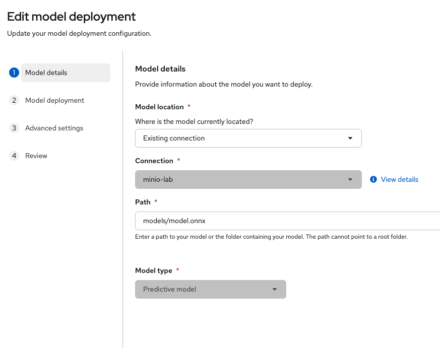
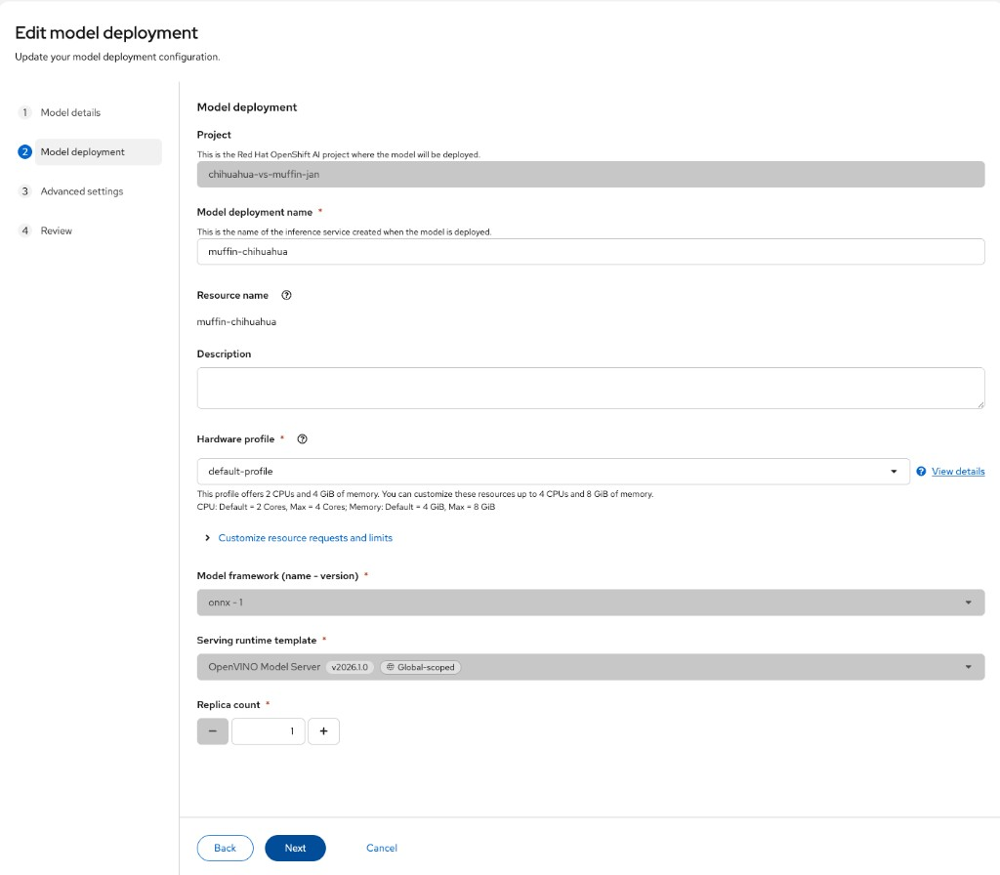
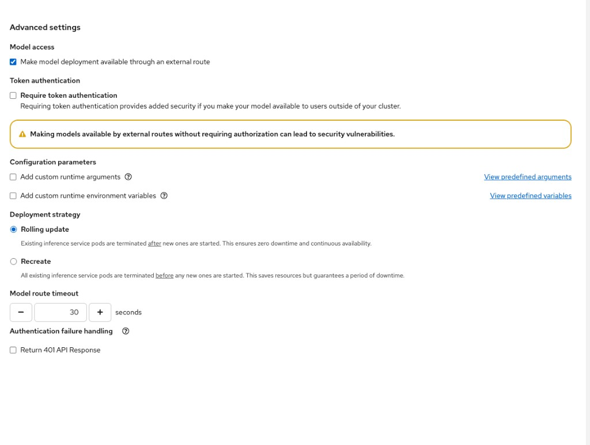

# Chihuahua vs Muffin — OpenShift AI Feature Thread

**Version:** draft 0.14 — English, copy-paste friendly  
**OpenShift AI version:** **Self-Managed 3.5** (source of truth for all platform steps)  
**Mode:** Ongoing **fil rouge** (no fixed duration) — progress milestone by milestone, with regular team syncs  
**Goal:** Exercise the main **OpenShift AI** capabilities on one concrete use case  
**Use case:** An image service that answers: is this photo a **chihuahua** or a **muffin**?  
**Audience:** Mixed team (beginners welcome) exploring the platform together  
**Team setup (4 people):** **one shared OpenShift AI cluster**, **one shared Data Science Project**, **one Workbench per person**, shared MinIO + one served predictive model / OVMS (+ TrustyAI later)

> **How to use this doc**  
> 1. Pick the next **Milestone** (M0 → M7).  
> 2. Copy-paste the commands. Change only values marked `<LIKE_THIS>`.  
> 3. At each team sync, fill the checkpoint table.  
> 4. Do not rush — the point is to **see the platform features**, not to finish in one day.
>
> **Source of truth (platform):** always follow  
> [Red Hat OpenShift AI Self-Managed 3.5](https://docs.redhat.com/en/documentation/red_hat_openshift_ai_self-managed/3.5).  
> If this lab guide disagrees with that documentation, **the Red Hat 3.5 docs win** — then update this file.
>
> **Living document:** whenever a command, URL, or install step differs from reality during the fil rouge, **update this file immediately** so the next person is not blocked. Known fixes already folded in: macOS Kaggle venv (PEP 668), `mc` install options, OpenShift HTML errors on MinIO routes, Plan B ONNX is not shipped in the repo, Workbench needs `%pip install onnx` (same kernel) before `torch.onnx.export`, F1 deploy wizard validated with screenshots, **F2 OVMS versioned path** required when UI shows Ready but **No model availability**.

---

## The story (why this use case)

We build a small **predictive model** and deploy it on the OpenShift AI **single-model serving platform** (see 3.5 docs):

1. Photos live in shared object storage (S3 **connection**)  
2. The team trains a classifier in a **Workbench**  
3. The model is versioned in the **Model registry** (optional) and **deployed** as an inference endpoint  
4. Anyone (or any app) can call that API  
5. **TrustyAI** watches for **data drift** when people send weird photos (owls, cookies, screenshots…)

Same business pattern as a real project: *data → train → register → serve → monitor*.

> In OpenShift AI **3.5**, the product guide **“Models-as-a-Service”** is mainly about **governing LLM access**.  
> Our Chihuahua/Muffin case is a **predictive** model → use **Deploy predictive models using single model serving platform**.

We are **not** chasing Kaggle leaderboard scores.  
We are **showcasing OpenShift AI 3.5**.

---

## OpenShift AI features this thread covers

| Milestone | Platform feature | What you prove |
|-----------|------------------|----------------|
| **M0** | Cluster prep | OpenShift AI is usable by the team |
| **M1** | Object storage + **Connection** (S3) | Shared S3 for data and models |
| **M2** | **Project** + **Workbench** | Collaborative ML workspace |
| **M3** | Training in Workbench | You can train and export ONNX on the platform |
| **M4** | **Single-model serving** (OVMS / KServe) | Predictive model exposed as an HTTP API |
| **M5** | **Model registry** (optional but recommended) | Versions of the model, not “a file on disk” |
| **M6** | **TrustyAI** (Monitor AI systems) | Detect when live inputs leave the training world |
| **M7** | **AI pipelines** (optional) | Repeatable train → evaluate → publish flow |

Related controls you will also touch:

- Client **confidence threshold** (reject low-confidence answers)  
- Optional **token auth** on the inference endpoint  
- Team **checkpoint reviews** (what worked / blocked)

**Official OpenShift AI 3.5 docs for this thread:**  
- Hub: https://docs.redhat.com/en/documentation/red_hat_openshift_ai_self-managed/3.5  
- Connections / S3: https://docs.redhat.com/en/documentation/red_hat_openshift_ai_self-managed/3.5/html/working_on_projects/using-connections_projects · https://docs.redhat.com/en/documentation/red_hat_openshift_ai_self-managed/3.5/html/working_with_data_in_an_s3-compatible_object_store/index  
- Workbenches: https://docs.redhat.com/en/documentation/red_hat_openshift_ai_self-managed/3.5/html/getting_started_with_red_hat_openshift_ai_self-managed/creating-a-workbench-select-ide_get-started  
- Deploy predictive models: https://docs.redhat.com/en/documentation/red_hat_openshift_ai_self-managed/3.5/html/deploying_models/deploying_models  
- Model registry: https://docs.redhat.com/en/documentation/red_hat_openshift_ai_self-managed/3.5/html/working_with_model_registries/index  
- AI pipelines: https://docs.redhat.com/en/documentation/red_hat_openshift_ai_self-managed/3.5/html/working_with_ai_pipelines/managing-ai-pipelines_ai-pipelines  
- TrustyAI configure: https://docs.redhat.com/en/documentation/red_hat_openshift_ai_self-managed/3.5/html/monitoring_your_ai_systems/configuring-trustyai_monitor  
- TrustyAI project setup: https://docs.redhat.com/en/documentation/red_hat_openshift_ai_self-managed/3.5/html/monitoring_your_ai_systems/setting-up-trustyai-for-your-project_monitor  
- TrustyAI data drift: https://docs.redhat.com/en/documentation/red_hat_openshift_ai_self-managed/3.5/html/monitoring_your_ai_systems/monitoring-data-drift_drift-monitoring

---

## Glossary (plain English)

| Name in the product | Meaning |
|---------------------|---------|
| **OpenShift** | The Kubernetes platform (cluster) |
| **OpenShift AI (RHOAI)** | The AI layer on OpenShift |
| **Project** | Shared team workspace (namespace) in OpenShift AI |
| **Workbench** | Browser IDE (often JupyterLab) running on the cluster |
| **Connection** | Saved config (Secret) to reach S3 / other data sources (3.5 term; older docs said “data connection”) |
| **S3 / MinIO** | Object storage for images and model files |
| **Training** | Teaching the model with labeled photos |
| **ONNX** | Portable model file format for OpenVINO Model Server |
| **Single-model serving platform** | Deploy a **predictive** model (KServe + runtime such as OVMS) as an HTTP API |
| **Models-as-a-Service (3.5)** | Product feature focused on **governing LLM access** — not our muffin/chihuahua path |
| **Model registry** | Catalog of model versions |
| **TrustyAI** | Monitoring (drift, bias, …) — OVMS models only |
| **AI pipelines** | Automated multi-step ML workflows (KFP) |
| **Endpoint / API** | The inference URL you call with an image |

---

## How team syncs work

Use this short agenda every time you meet:

1. Which milestone are we on?  
2. Demo what works (screen share).  
3. Update the checkpoint table (OK / Blocked / Next).  
4. Pick one owner for the next milestone.

### Checkpoint log (copy for each sync)

| Date | Milestone | Status | Demo done? | Blockers | Next owner |
|------|-----------|--------|------------|----------|------------|
| | M_ | OK / Partial / Blocked | Yes / No | | |

---

## Prerequisites (M0)

- [ ] OpenShift cluster with **OpenShift AI Self-Managed 3.5** (or compatible) installed  
- [ ] `oc` CLI logged in (`oc whoami` works)  
- [ ] Rights to create projects / deploy apps (admin help OK for MinIO + TrustyAI)  
- [ ] OpenShift AI dashboard access for everyone  
- [ ] **Single-model serving platform** enabled (KServe + **OpenVINO Model Server** runtime) — see [Deploying models](https://docs.redhat.com/en/documentation/red_hat_openshift_ai_self-managed/3.5/html/deploying_models/deploying_models)  
- [ ] **TrustyAI** component enabled by cluster admin (needed before M6)  
- [ ] (Optional) GPU — CPU is fine with a smaller dataset  
- [ ] (Optional) Model registry and AI pipelines components enabled if you want M5 / M7  

**Admin note for TrustyAI (3.5):** only **one** TrustyAI service instance per project; TrustyAI supports models served with **OpenVINO Model Server (OVMS)** only. See [Configuring TrustyAI](https://docs.redhat.com/en/documentation/red_hat_openshift_ai_self-managed/3.5/html/monitoring_your_ai_systems/configuring-trustyai_monitor).

---

# PART A — Milestone M1: Storage (MinIO as S3)

We install a small **MinIO** server on the cluster.  
It speaks the same API as Amazon S3. Perfect for labs.

## A1. Create a project for storage

```bash
oc new-project lab-minio
```

## A2. Create username / password secrets

```bash
# Change these passwords in a real environment
export MINIO_ROOT_USER="minio"
export MINIO_ROOT_PASSWORD="minio123"

oc -n lab-minio create secret generic minio-root \
  --from-literal=MINIO_ROOT_USER="$MINIO_ROOT_USER" \
  --from-literal=MINIO_ROOT_PASSWORD="$MINIO_ROOT_PASSWORD"
```

## A3. Deploy MinIO (PVC + Deployment + Service)

```bash
oc -n lab-minio apply -f - <<'EOF'
apiVersion: v1
kind: PersistentVolumeClaim
metadata:
  name: minio-data
spec:
  accessModes:
    - ReadWriteOnce
  resources:
    requests:
      storage: 20Gi
---
apiVersion: apps/v1
kind: Deployment
metadata:
  name: minio
spec:
  replicas: 1
  selector:
    matchLabels:
      app: minio
  strategy:
    type: Recreate
  template:
    metadata:
      labels:
        app: minio
    spec:
      containers:
        - name: minio
          image: quay.io/minio/minio:RELEASE.2024-12-18T13-15-44Z
          args:
            - server
            - /data
            - --console-address
            - :9001
          env:
            - name: MINIO_ROOT_USER
              valueFrom:
                secretKeyRef:
                  name: minio-root
                  key: MINIO_ROOT_USER
            - name: MINIO_ROOT_PASSWORD
              valueFrom:
                secretKeyRef:
                  name: minio-root
                  key: MINIO_ROOT_PASSWORD
          ports:
            - name: api
              containerPort: 9000
            - name: console
              containerPort: 9001
          volumeMounts:
            - name: data
              mountPath: /data
          readinessProbe:
            httpGet:
              path: /minio/health/ready
              port: 9000
            initialDelaySeconds: 10
            periodSeconds: 10
          livenessProbe:
            httpGet:
              path: /minio/health/live
              port: 9000
            initialDelaySeconds: 30
            periodSeconds: 20
      volumes:
        - name: data
          persistentVolumeClaim:
            claimName: minio-data
---
apiVersion: v1
kind: Service
metadata:
  name: minio
spec:
  selector:
    app: minio
  ports:
    - name: api
      port: 9000
      targetPort: 9000
    - name: console
      port: 9001
      targetPort: 9001
EOF
```

Wait until MinIO is ready:

```bash
oc -n lab-minio rollout status deployment/minio
oc -n lab-minio get pods
```

## A4. Expose MinIO (API + web console)

```bash
# S3 API (port 9000)
oc -n lab-minio create route edge minio-api \
  --service=minio \
  --port=9000 \
  --insecure-policy=Redirect

# Web UI (port 9001)
oc -n lab-minio create route edge minio-console \
  --service=minio \
  --port=9001 \
  --insecure-policy=Redirect
```

Get the URLs:

```bash
echo "MinIO API:     https://$(oc -n lab-minio get route minio-api -o jsonpath='{.spec.host}')"
echo "MinIO Console: https://$(oc -n lab-minio get route minio-console -o jsonpath='{.spec.host}')"
```

Open the **Console** URL in a browser.  
Login with `minio` / `minio123` (or the values you set).

> **Note for beginners:**  
> - **API URL** = what apps / OpenShift AI use  
> - **Console URL** = what humans use in the browser

### Important: in-cluster URL vs public route

Inside the cluster (Workbench, Model Serving), prefer the **Service DNS** (no TLS issues):

```text
http://minio.lab-minio.svc.cluster.local:9000
```

From your laptop, use the **Route** HTTPS URL.

Save these values (you will reuse them):

```bash
export MINIO_ENDPOINT_INCLUSTER="http://minio.lab-minio.svc.cluster.local:9000"
export MINIO_ENDPOINT_EXTERNAL="https://$(oc -n lab-minio get route minio-api -o jsonpath='{.spec.host}')"
export AWS_ACCESS_KEY_ID="minio"
export AWS_SECRET_ACCESS_KEY="minio123"
export BUCKET="muffin-chihuahua"
```

## A5. Create the bucket (from your laptop)

### Option 1 — MinIO Client (`mc`) — recommended

`mc` is **not** installed by default on macOS (`zsh: command not found: mc`).

**Install on macOS** (pick one):

```bash
# Preferred on Homebrew today
brew install minio-mc

# Or MinIO tap (may fail with HTTP 410 on some versions — if so, use minio-mc or binary below)
# brew install minio/stable/mc
```

Apple Silicon binary (if brew fails):

```bash
cd ~/Downloads
curl -O https://dl.min.io/client/mc/release/darwin-arm64/mc
chmod +x mc
sudo mv mc /usr/local/bin/mc
mc --version
```

Intel Mac: use `darwin-amd64` instead of `darwin-arm64`.

Linux:

```bash
curl -O https://dl.min.io/client/mc/release/linux-amd64/mc
chmod +x mc
sudo mv mc /usr/local/bin/
```

> If `brew` complains that **midnight-commander** already owns `mc`, do not force blindly — use the binary install and/or rename (`mcli`), or unlink midnight-commander only if you accept that trade-off.

Configure and create the bucket.

With an OpenShift **edge** route, TLS often needs `--insecure` (self-signed / cluster CA):

```bash
mc alias set lab "$MINIO_ENDPOINT_EXTERNAL" "$AWS_ACCESS_KEY_ID" "$AWS_SECRET_ACCESS_KEY" --api S3v4 --insecure

mc mb lab/"$BUCKET" --insecure
mc ls lab/ --insecure
```

### If `mc mb` returns HTML (OpenShift error page)

You are **not** talking to the MinIO S3 API. Typical causes: wrong route (console instead of API), MinIO pod not Ready, or broken external TLS.

Check:

```bash
echo "ENDPOINT=$MINIO_ENDPOINT_EXTERNAL"
mc alias list lab
oc -n lab-minio get pods,route
curl -k -I "$MINIO_ENDPOINT_EXTERNAL"
curl -k "$MINIO_ENDPOINT_EXTERNAL/minio/health/ready"
```

Recreate the alias on the **API** route (port 9000 / `minio-api`), not the console:

```bash
export MINIO_ENDPOINT_EXTERNAL="https://$(oc -n lab-minio get route minio-api -o jsonpath='{.spec.host}')"
mc alias set lab "$MINIO_ENDPOINT_EXTERNAL" minio minio123 --api S3v4 --insecure
mc mb lab/muffin-chihuahua --insecure
```

**Reliable workaround — port-forward** (avoids the public route entirely):

```bash
# Terminal 1
oc -n lab-minio port-forward svc/minio 9000:9000

# Terminal 2
mc alias set lab http://127.0.0.1:9000 minio minio123 --api S3v4
mc mb lab/muffin-chihuahua
mc ls lab/
```

### Option 2 — AWS CLI (also works with MinIO)

```bash
# macOS: brew install awscli
export AWS_ACCESS_KEY_ID="minio"
export AWS_SECRET_ACCESS_KEY="minio123"

aws --endpoint-url "$MINIO_ENDPOINT_EXTERNAL" s3 mb "s3://$BUCKET"
aws --endpoint-url "$MINIO_ENDPOINT_EXTERNAL" s3 ls
```

---

# PART B — Milestone M1 (continued): Import the dataset

## B1. What the dataset is

We use the public Kaggle dataset:

**Muffin vs Chihuahua** — Samuel Cortinhas  
https://www.kaggle.com/datasets/samuelcortinhas/muffin-vs-chihuahua-image-classification  

- ~6,000 images  
- License: **CC0** (free to use for this lab)  
- Folders: `train/` and `test/`, each with `chihuahua/` and `muffin/`

Target layout in S3:

```text
s3://muffin-chihuahua/
├── train/
│   ├── chihuahua/
│   └── muffin/
└── test/
    ├── chihuahua/
    └── muffin/
```

## B2. Download from Kaggle (laptop)

1. Create a free Kaggle account  
2. Kaggle → **Settings** (or Account) → **API** → **Create New Token** → downloads `kaggle.json`  
3. Install the Kaggle CLI in a **Python virtualenv** (required on modern macOS / Homebrew Python).

> Do **not** run `pip3 install kaggle` on the system Python.  
> You will get: `error: externally-managed-environment` (PEP 668).  
> Use a venv instead.

```bash
# Create and activate a dedicated venv (once)
python3 -m venv ~/lab-venv
source ~/lab-venv/bin/activate

# Install the CLI inside the venv
pip install kaggle
kaggle --version
```

Every **new terminal** where you need `kaggle`, activate first:

```bash
source ~/lab-venv/bin/activate
```

4. Place your API token:

```bash
mkdir -p ~/.kaggle
mv ~/Downloads/kaggle.json ~/.kaggle/kaggle.json
chmod 600 ~/.kaggle/kaggle.json
```

5. Download and unzip (venv must be active):

```bash
source ~/lab-venv/bin/activate
mkdir -p ~/lab-data && cd ~/lab-data

kaggle datasets download -d samuelcortinhas/muffin-vs-chihuahua-image-classification
unzip -q muffin-vs-chihuahua-image-classification.zip -d muffin-chihuahua-raw

# Inspect
find muffin-chihuahua-raw -type d | head
```

> Folder names after unzip can vary slightly.  
> Make sure you end up with `train/chihuahua`, `train/muffin`, `test/chihuahua`, `test/muffin`.

Find the real root folder:

```bash
# If you already see train/ here:
export DATA_ROOT=~/lab-data/muffin-chihuahua-raw

# If train/ is one level deeper, adjust, for example:
# export DATA_ROOT=~/lab-data/muffin-chihuahua-raw/archive

ls "$DATA_ROOT"
ls "$DATA_ROOT/train"
ls "$DATA_ROOT/train/chihuahua" | head
ls "$DATA_ROOT/test/muffin" | head
```

**Optional alternative:** `brew install pipx` then `pipx install kaggle` (installs an isolated app; only if you prefer pipx over a venv).
## B3. (Recommended) Build a smaller subset for the lab

Full dataset training can be slow on CPU. A smaller subset is fine for early checkpoints:

```bash
export FULL="$DATA_ROOT"
export SUBSET=~/lab-data/muffin-chihuahua-subset

mkdir -p "$SUBSET"/{train,test}/{chihuahua,muffin}

# Copy 500 train + 100 test images per class (adjust numbers if you want)
for split in train test; do
  for class in chihuahua muffin; do
    if [ "$split" = "train" ]; then N=500; else N=100; fi
    find "$FULL/$split/$class" -type f \
      | head -n "$N" \
      | while read -r f; do cp "$f" "$SUBSET/$split/$class/"; done
    echo "$split/$class: $(ls "$SUBSET/$split/$class" | wc -l) files"
  done
done
```

## B4. Upload to MinIO

```bash
# Upload the SUBSET (recommended)
mc mirror "$SUBSET" lab/"$BUCKET"/

# Or upload the FULL dataset:
# mc mirror "$DATA_ROOT" lab/"$BUCKET"/

# Verify
mc ls lab/"$BUCKET"/
mc ls lab/"$BUCKET"/train/
mc ls --summarize --recursive lab/"$BUCKET"/train/chihuahua/ | tail -5
```

With AWS CLI instead:

```bash
aws --endpoint-url "$MINIO_ENDPOINT_EXTERNAL" s3 sync "$SUBSET" "s3://$BUCKET/"
aws --endpoint-url "$MINIO_ENDPOINT_EXTERNAL" s3 ls "s3://$BUCKET/train/"
```

---

# PART C — Milestone M2: Project + Connection + Workbench

## C1. Create the project

Follow: [Get started with projects, workbenches, and pipelines](https://docs.redhat.com/en/documentation/red_hat_openshift_ai_self-managed/3.5/html/getting_started_with_red_hat_openshift_ai_self-managed/creating-a-workbench-select-ide_get-started) (OpenShift AI **3.5**).

**UI path (easiest for beginners):**

1. Open the **OpenShift AI** dashboard  
2. **Projects** → **Create project** (UI label may still say “Data science project” on some builds)  
3. Name: `chihuahua-vs-muffin`  
4. Add your teammates (Edit access)

**Or CLI:**

```bash
# Prefer the UI so OpenShift AI creates the expected project resources.
oc new-project chihuahua-vs-muffin
```

## C2. Create a Connection to MinIO (S3)

Official refs (3.5):  
[Using connections](https://docs.redhat.com/en/documentation/red_hat_openshift_ai_self-managed/3.5/html/working_on_projects/using-connections_projects) ·  
[Working with data in an S3-compatible object store](https://docs.redhat.com/en/documentation/red_hat_openshift_ai_self-managed/3.5/html/working_with_data_in_an_s3-compatible_object_store/index)

In the project `chihuahua-vs-muffin`:

1. **Connections** → add / create a connection  
2. Type: **S3 compatible object storage** (preinstalled connection type in 3.5)  
3. Fill:

| Field | Value |
|-------|--------|
| Name | `minio-lab` |
| Access key | `minio` |
| Secret key | `minio123` |
| Endpoint | `http://minio.lab-minio.svc.cluster.local:9000` |
| Region | `us-east-1` (dummy value is fine for MinIO) |
| Bucket | `muffin-chihuahua` |

> Use the **in-cluster** endpoint from Workbenches and model serving.  
> Do **not** use the external HTTPS route here unless you know how to trust the certificate.

Connections are stored as Kubernetes Secrets (see 3.5 “Using connections”). Prefer the **UI** unless you are following a specific CR/Secret example from the docs.

## C3. Start a Workbench

1. In the project → **Workbenches** → **Create workbench**  
2. Suggested settings:
   - Name: `pytorch-lab`
   - Image: **PyTorch** (or the PyTorch IDE image available on your 3.5 cluster)
   - Size / hardware profile: Medium (or as recommended by the wizard)
   - Accelerator: GPU if available, else none
3. Attach connection: `minio-lab`
4. Create → wait until **Running** → **Open**

You should land in **JupyterLab** (server-client IDE on the cluster — work stays on OpenShift).

---

# PART D — Milestone M2/M3: From the Workbench, talk to S3

Open a notebook or terminal inside Jupyter.

## D1. Install helpers (once)

**In a notebook cell**, use `%pip` so packages go into **this kernel** (plain `pip` in a terminal can install elsewhere → `ModuleNotFoundError` in the notebook):

```python
%pip install boto3 pillow matplotlib onnx
```

Then **Kernel → Restart**, and re-run your cells from the top (or at least re-create `model` / `DEVICE` before E3).

Verify:

```python
import sys
import onnx
print("python:", sys.executable)
print("onnx:", onnx.__version__)
```

> **Required for Part E3:** PyTorch’s `torch.onnx.export(...)` needs the Python package **`onnx`**.  
> Without it you get: `OnnxExporterError: Module onnx is not installed!` / `ModuleNotFoundError: No module named 'onnx'`.  
> The DeprecationWarning about TorchScript vs `torch.export` is OK for this lab — ignore it for now.

**If `%pip` is blocked**, use a Workbench **terminal** with the same Python as the notebook:

```bash
which python
python -m pip install boto3 pillow matplotlib onnx
```

Then restart the kernel.

## D2. List files in the bucket (copy-paste)

Create a notebook cell:

```python
import boto3
import os

endpoint = os.environ.get(
    "AWS_S3_ENDPOINT",
    "http://minio.lab-minio.svc.cluster.local:9000",
)
access_key = os.environ.get("AWS_ACCESS_KEY_ID", "minio")
secret_key = os.environ.get("AWS_SECRET_ACCESS_KEY", "minio123")
bucket = os.environ.get("AWS_S3_BUCKET", "muffin-chihuahua")

s3 = boto3.client(
    "s3",
    endpoint_url=endpoint,
    aws_access_key_id=access_key,
    aws_secret_access_key=secret_key,
)

# List first 20 objects
resp = s3.list_objects_v2(Bucket=bucket, MaxKeys=20)
for obj in resp.get("Contents", []):
    print(obj["Key"], obj["Size"])
```

> When you attach a Connection to a Workbench, OpenShift AI often injects env vars  
> like `AWS_ACCESS_KEY_ID`, `AWS_SECRET_ACCESS_KEY`, `AWS_S3_ENDPOINT`, `AWS_S3_BUCKET`.  
> Print them to learn your cluster’s exact names:

```python
import os
for k, v in sorted(os.environ.items()):
    if "AWS" in k or "S3" in k or "MINIO" in k:
        print(f"{k}={v}")
```

## D3. Download dataset from S3 into the Workbench

```python
import os
from pathlib import Path
import boto3

endpoint = os.environ.get("AWS_S3_ENDPOINT", "http://minio.lab-minio.svc.cluster.local:9000")
access_key = os.environ.get("AWS_ACCESS_KEY_ID", "minio")
secret_key = os.environ.get("AWS_SECRET_ACCESS_KEY", "minio123")
bucket = os.environ.get("AWS_S3_BUCKET", "muffin-chihuahua")
local_root = Path("/opt/app-root/src/data/muffin-chihuahua")
local_root.mkdir(parents=True, exist_ok=True)

s3 = boto3.client(
    "s3",
    endpoint_url=endpoint,
    aws_access_key_id=access_key,
    aws_secret_access_key=secret_key,
)

paginator = s3.get_paginator("list_objects_v2")
count = 0
for page in paginator.paginate(Bucket=bucket):
    for obj in page.get("Contents", []):
        key = obj["Key"]
        if key.endswith("/"):
            continue
        dest = local_root / key
        dest.parent.mkdir(parents=True, exist_ok=True)
        s3.download_file(bucket, key, str(dest))
        count += 1
        if count % 100 == 0:
            print(f"downloaded {count} files...")

print(f"Done. {count} files in {local_root}")
print("train/chihuahua:", len(list((local_root / "train/chihuahua").glob("*"))))
print("train/muffin:", len(list((local_root / "train/muffin").glob("*"))))
```

---

# PART E — Milestone M3: Train a small model (PyTorch)

## E1. What we do (beginner view)

1. Start from a model that already knows general image features (**ResNet18**)
2. Replace the last layer so it only answers: **chihuahua** or **muffin**
3. Train on our photos
4. Export an **ONNX** file
5. Upload that file to S3 for Model Serving

## E2. Training notebook (copy-paste starter)

```python
import time
from pathlib import Path

import torch
import torch.nn as nn
from torch.utils.data import DataLoader
from torchvision import datasets, models, transforms

DATA = Path("/opt/app-root/src/data/muffin-chihuahua")
DEVICE = "cuda" if torch.cuda.is_available() else "cpu"
print("Device:", DEVICE)

train_tf = transforms.Compose([
    transforms.Resize((224, 224)),
    transforms.RandomHorizontalFlip(),
    transforms.ColorJitter(brightness=0.2, contrast=0.2),
    transforms.ToTensor(),
    transforms.Normalize([0.485, 0.456, 0.406],
                         [0.229, 0.224, 0.225]),
])
test_tf = transforms.Compose([
    transforms.Resize((224, 224)),
    transforms.ToTensor(),
    transforms.Normalize([0.485, 0.456, 0.406],
                         [0.229, 0.224, 0.225]),
])

train_ds = datasets.ImageFolder(DATA / "train", transform=train_tf)
test_ds = datasets.ImageFolder(DATA / "test", transform=test_tf)
print("Classes:", train_ds.classes)  # expect ['chihuahua', 'muffin']

train_loader = DataLoader(train_ds, batch_size=32, shuffle=True, num_workers=2)
test_loader = DataLoader(test_ds, batch_size=32, shuffle=False, num_workers=2)

model = models.resnet18(weights=models.ResNet18_Weights.IMAGENET1K_V1)
for p in model.parameters():
    p.requires_grad = False
model.fc = nn.Linear(model.fc.in_features, 2)
model = model.to(DEVICE)

criterion = nn.CrossEntropyLoss()
optimizer = torch.optim.Adam(model.fc.parameters(), lr=1e-3)

def evaluate():
    model.eval()
    correct = total = 0
    with torch.no_grad():
        for x, y in test_loader:
            x, y = x.to(DEVICE), y.to(DEVICE)
            pred = model(x).argmax(1)
            correct += (pred == y).sum().item()
            total += y.size(0)
    return correct / total

EPOCHS = 3  # increase later if you have time / GPU
for epoch in range(EPOCHS):
    model.train()
    running = 0.0
    t0 = time.time()
    for x, y in train_loader:
        x, y = x.to(DEVICE), y.to(DEVICE)
        optimizer.zero_grad()
        loss = criterion(model(x), y)
        loss.backward()
        optimizer.step()
        running += loss.item()
    acc = evaluate()
    print(f"epoch {epoch+1}/{EPOCHS}  loss={running/len(train_loader):.4f}  test_acc={acc:.3f}  time={time.time()-t0:.1f}s")

# Save PyTorch checkpoint (optional)
out_dir = Path("/opt/app-root/src/models")
out_dir.mkdir(parents=True, exist_ok=True)
torch.save({"model": model.state_dict(), "classes": train_ds.classes}, out_dir / "model.pt")
print("Saved", out_dir / "model.pt")
```

**Target for the lab:** test accuracy **> 0.90** is enough.

### Plan B (if training is too slow)

**There is no ONNX in this Git repository** and no official public Chihuahua-vs-Muffin ONNX download used by this guide.

Plan B means: **someone on the team trains once** (Part E), exports ONNX, and uploads it already in the **OVMS layout**:

```text
s3://muffin-chihuahua/models/muffin-chihuahua/1/model.onnx
```

Then other sessions skip training and jump to Part F (Path in UI = `models/muffin-chihuahua`).

Do not confuse this path with a generic ImageNet ResNet18 ONNX (1000 classes) — that will **not** answer `chihuahua` / `muffin`.

## E3. Export ONNX and upload to S3 (OVMS layout from the start)

> **Do this so you skip the later `mc cp` fix.**  
> OpenVINO Model Server expects: `models/<model-name>/1/model.onnx`  
> Deploy UI **Path** = `models/muffin-chihuahua` (the folder).

If you skipped D1 or hit `Module onnx is not installed` / `No module named 'onnx'`, run this **in a notebook cell** first:

```python
%pip install onnx
```

Then **Kernel → Restart**, re-run training cells so `model` exists again, then continue.

Quick check before export:

```python
import sys, onnx
print(sys.executable, onnx.__version__)
```

```python
import torch
import boto3
import os
from pathlib import Path

model.eval()

# Local export path (Workbench disk)
onnx_path = Path("/opt/app-root/src/models/muffin-chihuahua/1/model.onnx")
onnx_path.parent.mkdir(parents=True, exist_ok=True)

export_model = model.to("cpu")
export_model.eval()
dummy_cpu = torch.randn(1, 3, 224, 224)

torch.onnx.export(
    export_model,
    dummy_cpu,
    str(onnx_path),
    input_names=["input"],
    output_names=["output"],
    dynamo=False,  # legacy exporter; OK for this lab
)
print("ONNX written:", onnx_path)
print("Size (MB):", round(onnx_path.stat().st_size / 1e6, 2))

# Upload straight into the OVMS versioned key
endpoint = os.environ.get("AWS_S3_ENDPOINT", "http://minio.lab-minio.svc.cluster.local:9000")
s3 = boto3.client(
    "s3",
    endpoint_url=endpoint,
    aws_access_key_id=os.environ.get("AWS_ACCESS_KEY_ID", "minio"),
    aws_secret_access_key=os.environ.get("AWS_SECRET_ACCESS_KEY", "minio123"),
)
bucket = os.environ.get("AWS_S3_BUCKET", "muffin-chihuahua")
key = "models/muffin-chihuahua/1/model.onnx"  # ← correct for OVMS from day 1
s3.upload_file(str(onnx_path), bucket, key)
print(f"Uploaded s3://{bucket}/{key}")

# Optional: also keep a flat copy for humans
s3.upload_file(str(onnx_path), bucket, "models/model.onnx")
print(f"Also uploaded s3://{bucket}/models/model.onnx (optional flat copy)")
```

After E3, in **F1** set:

| Field | Value |
|-------|--------|
| Path | `models/muffin-chihuahua` |

You should **not** need F2 unless someone already uploaded only `models/model.onnx`.

---


# PART F — Milestone M4: Deploy the predictive model (single-model serving)

This is the core “platform” moment: the model is no longer a notebook file.  
It is deployed on the **single-model serving platform** with an inference URL teammates and apps can call.

Official ref (3.5):  
[Deploying models](https://docs.redhat.com/en/documentation/red_hat_openshift_ai_self-managed/3.5/html/deploying_models/deploying_models)

## F1. Deploy with the OpenShift AI wizard (UI) — validated

> **Validated on cluster** with status **Ready** (team run, Sep 2026).  
> Screenshots below match a working deployment. Project name in the example is `chihuahua-vs-muffin-jan` — use your real project name.

### Prerequisites

- [ ] Logged in to OpenShift AI  
- [ ] KServe / model serving platform enabled  
- [ ] **OpenVINO Model Server** runtime available  
- [ ] Project created + connection **`minio-lab`**  
- [ ] Object present: `s3://…/models/model.onnx` (from E3)

### Open the wizard

1. Left menu → **Projects** → open your project  
2. Tab **Deployments** → **Deploy model**  
   (later edits use the same wizard titled **Edit model deployment**)

Wizard steps: **Model details** → **Model deployment** → **Advanced settings** → **Review**.

---

### Step 1 — Model details



| Field | Validated value |
|-------|-----------------|
| **Model location** | `Existing connection` |
| **Connection** | `minio-lab` |
| **Path** | Prefer **`models/muffin-chihuahua`** (versioned folder — see **F2**, validated). `models/model.onnx` can show UI Ready but **No model availability** |
| **Model type** | `Predictive model` |

Notes:

- First deploy may use `models/model.onnx` and still show UI **Ready** — that is **not** enough.  
- If details show **Model availability = No model availability**, apply **F2** (versioned path) before testing `/infer`.  
- Do **not** use a root path (UI forbids it).

Click **Next**.

---

### Step 2 — Model deployment



| Field | Validated value |
|-------|-----------------|
| **Project** | your project (example: `chihuahua-vs-muffin-jan`) |
| **Model deployment name** | `muffin-chihuahua` |
| **Resource name** | auto = `muffin-chihuahua` |
| **Description** | optional / empty |
| **Hardware profile** | `default-profile` (example: 2 CPU, 4 GiB; limits up to 4 CPU / 8 GiB) |
| **Model framework (name - version)** | `onnx - 1` |
| **Serving runtime template** | `OpenVINO Model Server` (example: `v2026.1.0`, Global-scoped) |
| **Replica count** | `1` |

Notes:

- Keep the deployment name **`muffin-chihuahua`** — you will reuse it as model id for TrustyAI (M6).  
- **OVMS is required** if you plan TrustyAI later (3.5: TrustyAI supports OVMS only).  
- Hardware profile names differ by cluster; `default-profile` is fine for this lab.

Click **Next**.

---

### Step 3 — Advanced settings



| Field | Validated value (Ready OK) | Recommendation |
|-------|----------------------------|----------------|
| **Make model deployment available through an external route** | ✅ checked | Keep if you call from laptop / outside the cluster |
| **Require token authentication** | ☐ unchecked (lab worked) | **Prefer checked** for anything beyond a private lab — UI warns about open external routes |
| Custom runtime arguments / env vars | ☐ unchecked | Leave off unless OVMS docs say otherwise |
| **Deployment strategy** | **Rolling update** | OK; use **Recreate** if the project is short on CPU/RAM |
| **Model route timeout** | `30` seconds | Default OK |
| **Return 401 API Response** | ☐ unchecked | Optional; only relevant with token auth |

> Security note (from the UI): exposing an external route **without** token authentication can be unsafe.  
> For the fil rouge on a private cluster it may be acceptable temporarily; turn **Require token authentication** on as soon as you demo to a wider audience.

Click **Next** → **Review** → **Deploy** (or save if editing).

---

### Step 4 — Confirm Ready

1. Project → **Deployments**  
2. Row `muffin-chihuahua` → **Status** shows Ready / checkmark  
3. Open the deployment → copy the **inference endpoint** URL  
4. If token auth is on, copy the token too  

**Feature shown:** predictive model serving on OpenShift AI 3.5 (OVMS + KServe).

### Validated summary (copy for teammates)

```text
Connection:     minio-lab
Path:           models/muffin-chihuahua   ← versioned OVMS folder (REQUIRED for inference)
Type:           Predictive model
Name:           muffin-chihuahua
Framework:      onnx - 1
Runtime:        OpenVINO Model Server
Replicas:       1
Hardware:       default-profile (or cluster equivalent)
External route: yes
Token auth:     optional (recommended on)
Strategy:       Rolling update
Timeout:        30s
Result:         Ready + model metadata HTTP 200 (not only UI Ready)
```

## F2. Recovery only — if you already uploaded a flat `models/model.onnx`

> Prefer fixing this at **E3** (upload to `models/muffin-chihuahua/1/model.onnx` from training).  
> Use F2 only to repair an old export.

> **Symptom validated on cluster:** deployment shows **Ready**, but **Model availability = No model availability**, and  
> `GET /v2/models/muffin-chihuahua` returns `Model with requested version is not found`.  
> **Root cause:** Path pointed at a single file `models/model.onnx`. OVMS needs a **version directory**.

### 1) Put the ONNX in the OVMS layout on MinIO

From your laptop (`mc` alias `lab`, add `--insecure` if needed):

```bash
mc cp lab/muffin-chihuahua/models/model.onnx \
  lab/muffin-chihuahua/models/muffin-chihuahua/1/model.onnx --insecure

mc ls --recursive lab/muffin-chihuahua/models/ --insecure
```

Expected layout:

```text
models/
├── model.onnx                          # original export from E3 (keep)
└── muffin-chihuahua/
    └── 1/
        └── model.onnx                  # what OVMS loads as version "1"
```

### 2) Edit the deployment Path

1. OpenShift AI → project → **Deployments** → `muffin-chihuahua` → **Edit**  
2. Set **Path** = `models/muffin-chihuahua`  ← the **folder**, not `models/model.onnx`  
3. Save → wait until **Ready** again  

### 3) Confirm in the UI

On the deployment details, **Model availability** must **no longer** say `No model availability`.

### 4) Confirm from the Workbench (metadata)

```python
import warnings
import requests

warnings.filterwarnings("ignore", message="Unverified HTTPS request")

EP = "https://muffin-chihuahua-chihuahua-vs-muffin-jan.apps.ocp.dv6rj.sandbox1011.opentlc.com"
# Or internal:
# EP = "http://muffin-chihuahua-predictor.chihuahua-vs-muffin-jan.svc.cluster.local:8080"

r = requests.get(f"{EP}/v2/models/muffin-chihuahua", verify=False, timeout=15)
print(r.status_code, r.text[:500])
```

**Validated successful response (HTTP 200):**

```json
{
  "name": "muffin-chihuahua",
  "versions": ["1"],
  "platform": "OpenVINO",
  "inputs": [{"name": "input", "datatype": "FP32", "shape": [1, 3, 224, 224]}],
  "outputs": [{"name": "output", "datatype": "FP32", "shape": [1, 2]}]
}
```

Then continue to **F3** for a real image `/infer` call.

## F3. Call the service from a Workbench (not Gen AI Playground)

> **Do not use Gen AI studio → Playground** for this model.  
> That UI is for **Generative AI** chat models only ([3.5 playground docs](https://docs.redhat.com/en/documentation/red_hat_openshift_ai_self-managed/3.5/html/experimenting_with_models_in_the_gen_ai_playground/index)).  
> Our deployment is **Predictive** (ONNX / OVMS) → test with **HTTP inference** (curl or notebook).

### Internal endpoint (from Workbench only)

Example:

```text
http://muffin-chihuahua-predictor.chihuahua-vs-muffin-jan.svc.cluster.local:8080
```

- Works **only inside the cluster** (Workbench / pods), **not** from your Mac.  
- Prefer this URL from notebooks in the same project.

If `%%bash` + `curl` returns **exit status 7** (`Failed to connect`), the service name/port may differ, or DNS failed. Diagnose in **Python** (does not abort the cell the same way):

```python
import socket
import requests

host = "muffin-chihuahua-predictor.chihuahua-vs-muffin-jan.svc.cluster.local"
port = 8080

try:
    print("DNS:", socket.getaddrinfo(host, port)[0][4])
except Exception as e:
    print("DNS FAILED:", e)

for path in [
    "/v2/models/muffin-chihuahua",
    "/v2/models/muffin-chihuahua/versions/1",
    "/v2/models/muffin-chihuahua/ready",
]:
    url = f"http://{host}:{port}{path}"
    try:
        r = requests.get(url, timeout=10)
        print(path, "→", r.status_code, r.text[:300])
    except Exception as e:
        print(path, "→", type(e).__name__, e)
```

Find the real Service name (Workbench **Terminal** or laptop with `oc`):

```bash
oc -n chihuahua-vs-muffin-jan get svc
oc -n chihuahua-vs-muffin-jan get inferenceservice
oc -n chihuahua-vs-muffin-jan get route
```

Use the `*-predictor` ClusterIP service and its port (often `8080` or `80`). Soft curl that never fails the notebook cell:

```python
%%bash
EP="http://muffin-chihuahua-predictor.chihuahua-vs-muffin-jan.svc.cluster.local:8080"
curl -sv --connect-timeout 5 "$EP/v2/models/muffin-chihuahua" || echo "curl_exit=$?"
```

### 1) Health / metadata checks (laptop or Workbench terminal)

```bash
export EP="https://muffin-chihuahua-chihuahua-vs-muffin-jan.apps.ocp.dv6rj.sandbox1011.opentlc.com"

# Try these (one of them should return JSON / OK depending on runtime wiring)
curl -k "$EP/v2/health/ready"
curl -k "$EP/v2/models/muffin-chihuahua"
curl -k "$EP/v2/models/muffin-chihuahua/ready"
```

If token auth is enabled later:

```bash
curl -k -H "Authorization: Bearer $TOKEN" "$EP/v2/models/muffin-chihuahua"
```

### 2) Inference from a Workbench notebook (copy-paste)

Preprocess must match training: **224×224**, ImageNet mean/std, NCHW `float32`, input name **`input`** (from E3 export).

```python
import json
import numpy as np
import requests
import torch
from pathlib import Path
from PIL import Image
from torchvision import transforms

EP = "https://muffin-chihuahua-chihuahua-vs-muffin-jan.apps.ocp.dv6rj.sandbox1011.opentlc.com"
MODEL_NAME = "muffin-chihuahua"
CLASSES = ["chihuahua", "muffin"]  # must match ImageFolder order from training
TOKEN = ""  # paste token if Require token authentication is ON

# Pick a test image already in the workbench (adjust path if needed)
sample = next(Path("/opt/app-root/src/data/muffin-chihuahua/test/muffin").glob("*"))
print("image:", sample)

tfm = transforms.Compose([
    transforms.Resize((224, 224)),
    transforms.ToTensor(),
    transforms.Normalize([0.485, 0.456, 0.406],
                         [0.229, 0.224, 0.225]),
])
x = tfm(Image.open(sample).convert("RGB")).unsqueeze(0)  # [1,3,224,224]
data = x.numpy().astype("float32").reshape(-1).tolist()

payload = {
    "inputs": [
        {
            "name": "input",
            "shape": [1, 3, 224, 224],
            "datatype": "FP32",
            "data": data,
        }
    ]
}

headers = {"Content-Type": "application/json"}
if TOKEN:
    headers["Authorization"] = f"Bearer {TOKEN}"

url = f"{EP}/v2/models/{MODEL_NAME}/infer"
r = requests.post(url, headers=headers, data=json.dumps(payload), verify=False, timeout=60)
print("HTTP", r.status_code)
print(r.text[:2000])

r.raise_for_status()
body = r.json()
# Typical KServe v2: outputs[0].data = logits or scores
out = np.array(body["outputs"][0]["data"], dtype=np.float32)
probs = torch.softmax(torch.tensor(out), dim=0).numpy()
pred = int(probs.argmax())
conf = float(probs.max())
label = CLASSES[pred] if conf >= 0.80 else "uncertain"
print({"label": label, "confidence": conf, "probs": dict(zip(CLASSES, map(float, probs)))})
```

### If you see `version is not found` / `No model availability`

**Validated:** follow **F2** completely (`mc cp` → Path `models/muffin-chihuahua` → UI availability OK → Workbench metadata check).

Quick re-check after F2 (Workbench):

```python
import warnings
import requests
warnings.filterwarnings("ignore", message="Unverified HTTPS request")
EP = "https://muffin-chihuahua-chihuahua-vs-muffin-jan.apps.ocp.dv6rj.sandbox1011.opentlc.com"
r = requests.get(f"{EP}/v2/models/muffin-chihuahua", verify=False, timeout=15)
print(r.status_code, r.text[:500])
# Expect HTTP 200 and JSON with "versions":["1"], inputs input [1,3,224,224], outputs output [1,2]
```

Other noise you may see before the fix:

| Request | Typical response |
|---------|------------------|
| `GET /v2/models` | `Invalid request URL` (OVMS often has no list-all) |
| `GET /v2/models/model` | `name is not found` |
| `GET /v2/models/muffin-chihuahua` (bad path) | `version is not found` |
| UI **Model availability** | `No model availability` |

Optional: check serving logs

```bash
oc -n chihuahua-vs-muffin-jan get pods
oc -n chihuahua-vs-muffin-jan logs -l serving.kserve.io/inferenceservice=muffin-chihuahua --tail=80
```

### Control #1 — confidence threshold (client-side guardrail)

```python
import numpy as np

classes = ["chihuahua", "muffin"]
# logits_or_probs = <array from model response>
# probs = softmax(logits_or_probs)  # if you received logits
# conf = float(np.max(probs))
# label = classes[int(np.argmax(probs))]
# if conf < 0.80:
#     result = {"label": "uncertain", "reason": "human_review_required", "confidence": conf}
# else:
#     result = {"label": label, "confidence": conf}
# print(result)
```

**Feature shown:** basic quality control before you trust the answer.

### Control #2 — out-of-domain smoke test

Send:

1. a clear muffin  
2. a clear chihuahua  
3. something else (cat, croissant, screenshot)

Discuss as a team: what should the **service** do vs what should **TrustyAI** detect?

---

# PART G — Milestone M5: Model registry (recommended)

Official ref (3.5):  
[Working with model registries](https://docs.redhat.com/en/documentation/red_hat_openshift_ai_self-managed/3.5/html/working_with_model_registries/index)

If the Model registry is enabled on your cluster, register the ONNX artifact so the team shares **versions**, not a random S3 path.

## G1. UI path (typical)

1. OpenShift AI → **Model registry**  
2. Register model `muffin-chihuahua`  
3. Add version `v1` pointing at the object stored via connection `minio-lab` (`models/model.onnx`)  
4. Deploy **from the registry** to the single-model serving platform when your build supports it

## G2. Why this matters in the fil rouge

| Without registry | With registry |
|------------------|---------------|
| “Which ONNX did we serve?” | Version `v1`, `v2`, … |
| Easy to overwrite by mistake | Explicit promotion |
| Hard for teammates to discover | Shared catalog |

**Sync question:** Can a new teammate find the current production model without asking in chat?

If Model Registry is not installed yet, skip M5 and note it as a platform gap in the checkpoint log.

---

# PART H — Milestone M6: TrustyAI controls

TrustyAI is how OpenShift AI helps you **monitor** a served model.

For this use case we focus on **data drift**:

> Training world = muffins + chihuahuas.  
> If users start sending owls, cookies, or memes, the input distribution changes.  
> TrustyAI should show that the live traffic no longer matches training.

### Important constraints (from Red Hat docs)

- Cluster admin must **enable TrustyAI** and install **one TrustyAI service per project**  
- TrustyAI supports models on **OpenVINO Model Server (OVMS)** — which is why M4 uses OVMS  
- UI labels and routes differ slightly by OpenShift AI version — keep the official doc tab open

## H1. Admin: install TrustyAI in the project

Ask your cluster admin to:

1. Enable the TrustyAI component in the OpenShift AI Operator  
2. Install the TrustyAI service into namespace `chihuahua-vs-muffin` (**only one instance**)  
3. Confirm model monitoring / inference data capture is configured for the model serving platform  

Refs:  
https://docs.redhat.com/en/documentation/red_hat_openshift_ai_self-managed/3.5/html/monitoring_your_ai_systems/configuring-trustyai_monitor

Verify the service exists:

```bash
oc -n chihuahua-vs-muffin get pods | grep -i trusty
oc -n chihuahua-vs-muffin get route | grep -i trusty
```

Get the TrustyAI route:

```bash
export TRUSTY_ROUTE="https://$(oc -n chihuahua-vs-muffin get route -o jsonpath='{.items[?(@.metadata.name=="trustyai-service")].spec.host}')"
# If the name differs, list routes and pick the TrustyAI one:
oc -n chihuahua-vs-muffin get route
echo "TRUSTY_ROUTE=$TRUSTY_ROUTE"
```

Get a token (user token or service account — follow your cluster policy):

```bash
export TOKEN="$(oc whoami -t)"
```

## H2. Upload a TRAINING baseline to TrustyAI

TrustyAI compares **live inference traffic** to a tagged **TRAINING** reference.

For an image model, the monitored values are the **numeric tensors** OpenVINO sends/receives (inputs/outputs), not the JPEG files themselves.  
Practical approach for this fil rouge:

1. Run a batch of **in-domain** inferences (real muffin / chihuahua test images) so TrustyAI observes “normal” traffic  
2. Upload or tag a **TRAINING** reference dataset through the TrustyAI API (format = TrustyAI / model payload schema for your version)  
3. Later, send **out-of-domain** images and watch drift metrics move

Minimal health check — does TrustyAI answer?

```bash
curl -k -H "Authorization: Bearer $TOKEN" \
  "$TRUSTY_ROUTE/info" | jq .
```

List known models / observations (endpoint names can vary by version):

```bash
curl -k -H "Authorization: Bearer $TOKEN" \
  "$TRUSTY_ROUTE/info/observation/metadata" | jq .
```

Upload training / reference data (shape must match your model’s input/output schema).  
Use the payload structure from your cluster doc page **“Send training data to TrustyAI”**.  
Pattern:

```bash
# PSEUDO — adapt field names to your OpenShift AI version + model schema
curl -k -H "Authorization: Bearer $TOKEN" \
  -H "Content-Type: application/json" \
  -X POST "$TRUSTY_ROUTE/data/upload" \
  -d @trustyai-training-payload.json
```

`trustyai-training-payload.json` must include at least:

- `modelId`: same as served model (`muffin-chihuahua`)  
- a tag such as `TRAINING` / `referenceTag`  
- input + output numeric arrays consistent with OVMS

> Tip: after a few successful in-domain API calls, inspect what TrustyAI already observed, then align your TRAINING upload to that schema (`/info` endpoints help).

## H3. Schedule a drift metric (MeanShift)

From Red Hat “Monitoring data drift”:

```bash
curl -k -H "Authorization: Bearer $TOKEN" \
  -H "Content-Type: application/json" \
  -X POST "$TRUSTY_ROUTE/metrics/drift/meanshift/request" \
  -d '{
    "modelId": "muffin-chihuahua",
    "referenceTag": "TRAINING"
  }'
```

Other drift metrics exist (KSTest, ApproxKSTest, FourierMMD) if MeanShift is a poor fit for your distributions — see:
https://docs.redhat.com/en/documentation/red_hat_openshift_ai_self-managed/3.5/html/monitoring_your_ai_systems/monitoring-data-drift_drift-monitoring

## H4. Generate traffic: normal vs drifted

**Normal (should look like training):**

```text
test/muffin/* and test/chihuahua/*  →  call the deployed model inference endpoint many times
```

**Drifted (should look different):**

```text
photos of owls, cats, chocolate chip cookies, random screenshots
```

Send both batches from a notebook (reuse your Part F client).

## H5. Read drift in OpenShift Observe

1. OpenShift console → **Observe** → **Metrics**  
2. Custom query examples:

```promql
trustyai_model_observations_total
```

```promql
trustyai_meanshift
```

**How to read MeanShift (beginner version):**

- Values are **p-values**  
- Close to **1.0** → live data still looks like training  
- Below **~0.05** → statistically significant drift  

**Team demo script for a sync:**

1. Show the deployed model returning `muffin` / `chihuahua`  
2. Show TrustyAI observations increasing  
3. Flood with out-of-domain images  
4. Show MeanShift drop / alert discussion  
5. Decide the **control action**: human review, block, or retrain (M7)

## H6. Control actions (what TrustyAI enables)

| Signal | Suggested team action |
|--------|------------------------|
| High confidence + in-domain | Return label |
| Low confidence (&lt; 0.80) | Return `uncertain` (client guardrail) |
| Drift alert (TrustyAI) | Investigate inputs; maybe collect new labeled data |
| Persistent drift | Retrain / new model version (Registry v2) + redeploy |

**Feature shown:** monitoring + operational controls around the deployed predictive model.

---

# PART I — Milestone M7: AI pipelines (optional)

Official ref (3.5):  
[Managing AI pipelines](https://docs.redhat.com/en/documentation/red_hat_openshift_ai_self-managed/3.5/html/working_with_ai_pipelines/managing-ai-pipelines_ai-pipelines)

When M3–M6 work manually, automate the happy path.

Typical pipeline steps:

1. Pull dataset from S3  
2. Train + evaluate  
3. If accuracy &gt; threshold → export ONNX  
4. Upload to S3 / register new Model registry version  
5. (Optional) trigger redeploy

**UI path (3.5):** project → **Pipelines** → configure pipeline server (S3 connection) → import / run pipeline.

**Sync question:** Can we retrain without re-running every notebook cell by hand?

---

# PART J — Global feature checklist

Update live during the fil rouge:

| Feature | Milestone | Status | Evidence (URL, screenshot, metric) |
|---------|-----------|--------|-------------------------------------|
| Project | M2 | | |
| Workbench (PyTorch) | M2 | | |
| Connection (S3) | M1–M2 | | |
| Train + ONNX export | M3 | | |
| Single-model serving (OVMS) | M4 | | |
| Auth token on endpoint | M4 | | |
| Confidence guardrail | M4 | | |
| Model Registry | M5 | | |
| TrustyAI service in project | M6 | | |
| TrustyAI TRAINING baseline | M6 | | |
| Drift metric + Observe graph | M6 | | |
| Pipelines | M7 | | |

---

# Troubleshooting (beginners)

| Problem | What to try |
|---------|-------------|
| `zsh: command not found: mc` | Install: `brew install minio-mc` (or binary from dl.min.io — see A5) |
| `brew install minio/stable/mc` → HTTP 410 | Use `brew install minio-mc` or the darwin binary in A5 |
| `mc` TLS certificate error | Add `--insecure` on alias / commands |
| `mc mb` returns HTML (OpenShift page) | Wrong route or MinIO down — use `minio-api` route + `--insecure`, or `oc port-forward svc/minio 9000:9000` |
| Workbench cannot reach MinIO | Use `http://minio.lab-minio.svc.cluster.local:9000` |
| Empty bucket listing | Wrong key / bucket / endpoint |
| `pip3 install kaggle` → externally-managed-environment | Use a venv: `python3 -m venv ~/lab-venv` then `source ~/lab-venv/bin/activate` and `pip install kaggle` |
| `kaggle: command not found` | Activate the venv: `source ~/lab-venv/bin/activate` |
| Kaggle download / auth fails | Check `~/.kaggle/kaggle.json` exists and `chmod 600 ~/.kaggle/kaggle.json` |
| Where is `model.onnx`? | Not in the repo — produce it in M3, or use Plan B after one teammate exports it |
| `OnnxExporterError: Module onnx is not installed!` | In a **notebook** cell: `%pip install onnx` → Kernel Restart → re-run cells |
| `ModuleNotFoundError: No module named 'onnx'` after pip | You installed into another Python. Use `%pip install onnx` (not bare `pip`) and restart kernel |
| DeprecationWarning about legacy TorchScript ONNX export | Safe to ignore for this lab (`dynamo=False` is intentional) |
| Training very slow | Use subset; fewer epochs; Plan B ONNX (team-produced) |
| Model never Ready | Wrong ONNX path; runtime wants a folder; check serving pod logs |
| TrustyAI pod missing | Admin must enable component + install service in the project |
| TrustyAI errors with non-OVMS models | Serve with **OpenVINO Model Server** only |
| No drift signal | Not enough inference traffic; TRAINING tag mismatch; wrong `modelId` |
| Ready but **No model availability** / `version is not found` | Apply **F2**: `mc cp` → `…/muffin-chihuahua/1/model.onnx`, Path=`models/muffin-chihuahua`, then `/v2/models/muffin-chihuahua` → HTTP 200 with `versions:["1"]` |
| `curl` exit status 7 to internal `*.svc.cluster.local` | DNS/connect failed from Workbench — check `oc get svc` for real `*-predictor` name/port; test with Python `requests` + `socket.getaddrinfo` |

```bash
oc -n lab-minio logs deploy/minio --tail=100
oc -n chihuahua-vs-muffin get pods
oc -n chihuahua-vs-muffin get route
oc -n chihuahua-vs-muffin logs -l app=trustyai --tail=100
```

---

# Useful links

## OpenShift AI Self-Managed 3.5 (authoritative)

- **Doc hub:** https://docs.redhat.com/en/documentation/red_hat_openshift_ai_self-managed/3.5  
- Connections: https://docs.redhat.com/en/documentation/red_hat_openshift_ai_self-managed/3.5/html/working_on_projects/using-connections_projects  
- S3 from workbench: https://docs.redhat.com/en/documentation/red_hat_openshift_ai_self-managed/3.5/html/working_with_data_in_an_s3-compatible_object_store/index  
- Workbenches: https://docs.redhat.com/en/documentation/red_hat_openshift_ai_self-managed/3.5/html/getting_started_with_red_hat_openshift_ai_self-managed/creating-a-workbench-select-ide_get-started  
- Deploy predictive models: https://docs.redhat.com/en/documentation/red_hat_openshift_ai_self-managed/3.5/html/deploying_models/deploying_models  
- Model registry: https://docs.redhat.com/en/documentation/red_hat_openshift_ai_self-managed/3.5/html/working_with_model_registries/index  
- AI pipelines: https://docs.redhat.com/en/documentation/red_hat_openshift_ai_self-managed/3.5/html/working_with_ai_pipelines/managing-ai-pipelines_ai-pipelines  
- Monitor AI systems (TrustyAI hub): https://docs.redhat.com/en/documentation/red_hat_openshift_ai_self-managed/3.5/html/monitoring_your_ai_systems/index  
- TrustyAI configure: https://docs.redhat.com/en/documentation/red_hat_openshift_ai_self-managed/3.5/html/monitoring_your_ai_systems/configuring-trustyai_monitor  
- TrustyAI project setup: https://docs.redhat.com/en/documentation/red_hat_openshift_ai_self-managed/3.5/html/monitoring_your_ai_systems/setting-up-trustyai-for-your-project_monitor  
- TrustyAI data drift: https://docs.redhat.com/en/documentation/red_hat_openshift_ai_self-managed/3.5/html/monitoring_your_ai_systems/monitoring-data-drift_drift-monitoring  

## Dataset / extras (not Red Hat)

- Dataset: https://www.kaggle.com/datasets/samuelcortinhas/muffin-vs-chihuahua-image-classification  
- Paper: https://arxiv.org/abs/1801.09573  
- MinIO: https://min.io/docs/minio/linux/index.html  
- DIY FastAPI comparison: https://github.com/fabianjkrueger/muffin_vs_chihuahua  

---

*Draft 0.14 — E3 uploads ONNX directly to OVMS layout `models/muffin-chihuahua/1/model.onnx`; F2 kept as recovery only.*
