# Gen AI lab — Agentic (beginner)

**New OpenShift AI project** — not `genai-hotline`. Same cluster, **one GPU** is typical: stop the Hotline Granite (or predictive OVMS) before you deploy here.

| | Chat | RAG | **This lab** |
|--|------|-----|--------------|
| The model… | writes a reply | reads runbooks, then writes | can **use tools**, then writes |

**One-liner:** a chatbot *talks*. An **agent** *talks and does small jobs* (via **tools**).

Hub: [`README.md`](README.md)

**Docs of record (RHOAI 3.5):**

- [Working with OGX](https://docs.redhat.com/en/documentation/red_hat_openshift_ai_self-managed/3.5/html-single/working_with_ogx/index)
- [Configure a playground](https://docs.redhat.com/en/documentation/red_hat_openshift_ai_self-managed/3.5/html/experimenting_with_models_in_the_gen_ai_playground/configuring-a-playground-for-your-project_rhoai-user)
- [Playground — MCP](https://docs.redhat.com/en/documentation/red_hat_openshift_ai_self-managed/3.5/html/experimenting_with_models_in_the_gen_ai_playground/testing-with-model-context-protocol-servers_rhoai-user)
- [Playground prerequisites — admin MCP ConfigMap](https://docs.redhat.com/en/documentation/red_hat_openshift_ai_self-managed/3.5/html/experimenting_with_models_in_the_gen_ai_playground/playground-prerequisites_rhoai-user)
- **MCP catalog (RHOAI 3.5):** [Working with the MCP catalog](https://docs.redhat.com/en/documentation/red_hat_openshift_ai_self-managed/3.5/html-single/working_with_the_mcp_catalog/index)
- **MCP gateway (RHCL 1.4):** [Install the MCP gateway](https://docs.redhat.com/en/documentation/red_hat_connectivity_link/1.4/html-single/install_the_mcp_gateway/index)

Playground / OGX / MCP catalog / MCP gateway are **Technology Preview**.

---

## Progress

| Step | Topic | Done |
|------|--------|------|
| A0 | [Chat vs agent](#a0) | read |
| A1 | [Four words](#a1) | read |
| A2 | [Demo story](#a2) | pick |
| P0 | [Cluster flags (Playground)](#p0) | |
| P1 | [Free the GPU](#p1) | |
| P2 | [Create project `genai-agent`](#p2) | ✅ |
| P3 | [Deploy Granite + tool-calling](#p3) | ✅ |
| P4 | [Create Playground](#p4) | ✅ |
| P5 | [Chat once (no tools)](#p5) | ✅ guessed |
| P6 | [Peek MCP tab](#p6) | ✅ empty |
| M1 | [What we install (MCP)](#m1) | |
| M2 | [MCP gateway Operator (RHCL 1.4)](#m2) | |
| M3 | [Verify gateway Operator](#m3) | |
| M4 | [MCP Lifecycle Operator + catalog flag](#m4) | ✅ pod Running |
| M5 | [See AI Hub MCP Catalog](#m5) | ✅ catalog visible |
| E0 | [Prerequisites — what we create](#e0) | read |
| E1 | [Deploy fake-inbox MCP](#e1) | ✅ Route JSON + POST /mcp 200 |
| E2 | [Register it for Playground](#e2) | ✅ Desk-Inbox-MCP listed |
| E3 | [Authorize MCP + tools](#e3) | ✅ 2/2 tools |
| E4 | [Ask the briefing question](#e4) | ✅ list_inbox · wifi follow-up HIT (body facts) |
| T0 | [Travel agent — public APIs](#t0) | ✅ public APIs, no catalog card |
| T1 | [Deploy travel MCP](#t1) | ✅ Route JSON + egress 200 |
| T2 | [Register Travel-MCP in Playground](#t2) | ✅ |
| T3 | [Ask a destination](#t3) | ✅ follow-up get_trip_brief HIT |
| T4 | [Add public holidays tool](#t4) | ✅ get_public_holidays · 5 Oct Republic Day |
| M6 | [Later — OpenShift MCP](#m6) | park |
| A5 | [Later](#a5) | park |

---

<a id="a0"></a>

# A0 — Chat vs agent

### What we want
You can explain the difference in one sentence.

### Why
“Agent” is not “smarter chatbot”. It is a chatbot **plus hands**.

### Success looks like
- You can say: the **LLM** writes words; a **tool** is a real action; an **agent** is *think → maybe use a tool → answer*

### How

1. **Chat** — you ask “What is urgent?” The model **guesses**.
2. **RAG** — it **opens a binder** of files, then answers (Hotline lab).
3. **Agent** — it can **open an inbox** (a tool), then write a briefing.

We still do **not** connect Gmail.

---

<a id="a1"></a>

# A1 — Four words

### What we want
A tiny glossary.

### Why
The UI says **MCP** and **tool-calling**. Those must mean something before you click.

### Success looks like
- You can match each row below

### How

| Word | Meaning |
|------|---------|
| **LLM** | Granite — predicts the next words |
| **Tool** | A named job, e.g. `list_inbox`. A **program** runs it; the model only *asks* |
| **Tool-calling** | The model can request a tool in a structured way. Playground MCP **requires** this on the serving runtime |
| **MCP** | Plug for tools. Playground **Settings → MCP**. Admins can register servers in ConfigMap `gen-ai-aa-mcp-servers` (`redhat-ods-applications`) |
| **Agent** | Question → maybe tools → final text |

---

<a id="a2"></a>

# A2 — Demo story (fake inbox)

### What we want
Agree the question we will ask later.

### Why
Live mail is too heavy for a first agent.

### Success looks like
- You know the user question and what “good” looks like

### How

Ask later:

> What should I handle before 10:00? Skip the noise.

**Good:** urgent **lift** + **Wi-Fi** from the files; newsletter and coffee **later**. Files live in [`data/agent-inbox/`](data/agent-inbox/).

---

<a id="p0"></a>

# P0 — Playground must exist on the cluster

### What we want
Confirm Gen AI studio / Playground is turned on (cluster admin may already have done this for Hotline).

### Why
Without this, **Add to playground** never appears.

### Success looks like
- Left nav shows **Gen AI studio → Playground**
- Check commands print `genAiStudio=true` and `ogx=Managed`

### How

**UI:** OpenShift AI left nav — you should already see **Gen AI studio**. If yes, skip the patches.

**CLI check (copy-paste):**

```bash
oc -n redhat-ods-applications get odhdashboardconfig odh-dashboard-config \
  -o jsonpath='genAiStudio={.spec.dashboardConfig.genAiStudio}{"\n"}'

oc get dsc default-dsc -o jsonpath='ogx={.spec.components.ogx.managementState} llama={.spec.components.llamastackoperator.managementState}{"\n"}'
```

**Expected output (shape):**

```text
genAiStudio=true
ogx=Managed llama=Removed
```

If `genAiStudio` is empty/false — **cluster admin** (same as Hotline G1):

```bash
oc -n redhat-ods-applications patch odhdashboardconfig odh-dashboard-config --type=merge \
  -p '{"spec":{"dashboardConfig":{"genAiStudio":true}}}'
```

If `ogx` is not `Managed`, or **both** `ogx` and `llamastackoperator` are `Managed`, use the Hotline G1 patch in [`README-GENAI.md` G1](README-GENAI.md#g1) (`llamastackoperator=Removed`, `ogx=Managed`). Then hard-refresh the UI.

**Pods:** none in your project.

---

<a id="p1"></a>

# P1 — Free the GPU

### What we want
One free GPU so the **new** Granite can start.

### Why
Sandboxes often have **one** GPU. `genai-hotline` Granite **or** predictive OVMS will block this project.

### Success looks like
- No Running `*-predictor-*` / workbench using GPU in the other projects
- `nvidia.com/gpu` is not stuck at 0 available (you will see that if P3 stays Pending)

### How

**UI (preferred):**

1. OpenShift AI → project **`genai-hotline`** (if it exists) → **AI hub → Models → Deployments** (or project model deployments) → **Stop** Granite (`RedHatAI/granite-4.0-h-tiny-FP8-dynamic` / `redhataigranite-40-h-tiny-fp8`). Do **not** delete unless you mean to.
2. If you still use predictive lab: project **`chihuahua-vs-muffin-jan`** → **Stop** workbench + **Stop** `muffin-chihuahua`. Do **not** delete.

**CLI check (copy-paste):**

```bash
oc get pods -A | grep -iE 'predictor|workbench' | grep -v Completed | grep -v 'redhat-ods'
```

**Expected:** no `Running` GPU predictor in `genai-hotline` or `chihuahua-vs-muffin-jan` (names differ). MinIO / MariaDB can stay Running.

---

<a id="p2"></a>

# P2 — Create project `genai-agent`

### What we want
A **new** OpenShift AI project, empty except what we add next.

### Why
Keeps Hotline RAG and this agent story in two namespaces.

### Success looks like
- Dashboard opens project **`genai-agent`**
- Namespace exists with dashboard label

### How

**UI:**

1. OpenShift AI → **Projects** → **Create project**
2. Name: **`genai-agent`**
3. Display name (if asked): `Gen AI Agent desk`
4. Create → open the project

**CLI equivalent (copy-paste):**

```bash
export PROJECT=genai-agent
oc apply -f - <<EOF
apiVersion: v1
kind: Namespace
metadata:
  name: ${PROJECT}
  labels:
    opendatahub.io/dashboard: "true"
  annotations:
    opendatahub.io/display-name: "Gen AI Agent desk"
EOF
oc get ns genai-agent
```

**Expected output (shape):**

```text
namespace/genai-agent created
NAME          STATUS   AGE
genai-agent   Active   …
```

**Pods created:** none yet.

---

<a id="p3"></a>

# P3 — Deploy Granite (chat + tool-calling)

### What we want
The same small catalog model as Hotline, **in `genai-agent`**, with vLLM **tool-calling** flags (needed later for Playground MCP / tools).

### Why
Playground talks to an **AI asset** (vLLM). Tools fail later if vLLM was started without `--enable-auto-tool-choice`.

### Success looks like
- Deployment **Ready** in **`genai-agent`**
- **Pod:** `redhataigranite-40-h-tiny-fp8-predictor-…` often **3/3** Ready
- Args include `--enable-auto-tool-choice` and `--tool-call-parser=granite4`

### How

**UI path (validated on 3.5):** catalog is **AI hub**, not always Project → Deployments.

1. Left nav → **AI hub** → **Models** → tab **Catalog**
2. Search **`granite`** + **`tiny`** / **FP8** → card **`RedHatAI/granite-4.0-h-tiny-FP8-dynamic`**
3. **Deploy**
4. **Project:** **`genai-agent`** (not `genai-hotline`)
5. **Model deployment:**

| Field | Lab value |
|-------|-----------|
| Model deployment name | leave catalog default (`RedHatAI/granite-4.0-h-tiny-FP8-dynamic` → resource ≈ `redhataigranite-40-h-tiny-fp8`) |
| Deployment method | **Inference service** |
| Hardware profile | **`gpu-profile`** (1 GPU) — not CPU `default-profile` |
| Serving runtime | **Automatic** → `vLLM NVIDIA GPU ServingRuntime for KServe` |
| Replica count | `1` |
| Deployment strategy | **Recreate** (1× GPU: Rolling often needs a second GPU) |

6. **Advanced settings:**

| Field | Lab value |
|-------|-----------|
| **Add as AI asset endpoint** | **Yes** |
| **Use case** | `Chatbot` |
| External route | **No** |
| Token authentication | **No** |
| **Additional serving runtime arguments** (custom args) | see block below |
| Model route timeout | **30** |

**Copy-paste into additional serving runtime arguments** (two args, same as Hotline RAG tool-calling fix):

```text
--enable-auto-tool-choice
--tool-call-parser=granite4
```

If the runtime rejects `granite4`, use `--tool-call-parser=granite` instead.

This sandbox freeze used **Rolling update** and still went **Ready** (GPU was free). Prefer **Recreate** if you hit `Insufficient nvidia.com/gpu`.

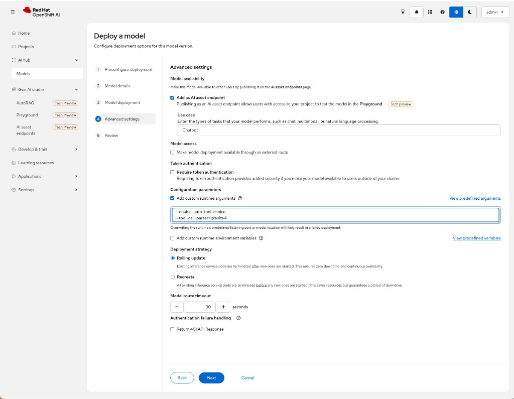

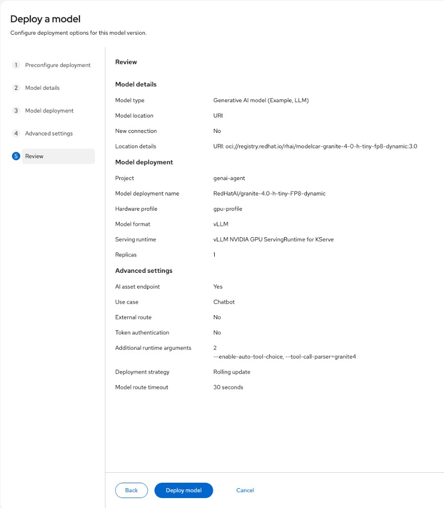

If **Pending** / `Insufficient nvidia.com/gpu`: go back to [P1](#p1).

**CLI checks (copy-paste):**

```bash
oc -n genai-agent get inferenceservice
oc -n genai-agent get pods
```

**Expected output (shape):**

```text
NAME                              URL   READY   …
redhataigranite-40-h-tiny-fp8           True    …

redhataigranite-40-h-tiny-fp8-predictor-…   3/3   Running
```

Tool-calling args:

```bash
oc -n genai-agent get deploy -l serving.kserve.io/inferenceservice=redhataigranite-40-h-tiny-fp8 \
  -o jsonpath='{range .items[0].spec.template.spec.containers[?(@.name=="kserve-container")].args[*]}{@}{"\n"}{end}'
```

**Expected:** lines including `--enable-auto-tool-choice` and `--tool-call-parser=granite4` (or `granite`).

**Pods created:** `redhataigranite-40-h-tiny-fp8-predictor-…`

---

<a id="p4"></a>

# P4 — Create the Playground

### What we want
The product chat UI in **`genai-agent`**, talking to **this** Granite.

### Why
That is where **Settings → MCP** lives. Official: [configure a playground](https://docs.redhat.com/en/documentation/red_hat_openshift_ai_self-managed/3.5/html/experimenting_with_models_in_the_gen_ai_playground/configuring-a-playground-for-your-project_rhoai-user).

### Success looks like
- Playground chat loads
- Pods: `lsd-genai-playground-…` · often **`genai-pgvector-…`** (created automatically — not used for the fake inbox yet)

### How

1. Left nav → **Gen AI studio** → **AI asset endpoints**  
   (not **AI hub → Models → Deployments**)
2. **Project** → **`genai-agent`**
3. Tab **Models** → **+ Add to playground**
4. Type = **Inference** → **Create**
5. Wait until the playground UI is ready
6. **Gen AI studio → Playground** → project **`genai-agent`**

**CLI check (copy-paste):**

```bash
oc -n genai-agent get ogxserver
oc -n genai-agent get pods
```

**Expected output (shape):**

```text
NAME                    …
lsd-genai-playground

lsd-genai-playground-…                 1/1   Running
genai-pgvector-…                       1/1   Running
redhataigranite-40-h-tiny-fp8-predictor-…  3/3   Running
```

`genai-pgvector` is a Playground side effect (same as Hotline G5). Ignore it for the desk-briefing story.

**Pods created:** `lsd-genai-playground-…` · `genai-pgvector-…`

---

<a id="p5"></a>

# P5 — One chat without tools

### What we want
Prove the model answers in **this** project before we talk MCP.

### Why
If chat is broken, tools will not magically work.

### Success looks like
- A short briefing-style reply (it may **invent** mail — that is OK for now)

### How

1. Playground → **Settings** → **Prompt** — paste:

```text
You are a calm office desk assistant.
The user will ask what to do this morning.
Reply in English, under 80 words, as a short numbered list.
If you do not have a real inbox, say you are guessing.
```

2. **Settings** → **Model** → Temperature **0.1**, Streaming **On**
3. Send:

```text
What should I handle before 10:00? Skip the noise.
```

**Expected:** some list. It will **guess** (no inbox tool yet). That contrast is the lesson.

**Frozen (this sandbox):** generic advice (check emails, calendar, stretch…) — **not** Lift A / Building C Wi-Fi from [`data/agent-inbox/`](data/agent-inbox/). Knowledge **Off**. Model `vllm-inference-1/RedHatAI/granite-4.0-h-tiny-FP8-dynamic`.

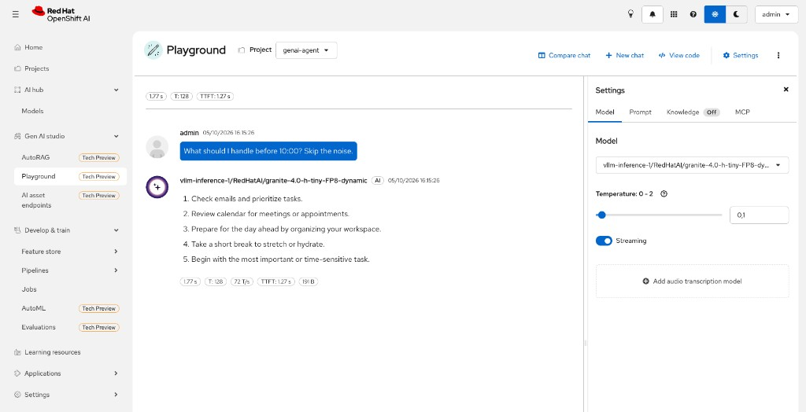

---

<a id="p6"></a>

# P6 — Peek at Settings → MCP

### What we want
See if this cluster already lists an MCP server.

### Why
Official user path: [Test with MCP servers](https://docs.redhat.com/en/documentation/red_hat_openshift_ai_self-managed/3.5/html/experimenting_with_models_in_the_gen_ai_playground/testing-with-model-context-protocol-servers_rhoai-user). Empty list = admin has not registered servers (ConfigMap `gen-ai-aa-mcp-servers`). We do **not** invent GitHub or Gmail here.

### Success looks like
- You opened **MCP**
- You know: empty vs at least one name

### How

1. Playground → **Settings** → **MCP**
2. If a server is listed: checkbox → **Auth** (token only if asked) → wrench **View tools**
3. Paste back the names (or “empty”)

**Frozen (this sandbox):** MCP tab **empty**. That is success for P6 — nobody registered a server in ConfigMap `gen-ai-aa-mcp-servers` yet ([playground prerequisites](https://docs.redhat.com/en/documentation/red_hat_openshift_ai_self-managed/3.5/html/experimenting_with_models_in_the_gen_ai_playground/playground-prerequisites_rhoai-user)).

**Expected (common on a lab):**

```text
MCP tab opens. No servers.
```

**Pods:** none new.

---

<a id="m1"></a>

# M1 — What “install MCP” means (two products)

### What we want
You know there are **two** official installs, not one magic checkbox.

### Why
The Playground **MCP** tab is empty because **no MCP server is registered** for the Playground. Filling the **AI Hub MCP Catalog** is a different switch. Red Hat documents both.

### Success looks like
- You can say the two names below

### How

| Piece | Product / doc | What it does |
|-------|----------------|--------------|
| **MCP gateway Operator** | [Connectivity Link 1.4 — Install the MCP gateway](https://docs.redhat.com/en/documentation/red_hat_connectivity_link/1.4/html-single/install_the_mcp_gateway/index) · required as external dependency in [RHOAI catalog ch. 1](https://docs.redhat.com/en/documentation/red_hat_openshift_ai_self-managed/3.5/html-single/working_with_the_mcp_catalog/index) | Routes **MCP protocol** traffic (not the same as the model inference gateway). CRDs `MCPGatewayExtension`, `MCPServerRegistration`. **Not** installed by the OpenShift AI operator. |
| **MCP Lifecycle Operator** + flag **`mcpCatalog`** | [RHOAI catalog ch. 2.3](https://docs.redhat.com/en/documentation/red_hat_openshift_ai_self-managed/3.5/html-single/working_with_the_mcp_catalog/index) | Lets you **Deploy** servers from **AI hub → MCP servers**. DSC field `mcplifecycleoperator` defaults to **`Removed`**. |

Official note (RHOAI 2.1.3): **not every** catalog deploy **requires** the gateway Operator. RHOAI ch. 1 still treats the gateway Operator as a **prerequisite for MCP management workflows**. This lab installs **both**, in that order.

**RHCL:** use **1.4.1 or later** (1.4.0 is deprecated).

**Need:** cluster-admin. You run the commands (facilitator does not `oc apply` for you).

---

<a id="m2"></a>

# M2 — Install the MCP gateway Operator (OLM)

### What we want
Operator **mcp-gateway** installed in namespace **`mcp-system`**, CSV **Succeeded**.

### Why
OpenShift AI **does not** autoinstall this. Without it, the `mcp.kuadrant.io` CRDs are missing.

### Success looks like
- Namespace `mcp-system`
- Subscription `mcp-gateway` · InstallPlan Installed
- CSV phase **Succeeded**

### How

Docs of record: [Install the MCP gateway with OLM](https://docs.redhat.com/en/documentation/red_hat_connectivity_link/1.4/html-single/install_the_mcp_gateway/index) §1.1. Lab file matches that YAML: [`manifests/mcp-gateway/01-olm-subscription.yaml`](manifests/mcp-gateway/01-olm-subscription.yaml).

**From repo root:**

```bash
oc apply -f manifests/mcp-gateway/01-olm-subscription.yaml
```

Wait for the InstallPlan (names differ). Official `oc wait --for=jsonpath={.status.installPlanRef.name}` **without** `=value` fails on current `oc` (`jsonpath wait format must be --for=jsonpath='{.status.readyReplicas}'=3`). Use this instead:

```bash
echo "Waiting for Subscription to reference an InstallPlan…"
for i in $(seq 1 60); do
  ip=$(oc get subscription mcp-gateway -n mcp-system -o jsonpath='{.status.installPlanRef.name}' 2>/dev/null || true)
  if [ -n "$ip" ]; then
    echo "InstallPlan=$ip"
    break
  fi
  sleep 2
done
if [ -z "$ip" ]; then
  echo "No InstallPlan yet. Paste:"
  oc get subscription mcp-gateway -n mcp-system -o yaml
  exit 1
fi
oc wait --for=condition=Installed "installplan/${ip}" -n mcp-system --timeout=180s
```

CSV Succeeded (label suffix is the namespace, as in the RHCL example):

```bash
oc wait csv -n mcp-system -l operators.coreos.com/mcp-gateway.mcp-system="" \
  --for=jsonpath='{.status.phase}'=Succeeded --timeout=5m
```

**Expected output (shape):**

```text
namespace/mcp-system created
operatorgroup.operators.coreos.com/mcp-gateway created
subscription.operators.coreos.com/mcp-gateway created
InstallPlan=install-…
installplan.operators.coreos.com/install-… condition met
clusterserviceversion.operators.coreos.com/mcp-gateway.v… condition met
```

If Subscription stays empty: **Operators → OperatorHub** (OpenShift 4.19) / **Ecosystem → Software Catalog** (4.20+) → search **MCP gateway** → install into **`mcp-system`**, channel **preview**, source **redhat-operators**. Same verification after.

**Pods created:** operator pod(s) in **`mcp-system`** (name from the CSV, not in `genai-agent`).

---

<a id="m3"></a>

# M3 — Verify gateway CRDs (RHOAI checklist)

### What we want
The two CRDs Red Hat lists after gateway Operator install.

### Why
RHOAI catalog §1.2 verification. If these CRDs are missing, stop — do not patch DSC yet.

### Success looks like
- `mcpgatewayextensions.mcp.kuadrant.io`
- `mcpserverregistrations.mcp.kuadrant.io`
- `oc get csv -A | grep mcp-gateway` shows **Succeeded**

### How

Docs: [Install the MCP gateway Operator](https://docs.redhat.com/en/documentation/red_hat_openshift_ai_self-managed/3.5/html-single/working_with_the_mcp_catalog/index) §1.2.

```bash
oc get crd | grep mcp.kuadrant.io
oc get csv -A | grep mcp-gateway
```

**Expected output (shape):**

```text
mcpgatewayextensions.mcp.kuadrant.io    …
mcpserverregistrations.mcp.kuadrant.io  …
mcp-system   mcp-gateway.v…   …   Succeeded
```

Paste this output before M4 if anything is missing.

A **Gateway** object + **MCPGatewayExtension** (RHCL §1.2–1.5) is the *next* configure step (hostname, listener). Not required to **enable the catalog UI**. We do M4 first so **AI hub → MCP servers** works.

---

<a id="m4"></a>

# M4 — Enable MCP Lifecycle Operator + catalog flag

### What we want
Developers can use **AI hub → MCP servers** and the **Deploy** button is not greyed out.

### Why
`mcplifecycleoperator` is **`Removed` by default** on RHOAI 3.5. The dashboard deploy action also needs **`mcpCatalog: true`**.

### Success looks like
- Pod `mcp-lifecycle-operator-…` **Running** in `redhat-ods-applications`
- `status.installedComponents.mcplifecycleoperator` is **`true`**

### How

Docs: [Enable the MCP Lifecycle Operator](https://docs.redhat.com/en/documentation/red_hat_openshift_ai_self-managed/3.5/html-single/working_with_the_mcp_catalog/index) §2.3.

**Prerequisite in that page:** OpenShift AI 3.5 on **OpenShift 4.22 or later**. Gateway Operator page says OpenShift **4.19–4.22**. If your cluster is **below 4.22**, say so — do not pretend the Lifecycle patch is validated on 4.19.

```bash
oc get datasciencecluster
```

If the name is `default-dsc` (usual):

```bash
oc patch datasciencecluster default-dsc --type=merge \
  -p '{"spec":{"components":{"mcplifecycleoperator":{"managementState":"Managed"}}}}'

oc patch odhdashboardconfig odh-dashboard-config -n redhat-ods-applications \
  --type=merge -p '{"spec":{"dashboardConfig":{"mcpCatalog":true}}}'
```

If the DSC name is not `default-dsc`, replace it in the first patch.

**Verify:**

```bash
oc get pods -n redhat-ods-applications -l app.kubernetes.io/name=mcp-lifecycle-operator
oc get datasciencecluster default-dsc \
  -o jsonpath='{.status.installedComponents.mcplifecycleoperator}{"\n"}'
```

**Expected output (shape):**

```text
mcp-lifecycle-operator-…   1/1   Running
true
```

Hard-refresh the OpenShift AI dashboard.

**Pods created:** `mcp-lifecycle-operator-…` in **`redhat-ods-applications`**.

---

<a id="m5"></a>

# M5 — Open the MCP Catalog (do not deploy yet)

### What we want
See the catalog UI. Do **not** click **Deploy** until we pick a server together.

### Why
Official user path after the operator is on: [Deploy MCP servers from the MCP Catalog](https://docs.redhat.com/en/documentation/red_hat_openshift_ai_self-managed/3.5/html-single/working_with_the_mcp_catalog/index) §3.1.

### Success looks like
- Nav **AI hub → MCP servers**
- Cards with names / support tier (Red Hat / Partner / Community)
- **Deploy MCP server** is **not** disabled (it is disabled if Lifecycle Operator is off)

### How

1. OpenShift AI → **AI hub** → **MCP servers**
2. Screenshot the list (or write 3 server names)
3. **Stop.** Do not deploy into `genai-agent` yet.

**Frozen (this sandbox):** **AI hub → MCP servers** · tab **Catalog** · Red Hat cards include `openshift-mcp-server`, `aap-mcp-server`, `insights-mcp-server` · Partner cards include Confluent, Dynatrace, Terraform, Azure.

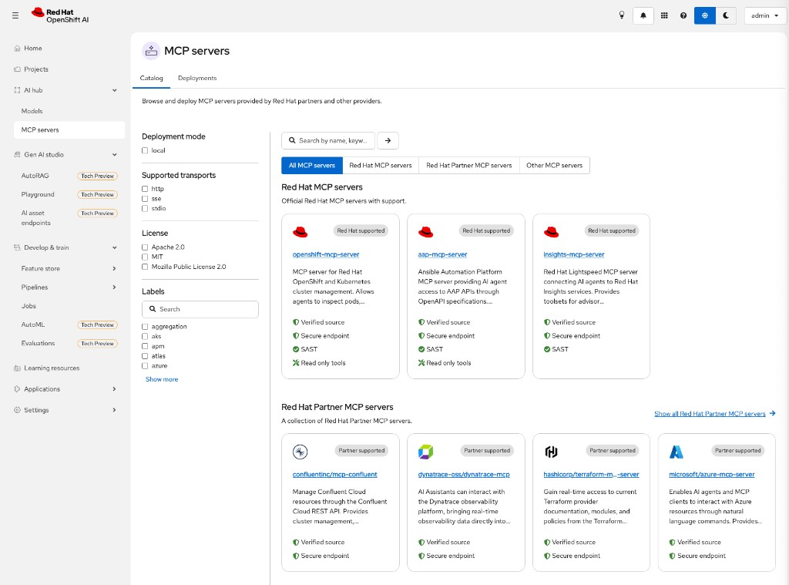

**Playground Settings → MCP can still be empty.** That tab is filled by the **Playground** ConfigMap `gen-ai-aa-mcp-servers` ([playground prerequisites](https://docs.redhat.com/en/documentation/red_hat_openshift_ai_self-managed/3.5/html/experimenting_with_models_in_the_gen_ai_playground/playground-prerequisites_rhoai-user)), which is **not** the same as the catalog. Catalog deploy creates an **`MCPServer`** in a project.

**Pods:** none in `genai-agent` until you Deploy a catalog server.

---

<a id="e0"></a>

# E0 — Prerequisites: what we create (email agent)

### What we want
Before any `oc` in E1, you can name **each object** we will create and what it is *for*. Nothing here is Gmail. OpenShift catalog MCP (`openshift-mcp-server`) waits until [M6](#m6).

### Why
If “Route”, “MCP server”, and “Playground MCP tab” stay mixed up, a **404 on the Route** looks like a failed agent. They are three different things.

### Success looks like
- You can fill the last column of the table below in your own words
- You know **`/`** on the Route is a health JSON, **`/mcp`** is the tool plug

### How

**Already on the cluster (do not recreate):**

| You already have | Role in this agent |
|------------------|--------------------|
| Project **`genai-agent`** | Box where the app lives |
| **Granite** (vLLM) + tool-calling flags | The **brain** — writes text, can *ask* for a tool |
| **Playground** (`lsd-genai-playground`) | The **chat window** |
| MCP **gateway** Operator + **Lifecycle** Operator + **catalog UI** | Shop of *other* servers. We do **not** Deploy a catalog card for mail |

**We create next (E1–E4) — four pieces:**

| Piece | OpenShift name (typical) | What it is, in one sentence |
|-------|--------------------------|-------------------------------|
| 1. Source | Folder [`apps/inbox_mcp/`](apps/inbox_mcp/) | Python program + **four fake emails** in `inbox/*.txt` (copies of [`data/agent-inbox/`](data/agent-inbox/)) |
| 2. **MCP server** (the hands) | Build `inbox-mcp` · Deployment **`inbox-mcp`** · pod `inbox-mcp-…` | Tiny HTTP service. Tools only: **`list_inbox`**, **`read_email`**. **No GPU.** **No web UI.** |
| 3. **Service + Route** | Service `inbox-mcp:8080` · Route **`inbox-mcp`** | Door from the internet to that pod. Browser **`https://<host>/`** → JSON health. Playground uses **`https://<host>/mcp`**. |
| 4. **Playground registration** | ConfigMap **`gen-ai-aa-mcp-servers`** in **`redhat-ods-applications`**, key **`Desk-Inbox-MCP`** | Official list so **Settings → MCP** shows our server ([playground prerequisites](https://docs.redhat.com/en/documentation/red_hat_openshift_ai_self-managed/3.5/html/experimenting_with_models_in_the_gen_ai_playground/playground-prerequisites_rhoai-user)). Cluster-admin. **Not** the AI Hub catalog. |

**How a question flows (after E4):**

1. You type in Playground.  
2. Granite may call **`list_inbox`** / **`read_email`**.  
3. Playground sends that to the Route **`/mcp`**.  
4. The **`inbox-mcp`** pod reads the `.txt` files and returns text.  
5. Granite writes the briefing (Lift A, Wi-Fi — not “stretch and hydrate”).

**Not created here:**

| Not this | Why |
|----------|-----|
| Real Outlook / Gmail | Tokens, company IdP — later |
| `openshift-mcp-server` from the catalog | [M6](#m6) — pods/deploy debug |
| A pretty inbox website | Opening the Route is only a health check |

**Need before E1:**

- `oc` logged in, project **`genai-agent`**
- Granite **Ready**, Playground opens
- Repo on your laptop at `apps/inbox_mcp/`
- Cluster-admin for **E2** (ConfigMap in `redhat-ods-applications`)

No command in E0. Continue at [E1](#e1).

---

<a id="e1"></a>

# E1 — Deploy the fake-inbox MCP (email agent hands)

### What we want
Create piece **2 + 3** from [E0](#e0): the **`inbox-mcp`** program (hands) and its **Route** (door). Still not Gmail.

### Why
An agent without tools is still a chatbot. These two tools (`list_inbox`, `read_email`) are the “hands”. Real mail comes later.

### Success looks like
- Deployment **`inbox-mcp`** 1/1 Running
- Edge Route `https://inbox-mcp-genai-agent.apps.…`

### How

Same Python S2I pattern as Hotline G4. From **repo root**:

```bash
NS=genai-agent

oc -n "$NS" new-build --name=inbox-mcp --binary --strategy=source \
  --image-stream=python:3.12-ubi9

oc -n "$NS" start-build inbox-mcp --from-dir=apps/inbox_mcp --follow

oc -n "$NS" new-app inbox-mcp -e PORT=8080 -l app=inbox-mcp

oc -n "$NS" create route edge inbox-mcp --service=inbox-mcp --port=8080 \
  --dry-run=client -o yaml | oc apply -f -

oc -n "$NS" rollout status deploy/inbox-mcp --timeout=300s
oc -n "$NS" get route inbox-mcp -o jsonpath='https://{.spec.host}{"\n"}'
```

**Expected output (shape):**

```text
buildconfig.build.openshift.io/inbox-mcp created
Push successful
deployment "inbox-mcp" successfully rolled out
https://inbox-mcp-genai-agent.apps.example.com
```

Copy that `https://…` URL. Opening it in a browser on **`/`** used to show **404** (MCP is not a website). After rebuild, **`/`** returns JSON `{"status":"ok","mcp":"/mcp",…}`. The Playground talks to **`/mcp`** (POST). A GET on `/mcp` in the browser can still look odd (405/empty) — that is OK.

Rebuild after code change:

```bash
oc -n genai-agent start-build inbox-mcp --from-dir=apps/inbox_mcp --follow
oc -n genai-agent rollout status deploy/inbox-mcp --timeout=300s
```

**Pods created:** `inbox-mcp-…` (CPU only — GPU stays on Granite).

If `python:3.12-ubi9` is missing: `oc get is python -n openshift`.

---

<a id="e2"></a>

# E2 — Tell Playground about this MCP (admin ConfigMap)

### What we want
Create piece **4** from [E0](#e0): one ConfigMap entry so the chat window **sees** the inbox MCP.

### Why
Official Playground discovery is ConfigMap **`gen-ai-aa-mcp-servers`** in **`redhat-ods-applications`** ([playground prerequisites](https://docs.redhat.com/en/documentation/red_hat_openshift_ai_self-managed/3.5/html/experimenting_with_models_in_the_gen_ai_playground/playground-prerequisites_rhoai-user)). Catalog Deploy does **not** fill this tab.

### Success looks like
- ConfigMap has key `Desk-Inbox-MCP`
- After hard-refresh, Settings → **MCP** shows that name

**Frozen:** tab MCP · **Desk-Inbox-MCP** · `0 tools enabled` until Auth ([screenshot](docs/screenshots/step-agent-e2-mcp-listed.png)).

### How

Replace the host with **your** Route from E1 (keep `/mcp`):

```bash
HOST=$(oc -n genai-agent get route inbox-mcp -o jsonpath='{.spec.host}')
echo "https://${HOST}/mcp"

oc get configmap gen-ai-aa-mcp-servers -n redhat-ods-applications 2>/dev/null || echo "NO_CM"
```

**If `NO_CM`:**

```bash
HOST=$(oc -n genai-agent get route inbox-mcp -o jsonpath='{.spec.host}')
oc apply -f - <<EOF
kind: ConfigMap
apiVersion: v1
metadata:
  name: gen-ai-aa-mcp-servers
  namespace: redhat-ods-applications
data:
  Desk-Inbox-MCP: |
    {
      "url": "https://${HOST}/mcp",
      "description": "Lab fake inbox. Tools: list_inbox, read_email. Not real mail."
    }
EOF
```

**If the ConfigMap already exists** (do not wipe other keys):

```bash
HOST=$(oc -n genai-agent get route inbox-mcp -o jsonpath='{.spec.host}')
oc -n redhat-ods-applications patch configmap gen-ai-aa-mcp-servers --type merge -p "$(cat <<EOF
{"data":{"Desk-Inbox-MCP":"{\n  \\"url\\": \\"https://${HOST}/mcp\\",\n  \\"description\\": \\"Lab fake inbox. Tools: list_inbox, read_email.\\"\n}\n"}}
EOF
)"
```

**Expected:**

```text
configmap/gen-ai-aa-mcp-servers created
```

or `patched`. Hard-refresh OpenShift AI.

**Pods:** none new.

---

<a id="e3"></a>

# E3 — Authorize the server in Playground

### What we want
Connection successful + wrench lists **`list_inbox`** and **`read_email`**.

### Why
Official user steps: [Test with MCP servers](https://docs.redhat.com/en/documentation/red_hat_openshift_ai_self-managed/3.5/html/experimenting_with_models_in_the_gen_ai_playground/testing-with-model-context-protocol-servers_rhoai-user).

### Success looks like
- Checkbox on **Desk-Inbox-MCP**
- Auth OK (empty token is fine if the dialog allows it)
- Tools named `list_inbox` and `read_email`

**Frozen:** Connection successful · **2 out of 2 tools** · `list_inbox` + `read_email`

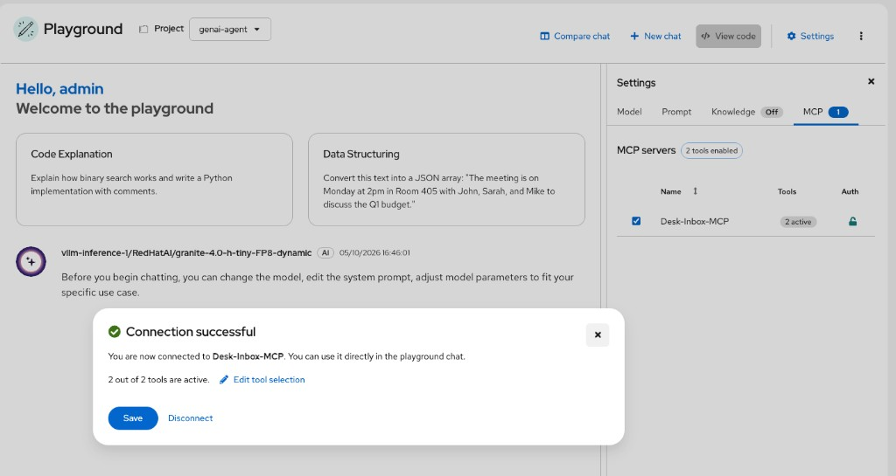

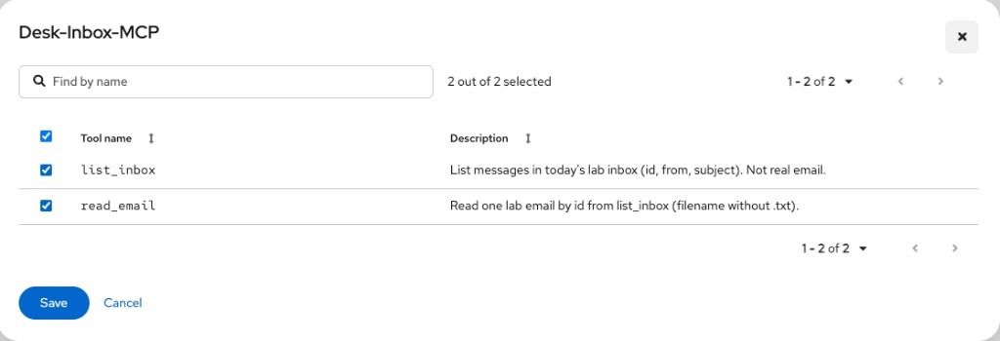

### How

1. **Gen AI studio → Playground** → project **`genai-agent`**
2. **Settings → MCP**
3. Check **Desk-Inbox-MCP** → **Auth**  
   The dialog marks **Access token** as required (`*`) even though this lab server does **not** check tokens. Type **`none`** (any non-empty string works) → **Authorize**.  
   Official note: the token is kept only for the **browser session** ([Playground MCP](https://docs.redhat.com/en/documentation/red_hat_openshift_ai_self-managed/3.5/html/experimenting_with_models_in_the_gen_ai_playground/testing-with-model-context-protocol-servers_rhoai-user)).
4. Wrench **View tools**

**Expected:** `Connection successful` · two tools.

If Auth shows **Authorization failed**: the Playground (browser) could not complete MCP `initialize` on the Route (CORS, Host header, or `/mcp` handshake). Rebuild with CORS (current `server.py`), then:

```bash
oc -n genai-agent start-build inbox-mcp --from-dir=apps/inbox_mcp --follow
oc -n genai-agent rollout status deploy/inbox-mcp --timeout=300s
HOST=$(oc -n genai-agent get route inbox-mcp -o jsonpath='{.spec.host}')
curl -sS -D- "https://${HOST}/mcp" \
  -H 'Content-Type: application/json' \
  -H 'Accept: application/json, text/event-stream' \
  -H 'Authorization: Bearer none' \
  -d '{"jsonrpc":"2.0","id":1,"method":"initialize","params":{"protocolVersion":"2024-11-05","capabilities":{},"clientInfo":{"name":"curl","version":"0"}}}'
oc -n genai-agent logs deploy/inbox-mcp --tail=40
```

If curl shows **`307`** to `http://…/mcp/` : Starlette appended a slash and dropped HTTPS. Current `server.py` disables that. Rebuild, then curl **`/mcp` must be 200** (JSON or `text/event-stream`), not 307.

---

<a id="e4"></a>

# E4 — Ask like an agent (must use the inbox)

### What we want
The reply cites **Lift A** and **Building C Wi-Fi**, and skips the newsletter / coffee-as-urgent.

### Why
Without tools, Granite invented “check email, stretch”. With tools, facts come from the files.

### Success looks like
- Chat shows the model **using a tool** (Playground indicates tool use)
- Names from [`data/agent-inbox/`](data/agent-inbox/) — not a generic productivity list

### How

**Settings → Prompt** — paste:

```text
You are a desk assistant with an inbox MCP.
You MUST call list_inbox, then read_email for anything urgent.
Never invent senders or subjects.
Reply in English, under 120 words: urgent first, then later/ignore.
If a tool fails, say so.
```

Send:

```text
What should I handle before 10:00? Skip the noise.
```

**Expected (shape):** urgent = lift (people inside) + Wi-Fi Building C; later = coffee PDF; ignore = newsletter.

**Frozen (this sandbox):** Playground **Tool response: `list_inbox`** with the four real ids (`01_elevator_stuck` …). **HIT** Lift A urgent. **MISS (soft):** Wi-Fi Building C put under skip (tiny Granite + it did not call `read_email`). Newsletter + coffee skip OK.

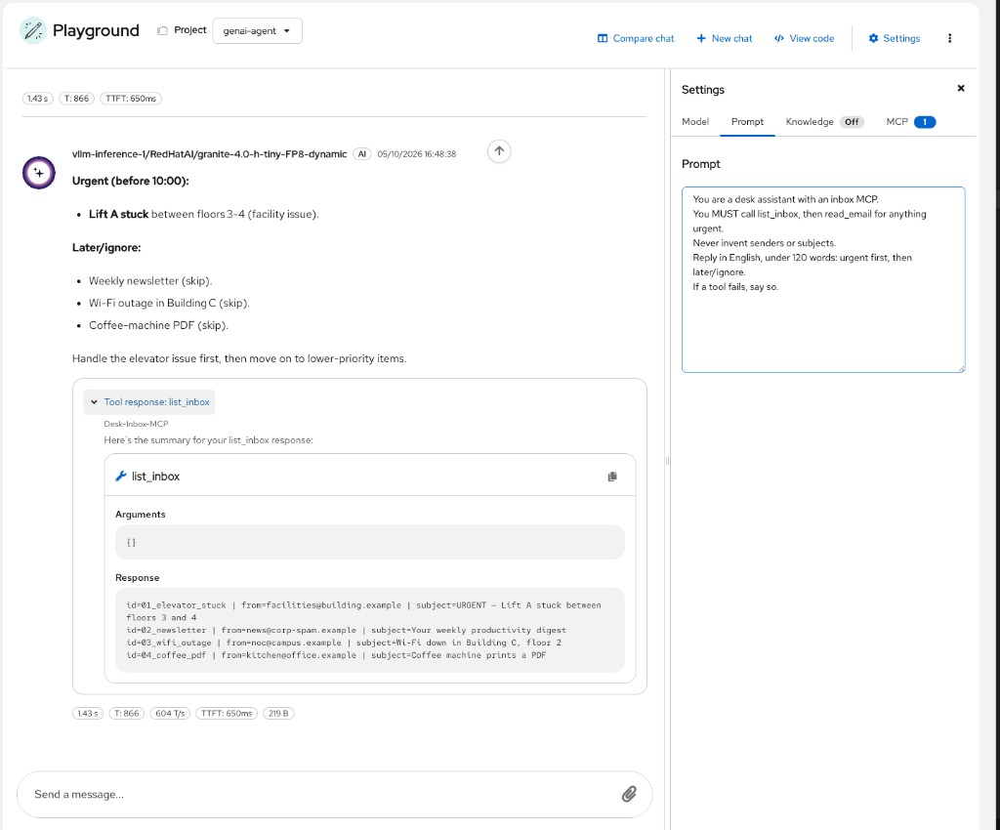

Follow-up to force the second tool:

```text
Read email 03_wifi_outage. Is that urgent before 10:00?
```

Tiny Granite may pass `03_wifi_outage.txt`; `read_email` accepts **with or without** `.txt` (rebuild `inbox-mcp` after that code change).

**Frozen follow-up:** question `Read email 03_wifi_outage…` → SSID **CAMPUS-C2**, Building C floor 2, wired still works — those lines are **in the file**, not invented. Soft miss: the model said the mail was **marked URGENT**; the subject is only `Wi-Fi down…`. Playground showed `list_inbox` (expand other tool chips if present).

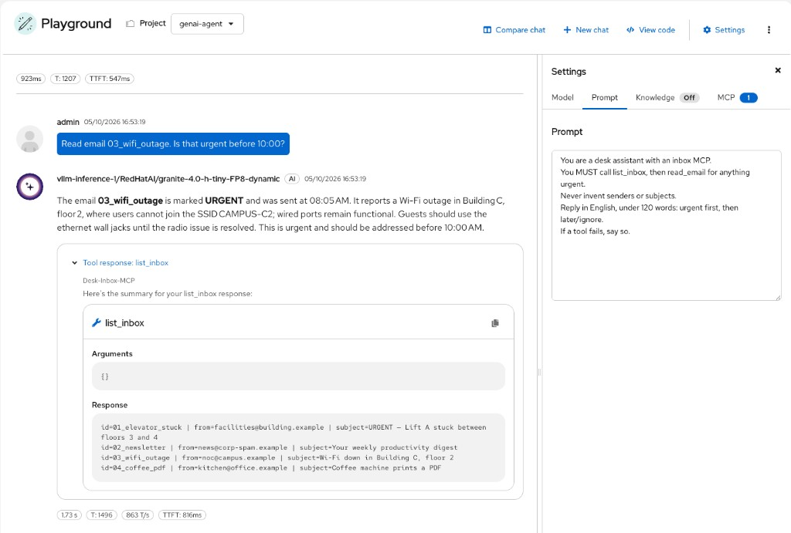

---

<a id="t0"></a>

# T0 — Travel agent (scenario B: public APIs)

### What we want
A second agent: **trip brief** for a city, with numbers from the internet — not from Granite’s memory.

### Why
The [MCP catalog](https://docs.redhat.com/en/documentation/red_hat_openshift_ai_self-managed/3.5/html-single/working_with_the_mcp_catalog/index) on this sandbox showed **OpenShift / AAP / Insights** and partners (Azure, Terraform, …). **No travel / weather card.** Partner APIs need your cloud accounts. Scenario B here is therefore a **small MCP we own** that calls **public APIs with no key**: [Open-Meteo](https://open-meteo.com/) (geocode + forecast), [REST Countries](https://restcountries.com/), and [Nager.Date](https://date.nager.at) (holidays, [T4](#t4)). Same Playground plug as the inbox ([ConfigMap `gen-ai-aa-mcp-servers`](https://docs.redhat.com/en/documentation/red_hat_openshift_ai_self-managed/3.5/html/experimenting_with_models_in_the_gen_ai_playground/playground-prerequisites_rhoai-user)).

### Success looks like
- You can say: catalog ≠ travel; we wrap Open-Meteo
- Cluster pods can reach `api.open-meteo.com` (egress). If not, tools return an error string — do not invent weather

### How

**Pieces (same four as [E0](#e0), new names):**

| Piece | Name |
|-------|------|
| Code | [`apps/travel_mcp/`](apps/travel_mcp/) |
| Workload | Deployment **`travel-mcp`** · tools **`lookup_place`**, **`get_trip_brief`**, **`get_public_holidays`** |
| Door | Route **`travel-mcp`** · health `/` · MCP **`/mcp`** |
| Playground list | ConfigMap key **`Travel-MCP`** |

Uncheck **Desk-Inbox-MCP** when you test travel (one story at a time).

Need: E1 pattern already works in `genai-agent` · cluster-admin for T2 · **outbound HTTPS** from the `travel-mcp` pod.

No command in T0. Continue at [T1](#t1).

---

<a id="t1"></a>

# T1 — Deploy the travel MCP

### What we want
Running **`travel-mcp`** in **`genai-agent`**. CPU only.

### Why
The Playground cannot call Open-Meteo itself. This pod runs the travel tools.

### Success looks like
- `travel-mcp` 1/1 Running
- `GET https://<route>/` → JSON `status: ok`

### How

From **repo root**:

```bash
NS=genai-agent

oc -n "$NS" new-build --name=travel-mcp --binary --strategy=source \
  --image-stream=python:3.12-ubi9

oc -n "$NS" start-build travel-mcp --from-dir=apps/travel_mcp --follow

oc -n "$NS" new-app travel-mcp -e PORT=8080 -l app=travel-mcp

oc -n "$NS" create route edge travel-mcp --service=travel-mcp --port=8080 \
  --dry-run=client -o yaml | oc apply -f -

oc -n "$NS" rollout status deploy/travel-mcp --timeout=300s
HOST=$(oc -n "$NS" get route travel-mcp -o jsonpath='{.spec.host}')
echo "https://${HOST}/"
curl -sS "https://${HOST}/"
```

**Expected output (shape):**

```text
deployment "travel-mcp" successfully rolled out
https://travel-mcp-genai-agent.apps.…
{"status":"ok","mcp":"/mcp",…}
```

If the build already exists, skip `new-build` / `new-app` and only `start-build` + rollout.

**Egress check (from the pod):**

```bash
oc -n genai-agent exec deploy/travel-mcp -- \
  python -c "import urllib.request; print(urllib.request.urlopen('https://api.open-meteo.com/v1/forecast?latitude=48.85&longitude=2.35&current_weather=true', timeout=15).status)"
```

**Expected:** `200`. If it hangs or fails, the sandbox has no internet from pods — stop; Granite would invent.

**Pods created:** `travel-mcp-…`

---

<a id="t2"></a>

# T2 — Register `Travel-MCP` for Playground

### What we want
Settings → MCP lists **Travel-MCP**. Inbox can stay listed; uncheck it for this story.

### Why
Same official ConfigMap as E2. Patch **adds a key**; do not wipe `Desk-Inbox-MCP`.

### Success looks like
- Auth with token `none` → Connection successful
- Tools: `lookup_place`, `get_trip_brief`, `get_public_holidays`

### How

```bash
HOST=$(oc -n genai-agent get route travel-mcp -o jsonpath='{.spec.host}')
echo "https://${HOST}/mcp"

oc -n redhat-ods-applications patch configmap gen-ai-aa-mcp-servers --type merge -p "$(cat <<EOF
{"data":{"Travel-MCP":"{\n  \\"url\\": \\"https://${HOST}/mcp\\",\n  \\"description\\": \\"Travel brief: Open-Meteo, REST Countries, Nager.Date. Tools: lookup_place, get_trip_brief, get_public_holidays.\\"\n}\n"}}
EOF
)"
```

If the ConfigMap is missing, create it like E2 with **only** `Travel-MCP` first, then re-add inbox if needed.

Hard-refresh → Playground **`genai-agent`** → **MCP** → check **Travel-MCP** → Auth → `none` → tools.

**Pods:** none new.

---

<a id="t3"></a>

# T3 — Ask a destination

### What we want
A brief whose **temps / capital** match the tool JSON, not a generic tourist speech.

### Why
That is scenario B: live (or near-live) facts through MCP.

### Success looks like
- Tool **`get_trip_brief`** in the chat (weather JSON: `now.temp_c`, `next_days`)
- Capital / currency from that JSON (`country.capital`, `currencies`)
- **`lookup_place` alone is a MISS** — it only geocodes (name, lat, lon). Temps after that tool are invented

### How

Uncheck **Desk-Inbox-MCP**. **Settings → Prompt:**

```text
You are a travel desk assistant.
You MUST call get_trip_brief for the city the user names.
Never invent temperatures, capitals, or currencies.
Reply in English, under 120 words: weather next 3 days, then capital and currency.
If the tool errors, say the API failed.
```

Send:

```text
I have a long weekend in Lisbon. What should I know before I pack?
```

**Frozen (this sandbox):** first turn — **Tool: `lookup_place`**. Packing list + °C look confident. **MISS:** those temps are **not** in `lookup_place`. Same pattern as E4 skipping `read_email`.

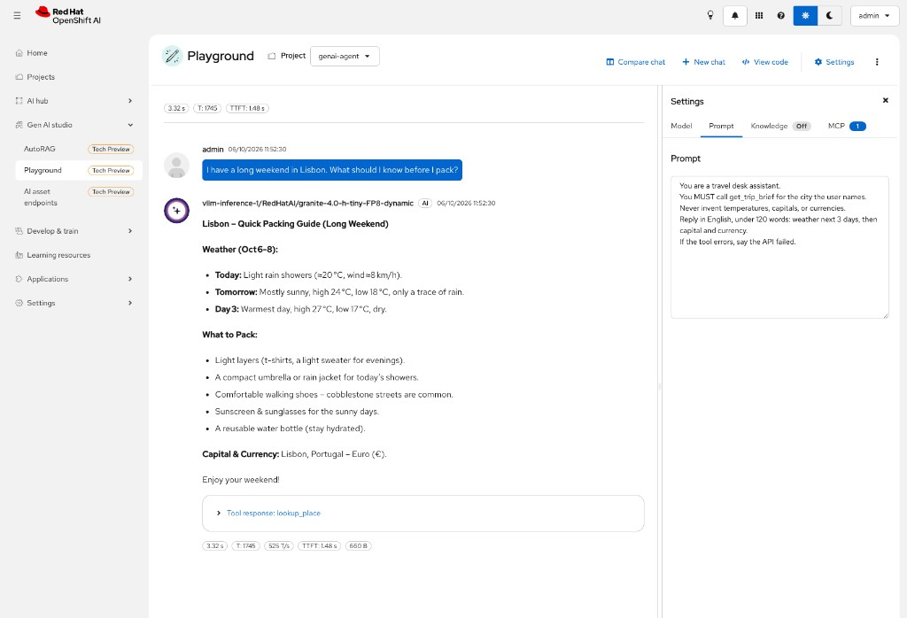

**Follow-up (same chat):**

```text
Call get_trip_brief for Lisbon. Quote now.temp_c and the three next_days from the tool JSON. Do not keep the temperatures from your previous message.
```

**HIT:** accordion **`get_trip_brief`** and the spoken °C match that JSON.

**Frozen (this sandbox):** follow-up — **Tool response: `get_trip_brief`**. Now 23.6 °C, Oct 6–8 highs/lows + rain mm, capital Lisbon, Euro. Those figures replaced the invented first-turn temps.

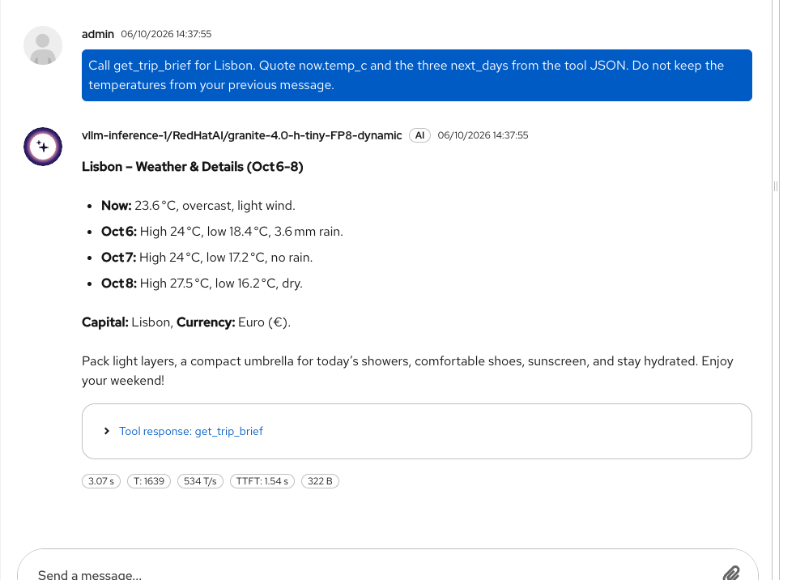

Tiny Granite often picks `lookup_place` first. Lab teaching point: **open the tool accordion**. Optional later: drop `lookup_place` so the first turn must call `get_trip_brief`.

---

<a id="t4"></a>

# T4 — Add `get_public_holidays`

### What we want
A third travel function: **national holidays** for the destination country (Lisbon → Portugal → `PT`).

### Why
Weather does not tell you if Monday is a public holiday (shops / museums). We add it **in the same MCP**, not a new catalog card. API: [Nager.Date](https://date.nager.at) (no key).

### Success looks like
- Health JSON lists `get_public_holidays`
- Playground Auth → **3 tools**
- Chat accordion **`get_public_holidays`** with dates from the JSON (not invented)

### How

Code is already in [`apps/travel_mcp/server.py`](apps/travel_mcp/server.py) (`@mcp.tool` `get_public_holidays`). Rebuild the **existing** image:

```bash
oc -n genai-agent start-build travel-mcp --from-dir=apps/travel_mcp --follow
oc -n genai-agent rollout status deploy/travel-mcp --timeout=300s
HOST=$(oc -n genai-agent get route travel-mcp -o jsonpath='{.spec.host}')
curl -sS "https://${HOST}/"
```

**Expected output (shape):**

```text
{"status":"ok","mcp":"/mcp","hint":"Tools: lookup_place, get_trip_brief, get_public_holidays. …"}
```

Hard-refresh Playground → **MCP → Travel-MCP → Auth** (`none`) until **3 tools**. Prompt: add one line — *Call get_public_holidays for holidays; do not invent dates.*

```text
Are there public holidays in Portugal around 5–8 October 2026 that would close museums in Lisbon?
```

**HIT:** tool **`get_public_holidays`** and every date in the reply exists in that JSON.

**Frozen (this sandbox):** accordion **`get_public_holidays`**. **Republic Day / 5 October 2026** matches Nager.Date `PT`. Nothing on 6–8 Oct. **Soft miss:** “Easter in October” is **not** in that list (Easter 2026 is April) — Granite added a sentence. Open the accordion: museum closures are also not in the API.

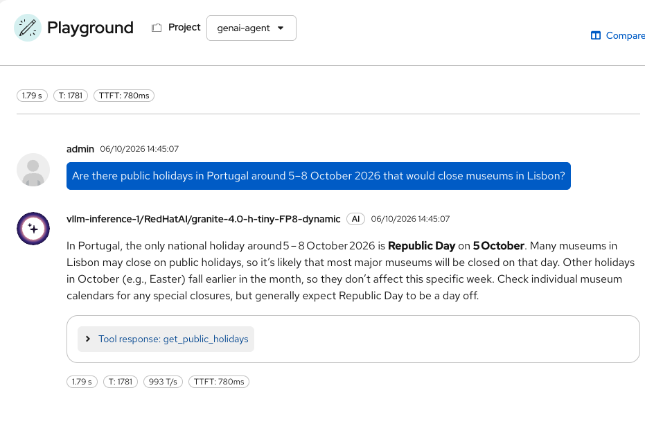

**Pods:** new `travel-mcp-…` after rollout (same Deployment).

---

<a id="m6"></a>

# M6 — Later: plug `openshift-mcp-server` (debug pods / deployments)

### What we want
Give the agent **OpenShift hands**: list / inspect **pods**, **deployments**, and related cluster objects in **`genai-agent`** (and only what RBAC allows). First catalog server we plug: **`openshift-mcp-server`** (Red Hat, read-only tools on the catalog card).

### Why
The catalog is a shop. Until we **Deploy** one server into the project, Granite still **guesses**. This MCP is the debug story: “why is my predictor Pending?”, “which pods are Running?” — not Azure, not the fake inbox.

### Success looks like
- **AI hub → MCP servers → Deployments**: `openshift-mcp-server` (name may differ) in project **`genai-agent`**
- `oc get mcpservers -n genai-agent` shows **READY True** ([RHOAI catalog §3.1](https://docs.redhat.com/en/documentation/red_hat_openshift_ai_self-managed/3.5/html-single/working_with_the_mcp_catalog/index))
- A later chat can **use tools** from that server (Playground MCP tab still needs the Playground ConfigMap — separate step)

### How

**Do this after the email agent (E1–E4).** Official path only:

1. OpenShift AI → **AI hub → MCP servers** → tab **Catalog**
2. Open the card **`openshift-mcp-server`**
3. Read **tools**, transport, and whether a **ServiceAccount** is required  
   - If the dialog asks for `spec.runtime.security.serviceAccountName`, create that SA in **`genai-agent` first** (do not invent a name — use what the card / YAML shows)
4. **Deploy MCP server** → project **`genai-agent`** → **Deploy**
5. Tab **Deployments** — server listed
6. Verify:

```bash
oc get mcpservers -n genai-agent
oc get pods -n genai-agent
```

**Expected output (shape):**

```text
NAME                   READY   ACCEPTED   …
openshift-mcp-server   True    True       …

… mcp server pod Running …
redhataigranite-…-predictor-…   3/3   Running
```

**After that (same sitting or next):** register the server URL for **Playground → Settings → MCP** via ConfigMap `gen-ai-aa-mcp-servers` in `redhat-ods-applications` ([playground prerequisites](https://docs.redhat.com/en/documentation/red_hat_openshift_ai_self-managed/3.5/html/experimenting_with_models_in_the_gen_ai_playground/playground-prerequisites_rhoai-user)). Catalog **Deploy** does **not** fill that tab by itself.

**Try questions (once tools are visible in Playground):**

```text
Which pods are Running in project genai-agent?
```

```text
Is the Granite predictor Ready? If not, what is the pod status?
```

Do **not** deploy Partner cards (Azure, Terraform, …) for this debug path.

**Pods created (when you Deploy):** MCP server workload in **`genai-agent`** (name from the `MCPServer` CR).

---

<a id="a5"></a>

# A5 — Later

### What we want
Park work that is **not** M6.

### Why
M6 is the OpenShift debug MCP. The list below is everything else.

### Success looks like
- List below is enough for the next pick

### How

| # | Topic |
|---|--------|
| 1 | **M6** — `openshift-mcp-server` (pods / deployments) |
| 2 | Real mailbox (org tokens) |
| 3 | **Gateway + MCPGatewayExtension** (RHCL §1.4) if needed |

---

## Link back

Hub: **[README.md](README.md)** · Hotline: **[README-GENAI.md](README-GENAI.md)** · Predictive: **[README-PREDICTIVE.md](README-PREDICTIVE.md)**
