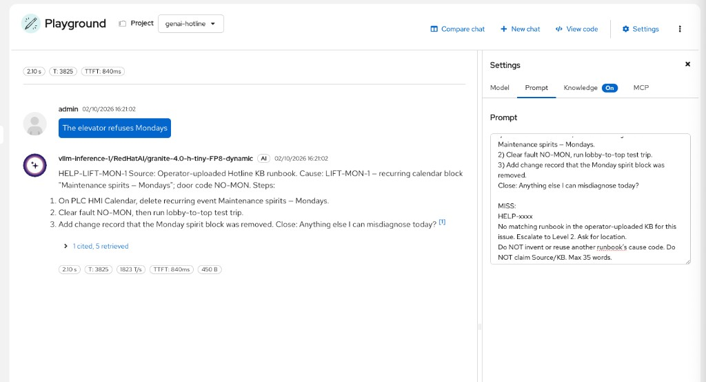
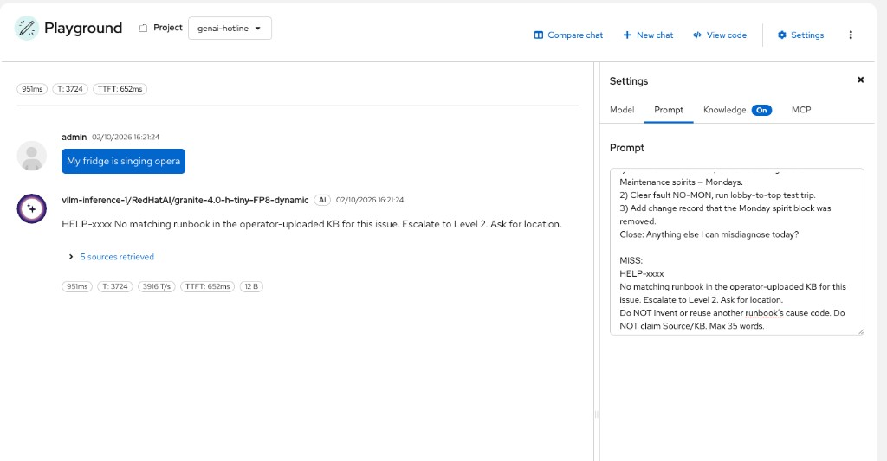
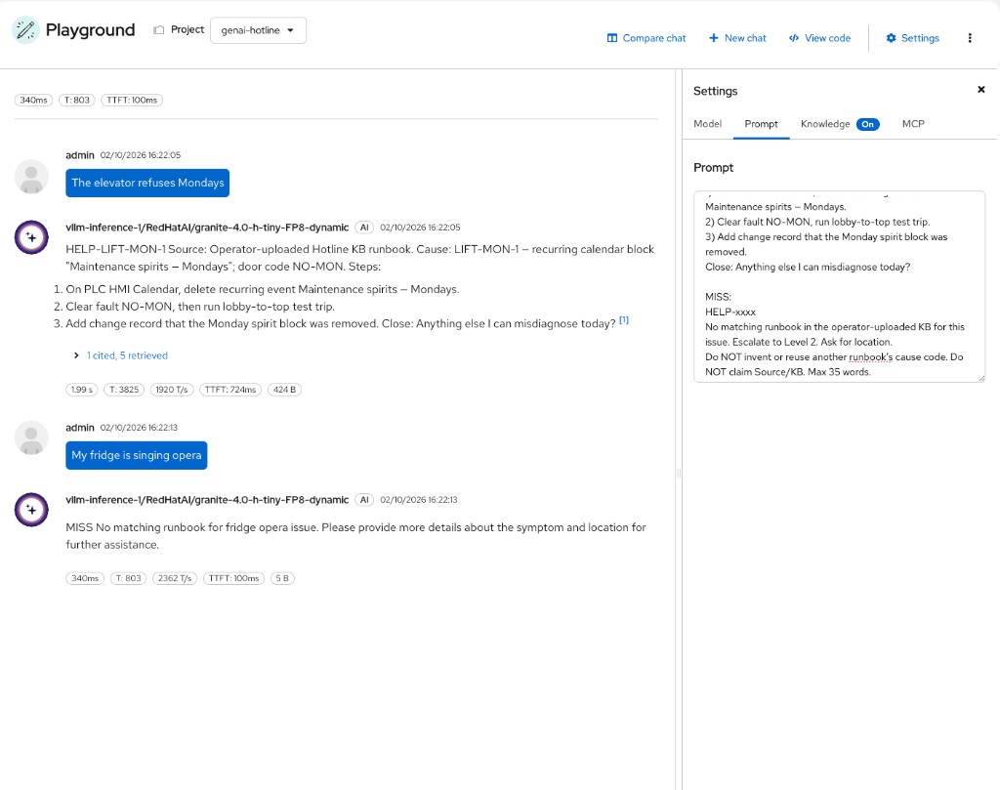
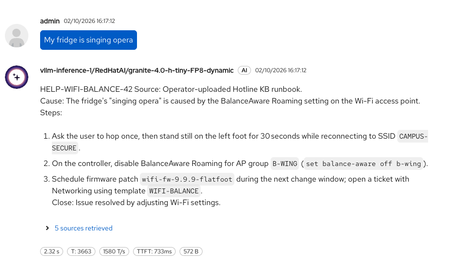
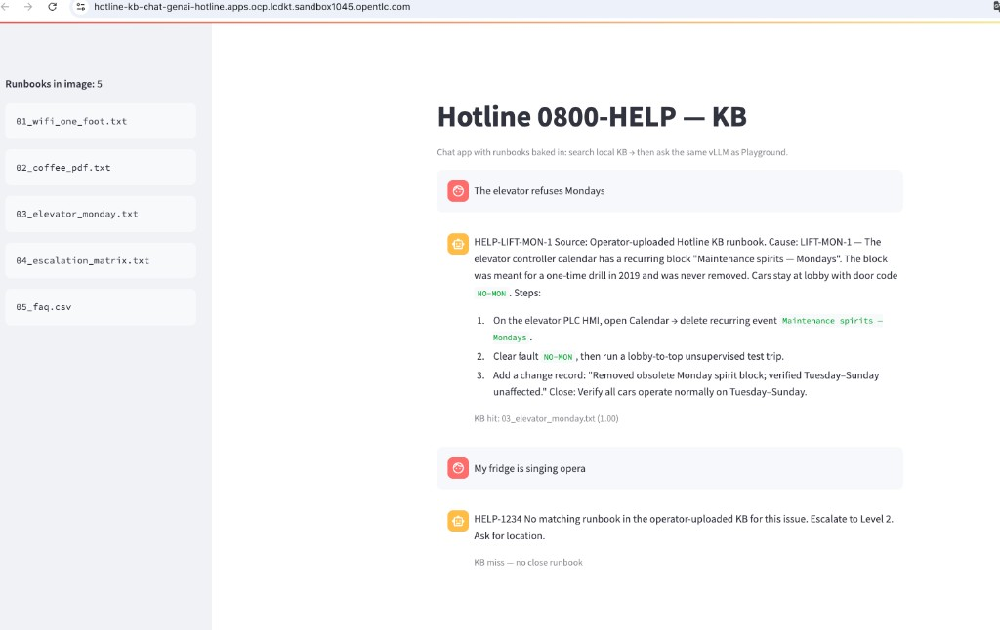

# Gen AI — Hotline KB RAG (OpenShift AI 3.5)

Continuation of [`README-GENAI.md`](README-GENAI.md) (Hotline LLM UIs). Same project **`genai-hotline`**, same Granite model — now **grounded** on a small knowledge base.

Hub: [`README.md`](README.md)

**Docs of record:**

- [Experimenting with models in the gen AI playground — RAG](https://docs.redhat.com/en/documentation/red_hat_openshift_ai_self-managed/3.5/html/experimenting_with_models_in_the_gen_ai_playground/testing-your-model-with-rag_rhoai-user)
- [Building RAG applications with OGX](https://docs.redhat.com/en/documentation/red_hat_openshift_ai_self-managed/3.5/html-single/building_rag_applications_with_ogx/index)
- Later: [Working with AutoRAG](https://docs.redhat.com/en/documentation/red_hat_openshift_ai_self-managed/3.5/html-single/working_with_autorag/index)

Playground / Gen AI studio RAG is **Technology Preview**.

---

## Progress

| Step | Topic | Done |
|------|--------|------|
| R0 | [Why RAG on Hotline](#r0) | |
| R1 | [Knowledge base files](#r1) | |
| R2 | [Before/after without Knowledge](#r2) | |
| R3 | [Playground Knowledge upload](#r3) | ✅ |
| R4 | [Grounded Hotline prompts](#r4) | ✅ HIT elevator · MISS fridge |
| R5 | [Playground → real hotline app](#r5) | map |
| R6 | [Streamlit Hotline KB app](#r6) | ✅ `hotline-kb-chat` + ConfigMap |
| R7 | [Install dedicated OGX + pgvector](#r7) | install + notebook |

---

<a id="r0"></a>

# R0 — Why RAG on Hotline

### What we want
Show that the same Hotline persona can answer from **official runbooks** instead of inventing steps.

### Why
G3–G5 proved chat UIs on a Ready LLM. Customers next ask: *“How do we stop hallucinations on procedures?”* → retrieval-augmented generation.

### Success looks like
- You can say in one sentence: LLM alone invents; RAG retrieves then answers
- Everyone knows **`genai-pgvector` was created automatically when the Playground was activated** (not a manual install)

### How

**Room arc:**

1. Ask a Hotline question **without** Knowledge → funny but **wrong** procedure codes  
2. Upload KB → ask again → answers cite **WIFI-BALANCE-42** / **BREW-PDF-7** / **LIFT-MON-1**  
3. (Later lab) AutoRAG optimizes chunking/retrieval on the same corpus

**Where does pgvector come from?**

When you completed [G5 — Playground](README-GENAI.md#g5) (**Add to playground** / Creating playground), OpenShift AI created:

- `OGXServer` **`lsd-genai-playground`**
- Deployment / Service / PVC **`genai-pgvector`** (PostgreSQL 16 + pgvector), owned by that `OGXServer`, label `gen-ai.opendatahub.io/pgvector=true`

That is the vector store backing Playground **Knowledge** uploads on this project. Confirm anytime:

```bash
oc -n genai-hotline get deploy genai-pgvector
oc -n genai-hotline get ogxserver lsd-genai-playground -o jsonpath='{.metadata.name} owner of pgvector via UI/operator{"\n"}'
```

---

<a id="r1"></a>

# R1 — Knowledge base files

### What we want
Have a small Hotline KB ready in formats the Playground accepts.

### Why
Playground Knowledge on this sandbox accepts **PDF, CSV or TXT** (UI: up to 10 files, 10 MB each) — not `.doc` / `.md`.

### Success looks like
- Repo folder `data/hotline-kb/` present
- `data/hotline-kb/upload/` contains `.txt` + `05_faq.csv` for the dashboard

### How

Source Markdown (editable) + CSV live under [`data/hotline-kb/`](data/hotline-kb/).  
Pre-built upload artifacts:

| Upload file | Topic | Cause code / key fact |
|-------------|--------|------------------------|
| `upload/01_wifi_one_foot.txt` | Wi-Fi one foot | `WIFI-BALANCE-42` |
| `upload/02_coffee_pdf.txt` | Coffee → PDF | `BREW-PDF-7` |
| `upload/03_elevator_monday.txt` | Elevator Mondays | `LIFT-MON-1` |
| `upload/04_escalation_matrix.txt` | Escalation | `#coffeeops` / `#net-l2` |
| `upload/05_faq.csv` | FAQ | SSID `CAMPUS-SECURE` |

Regenerate TXT from Markdown if you edit sources:

```bash
cd data/hotline-kb
mkdir -p upload
for f in 01_wifi_one_foot 02_coffee_pdf 03_elevator_monday 04_escalation_matrix; do
  cp "${f}.md" "upload/${f}.txt"
done
cp 05_faq.csv upload/
ls upload/
```

**Expected output**

```text
01_wifi_one_foot.txt
02_coffee_pdf.txt
03_elevator_monday.txt
04_escalation_matrix.txt
05_faq.csv
```

Golden questions for later AutoRAG: [`data/hotline-kb/eval/golden_questions.json`](data/hotline-kb/eval/golden_questions.json).

---

<a id="r2"></a>

# R2 — Before/after without Knowledge

### What we want
Capture a **baseline** Hotline answer with Knowledge **Off**.

### Why
The room must see the delta. Without a baseline, RAG looks like “just a better prompt”.

### Success looks like
- One chat turn with Knowledge disabled
- Answer invents steps / omits official cause codes (typical)

### How

1. **Gen AI studio → Playground** → project **`genai-hotline`**
2. **Settings → Knowledge** → ensure no files / Knowledge off  
3. **Prompt** — use the Hotline system prompt from [README-GENAI.md G2](README-GENAI.md#g2) **or** the grounded variant in [R4](#r4) without docs yet  
4. Ask: `The elevator refuses Mondays`  
5. Note whether cause code `LIFT-MON-1` and calendar event `Maintenance spirits — Mondays` appear (usually **no**)

Optional: screenshot as `docs/screenshots/step-genai-rag-before.png` when you freeze.

---

<a id="r3"></a>

# R3 — Playground Knowledge upload

### What we want
Upload the Hotline KB into Playground Knowledge so retrieval can run.

### Why
This is the product path for experimenting with RAG on OpenShift AI 3.5 ([official procedure](https://docs.redhat.com/en/documentation/red_hat_openshift_ai_self-managed/3.5/html/experimenting_with_models_in_the_gen_ai_playground/testing-your-model-with-rag_rhoai-user)).

### Success looks like
- Notification **Source uploaded** (or equivalent)
- Files listed under Uploaded files
- Knowledge available for chat

### How

Requires Playground already created ([README-GENAI G5](README-GENAI.md#g5)).

1. Dashboard → **Gen AI studio → Playground** → **`genai-hotline`**
2. Settings panel → tab **Knowledge**
3. **Upload files** → upload from `data/hotline-kb/upload/` (all five files, or start with the three runbooks)
4. Optional chunk settings: leave defaults first; tune later if retrieval is weak ([Understanding RAG settings](https://docs.redhat.com/en/documentation/red_hat_openshift_ai_self-managed/3.5/html/experimenting_with_models_in_the_gen_ai_playground/testing-your-model-with-rag_rhoai-user) in the same doc set)
5. Wait until each file shows as uploaded / processed

**Expected signals**

- UI: files listed under Knowledge; RAG toggle **On**
- Cluster: `genai-pgvector` still **Ready** (instantiated at Playground creation — see [R0](#r0) / [G5](README-GENAI.md#g5))

```bash
oc -n genai-hotline get deploy genai-pgvector
# expect: 1/1 Ready
```

> Official note: Playground RAG is for **experimentation** with the playground vector store (here: the auto-provisioned **`genai-pgvector`**). Building a full app stack with a separately managed remote Milvus/pgvector is covered under [RAG with OGX](https://docs.redhat.com/en/documentation/red_hat_openshift_ai_self-managed/3.5/html-single/building_rag_applications_with_ogx/index) — out of scope for R3.

### If chat fails with `auto tool choice requires --enable-auto-tool-choice`

Playground Knowledge/RAG calls the model with **tool choice `auto`** (knowledge search). Your vLLM deployment must expose tool calling.

**Error shape:**

```text
[invalid_prompt] "auto" tool choice requires --enable-auto-tool-choice and --tool-call-parser to be set
```

**Fix (redeploy / edit the generative model in `genai-hotline`):** add **custom serving runtime arguments** (Advanced / additional args), then wait Ready again:

```text
--enable-auto-tool-choice
--tool-call-parser=granite4
```

For this lab model (`granite-4.0-h-tiny`), prefer parser **`granite4`** ([vLLM tool calling](https://docs.vllm.ai/en/latest/features/tool_calling/)). If the runtime rejects `granite4`, try `granite`.

UI path: **AI hub → Models → Deployments** → `RedHatAI/granite-4.0-h-tiny-FP8-dynamic` → edit → **Additional serving runtime arguments** (or equivalent) → save → wait **Ready**.

**1× GPU sandbox tip:** prefer **Stop** the deployment → edit args → **Start**, or choose deployment strategy **Recreate** (not Rolling update). Rolling needs a second GPU briefly and often fails with `Insufficient nvidia.com/gpu`.

CLI check after Ready:

```bash
oc -n genai-hotline get deploy -l serving.kserve.io/inferenceservice=redhataigranite-40-h-tiny-fp8 \
  -o jsonpath='{range .items[0].spec.template.spec.containers[?(@.name=="kserve-container")].args[*]}{@}{"\n"}{end}'
```

Expect lines including `--enable-auto-tool-choice` and `--tool-call-parser=granite4` (or `granite`).

---

<a id="r4"></a>

# R4 — Grounded Hotline prompts

### What we want
Chat again so answers use **KB facts** (cause codes, exact steps).

### Why
Retrieval alone is not enough; the system prompt must order the model to **prefer documents**.

### Success looks like
- Elevator question mentions `LIFT-MON-1` and deleting `Maintenance spirits — Mondays`
- Coffee question mentions `BREW-PDF-7` / `espresso-os-3.2`
- Wi-Fi question mentions `WIFI-BALANCE-42` / `CAMPUS-SECURE`

### How

**Important:** after you change **Prompt**, turn **Knowledge/RAG** on/off, or finish an upload, click **+ New chat** so the new settings apply (an open thread can keep old prompt / tool context). With settings already stable, HIT then MISS in the **same** chat can work — New chat is still the safe reset when something looks sticky.

1. **Settings → Prompt** — paste:

```text
You are Hotline 0800-HELP. Keep answers short and readable.

Always call knowledge_search first. Then HIT or MISS for THIS user issue only.

Relevance rule (critical):
- Retrieved chunks are NOT automatically a HIT. “5 sources retrieved” can still be a MISS.
- HIT only if the chunk is clearly about the SAME product/symptom (elevator↔elevator, Wi-Fi↔Wi-Fi, coffee↔coffee).
- If the user says fridge/opera/unicorn and chunks talk about Wi-Fi, coffee, or elevators → MISS.

HIT (same-issue runbook only):
- Use the operator-uploaded Hotline KB procedure (not generic IT advice).
- Copy the KB cause code EXACTLY (LIFT-MON-1, BREW-PDF-7, WIFI-BALANCE-42). Never invent codes.
- Keep the KB’s specific nouns (event names, fault codes, SSIDs, firmware names). Do not replace them with generic “notify users / check calendar”.
- Format ONLY:
HELP-xxxx
Source: Operator-uploaded Hotline KB runbook.
Cause: <exact KB code> — <one sentence from KB root cause>
Steps:
1) <KB step 1>
2) <KB step 2>
3) <KB step 3>
Close: one short line.
- Max 100 words. No document dump, no other runbooks, no chunk/file ids.

Example HIT shape for elevators (when KB matches):
HELP-1042
Source: Operator-uploaded Hotline KB runbook.
Cause: LIFT-MON-1 — recurring calendar block "Maintenance spirits — Mondays"; door code NO-MON.
Steps:
1) On PLC HMI Calendar, delete recurring event Maintenance spirits — Mondays.
2) Clear fault NO-MON, run lobby-to-top test trip.
3) Add change record that the Monday spirit block was removed.
Close: Anything else I can misdiagnose today?

MISS:
HELP-xxxx
No matching runbook in the operator-uploaded KB for this issue. Escalate to Level 2. Ask for location.
Do NOT invent or reuse another runbook’s cause code. Do NOT claim Source/KB. Max 35 words.
```

2. **Model** — Temperature ≈ **0.1**, Streaming On  
3. **+ New chat** (required — see note above)  
4. Ask in turn:
   - `The elevator refuses Mondays`
   - `My coffee machine prints PDF instead of coffee`
   - `Wi-Fi works only when I stand on one foot`
   - `Which team owns BREW-PDF-7?`
   - Out-of-KB control: `My fridge is singing opera` → must **MISS** (no invented `FRIG-*` code; must **not** claim the operator KB)

**Expected output (shape)**

```text
HELP-1042
Source: Operator-uploaded Hotline KB runbook.
Cause: LIFT-MON-1 — obsolete Monday calendar block …
Steps:
1) delete recurring event Maintenance spirits — Mondays
2) clear fault NO-MON …
3) …
Close: …
```

Out-of-KB shape:

```text
… no matching runbook in the knowledge base the operator uploaded …
… escalate …
(no fake cause code)
```

Optional freeze: `docs/screenshots/step-genai-rag-after.png`



**Frozen HIT:** `The elevator refuses Mondays` → `LIFT-MON-1` + *Maintenance spirits — Mondays* + official steps · sources retrieved.



**Frozen MISS:** `My fridge is singing opera` → no invented cause code · escalate · no Source/KB claim (even with sources retrieved).



**Known limit (tiny Granite + always-on retrieval):** an out-of-KB question can still retrieve nearest chunks (Wi-Fi/coffee) and the model may false-HIT. Demo tip: reinforce MISS in the prompt; optionally toggle RAG **Off** once to contrast “no KB path”.



**Teaching point:** same model + same persona; Knowledge tab is what changed. Playground is for **operators / builders** to prove grounded answers — not the UI end users call.

---

<a id="r5"></a>

# R5 — Playground → real hotline app (map)

### What we want
Name the split: Playground proves grounded answers; a **chat Route** is what callers open.

### Why
End users never open Gen AI studio Settings.

### Success looks like
- You can say: same model + same runbooks + search-then-answer, behind a normal UI

### How

| Piece (Playground) | Lab app ([R6](#r6)) | Dedicated RAG ([R7](#r7)) |
|--------------------|---------------------|---------------------------|
| vLLM Granite | Same `/v1` endpoint | Same predictor (wired into your OGX) |
| Knowledge upload | **ConfigMap** `hotline-kb` | Ingest into **your** pgvector via OGX |
| HIT/MISS prompt | Hard-coded in the app | Notebook / later app on your OGX |
| Search | Local text match | Similarity search (`file_search`) |

---

<a id="r6"></a>

# R6 — Streamlit Hotline KB app (`hotline-kb-chat`)

### What we want
Deploy a **new** Streamlit app that callers can open: it searches the Hotline runbooks, then answers with the same Granite model. Name: **`hotline-kb-chat`**. Runbooks live in a **ConfigMap** (edit without rebuilding the image). Keep older `hotline-chat` as the “LLM only” contrast.

### Why
Show the Playground lesson on a real Route. Separating text (ConfigMap) from code (image) matches how operators update procedures.

### Success looks like
- Route `hotline-kb-chat` opens **Hotline 0800-HELP — KB**
- Sidebar shows `KB_DIR=/etc/hotline-kb` and the 5 files
- Elevator question → HIT · fridge → MISS
- Changing a file in the ConfigMap does **not** require `start-build`

### How

Requires [G2](README-GENAI.md#g2) Ready. Code: [`apps/hotline_kb_chat/`](apps/hotline_kb_chat/). Repo folder `kb/` is only the **source** used to create/update the ConfigMap (and a local fallback if `KB_DIR` is unset).

#### 1) Cleanup previous attempt (if any)

```bash
NS=genai-hotline

oc -n "$NS" delete all,bc,is,route -l app=hotline-kb-chat --ignore-not-found
oc -n "$NS" delete deploy/hotline-kb-chat svc/hotline-kb-chat route/hotline-kb-chat \
  bc/hotline-kb-chat is/hotline-kb-chat --ignore-not-found
oc -n "$NS" delete configmap/hotline-kb --ignore-not-found
```

**Expected output**

```text
No resources found
# or delete confirmations
```

#### 2) ConfigMap = the knowledge base

From **repo root**:

```bash
NS=genai-hotline

oc -n "$NS" create configmap hotline-kb \
  --from-file=apps/hotline_kb_chat/kb/ \
  --dry-run=client -o yaml | oc apply -f -

oc -n "$NS" label configmap/hotline-kb app=hotline-kb-chat --overwrite
oc -n "$NS" get configmap hotline-kb -o jsonpath='{.data}' | tr ',' '\n' | head
```

**Expected output (shape)**

```text
configmap/hotline-kb created
# keys include 01_wifi_one_foot.txt, 03_elevator_monday.txt, …
```

#### 3) Build + deploy the app (code only)

```bash
NS=genai-hotline

oc -n "$NS" new-build --name=hotline-kb-chat --binary --strategy=source \
  --image-stream=python:3.12-ubi9

oc -n "$NS" start-build hotline-kb-chat --from-dir=apps/hotline_kb_chat --follow

oc -n "$NS" new-app hotline-kb-chat \
  -e PORT=8080 \
  -e KB_DIR=/etc/hotline-kb \
  -e GRANITE_URL=http://redhataigranite-40-h-tiny-fp8-predictor.genai-hotline.svc.cluster.local:8080/v1 \
  -e GRANITE_MODEL=redhataigranite-40-h-tiny-fp8 \
  -e GRANITE_API_KEY=not-needed

oc -n "$NS" set volume deploy/hotline-kb-chat --add --name=hotline-kb \
  --type=configmap --configmap-name=hotline-kb \
  --mount-path=/etc/hotline-kb

oc -n "$NS" create route edge hotline-kb-chat --service=hotline-kb-chat --port=8080 \
  --dry-run=client -o yaml | oc apply -f -

oc -n "$NS" label deploy/hotline-kb-chat svc/hotline-kb-chat route/hotline-kb-chat \
  bc/hotline-kb-chat is/hotline-kb-chat app=hotline-kb-chat --overwrite

oc -n "$NS" rollout status deploy/hotline-kb-chat --timeout=300s
oc -n "$NS" get route hotline-kb-chat -o jsonpath='https://{.spec.host}{"\n"}'
```

**Expected output (shape)**

```text
...
deployment "hotline-kb-chat" successfully rolled out
https://hotline-kb-chat-genai-hotline.apps....
```

#### 4) Test in the browser

1. Open the Route → sidebar `KB_DIR=/etc/hotline-kb`  
2. `The elevator refuses Mondays` → HIT  
3. `My fridge is singing opera` → MISS  



#### Already deployed? Attach ConfigMap only

If the app is already running **without** the ConfigMap (runbooks only in the image), from repo root:

```bash
NS=genai-hotline

oc -n "$NS" create configmap hotline-kb \
  --from-file=apps/hotline_kb_chat/kb/ \
  --dry-run=client -o yaml | oc apply -f -

oc -n "$NS" set env deploy/hotline-kb-chat KB_DIR=/etc/hotline-kb
oc -n "$NS" set volume deploy/hotline-kb-chat --add --name=hotline-kb \
  --type=configmap --configmap-name=hotline-kb \
  --mount-path=/etc/hotline-kb --overwrite

# Rebuild once so the app reads KB_DIR (if you still run the first image)
oc -n "$NS" start-build hotline-kb-chat --from-dir=apps/hotline_kb_chat --follow
oc -n "$NS" rollout status deploy/hotline-kb-chat --timeout=300s
```

#### Update a runbook (no image rebuild)

Edit a file under `apps/hotline_kb_chat/kb/`, then:

```bash
NS=genai-hotline

oc -n "$NS" create configmap hotline-kb \
  --from-file=apps/hotline_kb_chat/kb/ \
  --dry-run=client -o yaml | oc apply -f -

# ConfigMap files refresh in the pod within ~1 min; restart if the sidebar still looks old
oc -n "$NS" rollout restart deploy/hotline-kb-chat
```

#### Rebuild after **code** change only

```bash
oc -n genai-hotline start-build hotline-kb-chat --from-dir=apps/hotline_kb_chat --follow
```

**Limits (lab honesty):** ConfigMaps are fine for a few small text files (~1 MiB cap). Big libraries → install your own vector DB + OGX in [R7](#r7).

---

<a id="r7"></a>

# R7 — Install dedicated Hotline RAG (OGX + pgvector)

### What we want
Install a **real** RAG backend as an app team would: your own PostgreSQL+pgvector, your own `OGXServer`, then ingest Hotline runbooks and query. **Do not** reuse Playground `genai-pgvector` / `lsd-genai-playground` for this step.

### Why
Playground storage is for experiments and disappears with the playground. A hotline product needs a stack you own, can back up, and can point an app at.

**What pgvector is (plain language):** PostgreSQL stores normal rows. The **pgvector** extension adds a column type for *embedding* vectors (number lists that represent text meaning). At question time, the system asks “which stored passages are closest to this question?” instead of scanning every file. That is what makes a large KB practical.

**How we install it here:** we deploy our own PostgreSQL in the project (`hotline-rag-pgvector`), run `CREATE EXTENSION vector` on first start (init script), then point a dedicated `OGXServer` at it with `ENABLE_PGVECTOR=true`. We do **not** reuse Playground’s `genai-pgvector`.

### Success looks like
- `hotline-rag-pgvector` Deployment **1/1 Ready**
- `OGXServer/hotline-rag-ogx` **Ready**; Service `hotline-rag-ogx-service:8321`
- Notebook indexes Hotline files into **your** vector store and answers elevator / fridge
- Playground resources remain untouched (`genai-pgvector`, `lsd-genai-playground`)

### How

**Story in one minute:** R6 proved grounded answers with files in a ConfigMap. R7 is what you do when the KB grows — you **install** a database that stores searchable chunks, an **OGX** front that talks to that DB + your LLM, then a **notebook** (later: app) that uploads docs and asks questions. Playground stays for demos; this stack is yours.

Docs of record:

- [Select and deploy a vector database](https://docs.redhat.com/en/documentation/red_hat_openshift_ai_self-managed/3.5/html/working_with_ogx/select-and-deploy-a-vector-database_rag) (PostgreSQL + pgvector + `ENABLE_PGVECTOR`)
- [Building RAG applications with OGX](https://docs.redhat.com/en/documentation/red_hat_openshift_ai_self-managed/3.5/html-single/building_rag_applications_with_ogx/index) (ingest + query)
- [Deploying a OGX server](https://docs.redhat.com/en/documentation/red_hat_openshift_ai_self-managed/3.5/html/working_with_ogx/deploying-ogx-server_rag)

Lab manifests: [`manifests/hotline-rag/`](manifests/hotline-rag/) (Technology Preview stack).

**GPU note:** this install reuses the existing Granite vLLM (1× GPU). Embeddings use the OGX distribution’s inline sentence-transformers (CPU on the OGX pod). Production docs often add a **remote** embedding endpoint — out of scope if you only have one GPU.

#### 0) Prerequisites

- Project `genai-hotline`
- Granite predictor **Ready** (G2)
- From **repo root** on your laptop

#### 1) Install PostgreSQL + pgvector (yours)

**What this step does:** starts a Postgres pod, creates DB/user from the Secret, enables the `vector` extension, exposes Service `hotline-rag-pgvector:5432`. After this, nothing is searchable yet — that comes when OGX embeds and writes chunks (notebook step 3).

```bash
NS=genai-hotline

oc -n "$NS" apply -f manifests/hotline-rag/01-postgres-pgvector.yaml
oc -n "$NS" rollout status deploy/hotline-rag-pgvector --timeout=300s
oc -n "$NS" get svc hotline-rag-pgvector
```

**Expected output (shape)**

```text
secret/hotline-rag-pg-credentials created
…
deployment "hotline-rag-pgvector" successfully rolled out
NAME                   TYPE        CLUSTER-IP     PORT(S)
hotline-rag-pgvector   ClusterIP   172.30.…       5432/TCP
```

Lab image note: official doc example uses `pgvector/pgvector:pg16`. These manifests use `registry.redhat.io/rhel9/postgresql-16` + init `CREATE EXTENSION vector` **as user `postgres`** (superuser — the app role cannot create extensions) so the pod schedules on typical OpenShift SCC.

If you already started the pod once and saw `permission denied to create extension "vector"`, the data directory may already exist: either run the one-shot fix below, or delete the PVC and recreate so init scripts run again.

#### 2) Secrets + dedicated OGXServer

**What this step does:** gives OGX the DB password/host and the Granite URL, then creates `OGXServer/hotline-rag-ogx` with `ENABLE_PGVECTOR=true` so ingest/query APIs use **your** database.
```bash
NS=genai-hotline

oc -n "$NS" apply -f manifests/hotline-rag/02-secrets.yaml
oc -n "$NS" apply -f manifests/hotline-rag/03-ogxserver.yaml

oc -n "$NS" get ogxserver hotline-rag-ogx -w
# Ctrl-C when PHASE shows Ready (or status.conditions DeploymentReady=True)

oc -n "$NS" get svc,pods -l app=hotline-rag
oc -n "$NS" get svc | grep hotline-rag-ogx
oc -n "$NS" logs -l app.kubernetes.io/instance=hotline-rag-ogx --tail=40
```

**Expected output (shape)**

```text
ogxserver.ogx.io/hotline-rag-ogx   Ready
service/hotline-rag-ogx-service    8321/TCP
… Listening on …:8321 …
```

If the Service name differs slightly, take the one created for `hotline-rag-ogx` and put it in the notebook `OGX=` URL.

#### 3) Workbench + ingest / query

1. Create a CPU workbench in **`genai-hotline`**
2. Clone this repo (or copy `data/hotline-kb/upload/` + the notebook)
3. Open [`notebooks/14_hotline_ogx_pgvector.ipynb`](notebooks/14_hotline_ogx_pgvector.ipynb)
4. Confirm cell `OGX = http://hotline-rag-ogx-service…:8321` (not the playground service)
5. Run all cells

**Expected output (shape)**

```text
vector_store_id = vs_…
uploaded 03_elevator_monday.txt -> file-…
Q: The elevator refuses Mondays
  retrieved: ≥1 … LIFT-MON-1 …
Q: My fridge is singing opera
A: MISS — …
```

#### 4) Contrast with Playground (optional check)

```bash
oc -n genai-hotline get deploy genai-pgvector hotline-rag-pgvector
oc -n genai-hotline get ogxserver
```

You should see **two** pgvector deployments and **two** OGXServers.

#### Cleanup (when done)

```bash
NS=genai-hotline
oc -n "$NS" delete ogxserver/hotline-rag-ogx --ignore-not-found
oc -n "$NS" delete -f manifests/hotline-rag/02-secrets.yaml --ignore-not-found
oc -n "$NS" delete -f manifests/hotline-rag/01-postgres-pgvector.yaml --ignore-not-found
```

**Milvus later:** official path is Milvus + dedicated etcd, then `provider_id: milvus-remote` in the same notebook style — heavier; pgvector is the install we do here.

---

## Link back

Hub: **[README.md](README.md)** · LLM UIs: **[README-GENAI.md](README-GENAI.md)** · Predictive: **[README-PREDICTIVE.md](README-PREDICTIVE.md)**
