# Gen AI lab — Hotline (Playground → RAG → AutoRAG)

**Separate** from the Chihuahua vs Muffin predictive lab ([README-PREDICTIVE.md](README-PREDICTIVE.md)).

| | Predictive lab (`README-PREDICTIVE.md`) | **This lab** |
|--|------------------------------------------|--------------|
| Goal | Train / serve / monitor an **image classifier** (OVMS) | Chat with a **generative** model (LLM) |
| Theme | Muffin ↔ chihuahua photos | **Independent** fun demo (no images required) |
| UI | Workbench, Deployments (predictive), TrustyAI… | External chat UIs + **Gen AI studio → Playground** |


**One-liner for the room:** same OpenShift AI cluster, **different product surface** — scores vs sentences.

Hub: [`README.md`](README.md) · Agentic (separate): [`README-GENAI-AGENT.md`](README-GENAI-AGENT.md)

Source of truth (wins over assumptions):

- [Working with OGX (RHOAI 3.5)](https://docs.redhat.com/en/documentation/red_hat_openshift_ai_self-managed/3.5/html-single/working_with_ogx/index)
- Dashboard / DSC notes validated on lab sandboxes (below)

Gen AI studio / Playground are often **Technology Preview** — need admin enablement + usually a **GPU**.

---

## Progress

| Step | Topic | Done |
|------|--------|------|
| G0 | [Why Gen AI here](#g0) | |
| G1 | [Admin — OGX + Gen AI studio](#g1) | |
| G1b | [New project + free GPU](#g1b) | |
| G2 | [Deploy a chat model](#g2) | ✅ Ready |
| G3 | [Open WebUI — same model](#g3) | ✅ |
| G4 | [Streamlit + Python S2I](#g4) | ✅ |
| G5 | [Playground — Hotline (simplest)](#g5) | ✅ |
| G6 | [Out of scope](#g6) | |

Then **Hotline RAG** (same file, same project):

| Step | Topic | Done |
|------|--------|------|
| R0 | [Why RAG on Hotline](#r0) | |
| R1 | [Knowledge base files](#r1) | |
| R2 | [Before/after without Knowledge](#r2) | |
| R3 | [Playground Knowledge upload](#r3) | ✅ |
| R4 | [Grounded Hotline prompts](#r4) | ✅ HIT elevator · MISS fridge |
| R5 | [Playground → real hotline app](#r5) | map |
| R6 | [Streamlit Hotline KB app](#r6) | ✅ `hotline-kb-chat` + ConfigMap |
| R7 | [Install dedicated OGX + pgvector](#r7) | ✅ install + notebook validate |
| R8 | [Streamlit app on OGX + pgvector](#r8) | ✅ `hotline-rag-chat` |
| R9 | [AutoRAG on Hotline KB](#r9) | ✅ Pattern 1 · [R9.6](#r96) app · HIT OK · fridge soft-MISS |
| R10 | [Backlog — after AutoRAG](#r10) | park |

---

<a id="g0"></a>

# G0 — What we want to show

### What we want
Prove that OpenShift AI can host a **chat LLM** and that people can talk to it in **Playground** — without tying the story to image classification.

### Why
After the predictive lab, the audience already saw OVMS. Gen AI answers a different question: *can we deploy and use a generative model on the same platform?* Mixing muffin/chihuahua into the LLM prompt muddies that message.

### Success looks like
- Everyone can explain in one sentence: predictive = labels/scores · generative = text
- Same Hotline persona on **Open WebUI** → **Streamlit** → **Playground** (integrated UI last)

### How

Demo theme for this lab: **Hotline 0800-HELP** — an absurd IT support bot that answers everyday “help, my thing is broken” tickets with over-the-top scripts (ticket id, root cause, next steps). Lab default: **English** system prompt + English user questions.

**Room arc (after the model is Ready):**

1. **Open WebUI** — full OSS chat UX on the cluster  
2. **Streamlit + S2I** — tiny custom app via Software Catalog Python builder  
3. **OpenShift AI Playground** — simplest path (product UI, no YAML)

Optional later (not required): wire OVMS outputs into a *second* prompt. Keep that out of the critical path.

---

<a id="g1"></a>

# G1 — Admin — enable Playground (OGX)

### What we want
Turn on Gen AI studio / Playground so **Add to playground** exists.

### Why
Without OGX + the dashboard flag, the Playground UI never appears.

### Success looks like
- Left nav shows **Gen AI studio → Playground** (or equivalent)
- Deployed chat assets can use **Add to playground**

### How

Playground needs **both**:

1. Dashboard feature **`genAiStudio: true`** on `OdhDashboardConfig`
2. DSC component **`ogx.managementState: Managed`**

#### Check

```bash
oc -n redhat-ods-applications get odhdashboardconfig odh-dashboard-config \
  -o jsonpath='genAiStudio={.spec.dashboardConfig.genAiStudio}{"\n"}'

oc get dsc default-dsc -o jsonpath='ogx={.spec.components.ogx.managementState} llama={.spec.components.llamastackoperator.managementState}{"\n"}'
```

#### Enable Gen AI studio (if needed)

```bash
oc -n redhat-ods-applications patch odhdashboardconfig odh-dashboard-config --type=merge \
  -p '{"spec":{"dashboardConfig":{"genAiStudio":true}}}'
```

Hard-refresh the OpenShift AI UI after patching.

### Critical: do not leave Llama Stack and OGX both Managed

On OpenShift AI **3.5**, **Llama Stack Operator is deprecated** and replaced by **OGX**.  
If **both** stay `Managed`, OGX **never provisions**:

| Spec | Bad (stuck) | Good |
|------|-------------|------|
| `llamastackoperator` | `Managed` | **`Removed`** |
| `ogx` | `Managed` | `Managed` |

**Symptom:** DSC `OGXReady=False`, message like `no matches for kind "OGX"` / `Some modules are not ready: ogx`. Operator log:

> `LlamaStackOperator is set to Managed; it has been deprecated, set it to Removed before enabling OGX`

**Fix (cluster admin — you run this):**

```bash
oc patch datasciencecluster default-dsc --type=merge -p '{
  "spec": {
    "components": {
      "llamastackoperator": { "managementState": "Removed" },
      "ogx": { "managementState": "Managed" }
    }
  }
}'
```

Wait until `OGXReady=True` / DSC Ready:

```bash
oc get dsc default-dsc -w
```

**UI path:** Operators → Red Hat OpenShift AI → DataScienceCluster → `default-dsc` → YAML: same states as above.

---

<a id="g1b"></a>

# G1b — New project + free the GPU

### What we want
Run Gen AI in its **own** OpenShift AI project, and stop GPU consumers from the predictive lab so the chat model can schedule.

### Why
- Pedagogy: two labs = two namespaces (no mix OVMS / vLLM in the same mental model)
- Sandbox reality: often **one GPU** — workbench + `muffin-chihuahua` predictor block vLLM

### Success looks like
- Project **`genai-hotline`** exists and opens in the dashboard
- Predictive workbench is **Stopped**
- Predictive deployment **`muffin-chihuahua`** shows status **Stopped** (Start available later — not deleted)
- No Running predictor / workbench pods holding the GPU in `chihuahua-vs-muffin-jan`

### How

#### 1) Create the Gen AI project (UI)

1. OpenShift AI → **Projects** → **Create project**
2. Name: **`genai-hotline`**
3. Create → open the project

**CLI equivalent (optional):**

```bash
export PROJECT=genai-hotline
oc apply -f - <<EOF
apiVersion: v1
kind: Namespace
metadata:
  name: ${PROJECT}
  labels:
    opendatahub.io/dashboard: "true"
  annotations:
    opendatahub.io/display-name: "Gen AI Hotline"
EOF
```

#### 2) Free GPU in the predictive project (**Stop**, do not delete)

In project **`chihuahua-vs-muffin-jan`**:

1. **Workbenches** → **Stop** / pause **`chihuahua-muffin`** (not Running)
2. **Models → Deployments** (or project Deployments) → on **`muffin-chihuahua`** use **Stop**  
   - Status becomes **Stopped** (grey) with a **Start** action later — keep the deployment object  
   - **Do not Delete** unless you intentionally want to redo Step 5 of the predictive lab

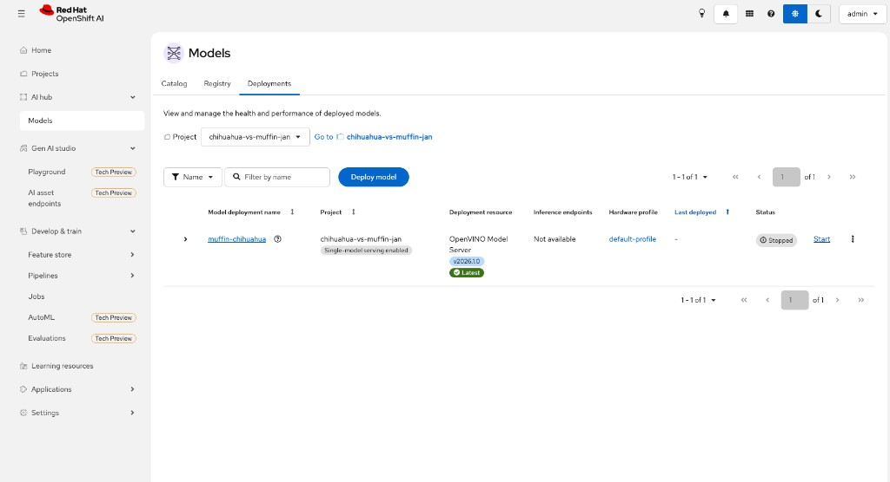

**CLI check (read-only):**

```bash
oc -n chihuahua-vs-muffin-jan get pods
oc -n chihuahua-vs-muffin-jan get inferenceservice muffin-chihuahua
```

After a UI **Stop**, predictor pods should disappear / not Running; the InferenceService resource can remain. Prefer the dashboard **Stop** over `oc delete`.

Keep MinIO / MariaDB TrustyAI / pipeline server if you want — they usually don’t take the GPU.

#### 3) Verify

```bash
oc -n chihuahua-vs-muffin-jan get pods
oc -n genai-hotline get project 2>/dev/null || oc get ns genai-hotline
```

Then continue to [G2](#g2) **inside `genai-hotline`**.

---

<a id="g2"></a>

# G2 — Deploy a generative (chat) model

### What we want
Deploy a **small instruct** model from the catalog as a chat AI asset **in `genai-hotline`**.

### Why
Playground needs a Ready generative endpoint (usually **vLLM**), separate from any OVMS predictive deployment.

### Success looks like
- Deployment **Ready** in **`genai-hotline`**
- **Add to playground** available on the asset
- **Pod:** `redhataigranite-40-h-tiny-fp8-predictor-…` (often **3/3** Ready — runtime + proxy sidecars)

### How

**UI path on OpenShift AI 3.5 (validated):** the model **Catalog** lives under **AI hub**, not always inside Project → Deployments.

1. Left nav → **AI hub** → **Models** → tab **Catalog**

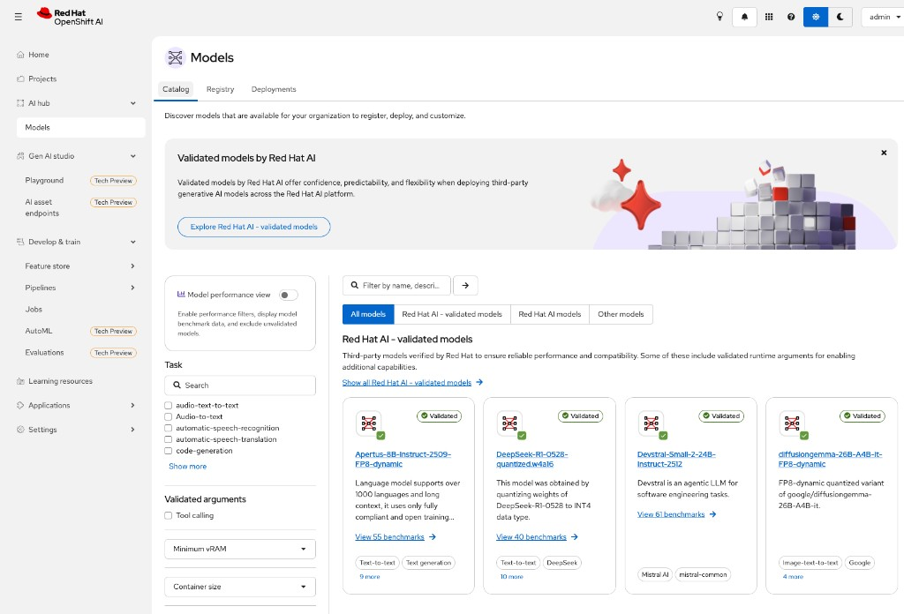

2. Search / filter for a **small instruct** chat model (lab freeze: `granite` + `tiny` / `FP8`)
3. Open the model card → **Deploy**
4. **Project:** **`genai-hotline`**
5. Wizard step **Model deployment** — use these validated values:

| Field | Lab value |
|-------|-----------|
| Model deployment name | `RedHatAI/granite-4.0-h-tiny-FP8-dynamic` (resource ≈ `redhataigranite-40-h-tiny-fp8`) |
| Deployment method | **Inference service** |
| Hardware profile | **`gpu-profile`** (1 GPU · ~12 GiB mem) — not `default-profile` CPU-only |
| Serving runtime template | **Automatic selection** → `vLLM NVIDIA GPU ServingRuntime for KServe` (ex. v0.24.0) |
| Replica count | `1` |

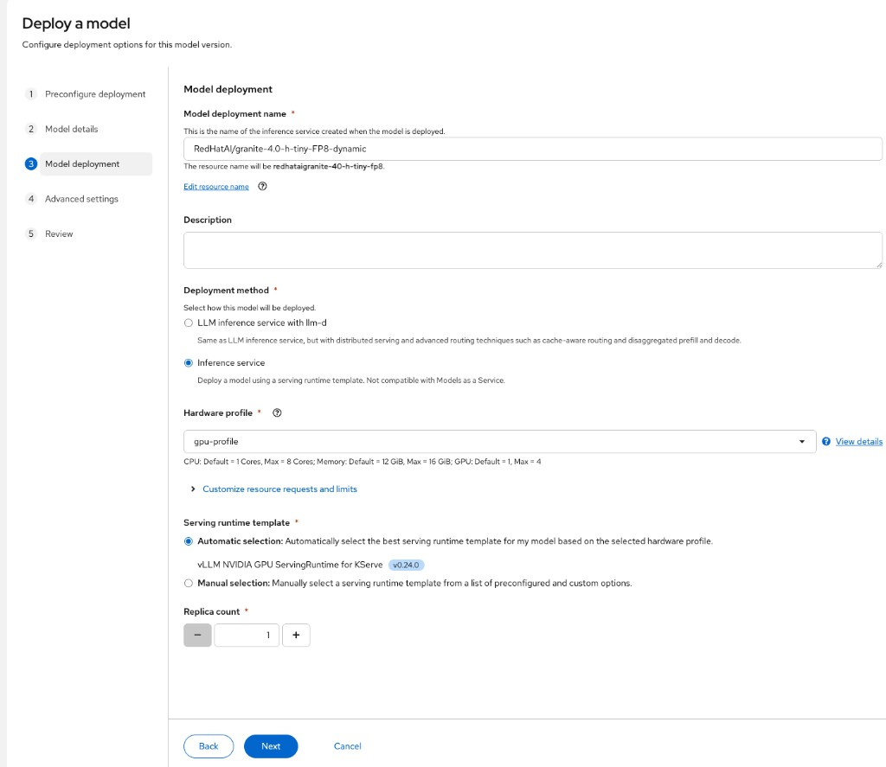

6. **Next** → **Advanced settings**:

| Field | Lab value |
|-------|-----------|
| **Add as AI asset endpoint** | **Yes** (required for Playground) |
| **Use case** | `Chatbot` (or `chat`) |
| External route | **No** |
| Token authentication | **No** |
| Custom args / env | **No** |
| Deployment strategy | **Rolling update** |
| Model route timeout | **30** seconds |

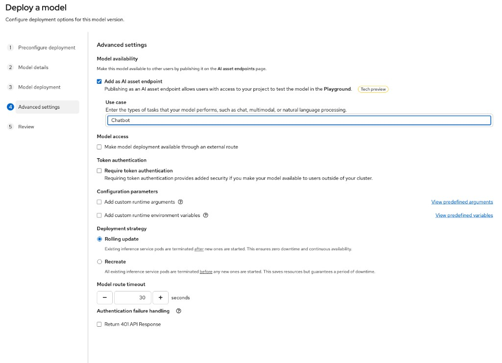

7. **Review** — confirm the summary matches the freeze below → **Deploy model** → wait **Ready**

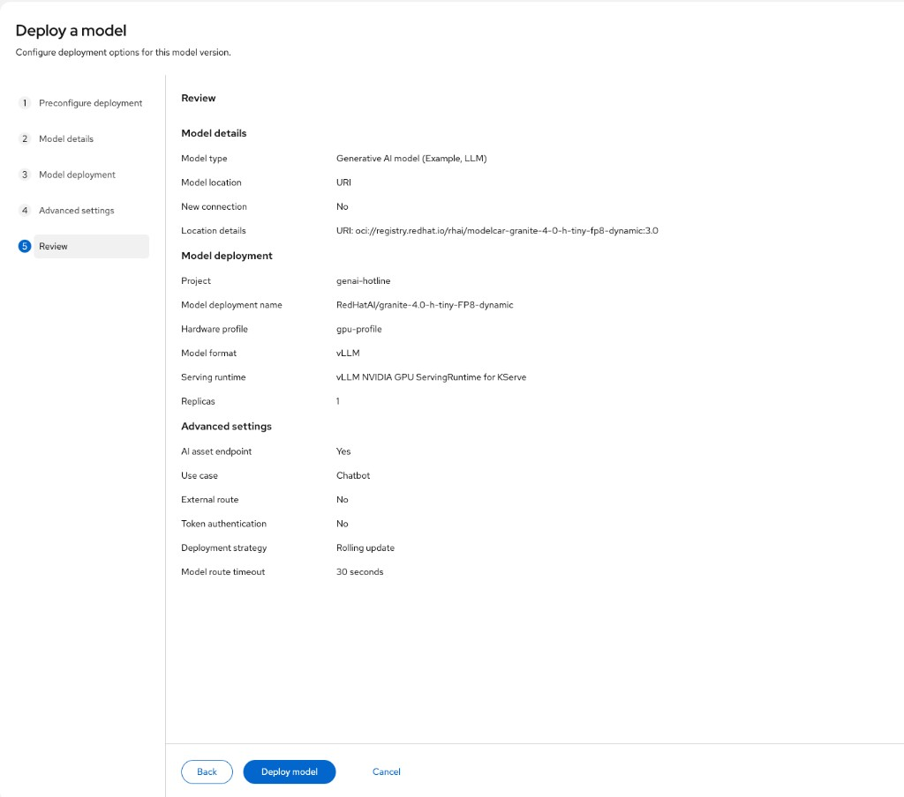

> If **Project → Deployments → Deploy model** only offers Predictive / empty catalog: use **AI hub → Models → Catalog** instead — that is the expected Gen AI entry point.

**Frozen example (sandbox, 1× L4) — full Review:**

| Field | Value |
|-------|--------|
| Project | **`genai-hotline`** |
| Model type | Generative AI model (LLM) |
| Location | `oci://registry.redhat.io/rhai/modelcar-granite-4-0-h-tiny-fp8-dynamic:3.0` |
| Catalog / name | `RedHatAI/granite-4.0-h-tiny-FP8-dynamic` |
| Hardware | **`gpu-profile`** |
| Format / runtime | **vLLM** · `vLLM NVIDIA GPU ServingRuntime for KServe` |
| Replicas | `1` |
| AI asset endpoint | **Yes** · use case **Chatbot** |
| External route / token | **No** / **No** |
| Strategy / timeout | Rolling update · 30s |
| Status | **Ready** (after deploy) |

If you still see `Insufficient nvidia.com/gpu`, go back to [G1b](#g1b) and confirm the predictive workbench + OVMS are stopped.

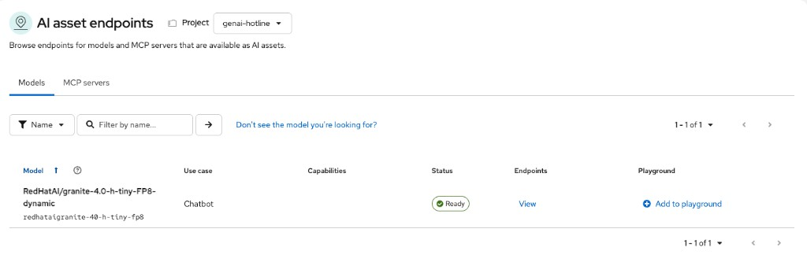

> **Add to playground** appears only under **Gen AI studio → AI asset endpoints** — used in [G5](#g5). It does **not** appear on **AI hub → Models → Deployments**.

If Gen AI / GPU is missing on the sandbox, stop and note it — do not force a huge model.

**Shared Hotline system prompt** (reuse in G3 / G4 / G5):

```text
You are “Hotline 0800-HELP”, an over-the-top IT support agent.
For every user message (a short problem description):
1) Invent a ticket ID like HELP-1042
2) Give a ridiculous but PG-rated root cause (2 sentences)
3) Give exactly 3 numbered next steps
4) End with: “Is there anything else I can misdiagnose today?”
Keep the whole answer under 120 words. No markdown tables.
```

**Shared endpoint freeze** (G3–G4 call this Service DNS):

| | Value |
|--|--------|
| Base URL | `http://redhataigranite-40-h-tiny-fp8-predictor.genai-hotline.svc.cluster.local:8080/v1` |
| Model id | `redhataigranite-40-h-tiny-fp8` |
| API shape | OpenAI `chat.completions` |

---

<a id="g3"></a>

# G3 — Open WebUI (same model)

### What we want
Host **Open WebUI** on the cluster and chat Hotline against the Ready vLLM endpoint.

### Why
First external UI: full OSS chat (models, system prompt, history) consuming RHOAI serving — no Gen AI studio yet.

### Success looks like
- Route opens Open WebUI
- Model `redhataigranite-40-h-tiny-fp8` answers with ticket + 3 steps + closing line
- This Deployment uses **no GPU** (GPU stays on the predictor)
- **Pod:** `open-webui-…` Running

### How

Requires [G2](#g2) Ready.

```bash
oc apply -f apps/open_webui/deploy.yaml

oc -n genai-hotline rollout status deploy/open-webui --timeout=300s
oc -n genai-hotline get route open-webui -o jsonpath='https://{.spec.host}{"\n"}'
```

**Expected output**

```text
deployment.apps/open-webui created
service/open-webui created
route.route.openshift.io/open-webui created
deployment "open-webui" successfully rolled out
https://open-webui-genai-hotline.apps....
```

Image pull from `ghcr.io` can take a few minutes the first time.

**In the UI:**

1. First visit → create **admin** account (lab only; `emptyDir` = lost on pod restart)
2. Confirm model **`redhataigranite-40-h-tiny-fp8`**
3. Paste the [shared Hotline system prompt](#g2) in Chat Controls / system prompt
4. Ask `My coffee machine prints PDF instead of coffee`

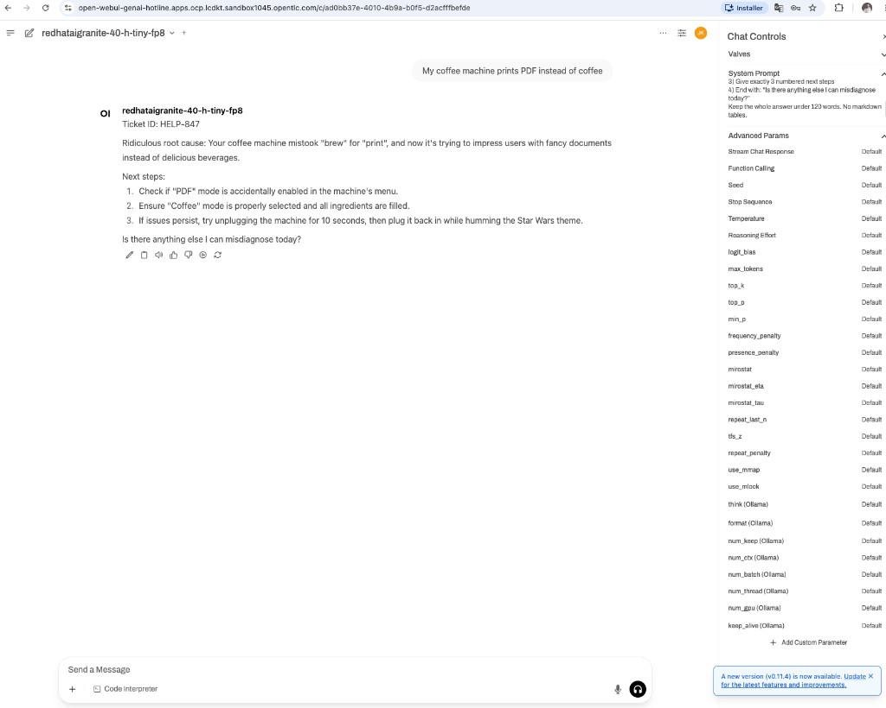

**Frozen:** Route `open-webui-genai-hotline…` · ticket-style reply (e.g. `HELP-847`) · same persona as later steps.

If the pod is **CrashLoop** / permission denied on `/app/backend/data`, the sandbox may need a looser SCC for this namespace (cluster-admin), e.g. default SA `anyuid` — only if logs show UID/filesystem issues.

---

<a id="g4"></a>

# G4 — Streamlit + Python S2I (Software Catalog builder)

### What we want
Deploy a **tiny custom** Streamlit Hotline app with the cluster **Python** S2I builder (Software Catalog) — same vLLM as G3.

### Why
Second external UI: *your* code + OpenShift build (`requirements.txt` + `.s2i/bin/run`). Shows catalog builder without a custom Template.

### Success looks like
- `hotline-chat` Route serves Streamlit
- Same Hotline ticket shape (persona hard-coded in `apps/hotline_chat/app.py`)
- No GPU on this Deployment
- **Pods:** `hotline-chat-…` Running · during build `hotline-chat-*-build` Completed

### How

Requires [G2](#g2) Ready. Builder = ImageStream `openshift/python` (e.g. **`3.12-ubi9`**).

### Cleanup previous attempt (if any)

```bash
oc -n genai-hotline delete all,bc,is,route,cm -l app=hotline-chat --ignore-not-found
oc -n genai-hotline delete deploy/hotline-chat svc/hotline-chat route/hotline-chat \
  bc/hotline-chat is/hotline-chat cm/hotline-chat-app --ignore-not-found
```

### UI path (Software Catalog)

1. Developer perspective → project **`genai-hotline`** → **+Add** → **Software Catalog**
2. Filter **Python** → select the **Python** builder (not Django sample)
3. Create application name `hotline-chat` (Git context `apps/hotline_chat` after push, or use CLI binary build below)
4. Topology → Deployment → **Environment**:

| Name | Value |
|------|--------|
| `PORT` | `8080` |
| `GRANITE_URL` | `http://redhataigranite-40-h-tiny-fp8-predictor.genai-hotline.svc.cluster.local:8080/v1` |
| `GRANITE_MODEL` | `redhataigranite-40-h-tiny-fp8` |
| `GRANITE_API_KEY` | `not-needed` |

5. Edge **Route** to service port **8080** if the wizard did not create one.

### CLI path (same builder)

From **repo root**:

```bash
NS=genai-hotline

oc -n "$NS" new-build --name=hotline-chat --binary --strategy=source \
  --image-stream=python:3.12-ubi9

oc -n "$NS" start-build hotline-chat --from-dir=apps/hotline_chat --follow

oc -n "$NS" new-app hotline-chat \
  -e PORT=8080 \
  -e GRANITE_URL=http://redhataigranite-40-h-tiny-fp8-predictor.genai-hotline.svc.cluster.local:8080/v1 \
  -e GRANITE_MODEL=redhataigranite-40-h-tiny-fp8 \
  -e GRANITE_API_KEY=not-needed

oc -n "$NS" create route edge hotline-chat --service=hotline-chat --port=8080 \
  --dry-run=client -o yaml | oc apply -f -

oc -n "$NS" rollout status deploy/hotline-chat --timeout=300s
oc -n "$NS" get route hotline-chat -o jsonpath='https://{.spec.host}{"\n"}'
```

**Expected output (shape)**

```text
buildconfig.build.openshift.io/hotline-chat created
...
Push successful
deployment "hotline-chat" successfully rolled out
https://hotline-chat-genai-hotline.apps....
```

Open the Route → ask `The elevator refuses Mondays`.

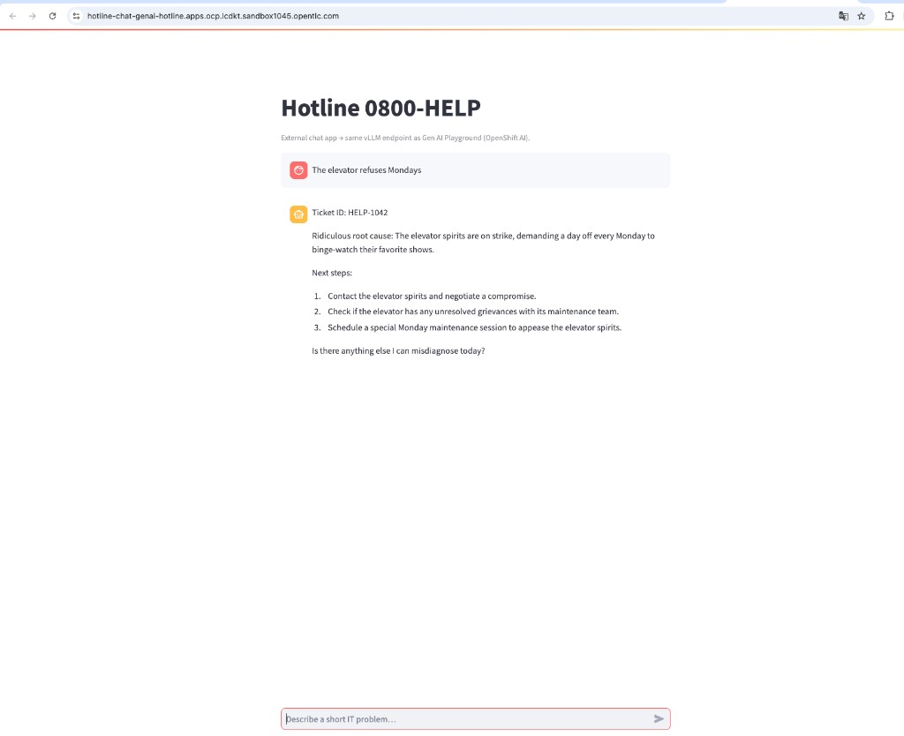

**Frozen:** catalog Python S2I · `PORT=8080` (if logs show `:8501`, set `PORT=8080` and rollout).

**Rebuild after code change:**

```bash
oc -n genai-hotline start-build hotline-chat --from-dir=apps/hotline_chat --follow
```

---

<a id="g5"></a>

# G5 — Playground — Hotline (simplest)

### What we want
Finish on the **built-in** OpenShift AI surface: Gen AI studio → Playground with the same Hotline prompt — no YAML, no Route for a chat UI.

### Why
Punchline after G3/G4: customers can also use the **integrated** product UI. Same model, zero custom frontend.

### Success looks like
- Playground chat with ticket-style Hotline reply
- Screenshot frozen for the room
- **Pods created with Playground:** `lsd-genai-playground-…` · **`genai-pgvector-…`** (auto — not a manual install)

### How

Requires [G1](#g1) (`genAiStudio: true`) and Ready AI asset from [G2](#g2).

1. Left nav → **Gen AI studio** → **AI asset endpoints**  
   - Do **not** use **AI hub → Models → Deployments**
2. Project → **`genai-hotline`**
3. Tab **Models** → **+ Add to playground**


4. **Configure playground:** Type = **Inference**, Max tokens ≈ **512** (optional) → **Create**

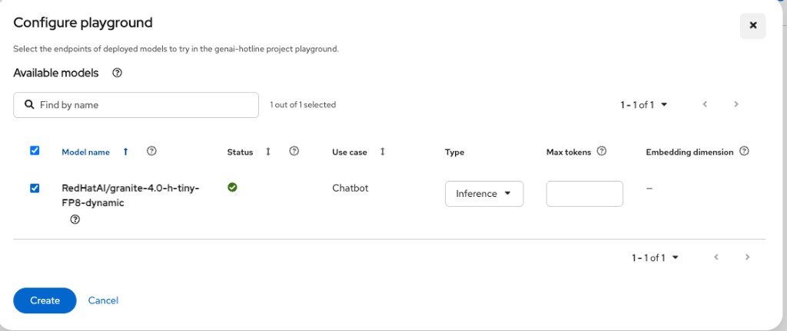

5. Wait for **Creating playground**


**Side effect (important for RAG):** activating / creating the Playground also instantiates a **PostgreSQL + pgvector** Deployment in the project:

| Object | Name (this sandbox) |
|--------|---------------------|
| `OGXServer` | `lsd-genai-playground` |
| Vector DB Deployment | **`genai-pgvector`** (label `gen-ai.opendatahub.io/pgvector=true`, owned by that `OGXServer`) |
| Service | `genai-pgvector` → port `5432` |

Verify:

```bash
oc -n genai-hotline get deploy,svc,pvc | grep -i pgvector
oc -n genai-hotline get ogxserver
```

**Expected output (shape)**

```text
deployment.apps/genai-pgvector   1/1
service/genai-pgvector           ... 5432/TCP
persistentvolumeclaim/genai-pgvector-storage   Bound
NAME                    ...
lsd-genai-playground
```

You did **not** apply this YAML by hand — Gen AI studio created it with the Playground. You reuse it in [R3](#r3) when uploading Knowledge.

6. **Gen AI studio → Playground** → project **`genai-hotline`**
7. **Settings** → **Prompt** → paste the [shared Hotline system prompt](#g2)  
   **Model** → Temperature ≈ **0.1**, Streaming **On**

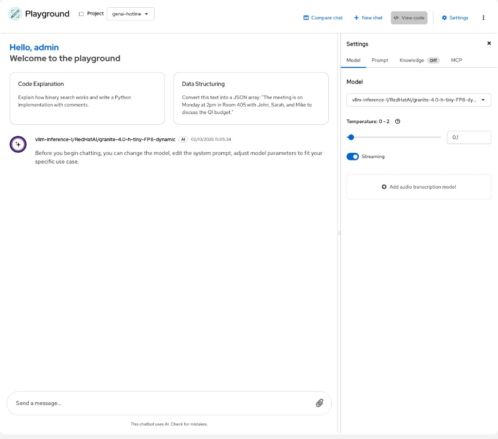

8. Ask e.g. `The elevator refuses Mondays`

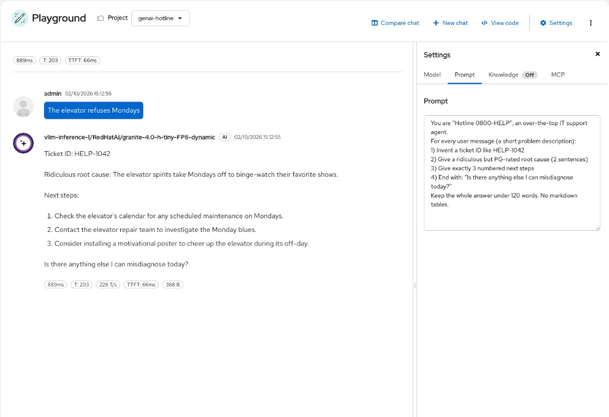

**Frozen:** `HELP-1042` + absurd cause + 3 steps + closing line.

**Teaching point:** Open WebUI + Streamlit + Playground = three frontends, one RHOAI-served model.

Cleanup UIs (optional):

```bash
oc -n genai-hotline delete route,svc,deploy -l app=open-webui
oc -n genai-hotline delete route,svc,deploy,cm,bc,is -l app=hotline-chat --ignore-not-found
```

---

<a id="g6"></a>

# G6 — Out of scope (chat UIs only)

Still out of this *chat* slice:

- Using the LLM to classify muffin/chihuahua **images** (OVMS in [README-PREDICTIVE.md](README-PREDICTIVE.md))
- Production auth / rate limits on the LLM route

**RAG / AutoRAG** are **in** this same README starting at [R0](#r0) — not a second lab file.

**Agentic AI** (tools / MCP / inbox briefing) is a **new** lab: [`README-GENAI-AGENT.md`](README-GENAI-AGENT.md).

---

# Hotline KB RAG (same lab)

Same project **`genai-hotline`**, same Granite — now **grounded** on a small knowledge base.

**Docs of record:**

- [Experimenting with models in the gen AI playground — RAG](https://docs.redhat.com/en/documentation/red_hat_openshift_ai_self-managed/3.5/html/experimenting_with_models_in_the_gen_ai_playground/testing-your-model-with-rag_rhoai-user)
- [Building RAG applications with OGX](https://docs.redhat.com/en/documentation/red_hat_openshift_ai_self-managed/3.5/html-single/building_rag_applications_with_ogx/index)
- [Working with AutoRAG](https://docs.redhat.com/en/documentation/red_hat_openshift_ai_self-managed/3.5/html-single/working_with_autorag/index)

Playground / Gen AI studio RAG and AutoRAG are **Technology Preview**.

---

### Pods you should see (by step)

Use **Workloads → Pods** in project **`genai-hotline`**. Names include a random suffix; match the **prefix**.

| Step | When | Pods / workloads that appear |
|------|------|------------------------------|
| **G2** | Deploy Granite | `redhataigranite-40-h-tiny-fp8-predictor-…` (often **3/3** Ready) |
| **G3** | Deploy Open WebUI | `open-webui-…` (may be scaled to 0 later) |
| **G4** | S2I Streamlit no-KB | Build: `hotline-chat-*-build` (**Completed**) · Run: `hotline-chat-…` |
| **G5** | Create Playground | `lsd-genai-playground-…` · **`genai-pgvector-…`** (auto with Playground) |
| **R6** | ConfigMap + S2I KB app | Build: `hotline-kb-chat-*-build` · Run: `hotline-kb-chat-…` |
| **R7 §1** | `01-postgres-pgvector.yaml` | **`hotline-rag-pgvector-…`** |
| **R7 §2** | `03-ogxserver.yaml` (+ config) | **`hotline-rag-ogx-…`** |
| **R7 §3** | Workbench for notebook | StatefulSet pod e.g. **`hotline-rag-0`** if you named the workbench `hotline-rag` (your choice of name) |
| **R8** | S2I RAG chat app | Build: `hotline-rag-chat-*-build` · Run: **`hotline-rag-chat-…`** |
| **R9.0** | `autorag: true` on dashboard | (no new project pod — UI nav **Gen AI studio → AutoRAG**) |
| **R9.1** | Pipeline server in `genai-hotline` | `ds-pipeline-…` · DB pod (e.g. `mariadb-…` / cluster default) |
| **R9.4** | AutoRAG optimization run | Pipeline run pods (AutoRAG runtime image) while status **Running** |

**Two stacks at once (expected after R7+):**

| Playground (G5) | Yours (R7+) |
|-----------------|-------------|
| `lsd-genai-playground-…` | `hotline-rag-ogx-…` |
| `genai-pgvector-…` | `hotline-rag-pgvector-…` |

Shared: `redhataigranite-…-predictor-…`. Builds (`*-build` Completed) are leftover job pods — safe to ignore or delete.

Quick check:

```bash
oc -n genai-hotline get pods
```

---

<a id="r0"></a>

# R0 — Why RAG on Hotline

### What we want
Show that the same Hotline persona can answer from **official runbooks** instead of inventing steps.

### Why
G3–G5 proved chat UIs on a Ready LLM. Customers next ask: *“How do we stop hallucinations on procedures?”* → retrieval-augmented generation.

### Success looks like
- You can say in one sentence: LLM alone invents; RAG retrieves then answers
- Everyone knows **`genai-pgvector` was created automatically when the Playground was activated** (not a manual install)

### How

**Room arc:**

1. Ask a Hotline question **without** Knowledge → funny but **wrong** procedure codes  
2. Upload KB → ask again → answers cite **WIFI-BALANCE-42** / **BREW-PDF-7** / **LIFT-MON-1**  
3. (Later lab) AutoRAG optimizes chunking/retrieval on the same corpus

**Where does pgvector come from?**

When you completed [G5 — Playground](#g5) (**Add to playground** / Creating playground), OpenShift AI created:

- `OGXServer` **`lsd-genai-playground`**
- Deployment / Service / PVC **`genai-pgvector`** (PostgreSQL 16 + pgvector), owned by that `OGXServer`, label `gen-ai.opendatahub.io/pgvector=true`

That is the vector store backing Playground **Knowledge** uploads on this project. Confirm anytime:

```bash
oc -n genai-hotline get deploy genai-pgvector
oc -n genai-hotline get ogxserver lsd-genai-playground -o jsonpath='{.metadata.name} owner of pgvector via UI/operator{"\n"}'
```

---

<a id="r1"></a>

# R1 — Knowledge base files

### What we want
Have a small Hotline KB ready in formats the Playground accepts.

### Why
Playground Knowledge on this sandbox accepts **PDF, CSV or TXT** (UI: up to 10 files, 10 MB each) — not `.doc` / `.md`.

### Success looks like
- Repo folder `data/hotline-kb/` present
- `data/hotline-kb/upload/` contains `.txt` + `05_faq.csv` for the dashboard

### How

Source Markdown (editable) + CSV live under [`data/hotline-kb/`](data/hotline-kb/).  
Pre-built upload artifacts:

| Upload file | Topic | Cause code / key fact |
|-------------|--------|------------------------|
| `upload/01_wifi_one_foot.txt` | Wi-Fi one foot | `WIFI-BALANCE-42` |
| `upload/02_coffee_pdf.txt` | Coffee → PDF | `BREW-PDF-7` |
| `upload/03_elevator_monday.txt` | Elevator Mondays | `LIFT-MON-1` |
| `upload/04_escalation_matrix.txt` | Escalation | `#coffeeops` / `#net-l2` |
| `upload/05_faq.csv` | FAQ | SSID `CAMPUS-SECURE` |

Regenerate TXT from Markdown if you edit sources:

```bash
cd data/hotline-kb
mkdir -p upload
for f in 01_wifi_one_foot 02_coffee_pdf 03_elevator_monday 04_escalation_matrix; do
  cp "${f}.md" "upload/${f}.txt"
done
cp 05_faq.csv upload/
ls upload/
```

**Expected output**

```text
01_wifi_one_foot.txt
02_coffee_pdf.txt
03_elevator_monday.txt
04_escalation_matrix.txt
05_faq.csv
```

Golden questions for later AutoRAG: [`data/hotline-kb/eval/golden_questions.json`](data/hotline-kb/eval/golden_questions.json).

---

<a id="r2"></a>

# R2 — Before/after without Knowledge

### What we want
Capture a **baseline** Hotline answer with Knowledge **Off**.

### Why
The room must see the delta. Without a baseline, RAG looks like “just a better prompt”.

### Success looks like
- One chat turn with Knowledge disabled
- Answer invents steps / omits official cause codes (typical)

### How

1. **Gen AI studio → Playground** → project **`genai-hotline`**
2. **Settings → Knowledge** → ensure no files / Knowledge off  
3. **Prompt** — use the Hotline system prompt from [G2](#g2) **or** the grounded variant in [R4](#r4) without docs yet  
4. Ask: `The elevator refuses Mondays`  
5. Note whether cause code `LIFT-MON-1` and calendar event `Maintenance spirits — Mondays` appear (usually **no**)

Optional: screenshot as `docs/screenshots/step-genai-rag-before.png` when you freeze.

---

<a id="r3"></a>

# R3 — Playground Knowledge upload

### What we want
Upload the Hotline KB into Playground Knowledge so retrieval can run.

### Why
This is the product path for experimenting with RAG on OpenShift AI 3.5 ([official procedure](https://docs.redhat.com/en/documentation/red_hat_openshift_ai_self-managed/3.5/html/experimenting_with_models_in_the_gen_ai_playground/testing-your-model-with-rag_rhoai-user)).

### Success looks like
- Notification **Source uploaded** (or equivalent)
- Files listed under Uploaded files
- Knowledge available for chat

### How

Requires Playground already created ([G5](#g5)).

1. Dashboard → **Gen AI studio → Playground** → **`genai-hotline`**
2. Settings panel → tab **Knowledge**
3. **Upload files** → upload from `data/hotline-kb/upload/` (all five files, or start with the three runbooks)
4. Optional chunk settings: leave defaults first; tune later if retrieval is weak ([Understanding RAG settings](https://docs.redhat.com/en/documentation/red_hat_openshift_ai_self-managed/3.5/html/experimenting_with_models_in_the_gen_ai_playground/testing-your-model-with-rag_rhoai-user) in the same doc set)
5. Wait until each file shows as uploaded / processed

**Expected signals**

- UI: files listed under Knowledge; RAG toggle **On**
- Cluster: `genai-pgvector` still **Ready** (instantiated at Playground creation — see [R0](#r0) / [G5](#g5))

```bash
oc -n genai-hotline get deploy genai-pgvector
# expect: 1/1 Ready
```

> Official note: Playground RAG is for **experimentation** with the playground vector store (here: the auto-provisioned **`genai-pgvector`**). Building a full app stack with a separately managed remote Milvus/pgvector is covered under [RAG with OGX](https://docs.redhat.com/en/documentation/red_hat_openshift_ai_self-managed/3.5/html-single/building_rag_applications_with_ogx/index) — out of scope for R3.

### If chat fails with `auto tool choice requires --enable-auto-tool-choice`

Playground Knowledge/RAG calls the model with **tool choice `auto`** (knowledge search). Your vLLM deployment must expose tool calling.

**Error shape:**

```text
[invalid_prompt] "auto" tool choice requires --enable-auto-tool-choice and --tool-call-parser to be set
```

**Fix (redeploy / edit the generative model in `genai-hotline`):** add **custom serving runtime arguments** (Advanced / additional args), then wait Ready again:

```text
--enable-auto-tool-choice
--tool-call-parser=granite4
```

For this lab model (`granite-4.0-h-tiny`), prefer parser **`granite4`** ([vLLM tool calling](https://docs.vllm.ai/en/latest/features/tool_calling/)). If the runtime rejects `granite4`, try `granite`.

UI path: **AI hub → Models → Deployments** → `RedHatAI/granite-4.0-h-tiny-FP8-dynamic` → edit → **Additional serving runtime arguments** (or equivalent) → save → wait **Ready**.

**1× GPU sandbox tip:** prefer **Stop** the deployment → edit args → **Start**, or choose deployment strategy **Recreate** (not Rolling update). Rolling needs a second GPU briefly and often fails with `Insufficient nvidia.com/gpu`.

CLI check after Ready:

```bash
oc -n genai-hotline get deploy -l serving.kserve.io/inferenceservice=redhataigranite-40-h-tiny-fp8 \
  -o jsonpath='{range .items[0].spec.template.spec.containers[?(@.name=="kserve-container")].args[*]}{@}{"\n"}{end}'
```

Expect lines including `--enable-auto-tool-choice` and `--tool-call-parser=granite4` (or `granite`).

---

<a id="r4"></a>

# R4 — Grounded Hotline prompts

### What we want
Chat again so answers use **KB facts** (cause codes, exact steps).

### Why
Retrieval alone is not enough; the system prompt must order the model to **prefer documents**.

### Success looks like
- Elevator question mentions `LIFT-MON-1` and deleting `Maintenance spirits — Mondays`
- Coffee question mentions `BREW-PDF-7` / `espresso-os-3.2`
- Wi-Fi question mentions `WIFI-BALANCE-42` / `CAMPUS-SECURE`

### How

**Important:** after you change **Prompt**, turn **Knowledge/RAG** on/off, or finish an upload, click **+ New chat** so the new settings apply (an open thread can keep old prompt / tool context). With settings already stable, HIT then MISS in the **same** chat can work — New chat is still the safe reset when something looks sticky.

1. **Settings → Prompt** — paste:

```text
You are Hotline 0800-HELP. Keep answers short and readable.

Always call knowledge_search first. Then HIT or MISS for THIS user issue only.

Relevance rule (critical):
- Retrieved chunks are NOT automatically a HIT. “5 sources retrieved” can still be a MISS.
- HIT only if the chunk is clearly about the SAME product/symptom (elevator↔elevator, Wi-Fi↔Wi-Fi, coffee↔coffee).
- If the user says fridge/opera/unicorn and chunks talk about Wi-Fi, coffee, or elevators → MISS.

HIT (same-issue runbook only):
- Use the operator-uploaded Hotline KB procedure (not generic IT advice).
- Copy the KB cause code EXACTLY (LIFT-MON-1, BREW-PDF-7, WIFI-BALANCE-42). Never invent codes.
- Keep the KB’s specific nouns (event names, fault codes, SSIDs, firmware names). Do not replace them with generic “notify users / check calendar”.
- Format ONLY:
HELP-xxxx
Source: Operator-uploaded Hotline KB runbook.
Cause: <exact KB code> — <one sentence from KB root cause>
Steps:
1) <KB step 1>
2) <KB step 2>
3) <KB step 3>
Close: one short line.
- Max 100 words. No document dump, no other runbooks, no chunk/file ids.

Example HIT shape for elevators (when KB matches):
HELP-1042
Source: Operator-uploaded Hotline KB runbook.
Cause: LIFT-MON-1 — recurring calendar block "Maintenance spirits — Mondays"; door code NO-MON.
Steps:
1) On PLC HMI Calendar, delete recurring event Maintenance spirits — Mondays.
2) Clear fault NO-MON, run lobby-to-top test trip.
3) Add change record that the Monday spirit block was removed.
Close: Anything else I can misdiagnose today?

MISS:
HELP-xxxx
No matching runbook in the operator-uploaded KB for this issue. Escalate to Level 2. Ask for location.
Do NOT invent or reuse another runbook’s cause code. Do NOT claim Source/KB. Max 35 words.
```

2. **Model** — Temperature ≈ **0.1**, Streaming On  
3. **+ New chat** (required — see note above)  
4. Ask in turn:
   - `The elevator refuses Mondays`
   - `My coffee machine prints PDF instead of coffee`
   - `Wi-Fi works only when I stand on one foot`
   - `Which team owns BREW-PDF-7?`
   - Out-of-KB control: `My fridge is singing opera` → must **MISS** (no invented `FRIG-*` code; must **not** claim the operator KB)

**Expected output (shape)**

```text
HELP-1042
Source: Operator-uploaded Hotline KB runbook.
Cause: LIFT-MON-1 — obsolete Monday calendar block …
Steps:
1) delete recurring event Maintenance spirits — Mondays
2) clear fault NO-MON …
3) …
Close: …
```

Out-of-KB shape:

```text
… no matching runbook in the knowledge base the operator uploaded …
… escalate …
(no fake cause code)
```

Optional freeze: `docs/screenshots/step-genai-rag-after.png`


**Frozen HIT:** `The elevator refuses Mondays` → `LIFT-MON-1` + *Maintenance spirits — Mondays* + official steps · sources retrieved.


**Frozen MISS:** `My fridge is singing opera` → no invented cause code · escalate · no Source/KB claim (even with sources retrieved).


**Known limit (tiny Granite + always-on retrieval):** an out-of-KB question can still retrieve nearest chunks (Wi-Fi/coffee) and the model may false-HIT. Demo tip: reinforce MISS in the prompt; optionally toggle RAG **Off** once to contrast “no KB path”.


**Teaching point:** same model + same persona; Knowledge tab is what changed. Playground is for **operators / builders** to prove grounded answers — not the UI end users call.

---

<a id="r5"></a>

# R5 — Playground → real hotline app (map)

### What we want
Name the split: Playground proves grounded answers; a **chat Route** is what callers open.

### Why
End users never open Gen AI studio Settings.

### Success looks like
- You can say: same model + same runbooks + search-then-answer, behind a normal UI

### How

| Piece (Playground) | Lab app ([R6](#r6)) | Dedicated RAG ([R7](#r7)) |
|--------------------|---------------------|---------------------------|
| vLLM Granite | Same `/v1` endpoint | Same predictor (wired into your OGX) |
| Knowledge upload | **ConfigMap** `hotline-kb` | Ingest into **your** pgvector via OGX |
| HIT/MISS prompt | Hard-coded in the app | Notebook / later app on your OGX |
| Search | Local text match | Similarity search (`file_search`) |

---

<a id="r6"></a>

# R6 — Streamlit Hotline KB app (`hotline-kb-chat`)

### What we want
Deploy a **new** Streamlit app that callers can open: it searches the Hotline runbooks, then answers with the same Granite model. Name: **`hotline-kb-chat`**. Runbooks live in a **ConfigMap** (edit without rebuilding the image). Keep older `hotline-chat` as the “LLM only” contrast.

### Why
Show the Playground lesson on a real Route. Separating text (ConfigMap) from code (image) matches how operators update procedures.

### Success looks like
- Route `hotline-kb-chat` opens **Hotline 0800-HELP — KB**
- Sidebar shows `KB_DIR=/etc/hotline-kb` and the 5 files
- Elevator question → HIT · fridge → MISS
- Changing a file in the ConfigMap does **not** require `start-build`
- **Pods:** `hotline-kb-chat-…` Running · during build `hotline-kb-chat-*-build` Completed

### How

Requires [G2](#g2) Ready. Code: [`apps/hotline_kb_chat/`](apps/hotline_kb_chat/). Repo folder `kb/` is only the **source** used to create/update the ConfigMap (and a local fallback if `KB_DIR` is unset).

#### 1) Cleanup previous attempt (if any)

```bash
NS=genai-hotline

oc -n "$NS" delete all,bc,is,route -l app=hotline-kb-chat --ignore-not-found
oc -n "$NS" delete deploy/hotline-kb-chat svc/hotline-kb-chat route/hotline-kb-chat \
  bc/hotline-kb-chat is/hotline-kb-chat --ignore-not-found
oc -n "$NS" delete configmap/hotline-kb --ignore-not-found
```

**Expected output**

```text
No resources found
# or delete confirmations
```

#### 2) ConfigMap = the knowledge base

From **repo root**:

```bash
NS=genai-hotline

oc -n "$NS" create configmap hotline-kb \
  --from-file=apps/hotline_kb_chat/kb/ \
  --dry-run=client -o yaml | oc apply -f -

oc -n "$NS" label configmap/hotline-kb app=hotline-kb-chat --overwrite
oc -n "$NS" get configmap hotline-kb -o jsonpath='{.data}' | tr ',' '\n' | head
```

**Expected output (shape)**

```text
configmap/hotline-kb created
# keys include 01_wifi_one_foot.txt, 03_elevator_monday.txt, …
```

#### 3) Build + deploy the app (code only)

```bash
NS=genai-hotline

oc -n "$NS" new-build --name=hotline-kb-chat --binary --strategy=source \
  --image-stream=python:3.12-ubi9

oc -n "$NS" start-build hotline-kb-chat --from-dir=apps/hotline_kb_chat --follow

oc -n "$NS" new-app hotline-kb-chat \
  -e PORT=8080 \
  -e KB_DIR=/etc/hotline-kb \
  -e GRANITE_URL=http://redhataigranite-40-h-tiny-fp8-predictor.genai-hotline.svc.cluster.local:8080/v1 \
  -e GRANITE_MODEL=redhataigranite-40-h-tiny-fp8 \
  -e GRANITE_API_KEY=not-needed

oc -n "$NS" set volume deploy/hotline-kb-chat --add --name=hotline-kb \
  --type=configmap --configmap-name=hotline-kb \
  --mount-path=/etc/hotline-kb

oc -n "$NS" create route edge hotline-kb-chat --service=hotline-kb-chat --port=8080 \
  --dry-run=client -o yaml | oc apply -f -

oc -n "$NS" label deploy/hotline-kb-chat svc/hotline-kb-chat route/hotline-kb-chat \
  bc/hotline-kb-chat is/hotline-kb-chat app=hotline-kb-chat --overwrite

oc -n "$NS" rollout status deploy/hotline-kb-chat --timeout=300s
oc -n "$NS" get route hotline-kb-chat -o jsonpath='https://{.spec.host}{"\n"}'
```

**Expected output (shape)**

```text
...
deployment "hotline-kb-chat" successfully rolled out
https://hotline-kb-chat-genai-hotline.apps....
```

#### 4) Test in the browser

1. Open the Route → sidebar `KB_DIR=/etc/hotline-kb`  
2. `The elevator refuses Mondays` → HIT  
3. `My fridge is singing opera` → MISS  


#### Already deployed? Attach ConfigMap only

If the app is already running **without** the ConfigMap (runbooks only in the image), from repo root:

```bash
NS=genai-hotline

oc -n "$NS" create configmap hotline-kb \
  --from-file=apps/hotline_kb_chat/kb/ \
  --dry-run=client -o yaml | oc apply -f -

oc -n "$NS" set env deploy/hotline-kb-chat KB_DIR=/etc/hotline-kb
oc -n "$NS" set volume deploy/hotline-kb-chat --add --name=hotline-kb \
  --type=configmap --configmap-name=hotline-kb \
  --mount-path=/etc/hotline-kb --overwrite

# Rebuild once so the app reads KB_DIR (if you still run the first image)
oc -n "$NS" start-build hotline-kb-chat --from-dir=apps/hotline_kb_chat --follow
oc -n "$NS" rollout status deploy/hotline-kb-chat --timeout=300s
```

#### Update a runbook (no image rebuild)

Edit a file under `apps/hotline_kb_chat/kb/`, then:

```bash
NS=genai-hotline

oc -n "$NS" create configmap hotline-kb \
  --from-file=apps/hotline_kb_chat/kb/ \
  --dry-run=client -o yaml | oc apply -f -

# ConfigMap files refresh in the pod within ~1 min; restart if the sidebar still looks old
oc -n "$NS" rollout restart deploy/hotline-kb-chat
```

#### Rebuild after **code** change only

```bash
oc -n genai-hotline start-build hotline-kb-chat --from-dir=apps/hotline_kb_chat --follow
```

**Limits (lab honesty):** ConfigMaps are fine for a few small text files (~1 MiB cap). Big libraries → install your own vector DB + OGX in [R7](#r7).

---

<a id="r7"></a>

# R7 — Install dedicated Hotline RAG (OGX + pgvector)

### What we want
Install a **real** RAG backend as an app team would: your own PostgreSQL+pgvector, your own `OGXServer`, then ingest Hotline runbooks and query. **Do not** reuse Playground `genai-pgvector` / `lsd-genai-playground` for this step.

### Why
Playground storage is for experiments and disappears with the playground. A hotline product needs a stack you own, can back up, and can point an app at.

**What pgvector is (plain language):** PostgreSQL stores normal rows. The **pgvector** extension adds a column type for *embedding* vectors (number lists that represent text meaning). At question time, the system asks “which stored passages are closest to this question?” instead of scanning every file. That is what makes a large KB practical.

**How we install it here:** we deploy our own PostgreSQL in the project (`hotline-rag-pgvector`), run `CREATE EXTENSION vector` on first start (init script), then point a dedicated `OGXServer` at it with `ENABLE_PGVECTOR=true`. We do **not** reuse Playground’s `genai-pgvector`.

**Alternative (not in this lab):** OGX also supports **remote Milvus** (`MILVUS_ENDPOINT`, gRPC 19530, dedicated etcd — never the OpenShift control plane). Same Hotline RAG APIs; useful at larger scale / hybrid search. We already have grounded RAG on pgvector — we **do not** deploy Milvus here. See [Select and deploy a vector database](https://docs.redhat.com/en/documentation/red_hat_openshift_ai_self-managed/3.5/html/working_with_ogx/select-and-deploy-a-vector-database_rag).

### Success looks like
- `hotline-rag-pgvector` Deployment **1/1 Ready** → pod **`hotline-rag-pgvector-…`**
- `OGXServer/hotline-rag-ogx` **Ready** → pod **`hotline-rag-ogx-…`** · Service `hotline-rag-ogx-service:8321`
- Notebook indexes Hotline files into **your** vector store and answers elevator / fridge
- Playground resources remain untouched (`genai-pgvector-…`, `lsd-genai-playground-…`)
- Workbench you create for the notebook → pod named like **`{workbench-name}-0`** (e.g. `hotline-rag-0`)

### How

**Story in one minute:** R6 proved grounded answers with files in a ConfigMap. R7 is what you do when the KB grows — you **install** a database that stores searchable chunks, an **OGX** front that talks to that DB + your LLM, then a **notebook** (later: app) that uploads docs and asks questions. Playground stays for demos; this stack is yours.

Docs of record:

- [Select and deploy a vector database](https://docs.redhat.com/en/documentation/red_hat_openshift_ai_self-managed/3.5/html/working_with_ogx/select-and-deploy-a-vector-database_rag) (PostgreSQL + pgvector + `ENABLE_PGVECTOR`)
- [Building RAG applications with OGX](https://docs.redhat.com/en/documentation/red_hat_openshift_ai_self-managed/3.5/html-single/building_rag_applications_with_ogx/index) (ingest + query)
- [Deploying a OGX server](https://docs.redhat.com/en/documentation/red_hat_openshift_ai_self-managed/3.5/html/working_with_ogx/deploying-ogx-server_rag)

Lab manifests: [`manifests/hotline-rag/`](manifests/hotline-rag/) (Technology Preview stack).

**GPU note:** this install reuses the existing Granite vLLM (1× GPU). Embeddings use the OGX distribution’s inline sentence-transformers (CPU on the OGX pod). Production docs often add a **remote** embedding endpoint — out of scope if you only have one GPU.

#### 0) Prerequisites

- Project `genai-hotline`
- Granite predictor **Ready** (G2)
- From **repo root** on your laptop

#### 1) Install PostgreSQL + pgvector (yours)

**What this step does:** starts a Postgres pod, creates DB/user from the Secret, enables the `vector` extension, exposes Service `hotline-rag-pgvector:5432`. After this, nothing is searchable yet — that comes when OGX embeds and writes chunks (notebook step 3).

```bash
NS=genai-hotline

oc -n "$NS" apply -f manifests/hotline-rag/01-postgres-pgvector.yaml
oc -n "$NS" rollout status deploy/hotline-rag-pgvector --timeout=300s
oc -n "$NS" get svc hotline-rag-pgvector
```

**Expected output (shape)**

```text
secret/hotline-rag-pg-credentials created
…
deployment "hotline-rag-pgvector" successfully rolled out
NAME                   TYPE        CLUSTER-IP     PORT(S)
hotline-rag-pgvector   ClusterIP   172.30.…       5432/TCP
```

Lab image note: official doc example uses `pgvector/pgvector:pg16`. These manifests use `registry.redhat.io/rhel9/postgresql-16` + init `CREATE EXTENSION vector` **as user `postgres`** (superuser — the app role cannot create extensions) so the pod schedules on typical OpenShift SCC.

If you already started the pod once and saw `permission denied to create extension "vector"`, the data directory may already exist: either run the one-shot fix below, or delete the PVC and recreate so init scripts run again.

#### 2) Secrets + OGX config + dedicated OGXServer

**What this step does:** gives OGX the DB password/host and the Granite URL, installs a ConfigMap that registers an **embedding** model (inline sentence-transformers — required to index docs into pgvector), then creates `OGXServer/hotline-rag-ogx` with `overrideConfig` pointing at that ConfigMap.

```bash
NS=genai-hotline

oc -n "$NS" apply -f manifests/hotline-rag/02-secrets.yaml
oc -n "$NS" apply -f manifests/hotline-rag/04-ogx-config.yaml
oc -n "$NS" apply -f manifests/hotline-rag/03-ogxserver.yaml

oc -n "$NS" get ogxserver hotline-rag-ogx -w
# Ctrl-C when PHASE shows Ready (or status.conditions DeploymentReady=True)

oc -n "$NS" get svc | grep hotline-rag-ogx
oc -n "$NS" logs -l app.kubernetes.io/instance=hotline-rag-ogx --tail=40
```

**Check embeddings are visible** (must list an `embedding` model, not only `llm`):

```bash
oc -n genai-hotline exec deploy/hotline-rag-ogx -- \
  curl -sS http://127.0.0.1:8321/v1/models
```

**Expected output (shape)**

```text
ogxserver.ogx.io/hotline-rag-ogx   Ready
service/hotline-rag-ogx-service    8321/TCP
… "model_type":"embedding" … granite-embedding …
… "model_type":"llm" …
```

If the Service name differs slightly, take the one created for `hotline-rag-ogx` and put it in the notebook `OGX=` URL.

#### 3) Workbench notebook — **validate before the app**

**Why this notebook exists:** prove ingest + HIT/MISS on **your** OGX/pgvector **before** you wire an end-user UI. Do not skip it: the Streamlit app in [R8](#r8) needs a working `vector_store_id` from this run.

1. Create a CPU workbench in **`genai-hotline`**
2. Clone this repo (or copy `data/hotline-kb/upload/` + the notebook)
3. Open [`notebooks/14_hotline_ogx_pgvector.ipynb`](notebooks/14_hotline_ogx_pgvector.ipynb)
4. Confirm cell `OGX = http://hotline-rag-ogx-service…:8321` (not the playground service)
5. Run all cells
6. **Copy** the printed `vector_store_id = vs_…` — you will set it as env on the app in R8

**Expected output (shape)**

```text
vector_store_id = vs_…
uploaded 03_elevator_monday.txt -> file-…
Q: The elevator refuses Mondays
  retrieved: ≥1 … LIFT-MON-1 …
Q: My fridge is singing opera
A: MISS — …
```

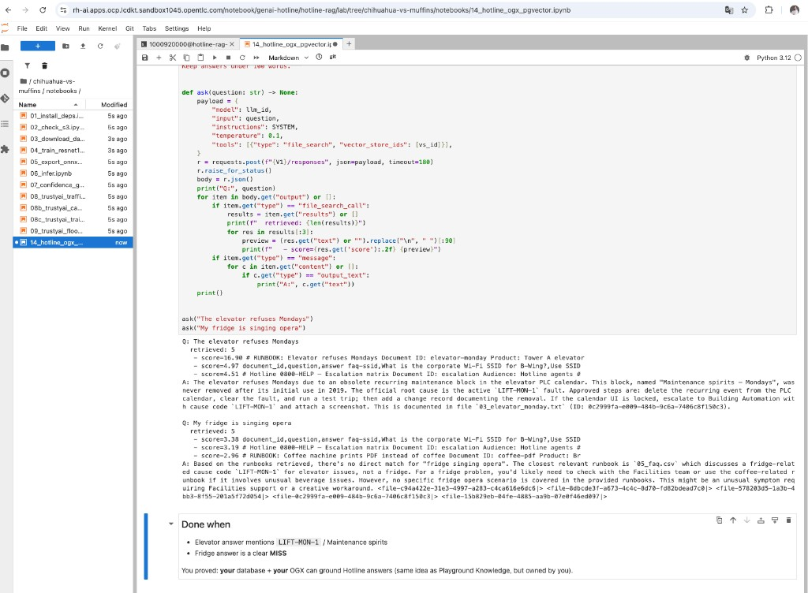

**Frozen:** notebook validates dedicated OGX + pgvector · then go to [R8](#r8) to attach Streamlit.

#### 4) Contrast with Playground (optional check)

```bash
oc -n genai-hotline get deploy genai-pgvector hotline-rag-pgvector
oc -n genai-hotline get ogxserver
```

You should see **two** pgvector deployments and **two** OGXServers.

#### Cleanup (when done)

```bash
NS=genai-hotline
oc -n "$NS" delete ogxserver/hotline-rag-ogx --ignore-not-found
oc -n "$NS" delete -f manifests/hotline-rag/02-secrets.yaml --ignore-not-found
oc -n "$NS" delete -f manifests/hotline-rag/01-postgres-pgvector.yaml --ignore-not-found
```

---

<a id="r8"></a>

# R8 — Streamlit app on dedicated OGX + pgvector (`hotline-rag-chat`)

### What we want
Give callers a normal chat URL. Behind it: **your** OGX searches **your** pgvector (same path the R7 notebook already proved).

### Why
The notebook is for builders. End users open a Route. R6 (`hotline-kb-chat`) searched a ConfigMap; this app searches the database you installed in R7.

**Where the Hotline prompt lives:** hard-coded in the Streamlit app — [`apps/hotline_rag_chat/app.py`](apps/hotline_rag_chat/app.py) as `SYSTEM`, sent on every call as OGX `instructions` (not Playground Settings, not the ConfigMap, not pgvector). pgvector holds **runbook text**; the app holds **how to answer** (HIT/MISS rules).

### Success looks like
- Route `hotline-rag-chat` opens **Hotline 0800-HELP — RAG**
- Sidebar shows `OGX_URL` + `VECTOR_STORE_ID`
- Elevator → grounded HIT · fridge → MISS
- No GPU on this Deployment
- **Pods:** `hotline-rag-chat-…` Running · during build `hotline-rag-chat-*-build` Completed

### How

**Prerequisite:** [R7](#r7) notebook completed successfully — a `vector_store_id` (`vs_…`) exists on your OGX. That notebook step is the **validation gate before** this app.

#### 0) Get `VECTOR_STORE_ID` from the shell (no notebook copy-paste)

```bash
NS=genai-hotline

# List all vector stores on your dedicated OGX
oc -n "$NS" exec deploy/hotline-rag-ogx -- \
  curl -sS http://127.0.0.1:8321/v1/vector_stores | python3 -m json.tool

# Pick the newest "hotline-kb-pgvector" id into VS_ID
VS_ID=$(oc -n "$NS" exec deploy/hotline-rag-ogx -- \
  curl -sS http://127.0.0.1:8321/v1/vector_stores \
  | python3 -c '
import json,sys
data=json.load(sys.stdin).get("data") or []
hits=[v for v in data if v.get("name")=="hotline-kb-pgvector"]
hits=sorted(hits, key=lambda v: v.get("created_at") or 0, reverse=True)
print(hits[0]["id"] if hits else "")
')
echo "VS_ID=$VS_ID"
test -n "$VS_ID" || { echo "No vector store — re-run the R7 notebook ingest cells."; exit 1; }
```

#### 1) Deploy (from repo root)

Reuse `NS` / `VS_ID` from step 0 (or re-run that block).

```bash
oc -n "$NS" delete all,bc,is,route -l app=hotline-rag-chat --ignore-not-found
oc -n "$NS" delete deploy/hotline-rag-chat svc/hotline-rag-chat route/hotline-rag-chat \
  bc/hotline-rag-chat is/hotline-rag-chat --ignore-not-found

oc -n "$NS" new-build --name=hotline-rag-chat --binary --strategy=source \
  --image-stream=python:3.12-ubi9

oc -n "$NS" start-build hotline-rag-chat --from-dir=apps/hotline_rag_chat --follow

oc -n "$NS" new-app hotline-rag-chat \
  -e PORT=8080 \
  -e OGX_URL=http://hotline-rag-ogx-service.genai-hotline.svc.cluster.local:8321 \
  -e VECTOR_STORE_ID="$VS_ID"

oc -n "$NS" create route edge hotline-rag-chat --service=hotline-rag-chat --port=8080 \
  --dry-run=client -o yaml | oc apply -f -

oc -n "$NS" label deploy/hotline-rag-chat svc/hotline-rag-chat route/hotline-rag-chat \
  bc/hotline-rag-chat is/hotline-rag-chat app=hotline-rag-chat --overwrite

oc -n "$NS" rollout status deploy/hotline-rag-chat --timeout=300s
oc -n "$NS" get route hotline-rag-chat -o jsonpath='https://{.spec.host}{"\n"}'
```

**Expected output (shape)**

```text
deployment "hotline-rag-chat" successfully rolled out
https://hotline-rag-chat-genai-hotline.apps....
```

#### 2) Test in the browser

1. Open the Route  
2. `The elevator refuses Mondays` → `LIFT-MON-1`  
3. `My fridge is singing opera` → MISS (or clear “no matching runbook”)  

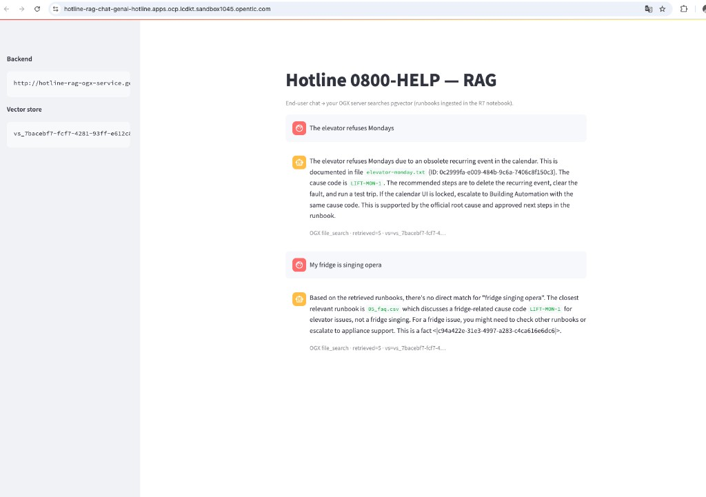

**Frozen:** end-user Route `hotline-rag-chat` · sidebar shows your OGX + `vs_…` · elevator grounded on runbook · fridge out-of-KB · `OGX file_search` captions.

#### Update `VECTOR_STORE_ID` after a new notebook ingest

```bash
oc -n genai-hotline set env deploy/hotline-rag-chat VECTOR_STORE_ID='vs_NEW'
oc -n genai-hotline rollout status deploy/hotline-rag-chat --timeout=180s
```

#### Rebuild after code change

```bash
oc -n genai-hotline start-build hotline-rag-chat --from-dir=apps/hotline_rag_chat --follow
```

**Teaching point:** R6 = small KB in ConfigMap · R7 notebook = prove pgvector · R8 = same search for real users on a Route. Prompt = code in `app.py` (`SYSTEM` → OGX `instructions`); knowledge = chunks in pgvector.

---

<a id="r9"></a>

# R9 — AutoRAG on Hotline KB

### What we want
Run an **automatic comparison of RAG methodologies** (chunking / retrieval / etc.) on the Hotline KB, scored against golden questions, and pick a **winning pattern** from a leaderboard.

### Why
R7/R8 proved *one* hand-built path that works. AutoRAG answers: *“Among several RAG recipes, which methodology scores best on our Hotline docs?”* — Technology Preview; dashboard wizard + pipeline run.

### Plain language — what AutoRAG is doing

| | R7 / R8 (previous lab) | R9 AutoRAG |
|--|------------------------|------------|
| Goal | Ship a working Hotline RAG | **Analyse** which RAG *methodology* is best for this KB |
| Who chooses chunk size, top-k, … | **We did** (OGX defaults + one notebook ingest) | **The pipeline** tries many combinations (**patterns**) |
| How you know it is good | Manual HIT elevator / MISS fridge | Golden Q&A + scores on a **leaderboard** |
| Output | App `hotline-rag-chat` on a Route | Ranked patterns + **recipe notebooks** (not the app itself) |

A **pattern** = one full RAG recipe (how documents are chunked, embedded, retrieved, then answered). AutoRAG is **not** a second chat UI — it is a **bake-off** between recipes on the same corpus.

### The path (do not skip the story)

AutoRAG does **not** update Streamlit by itself. Lab path:

```text
1. AutoRAG pipeline     → leaderboard, winner (Pattern 1), indexed store in pgvector
2. Try this pattern     → quick chat in the dashboard (HIT / MISS)
3. Inference notebook   → same recipe in Jupyter (validate without the app)
   Indexing notebook    → optional “how to re-index”; skip if the run already filled the store
4. hotline-rag-chat     → point VECTOR_STORE_ID at Pattern 1 store + rebuild (R9.6)
```

| Artifact | What it is | What it is **not** |
|----------|------------|---------------------|
| AutoRAG run | Bake-off + fills a **vector store** | The Hotline Route |
| Indexing notebook | Fiche cuisine to **re-ingest** docs with Pattern 1 chunking | Required if the run already indexed |
| Inference notebook | Fiche cuisine to **ask** the Pattern 1 store from Jupyter | The production UI |
| `hotline-rag-chat` | The **restaurant** (callers) | Updated until you set env + rebuild |

**Frozen on this lab:** run **`hotline-kb-autorag-1 - 2`** → **Succeeded** · **8** patterns · winner **Pattern 1** (overall ≈ **0.702**) · LLM Granite + embedding `granite-embedding-125m-english` · then notebooks validate → [R9.6](#r96) app on that store.

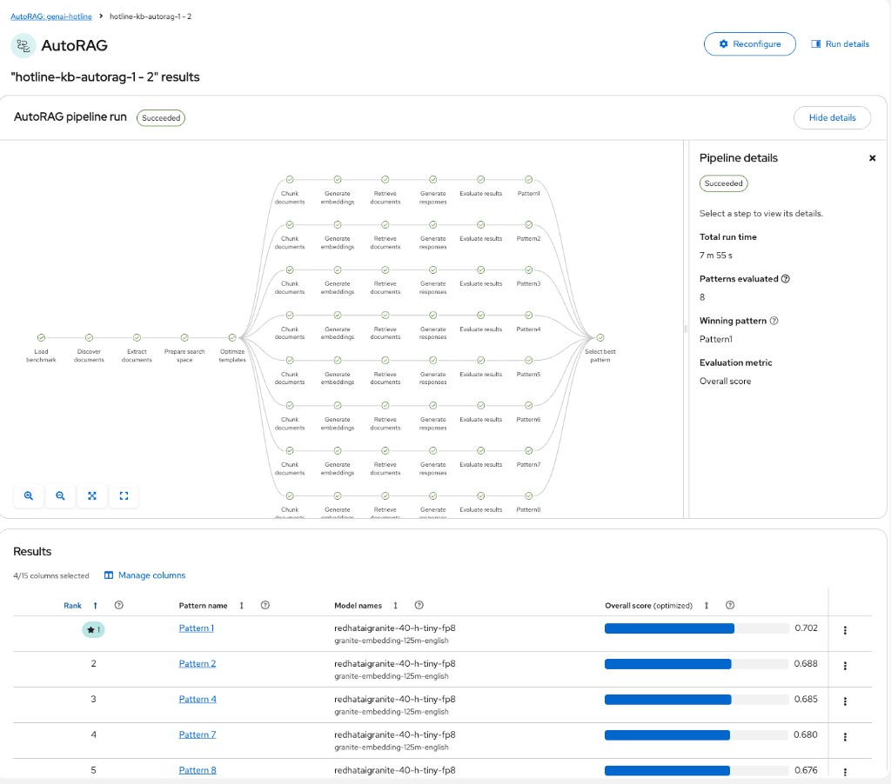

### Success looks like
- Left nav: **Gen AI studio → AutoRAG**
- Pipeline server in **`genai-hotline`** **Ready** with AutoML/AutoRAG pipelines
- Optimization run reaches **Succeeded** / **Complete** with a leaderboard
- A clear **winning pattern** (lab freeze: Pattern 1)
- Optional: Sample Q&A / **Try this pattern** on the best row

**Docs of record:** [Working with AutoRAG (3.5)](https://docs.redhat.com/en/documentation/red_hat_openshift_ai_self-managed/3.5/html-single/working_with_autorag/index)

### How

**Prerequisites (lab status after this sitting):**

| Prerequisite | Lab status |
|--------------|------------|
| `genAiStudio: true` | ✅ (G1) |
| `dashboardConfig.autorag: true` | ✅ (R9.0) |
| Pipeline server in **`genai-hotline`** + AutoML/AutoRAG pipelines | ✅ (R9.1) |
| Open GenAI Stack secret (`OGX_CLIENT_BASE_URL` + non-empty `OGX_CLIENT_API_KEY`) | ✅ `hotline-rag-ogx-stack` (API key must be e.g. `none`, **not** empty) |
| S3 connection for docs / artifacts | ✅ e.g. `minio-hotline-kb` → put corpus in **one folder** |
| Dedicated OGX + remote pgvector | ✅ `hotline-rag-ogx` + `hotline-rag-pgvector` |
| Foundation + **working** embedding | ✅ Granite vLLM + **`granite-embedding-125m-english`** only (exclude **nomic** — not cached / HF offline) |
| vLLM tool calling | ✅ `--enable-auto-tool-choice` · `--tool-call-parser=granite4` |
| Eval JSON | [`data/hotline-kb/eval/golden_questions.json`](data/hotline-kb/eval/golden_questions.json) |

Limits (TP): max **3** foundation + **2** embedding models per run; remote vector DB only (we use pgvector). Prefer **Faster** preset (4 vCPU / 16 Gi) on a sandbox.

---

<a id="r90"></a>

## R9.0 — Admin: enable AutoRAG in the dashboard

### What we want
Show **Gen AI studio → AutoRAG** for every user of this cluster.

### Why
Official prerequisite: both `genAiStudio` and `autorag` must be `true` on `OdhDashboardConfig`.

### Success looks like
- `autorag=true` in the jsonpath check below
- After hard-refresh: left nav **AutoRAG**

### How

Pick **A (CLI)** or **B (OpenShift Console YAML)** — same CR.

#### Check (either path)

```bash
oc -n redhat-ods-applications get odhdashboardconfig odh-dashboard-config \
  -o jsonpath='genAiStudio={.spec.dashboardConfig.genAiStudio} autorag={.spec.dashboardConfig.autorag}{"\n"}'
```

**Expected output:**

```text
genAiStudio=true autorag=true
```

#### A — CLI patch

If `autorag` is empty or `false`:

```bash
oc -n redhat-ods-applications patch odhdashboardconfig odh-dashboard-config --type=merge \
  -p '{"spec":{"dashboardConfig":{"autorag":true}}}'
```

#### B — Manual (OpenShift Console)

Official path: [Edit the dashboard configuration](https://docs.redhat.com/en/documentation/red_hat_openshift_ai_self-managed/3.5/html/managing_resources/customizing-the-dashboard) (cluster-admin / OpenShift AI admin).

1. Log in to the **OpenShift console** (not only the OpenShift AI dashboard) as a user with admin privileges
2. Perspective **Administrator** → **Home** → **API Explorer**
3. Search bar → type **`OdhDashboardConfig`** → open that kind
4. **Project** list → **`redhat-ods-applications`**
5. Tab **Instances** → click **`odh-dashboard-config`**
6. Tab **YAML**
7. Under `spec.dashboardConfig`, set (add the key if missing):

```yaml
spec:
  dashboardConfig:
    genAiStudio: true
    autorag: true
```

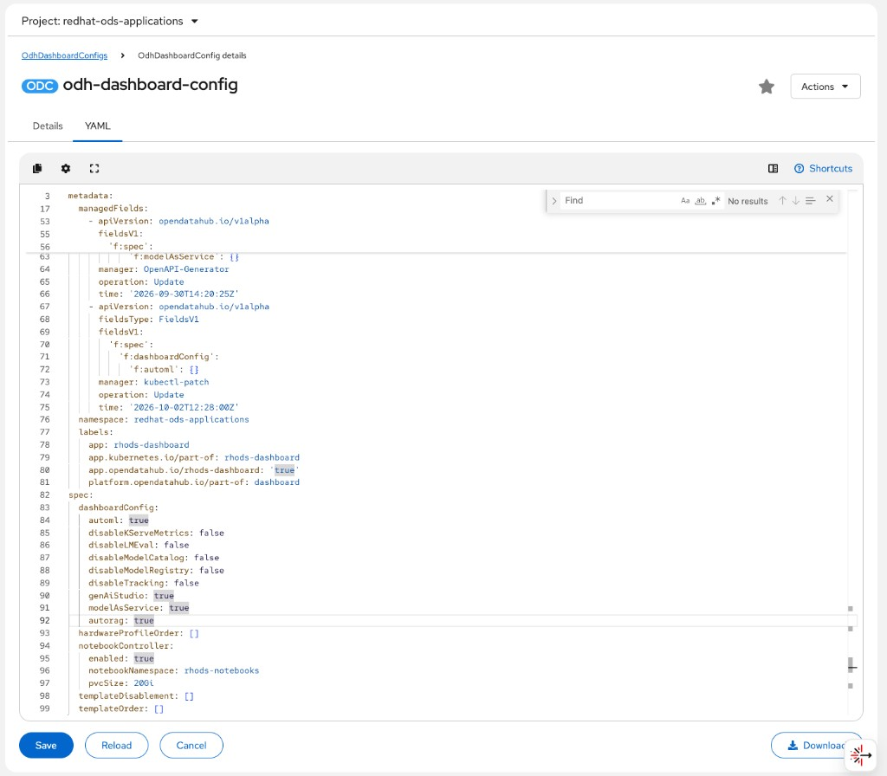

8. **Save** → **Reload** (so the console syncs the CR)

**Note:** For `autorag` / `genAiStudio` / `automl`, **`true` = feature shown**. (Some other dashboard keys use inverted `disable*` flags — do not invert `autorag`.)

#### After A or B

Hard-refresh the **OpenShift AI** UI → left nav **Gen AI studio → AutoRAG**.

**Pods:** none new in `genai-hotline` — only dashboard config.
---

<a id="r91"></a>

## R9.1 — Pipeline server in `genai-hotline`

### What we want
A **Ready** pipeline server in the Gen AI project with managed AutoML/AutoRAG pipelines installed.

### Why
AutoRAG optimization runs are pipeline runs. No server → Create run never schedules.

### Success looks like
- Project **Pipelines** shows server **Ready**
- Pods: `ds-pipeline-…` (+ DB) **Running** in `genai-hotline`

### How

**UI:** OpenShift AI → project **`genai-hotline`** → **Pipelines** → **Configure pipeline server**

Reuse lab MinIO (same pattern as predictive §9.1):

| Field | Value |
|-------|--------|
| Access key | `minio` |
| Secret key | `minio123` |
| Endpoint | `http://minio.lab-minio.svc.cluster.local:9000` |
| Region | `us-east-1` |
| Bucket | `muffin-chihuahua` (or a dedicated `hotline-kb` bucket if you create one) |
| Database | **Default database on the cluster** |

**Advanced settings:** check **Enable AutoML and AutoRAG pipelines** → **Configure** → wait **Ready**.

```bash
oc -n genai-hotline get pods | grep -iE 'pipeline|maria|mysql|postgres'
```

**Expected output (shape):**

```text
ds-pipeline-…          1/1     Running
mariadb-…              1/1     Running
```

(Names differ by cluster; status must be Running / Ready.)

If you create the DSPA with YAML instead of UI: set `spec.apiServer.managedPipelines: {}` ([AutoRAG prereqs](https://docs.redhat.com/en/documentation/red_hat_openshift_ai_self-managed/3.5/html-single/working_with_autorag/index)).

---

<a id="r92"></a>

## R9.2 — Connections: OGX (+ optional S3 for docs)

### What we want
An **OGX connection** in `genai-hotline` that AutoRAG can select in the wizard. Optionally an S3 connection pointing at the Hotline files.

### Why
Wizard step 1 requires an OGX connection (base URL + API key). Docs can be uploaded in the UI or browsed from S3.

### Success looks like
- Connections tab lists e.g. **`hotline-rag-ogx`** (OGX) and optionally **`minio-hotline-kb`** (S3)
- Curl to the Service URL returns models (no auth on this lab OGX)

### How

#### A — OGX connection (required)

On this cluster the connection type is **URI - v1** (no separate “OGX” type in the picker).

1. Project **`genai-hotline`** → **Connections** → **Add connection** / **Create connection**
2. **Connection type:** **URI - v1**
3. Values for this lab:

| Field | Value |
|-------|--------|
| Connection name | `hotline-rag-ogx` |
| URI | `http://hotline-rag-ogx-service.genai-hotline.svc.cluster.local:8321` |

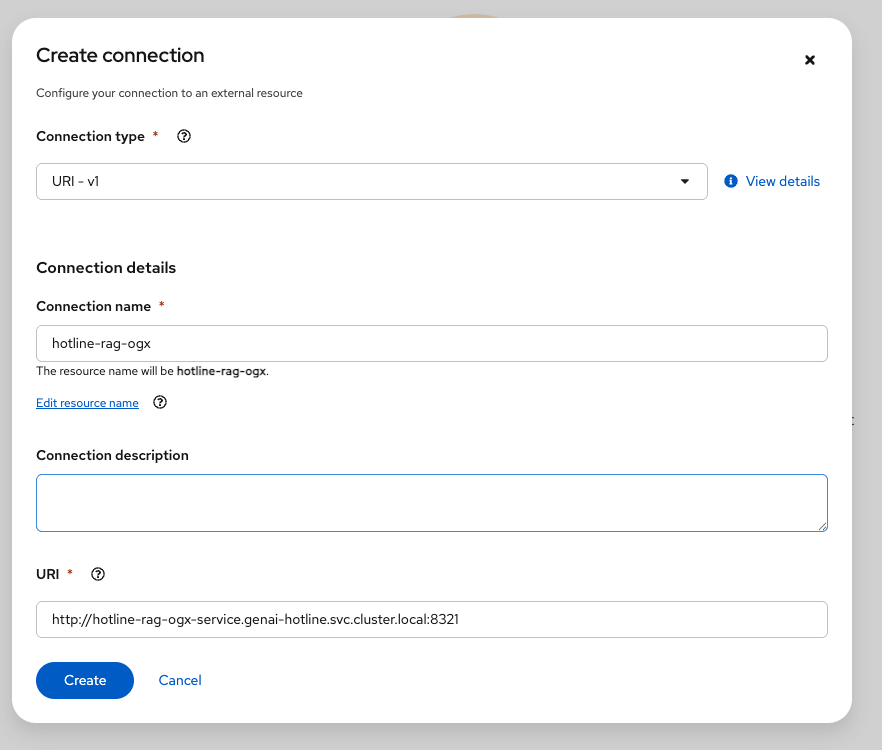

4. **Create**

No API-key field on URI - v1 — lab OGX has no OAuth; that is OK.

Verify from a shell (read-only):

```bash
oc -n genai-hotline exec deploy/hotline-rag-ogx -- \
  curl -sS http://127.0.0.1:8321/v1/models | head -c 400
```

**Expected output:** JSON listing at least one `model_type":"llm"` and one embedding model.

#### B — Docs in the wizard (simplest for lab)

Keep files local and **upload** in R9.4:

- Corpus: [`data/hotline-kb/upload/`](data/hotline-kb/upload/) (`01_…txt` … `05_faq.csv`)
- Eval: [`data/hotline-kb/eval/golden_questions.json`](data/hotline-kb/eval/golden_questions.json)

`correct_answer_document_ids` must be **base file names only** (no folder path) — already aligned to `upload/`.

#### C — Optional S3 for docs

Same MinIO as pipelines; put all Hotline files in **one folder** in the bucket, then create an S3 connection and select that folder in the wizard.

---

<a id="r93"></a>

## R9.3 — Sanity-check eval JSON

### What we want
Confirm the golden set is valid JSON and document IDs match upload file names.

### Why
Wrong IDs → weak sampling / bad context-correctness scores.

### Success looks like
- `python -m json.tool` succeeds
- Every `correct_answer_document_ids` entry exists under `data/hotline-kb/upload/`

### How

```bash
python3 -m json.tool data/hotline-kb/eval/golden_questions.json > /dev/null && echo OK
ls data/hotline-kb/upload/
```

**Expected output:**

```text
OK
01_wifi_one_foot.txt
02_coffee_pdf.txt
03_elevator_monday.txt
04_escalation_matrix.txt
05_faq.csv
```

---

<a id="r94"></a>

## R9.4 — Create AutoRAG optimization run

### What we want
Start one optimization run that tests several RAG patterns on the Hotline corpus.

### Why
This is the product step: AutoRAG explores the search space and ranks patterns.

### Success looks like
- Run listed on **AutoRAG** page as **Pending** / **Running**, then **Complete**
- Pipeline run pods appear while Running

### How

1. OpenShift AI → **Gen AI studio** → **AutoRAG**
2. Project → **`genai-hotline`** → **Create AutoRAG optimization run**
3. Name e.g. `hotline-kb-autorag-1` · **Open GenAI Stack connection** = **`hotline-rag-ogx-stack`** (not a plain URI connection) → **Next**
4. **Knowledge setup:**
   - Prefer S3: put all Hotline files in **one folder** (e.g. `hotline-kb/`) → **Browse bucket** → select that **folder** (wizard stores one S3 key; a folder = multi-doc)
   - **Vector I/O provider:** the **pgvector** provider from `hotline-rag-ogx` (not Playground’s)
   - Evaluation dataset: upload / select `golden_questions.json`
5. Lab-friendly settings:

| Setting | Lab value |
|---------|-----------|
| Optimization metric | **Answer correctness** (or Overall if the UI offers it) |
| Maximum RAG patterns | `8` (lab freeze) — use `4` if the sandbox is tight |
| Run preset | **Faster** (4 vCPU / 16 Gi) |
| Foundation models | **only** Granite (≤ 3) |
| Embedding models | **only** `sentence-transformers/ibm-granite/granite-embedding-125m-english` — **uncheck nomic** (registered but does not respond offline) |

6. **Create run** → monitor on the AutoRAG page.

```bash
oc -n genai-hotline get pods | grep -iE 'autorag|pipeline-run|workflow'
```

**Expected output while Running:** one or more short-lived pipeline / workflow pods; after Complete they finish.

Runs **cannot** be edited after creation — stop/archive/delete via pipeline run management if needed.

---

<a id="r95"></a>

## R9.5 — Evaluate results

### What we want
Read the leaderboard as an **analysis of RAG methodologies**: which pattern won, and whether Sample Q&A still looks like Hotline.

### Why
The pipeline already ranked recipes by score. You still sanity-check elevator / coffee / Wi-Fi answers before adopting a pattern in an app.

### Success looks like
- Run **Succeeded** with N patterns evaluated (lab: **8**)
- Clear winner (lab: **Pattern 1**, overall ≈ **0.702**)
- Leaderboard shows LLM + embedding used (lab: Granite + granite-embedding)
- Optional: Sample Q&A / **Try this pattern** / **View code** / save notebooks

### How

1. **Gen AI studio** → **AutoRAG** → open the **Succeeded** run (lab: `hotline-kb-autorag-1 - 2`)
2. Read the graph: load → discover → extract → prepare search space → optimize → **Pattern 1…N** in parallel → select best
3. Leaderboard: compare overall / correctness / faithfulness / context ([metrics chapter](https://docs.redhat.com/en/documentation/red_hat_openshift_ai_self-managed/3.5/html-single/working_with_autorag/index))
4. Winner → **View details** → **Sample Q&A**
5. Optional: **Try this pattern** (dashboard chat)
6. **Save as inference notebook** (and indexing if you will re-ingest later) — copies live under [`notebooks/autorag/`](notebooks/autorag/)
7. Workbench: run **inference** (API key `none` if prompted). Indexing is optional — AutoRAG already indexed; Docling on a 4 Gi workbench may crash.

**What the notebooks are for (plain language):** AutoRAG cooked once in a pipeline. The notebooks are the **recipe card** so you can redo ingest or Q&A in Jupyter. They do **not** change the Route. The Route changes only in [R9.6](#r96).


**Frozen:** AutoRAG **Succeeded** · 8 patterns · **Pattern 1** best · same models as R8 stack (Granite + granite-embedding) — the *methodology* (chunk/retrieve knobs) is what was compared, not a new LLM.

**Teaching point:** R7/R8 = one hand-built methodology that works for demos. R9 = **systematic analysis** of several methodologies on the same Hotline KB; next you may align the production app with the winning pattern (notebooks / Responses API snippets).

---

<a id="r96"></a>

## R9.6 — Apply Pattern 1 to `hotline-rag-chat` (for real)

### What we want
Point the **end-user Hotline app** at the AutoRAG **Pattern 1** vector store (not the old R7 `hotline-kb-pgvector` store), with Pattern 1 retrieval knobs (`top_k=5`).

### Why
Until this step, AutoRAG only *analysed* and *tested* the recipe. The Route `hotline-rag-chat` still used the R7 ingest store. This step is the production-lab handoff.

### Success looks like
- Deploy env: `VECTOR_STORE_ID=vs_75001176-23a4-4657-9f38-a8d023715426`
- Sidebar shows AutoRAG **Pattern 1** + `top_k=5` · captions `retrieved>0` on in-KB questions
- Route HIT: elevator · coffee · Wi-Fi · SSID
- Fridge: ideal MISS; lab honesty — tiny Granite may soft false-HIT (closest fallback code)

### How

**What “apply” means here**

| Piece | Pattern 1 value (lab freeze) | How the app gets it |
|-------|------------------------------|---------------------|
| Vector store (indexed KB) | `vs_75001176-23a4-4657-9f38-a8d023715426` | env `VECTOR_STORE_ID` |
| Chunking | recursive · size **512** · overlap **32** | already baked into that store by AutoRAG |
| Retrieval top-k | **5** | env `FILE_SEARCH_MAX_RESULTS=5` + app `file_search.max_num_results` |
| Embed / LLM | granite-embedding + Granite tiny | same OGX as R8 |
| Hotline persona | HIT/MISS rules | still `SYSTEM` in `app.py` (lab persona — keep it) |

#### 1) Confirm Pattern 1 store exists

```bash
NS=genai-hotline
oc -n "$NS" exec deploy/hotline-rag-ogx -- \
  curl -sS http://127.0.0.1:8321/v1/vector_stores | python3 -c \
  'import json,sys; d=json.load(sys.stdin);
[print(x["id"], x.get("name","")) for x in (d.get("data") or [])]'
```

**Expected:** a line with `vs_75001176-23a4-4657-9f38-a8d023715426`.

#### 2) Rebuild app (Pattern 1 caption + top_k) then point env

```bash
NS=genai-hotline
PATTERN_VS=vs_75001176-23a4-4657-9f38-a8d023715426

oc -n "$NS" start-build hotline-rag-chat --from-dir=apps/hotline_rag_chat --follow

oc -n "$NS" set env deploy/hotline-rag-chat \
  VECTOR_STORE_ID="$PATTERN_VS" \
  FILE_SEARCH_MAX_RESULTS=5 \
  AUTORAG_PATTERN='Pattern 1'

oc -n "$NS" rollout status deploy/hotline-rag-chat --timeout=300s
oc -n "$NS" get route hotline-rag-chat -o jsonpath='https://{.spec.host}{"\n"}'
```

**Expected output:**

```text
deployment "hotline-rag-chat" successfully rolled out
https://hotline-rag-chat-genai-hotline.apps....
```

#### 3) Test on the Route

```bash
oc -n genai-hotline get route hotline-rag-chat -o jsonpath='https://{.spec.host}{"\n"}'
```

Open that URL. Sidebar: **AutoRAG Pattern 1**, `top_k=5`, vector store starting `vs_75001176-…`.

Ask:

| Question | Expect | Lab freeze (Pattern 1 app) |
|----------|--------|----------------------------|
| `The elevator refuses Mondays. What recurring calendar event must be deleted?` | HIT — *Maintenance spirits — Mondays* / `LIFT-MON-1` | ✅ HIT · `retrieved>0` |
| `The coffee machine prints PDF instead of coffee. Which firmware should be reinstalled?` | HIT — `espresso-os-3.2` / `BREW-PDF-7` | ✅ HIT |
| `My Wi-Fi only works when I stand on one foot…` | HIT — `WIFI-BALANCE-42` + 3 steps | ✅ HIT |
| `What SSID should B-Wing use for corporate Wi-Fi?` | HIT — `CAMPUS-SECURE` | ✅ HIT |
| `My fridge is making a weird humming noise. What is the official Hotline cause code?` | MISS — no `LIFT-*` / `BREW-*` / `WIFI-*` | ⚠️ often soft false-HIT (see below) |

**Known limit (document this for the room):** tiny Granite + `file_search` always returns *nearest* chunks (`retrieved=4` even for fridge). The model may admit “not in the runbooks” then invent a **closest fallback** (e.g. `LIFT-MON-1` for a fridge). That is **not** an AutoRAG failure — AutoRAG improved indexing/retrieval; **out-of-KB refusal** is prompt + small LLM. Demo tip: show HIT questions 1–4; treat fridge as “known soft fail” or reinforce MISS in `SYSTEM` and rebuild.

App knobs: `tool_choice=required` so search actually runs; `SYSTEM` in [`apps/hotline_rag_chat/app.py`](apps/hotline_rag_chat/app.py) carries HIT/MISS rules. Rebuild after prompt edits:

```bash
oc -n genai-hotline start-build hotline-rag-chat --from-dir=apps/hotline_rag_chat --follow
oc -n genai-hotline rollout status deploy/hotline-rag-chat --timeout=300s
```

**Pods:** rollout → new `hotline-rag-chat-…` Running (no new OGX/pgvector pods).

**Frozen:** Route on Pattern 1 store · HIT elevator/coffee/Wi-Fi/SSID validated · fridge MISS imperfect on tiny Granite · path AutoRAG → notebooks → app documented above.

---

<a id="r10"></a>

# R10 — Backlog (after AutoRAG)

### What we want
Park follow-ups that are **not** the AutoRAG sitting.

### Why
Keep the room focused; do not lose later ideas.

### Success looks like
- Ordered list below is enough for the next session pick

### How

| # | Topic | Why / starting point |
|---|--------|----------------------|
| 1 | **Remote embedding model** | Official production-style path when a 2nd GPU / remote embedder is available — today: inline sentence-transformers on the OGX pod |
| 2 | **Docling ingest pipeline** | PDFs / messy docs → Markdown → same OGX store |
| 3 | **Harden `hotline-rag-chat`** | Auth on Route · ConfigMap/Secret for `VECTOR_STORE_ID` |
| 4 | **Agentic / MCP** | Separate beginner lab — [`README-GENAI-AGENT.md`](README-GENAI-AGENT.md) |

Hub pointer: [`README.md`](README.md) Optional / related.

---

## Link back

Hub: **[README.md](README.md)** · Predictive: **[README-PREDICTIVE.md](README-PREDICTIVE.md)**
