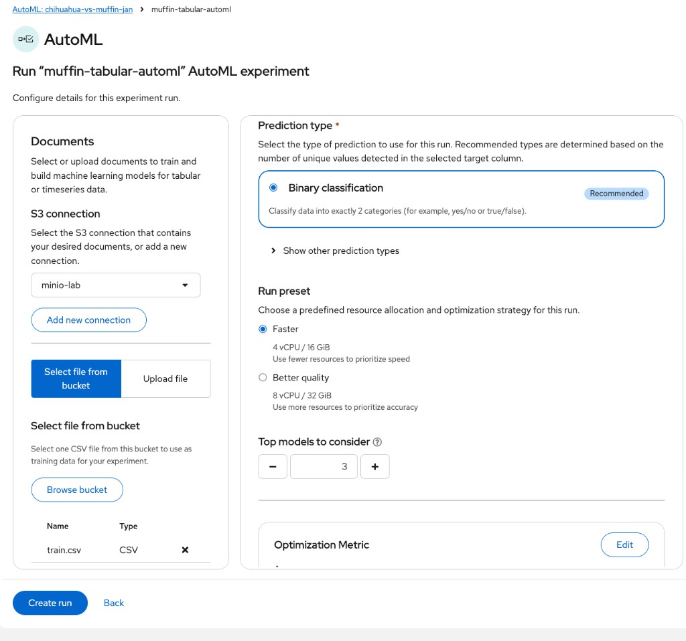

# Chihuahua vs Muffin — Predictive lab (OVMS)

Lab on **OpenShift AI 3.5**: S3 → train → serve → guardrails → TrustyAI → pipelines → AutoML.

Hub (all labs): [`README.md`](README.md) · Gen AI (separate): [`README-GENAI.md`](README-GENAI.md)

| | |
|--|--|
| **Docs** | [OpenShift AI 3.5](https://docs.redhat.com/en/documentation/red_hat_openshift_ai_self-managed/3.5) win on conflicts |
| **Team** | 4 people · 1 cluster · 1 project |
| **Rule** | One step → run it → then freeze a short section here |

---

## Progress

| Step | Topic | Done |
|------|--------|------|
| 0 | [Prerequisites](#step-0) | ✅ |
| 1 | [MinIO + bucket](#step-1) | ✅ |
| 2 | [Dataset on S3](#step-2) | ✅ |
| 3 | [Project + connection + Workbench](#step-3) | ✅ |
| 4 | [Train + ONNX](#step-4) | ✅ |
| 5 | [Deploy model (OVMS)](#step-5) | ✅ |
| 6 | [Call the API](#step-6) | ✅ |
| 7 | [Guardrails (confidence / margin)](#step-7) | ✅ |
| 8 | [TrustyAI](#step-8) | ✅ |
| 9 | [Pipelines](#step-9) | ✅ |
| 10 | [AutoML](#step-10) | ✅ |
| 11 | Gen AI → **[`README-GENAI.md`](README-GENAI.md)** (lab séparé) | ⬜ |

Jump: [0](#step-0) · [1](#step-1) · [2](#step-2) · [3](#step-3) · [4](#step-4) · [5](#step-5) · [6](#step-6) · [7](#step-7) · [8](#step-8) · [9](#step-9) · [10](#step-10) · [Gen AI](README-GENAI.md)  
Step 8: [story](#step-8) · [8.1](#81) · [8.2](#82) · [8.3](#83) · [8.4](#84) · [8.5](#85) · [8.6](#86) · [8.7](#87) · [8.8](#88) · [8.9](#89) · [8.10](#810) · [8.11](#811) · [8.12](#812) · [8.13](#813) · [8.14](#814) · [reset](#87-reset)  
Step 9: [9.1](#91-configure) · [9.2 smoke](#92-smoke) · [9.3](#93-out)  
Step 10: [10.0](#100-prereq) · [10.1](#101-data) · [10.2](#102-run) · [10.3](#103-read)

---

<a id="step-0"></a>

# Step 0 — Prerequisites

### What we want
Confirm you are logged into the right cluster and project before anything else.

### Why
Wrong project or missing APIs wastes the whole session. TrustyAI CRDs must exist on the cluster.

### Success looks like
- `oc whoami` shows your user
- Project is (or will be) `chihuahua-vs-muffin-jan`
- DSC exists; TrustyAI API resources appear in `oc api-resources`

### How

```bash
oc whoami
oc project
oc get datasciencecluster -A
oc api-resources | grep -i trustyai | head
```

| | |
|--|--|
| User | `admin` |
| Project | `chihuahua-vs-muffin-jan` |
| Cluster | `https://api.ocp.dv6rj.sandbox1011.opentlc.com:6443` |
| DSC | `default-dsc` Ready |

---

<a id="step-1"></a>

# Step 1 — MinIO + bucket

### What we want
Stand up an in-cluster S3-compatible store and create the `muffin-chihuahua` bucket.

### Why
Every later step (dataset, ONNX, pipelines, workbench connection) reads/writes this MinIO.

### Success looks like
- Deployment `minio` rolled out
- Routes `minio-api` + `minio-console` exist
- Bucket `muffin-chihuahua` created (`mc mb`)

### How

```bash
oc new-project lab-minio

oc -n lab-minio create secret generic minio-root \
  --from-literal=MINIO_ROOT_USER=minio \
  --from-literal=MINIO_ROOT_PASSWORD=minio123

oc -n lab-minio apply -f - <<'EOF'
apiVersion: v1
kind: PersistentVolumeClaim
metadata:
  name: minio-data
spec:
  accessModes: [ReadWriteOnce]
  resources:
    requests:
      storage: 20Gi
---
apiVersion: apps/v1
kind: Deployment
metadata:
  name: minio
spec:
  replicas: 1
  selector:
    matchLabels:
      app: minio
  strategy:
    type: Recreate
  template:
    metadata:
      labels:
        app: minio
    spec:
      containers:
        - name: minio
          # quay.io/minio/* anonymous pulls are blocked (401); use Silo (MinIO-compatible fork)
          image: docker.io/pgsty/silo:latest
          args: [server, /data, --console-address, ":9001"]
          env:
            - name: MINIO_ROOT_USER
              valueFrom: {secretKeyRef: {name: minio-root, key: MINIO_ROOT_USER}}
            - name: MINIO_ROOT_PASSWORD
              valueFrom: {secretKeyRef: {name: minio-root, key: MINIO_ROOT_PASSWORD}}
          ports:
            - {name: api, containerPort: 9000}
            - {name: console, containerPort: 9001}
          volumeMounts:
            - {name: data, mountPath: /data}
          readinessProbe:
            httpGet: {path: /minio/health/ready, port: 9000}
            initialDelaySeconds: 10
            periodSeconds: 10
      volumes:
        - name: data
          persistentVolumeClaim:
            claimName: minio-data
---
apiVersion: v1
kind: Service
metadata:
  name: minio
spec:
  selector:
    app: minio
  ports:
    - {name: api, port: 9000, targetPort: 9000}
    - {name: console, port: 9001, targetPort: 9001}
EOF

oc -n lab-minio create route edge minio-api --service=minio --port=9000 --insecure-policy=Redirect
oc -n lab-minio create route edge minio-console --service=minio --port=9001 --insecure-policy=Redirect
oc -n lab-minio rollout status deployment/minio

export MINIO_ENDPOINT_EXTERNAL="https://$(oc -n lab-minio get route minio-api -o jsonpath='{.spec.host}')"
export AWS_ACCESS_KEY_ID=minio AWS_SECRET_ACCESS_KEY=minio123 BUCKET=muffin-chihuahua

mc alias set lab "$MINIO_ENDPOINT_EXTERNAL" minio minio123 --api S3v4 --insecure
mc mb lab/"$BUCKET" --insecure
```

| | |
|--|--|
| API | `https://minio-api-lab-minio.apps.ocp.lcdkt.sandbox1045.opentlc.com` |
| Console | `https://minio-console-lab-minio.apps.ocp.lcdkt.sandbox1045.opentlc.com` |
| In-cluster | `http://minio.lab-minio.svc.cluster.local:9000` |
| Auth | `minio` / `minio123` |
| Bucket | `muffin-chihuahua` |

---

<a id="step-2"></a>

# Step 2 — Dataset on S3

### What we want
Download a Kaggle subset and mirror it into MinIO under `train|test` / `chihuahua|muffin`.

### Why
Training and inference need a shared, versionable dataset on S3 — not only files on one laptop.

### Success looks like
- Layout on S3: **500** train + **100** test images per class
- `mc mirror` finished without error

### How

Source: [Muffin vs Chihuahua (Kaggle, CC0)](https://www.kaggle.com/datasets/samuelcortinhas/muffin-vs-chihuahua-image-classification)

```bash
python3 -m venv ~/lab-venv && source ~/lab-venv/bin/activate
pip install -q kaggle
# put API token in ~/.kaggle/kaggle.json (chmod 600)

mkdir -p ~/lab-data && cd ~/lab-data
kaggle datasets download -d samuelcortinhas/muffin-vs-chihuahua-image-classification
unzip -qo muffin-vs-chihuahua-image-classification.zip -d muffin-chihuahua-raw
export DATA_ROOT=~/lab-data/muffin-chihuahua-raw

export SUBSET=~/lab-data/muffin-chihuahua-subset
rm -rf "$SUBSET"
mkdir -p "$SUBSET"/{train,test}/{chihuahua,muffin}
for split in train test; do
  for class in chihuahua muffin; do
    if [ "$split" = train ]; then N=500; else N=100; fi
    find "$DATA_ROOT/$split/$class" -type f | head -n "$N" | while read -r f; do
      cp "$f" "$SUBSET/$split/$class/"
  done
done
done

export MINIO_ENDPOINT_EXTERNAL="https://$(oc -n lab-minio get route minio-api -o jsonpath='{.spec.host}')"
mc alias set lab "$MINIO_ENDPOINT_EXTERNAL" minio minio123 --api S3v4 --insecure
mc mirror --overwrite "$SUBSET" lab/muffin-chihuahua/ --insecure
```

Layout on S3: `train|test` / `chihuahua|muffin` — **500** train + **100** test images per class.

---

<a id="step-3"></a>

# Step 3 — Project + connection + Workbench

### What we want
Create the OpenShift AI project, attach MinIO as a connection, and open a GPU workbench.

### Why
This is the lab workspace: notebooks, model deploy, and TrustyAI all live in this project.

### Success looks like
- Project `chihuahua-vs-muffin-jan` visible in the dashboard
- Connection `minio-lab` listed
- Workbench `chihuahua-muffin` **Running** and openable

### How

## Project

### What we want
Create the OpenShift AI project namespace with dashboard labels.

### Why
Without `opendatahub.io/dashboard=true`, the project does not show correctly in the RHOAI UI.

### Success looks like
- Namespace `chihuahua-vs-muffin-jan` exists
- Visible under Projects in the dashboard

### How

**UI:** Projects → Create project → `chihuahua-vs-muffin-jan`

**CLI:**

```bash
export PROJECT=chihuahua-vs-muffin-jan
oc apply -f - <<EOF
apiVersion: v1
kind: Namespace
metadata:
  name: ${PROJECT}
  labels:
    opendatahub.io/dashboard: "true"
  annotations:
    opendatahub.io/display-name: "Chihuahua vs Muffin"
EOF
```

## Connection `minio-lab`

### What we want
Register MinIO as an S3 connection the workbench and model deploy can use.

### Why
Notebooks and OVMS need credentials + endpoint via a dashboard **Connection**.  
A hand-made `oc apply` Secret often misses connection-type metadata the UI expects, so the connection is missing, incomplete, or not attachable to the workbench — **create it in the OpenShift AI console**.

### Success looks like
- Connection **`minio-lab`** listed under the project **Connections** tab
- Type: **S3 compatible object storage**
- You can **Attach** it when creating the workbench (next subsection)

### How

Do this in the **OpenShift AI** dashboard (not the plain OpenShift console).

1. Left nav → **Projects** → open **`chihuahua-vs-muffin-jan`**
2. Tab **Connections** → **Add connection** (or **Create connection**)
3. **Connection type:** **S3 compatible object storage**
4. Fill the form with the lab values below → **Create** / **Add connection**

| Field | Value |
|-------|--------|
| **Name** / Connection name | `minio-lab` |
| **Access key** | `minio` |
| **Secret key** | `minio123` |
| **Endpoint** | `http://minio.lab-minio.svc.cluster.local:9000` |
| **Region** | `us-east-1` |
| **Bucket** | `muffin-chihuahua` |

Notes:

- Prefer the **in-cluster** endpoint above (workbench + OVMS talk to MinIO inside the cluster). Do **not** paste the external `minio-api` route here unless you know you need it.
- Keep the `http://` prefix for this lab MinIO.
- If a broken CLI secret already exists: Connections → delete **`minio-lab`** (or `oc -n chihuahua-vs-muffin-jan delete secret minio-lab`), then recreate with the UI steps above.

**Expected output (UI):** card/row **`minio-lab`** on the Connections tab; type S3; bucket `muffin-chihuahua`.

## Workbench (UI)

### What we want
Create and open a Jupyter workbench with storage and the MinIO connection attached.

### Why
All training / export / TrustyAI notebooks run here, with data on the PVC.

### Success looks like
- Workbench status **Ready** / **Running**
- Connection `minio-lab` attached
- You can open Jupyter

### How

1. Workbenches → **Create workbench**
2. Name: `chihuahua-muffin`
3. Image: **Training | Jupyter | PyTorch | CUDA | Python** · version **3.5**
4. Hardware: `gpu-profile` (or Medium if no GPU)
5. Storage: create PVC (~20 GiB) at `/opt/app-root/src/`
6. Connections → **Attach existing** → `minio-lab`
7. Create → wait **Running** → **Open**


| | |
|--|--|
| Name | `chihuahua-muffin` |
| Image | PyTorch CUDA Python **3.5** |
| Profile | `gpu-profile` · 1 CPU · 12 GiB |
| Storage | `chihuahua-muffin-storage` · 20 GiB |
| Connection | `minio-lab` |
| Status | **Ready** |

---

<a id="step-4"></a>

# Step 4 — Train + ONNX

### What we want
Fine-tune ResNet18 in the workbench and upload an OVMS-ready ONNX model to MinIO.

### Why
Serving needs `models/muffin-chihuahua/1/model.onnx` on S3 before Deploy model works.

### Success looks like
- Notebooks **01 → 05** completed
- Object exists: `s3://muffin-chihuahua/models/muffin-chihuahua/1/model.onnx`

### How

Notebook scripts (English comments): [`notebooks/`](notebooks/)

| Order | File | What it does |
|------:|------|----------------|
| 1 | [`01_install_deps.ipynb`](notebooks/01_install_deps.ipynb) | Install boto3, pillow, onnx — then **restart kernel** |
| 2 | [`02_check_s3.ipynb`](notebooks/02_check_s3.ipynb) | Print AWS env vars + list MinIO objects |
| 3 | [`03_download_dataset.ipynb`](notebooks/03_download_dataset.ipynb) | Download `train/` + `test/` onto the PVC |
| 4 | [`04_train_resnet18.ipynb`](notebooks/04_train_resnet18.ipynb) | Fine-tune ResNet18 head → save `model.pt` |
| 5 | [`05_export_onnx_upload.ipynb`](notebooks/05_export_onnx_upload.ipynb) | Export ONNX + upload `models/muffin-chihuahua/1/model.onnx` |

**How to run:** Upload the folder to the workbench → open each `.ipynb` → run cells with ⇧Enter, order **01 → 05**. After 01: **Kernel → Restart**.

ONNX on S3 (OVMS layout): `s3://muffin-chihuahua/models/muffin-chihuahua/1/model.onnx`

---

<a id="step-5"></a>

# Step 5 — Deploy model (OVMS)

### What we want
Deploy the ONNX model with OpenVINO Model Server so the project has a live InferenceService.

### Why
Guardrails, TrustyAI capture, and demos all call this predictor — no deploy, no later steps.

### Success looks like
- InferenceService `muffin-chihuahua` Ready=`True`
- Predictor pod `2/2 Running`
- External route exists

### How

**UI:** Projects → `chihuahua-vs-muffin-jan` → **Deployments** → **Deploy model**

### Model details

| Field | Value |
|-------|--------|
| Model location | Existing connection |
| Connection | `minio-lab` |
| **Path** | `models/muffin-chihuahua` ← **folder**, not the `.onnx` file |
| Model type | Predictive model |

> Wrong path that fails with “no model found”: `muffin-chihuahua/models`  
> Correct: `models/muffin-chihuahua` (contains `1/model.onnx`)


### Model deployment

| Field | Value |
|-------|--------|
| Name | `muffin-chihuahua` |
| Framework | `onnx - 1` |
| Runtime | **OpenVINO Model Server** `v2026.1.0` |
| Replicas | `1` |
| Hardware | `default-profile` |


### Advanced settings

| Field | Value |
|-------|--------|
| External route | ✅ on |
| Token auth | off (lab) |
| Strategy | Rolling update |
| Timeout | 30s |


Deploy → wait until status **Ready**.


| | |
|--|--|
| InferenceService | `muffin-chihuahua` · Ready=`True` |
| External URL | `https://muffin-chihuahua-chihuahua-vs-muffin-jan.apps.ocp.dv6rj.sandbox1011.opentlc.com` |
| Predictor pod | `muffin-chihuahua-predictor-…` · 2/2 Running |

---

<a id="step-6"></a>

# Step 6 — Call the API

### What we want
Prove inference works from the workbench (and optionally from your laptop).

### Why
Validates ports, URLs, and model metadata before adding guardrails or TrustyAI logging.

### Success looks like
- Metadata HTTP 200; input `[1,3,224,224]`, output `[1,2]`
- Notebook `06_infer` shows sensible muffin/chihuahua scores
- Internal calls use **:8888** (not :8080)

### How

Notebook: [`notebooks/06_infer.ipynb`](notebooks/06_infer.ipynb)

Shows each image + a probability bar chart (`pred` vs `true`).

| | |
|--|--|
| Internal URL (use this) | `http://muffin-chihuahua-predictor.chihuahua-vs-muffin-jan.svc.cluster.local:8888` |
| External URL | `https://muffin-chihuahua-chihuahua-vs-muffin-jan.apps.ocp.dv6rj.sandbox1011.opentlc.com` |
| Metadata | HTTP 200 · versions `["1"]` · input `[1,3,224,224]` · output `[1,2]` |
| Example infer | `muffin` · confidence **~95%** |


### Known bug — dashboard internal port

The **Inference endpoints** modal shows:

```text
http://muffin-chihuahua-predictor.…svc.cluster.local:8080
```

That URL returns **Connection refused**.

**Cause (validated):** you never pick a port in the deploy wizard. KServe creates a **headless** Service (`ClusterIP: None`) with `port 80 → targetPort 8888`; the OVMS container listens on **8888**. The dashboard still prints the generic KServe port **8080**, which does not match this runtime.

| What | Port | Works? |
|------|------|--------|
| UI internal URL | `:8080` | No |
| Service / pod (real) | `:8888` | Yes |
| External route | `:443` | Yes |

**Workaround:** from the workbench, call **`:8888`**, not `:8080`. Confirm anytime with:

```bash
oc -n chihuahua-vs-muffin-jan get svc muffin-chihuahua-predictor -o jsonpath='{.spec.ports}{"\n"}'
oc -n chihuahua-vs-muffin-jan get endpoints muffin-chihuahua-predictor
```

```bash
# External check (laptop)
curl -k "https://muffin-chihuahua-chihuahua-vs-muffin-jan.apps.ocp.dv6rj.sandbox1011.opentlc.com/v2/models/muffin-chihuahua"

# Internal check (in-cluster)
curl -sS "http://muffin-chihuahua-predictor.chihuahua-vs-muffin-jan.svc.cluster.local:8888/v2/models/muffin-chihuahua"
```

---

<a id="step-7"></a>

# Step 7 — Confidence thresholds (before TrustyAI)

### What we want
Add a client-side confidence/margin guardrail so OOD images can be marked `uncertain`.

### Why
A 2-class model always picks a label. TrustyAI later *observes* drift; this step *soft-blocks* weak singles.

### Success looks like
- In-domain test images mostly **ACCEPTED**
- OOD (tea cup, etc.) mostly **UNCERTAIN**
- Defaults: `CONF_MIN=0.80`, `MARGIN_MIN=0.25`

### How

A 2-class model **always** returns `chihuahua` or `muffin`.  
Out-of-domain photos (tea cup, cat, car…) still get a label — that is expected.

**Client-side guardrail** (notebook / app), not a change to OVMS:

1. `confidence = max(prob)` must be ≥ `CONF_MIN` (default **0.80**)
2. `margin = top1 − top2` must be ≥ `MARGIN_MIN` (default **0.25**)
3. Otherwise → `uncertain` (do not trust the raw class)

Notebook: [`notebooks/07_confidence_guardrails.ipynb`](notebooks/07_confidence_guardrails.ipynb)

| Test | What to do | Expect |
|------|------------|--------|
| In-domain | sample from `test/muffin` + `test/chihuahua` | mostly **ACCEPTED** |
| Out-of-domain | upload photos to `/opt/app-root/src/ood/` (lab samples in repo [`ood/`](ood/)) | mostly **UNCERTAIN** (tea cup); edge dogs may still score high |


If OOD images are still accepted → raise `CONF_MIN` / `MARGIN_MIN` in the notebook and re-run.

### Validated defaults

| | |
|--|--|
| `CONF_MIN` | `0.80` |
| `MARGIN_MIN` | `0.25` |
| Lab OOD samples | [`ood/teacup.jpg`](ood/teacup.jpg), [`ood/hairless_dog.jpg`](ood/hairless_dog.jpg), [`ood/chihuahua_back.jpg`](ood/chihuahua_back.jpg) |
| Workbench path | `/opt/app-root/src/ood/` |

---

<a id="step-8"></a>

# Step 8 — TrustyAI (platform monitoring)

Validated path: **DATABASE (MariaDB)** + copy-paste replay.

Official docs (3.5): [Configuring TrustyAI](https://docs.redhat.com/en/documentation/red_hat_openshift_ai_self-managed/3.5/html/monitoring_your_ai_systems/configuring-trustyai_monitor) · [Set up TrustyAI for your project](https://docs.redhat.com/en/documentation/red_hat_openshift_ai_self-managed/3.5/html/monitoring_your_ai_systems/setting-up-trustyai-for-your-project_monitor) · [Data drift](https://docs.redhat.com/en/documentation/red_hat_openshift_ai_self-managed/3.5/html/monitoring_your_ai_systems/monitoring-data-drift_drift-monitoring)

Source of truth: [RHODS 3.5 — Monitoring your AI systems (PDF)](https://docs.redhat.com/en/documentation/red_hat_openshift_ai_self-managed/3.5/pdf/monitoring_your_ai_systems/Red_Hat_OpenShift_AI_Self-Managed-3.5-Monitoring_your_AI_systems-en-US.pdf)

**How to use this guide**

1. Copy-paste each command block **in order**.
2. Read **What we want** / **Why** / **Success looks like** / **How** before running anything.
3. After each command, compare your terminal to **Expected output** (pod names, ages, hosts, and requestIds will differ; the *shape* and key words must match).
4. Only go to the next step when Success is met.

| Constant | Value |
|----------|--------|
| Namespace | `chihuahua-vs-muffin-jan` |
| Model | `muffin-chihuahua` (OVMS) |
| Storage | DATABASE (MariaDB) |
| TrustyAIService | `trustyai-service` |

---

## The story in one minute (read once)

We already have a model that answers: *muffin or chihuahua?*

TrustyAI does **not** change those answers. It is a **camera on the traffic**:

1. It records what people send to the model.
2. We teach it what “normal” looks like (**TRAINING**).
3. It continuously compares live traffic to that normal world (**MeanShift**).
4. We show the result as a curve in OpenShift (**Observe**).

**Final demo for everyone:** weird photos → curve goes down (“the world changed”). Real muffins + dogs → curve goes back up.


### What this is *not*

This is **not** the Step 7 confidence guardrail (`uncertain` on a single image).  
That protects **one API call**. TrustyAI is **MLOps**: watch traffic over time — it does **not** block the request.

| | Step 7 — confidence | Step 8 — TrustyAI |
|--|---------------------|-------------------|
| Where | Your notebook / app | Service in the OpenShift AI project |
| Job | Reject a single weak prediction (`uncertain`) | Record traffic + detect **data drift** over time |
| Blocks the request? | Yes (if you honor `uncertain`) | No — it **observes** |
| Typical demo | Tea cup → uncertain | Many odd photos → drift metric rises |


---

<a id="81"></a>

## 8.1 — TrustyAI component enabled (§2.2)

### What we want
Confirm that OpenShift AI is allowed to run TrustyAI on this cluster.

### Why
TrustyAI is an optional platform component. If it is not **Managed**, creating a TrustyAIService in our project does nothing useful — no pod, no monitoring.

### Success looks like
- Operator deployment is Running
- DSC shows `trustyai: Managed`

### How

```bash
oc -n redhat-ods-applications get deploy trustyai-service-operator-controller-manager
oc get dsc -A -o jsonpath='{range .items[*]}{.metadata.name}: {.spec.components.trustyai.managementState}{"\n"}{end}'
```

**Expected output:**

```text
NAME                                           READY   UP-TO-DATE   AVAILABLE   AGE
trustyai-service-operator-controller-manager   1/1     1            1           …
default-dsc: Managed
```


*(Usually already true on the sandbox.)*

---

<a id="82"></a>

## 8.2 — MariaDB in the project (§2.3 prerequisite)

### What we want
A working database **inside our project** where TrustyAI can store captured data and metrics.

### Why
We chose the official **DATABASE** storage path (not a PVC file).  
The Red Hat doc is explicit: MariaDB must **already exist**. TrustyAI will not create the database for you. Without this step, the TrustyAIService stays Not Ready (“database credentials / connection” errors).

### Success looks like
- Pod `mariadb-…` is `1/1 Running`
- Service `mariadb-service` listens on port `3306`

### How

```bash
oc project chihuahua-vs-muffin-jan

oc apply -f - <<'EOF'
apiVersion: v1
kind: Secret
metadata:
  name: mariadb-root
  namespace: chihuahua-vs-muffin-jan
type: Opaque
stringData:
  database-root-password: "trustyai-lab-root"
  database-password: "trustyai-lab-pass"
---
apiVersion: v1
kind: PersistentVolumeClaim
metadata:
  name: mariadb-data
  namespace: chihuahua-vs-muffin-jan
spec:
  accessModes: ["ReadWriteOnce"]
  resources:
    requests:
      storage: 1Gi
---
apiVersion: apps/v1
kind: Deployment
metadata:
  name: mariadb
  namespace: chihuahua-vs-muffin-jan
  labels:
    app: mariadb
spec:
  replicas: 1
  selector:
    matchLabels:
      app: mariadb
  template:
    metadata:
      labels:
        app: mariadb
    spec:
      containers:
      - name: mariadb
        image: registry.redhat.io/rhel9/mariadb-105:latest
        ports:
        - containerPort: 3306
          name: mysql
        env:
        - name: MYSQL_ROOT_PASSWORD
          valueFrom:
            secretKeyRef:
              name: mariadb-root
              key: database-root-password
        - name: MYSQL_USER
          value: trustyai
        - name: MYSQL_PASSWORD
          valueFrom:
            secretKeyRef:
              name: mariadb-root
              key: database-password
        - name: MYSQL_DATABASE
          value: trustyai_service
        volumeMounts:
        - name: data
          mountPath: /var/lib/mysql/data
        resources:
          requests:
            cpu: 100m
            memory: 256Mi
          limits:
            cpu: "1"
            memory: 1Gi
      volumes:
      - name: data
        persistentVolumeClaim:
          claimName: mariadb-data
---
apiVersion: v1
kind: Service
metadata:
  name: mariadb-service
  namespace: chihuahua-vs-muffin-jan
  labels:
    app: mariadb
spec:
  selector:
    app: mariadb
  ports:
  - name: mysql
    port: 3306
    targetPort: 3306
EOF

oc -n chihuahua-vs-muffin-jan rollout status deploy/mariadb --timeout=180s
oc -n chihuahua-vs-muffin-jan get pods -l app=mariadb
oc -n chihuahua-vs-muffin-jan get svc mariadb-service
```

**Expected output:**

```text
Now using project "chihuahua-vs-muffin-jan" on server "https://api.…:6443".
secret/mariadb-root created
persistentvolumeclaim/mariadb-data created
deployment.apps/mariadb created
service/mariadb-service created
deployment "mariadb" successfully rolled out
NAME                       READY   STATUS    RESTARTS   AGE
mariadb-…                  1/1     Running   0          …
NAME              TYPE        CLUSTER-IP     EXTERNAL-IP   PORT(S)    AGE
mariadb-service   ClusterIP   172.30.…       <none>        3306/TCP   …
```


---

<a id="83"></a>

## 8.3 — TrustyAI DB credentials Secret (§2.3)

### What we want
A Kubernetes Secret that contains the **login details** TrustyAI needs to open MariaDB (user, password, host service name, database name).

### Why
TrustyAI never hard-codes DB passwords. It reads them from a Secret.  
Wrong name or missing keys → TrustyAIService never becomes Ready.

### Lab naming note
Doc examples sometimes say `db-credentials`. On this operator the Secret must be named:

`trustyai-service-db-credentials`  
(= `<TrustyAIService.name>-db-credentials`)

### Success looks like
`oc get secret …` shows `DATA: 7` (seven keys).

### How

```bash
oc apply -f - <<'EOF'
apiVersion: v1
kind: Secret
metadata:
  name: trustyai-service-db-credentials
  namespace: chihuahua-vs-muffin-jan
type: Opaque
stringData:
  databaseKind: mariadb
  databaseUsername: trustyai
  databasePassword: trustyai-lab-pass
  databaseService: mariadb-service
  databasePort: "3306"
  databaseGeneration: update
  databaseName: trustyai_service
EOF

oc -n chihuahua-vs-muffin-jan get secret trustyai-service-db-credentials
```

**Expected output:**

```text
secret/trustyai-service-db-credentials created
NAME                              TYPE     DATA   AGE
trustyai-service-db-credentials   Opaque   7      0s
```


---

<a id="84"></a>

## 8.4 — TrustyAIService CR (§2.4)

### What we want
Start the TrustyAI **service itself** in our project: a running pod + a Route we can call later.

### Why
One TrustyAI instance per project watches the models in that project.  
This CR is the “install TrustyAI here” switch. Until it is Ready, there is no camera.

### Lab note
Put `databaseConfigurations` under **`spec.storage`** (that is what the CRD expects; the PDF layout is easy to misread).

### Success looks like
- `phase=Ready` / `ready=True`
- Pod `trustyai-service-…` is `2/2 Running`
- Route `trustyai-service` exists

### How

```bash
oc apply -f - <<'EOF'
apiVersion: trustyai.opendatahub.io/v1
kind: TrustyAIService
metadata:
  name: trustyai-service
  namespace: chihuahua-vs-muffin-jan
spec:
  storage:
    format: "DATABASE"
    size: "1Gi"
    databaseConfigurations: trustyai-service-db-credentials
  metrics:
    schedule: "5s"
EOF

# Wait ~30–60s then:
oc -n chihuahua-vs-muffin-jan get trustyaiservice trustyai-service \
  -o jsonpath='{.status.phase}{" ready="}{.status.ready}{"\n"}'
oc -n chihuahua-vs-muffin-jan get pods | grep trustyai
oc -n chihuahua-vs-muffin-jan get route trustyai-service
```

**Expected output:**

```text
trustyaiservice.trustyai.opendatahub.io/trustyai-service created
Ready ready=True
trustyai-service-…             2/2     Running   0          …
NAME               HOST/PORT                                                              …
trustyai-service   trustyai-service-chihuahua-vs-muffin-jan.apps.…          …
```


---

<a id="85"></a>

## 8.5 — RawDeployment CA + logger (§2.5)

### What we want
Wire the **copy path**: every model prediction is duplicated to TrustyAI over HTTPS, with a trusted certificate.

### Why
When someone calls the model, a small sidecar (KServe **agent**) also forwards the request/response to TrustyAI — like CCTV on the API.

That forward uses **HTTPS**. Without the CA bundle:

- the agent fails with `x509: certificate signed by unknown authority`
- TrustyAI records **nothing**
- `/info` stays empty `{}` and the whole demo is dead

This step is “make the camera cable work”.

### Success looks like
- Cluster logger config mentions `kserve-logger-ca-bundle` + `service-ca.crt`
- Project ConfigMap contains injected `service-ca.crt`
- InferenceService has `logger.mode: all` pointing at TrustyAI HTTPS URL

### How

### 5a — Check cluster logger config

```bash
oc -n redhat-ods-applications get cm inferenceservice-config -o jsonpath='{.data.logger}{"\n"}'
```

**Expected output:**

```text
{
  "caBundle": "kserve-logger-ca-bundle",
  "caCertFile": "service-ca.crt",
  …
  "tlsSkipVerify": true
}
```


Need at least:

```json
"caBundle": "kserve-logger-ca-bundle",
"caCertFile": "service-ca.crt",
"tlsSkipVerify": true
```

*(PDF shows `tlsSkipVerify: false`. This lab uses `true`.)*

If missing: edit ConfigMap `inferenceservice-config` in namespace `redhat-ods-applications` (UI or CLI) and add those logger keys.

### 5b — CA ConfigMap in the project

```bash
oc apply -f - <<'EOF'
apiVersion: v1
kind: ConfigMap
metadata:
  name: kserve-logger-ca-bundle
  namespace: chihuahua-vs-muffin-jan
  annotations:
    service.beta.openshift.io/inject-cabundle: "true"
data: {}
EOF

sleep 5
oc -n chihuahua-vs-muffin-jan get cm kserve-logger-ca-bundle -o jsonpath='{.data}' | \
  python3 -c 'import sys,json; d=json.load(sys.stdin); print(list(d.keys()), "len=", len(d.get("service-ca.crt","")))'

oc -n chihuahua-vs-muffin-jan get inferenceservice muffin-chihuahua \
  -o jsonpath='{.spec.predictor.logger}{"\n"}'
```

**Expected output:**

```text
configmap/kserve-logger-ca-bundle created
['service-ca.crt'] len= 1212
{"mode":"all","url":"https://trustyai-service.chihuahua-vs-muffin-jan.svc.cluster.local"}

# If the ConfigMap already existed: configured / unchanged is fine.
# If logger is empty, wait for the TrustyAI operator to wire it, or check the ISVC again.
```


---

<a id="86"></a>

## 8.6 — Authenticate (§3.1)

### What we want
Be able to talk to TrustyAI **from our laptop** (not only from inside the cluster).

### Why
The TrustyAI Route is protected by OpenShift OAuth. Without a bearer token, external `curl` calls fail. Every later API check (`/info`, names, MeanShift) uses this token.

### Success looks like
- `TRUSTY_ROUTE` prints a real hostname
- `curl …/info` returns HTTP success (body may still be `{}` — that only means “no data yet”)

### How

```bash
export TOKEN=$(oc whoami -t)
export TRUSTY_ROUTE=https://$(oc -n chihuahua-vs-muffin-jan get route/trustyai-service --template={{.spec.host}})
echo "TRUSTY_ROUTE=$TRUSTY_ROUTE"
curl -sk -H "Authorization: Bearer $TOKEN" "$TRUSTY_ROUTE/info"; echo
```

**Expected output:**

```text
TRUSTY_ROUTE=https://trustyai-service-chihuahua-vs-muffin-jan.apps.…
{}

# {} is OK here — auth works, no TRAINING/capture yet (or empty store).
```


---

<a id="87"></a>

## 8.7 — First capture (§3.3)

### What we want
Send a few real predictions **through the logger**, and see TrustyAI acknowledge the model in `/info`.

### Why
Until at least one inference is recorded, TrustyAI does not know the model schema (inputs/outputs).  
No schema → no sensible names, no solid TRAINING/MeanShift story.

This step answers: *“Is the camera actually recording?”*

### Critical rules (or it looks broken)
| Do | Don’t |
|----|--------|
| Call predictor port **`:9081`** (agent / logger) | Use `:8888` (talks to OVMS only — **skips** TrustyAI) |
| Send **JSON** without `"parameters"` | Use binary protocol with `binary_data_size` (TrustyAI rejects it) |

### Success looks like
`/info` contains `muffin-chihuahua` with `observations ≥ 1`

### How

**Workbench:** run [`notebooks/08b_trustyai_capture_json.ipynb`](notebooks/08b_trustyai_capture_json.ipynb)

**Expected notebook output (example):**
```text
Sending 4 JSON inferences to http://muffin-chihuahua-predictor.…:9081
….jpg 200 1.2s
….jpg 200 0.9s
…
Done in …s
Next on laptop: curl …
```

**Laptop:**

```bash
curl -sk -H "Authorization: Bearer $TOKEN" "$TRUSTY_ROUTE/info"; echo
```

**Expected output:**

```text
{"muffin-chihuahua":{"metrics":{…},"data":{…,"observations":1}}}

# Must contain model id muffin-chihuahua and observations ≥ 1.
# Pretty-print optional: … | python3 -m json.tool
```


---

<a id="88"></a>

## 8.8 — Widen MariaDB column (required for images)

### What we want
Make the database able to store **full image tensors**, not only tiny numbers.

### Why
Official TrustyAI DB demos use small tabular features (age, credit score…).  
Our model input is a 224×224×3 image (~150k floats, ~3 MiB JSON).

Default Hibernate schema creates `serializableObject` as **`tinyblob`** (~255 bytes).  
Uploading TRAINING then fails with:

`Data too long for column 'serializableObject'`

This lab ALTER is mandatory for the **image** path with DATABASE storage.

### Success looks like
Column type is `longblob`

### How

```bash
NS=chihuahua-vs-muffin-jan
oc -n "$NS" exec deploy/mariadb -- \
  mysql -utrustyai -ptrustyai-lab-pass trustyai_service \
  -e "ALTER TABLE DataframeRow_Values MODIFY serializableObject LONGBLOB;"

oc -n "$NS" exec deploy/mariadb -- \
  mysql -utrustyai -ptrustyai-lab-pass trustyai_service \
  -e "SHOW COLUMNS FROM DataframeRow_Values LIKE 'serializableObject';"
```

**Expected output:**

```text
Field               Type       Null  Key  Default  Extra
serializableObject  longblob   YES              NULL

# ALTER itself prints nothing on success.
```


---

<a id="89"></a>

## 8.9 — TRAINING upload (§3.2)

### What we want
Give TrustyAI a small set of examples tagged **`TRAINING`**: “this is the normal world.”

### Why
Live captures alone are just traffic.  
Drift needs a **reference**. TRAINING is that reference. MeanShift later asks: *does live traffic still look like TRAINING?*

We upload only **4** images (2 muffins + 2 chihuahuas) on purpose — each stored tensor is large; huge floods can break reload.

### Why this upload path
Calling TrustyAI from the workbench on port 80 often **times out**.  
Validated path: build JSON on the workbench → copy to laptop → upload from **inside** the TrustyAI pod (`curl http://127.0.0.1:8080`).

### Success looks like
- Four times: `1 datapoints successfully added to muffin-chihuahua data.`
- `/info/tags` → `{"muffin-chihuahua":{"TRAINING":4}}`

### How

### 9a — Workbench

Run [`notebooks/08c_trustyai_training_upload.ipynb`](notebooks/08c_trustyai_training_upload.ipynb)  
→ files `/tmp/trustyai_training/train_0.json` … `train_3.json`

**Expected notebook output (example):**
```text
Building 4 payloads in /tmp/trustyai_training
[1/4] ….jpg infer :8888 …
  wrote /tmp/trustyai_training/train_0.json (≈3000000 bytes)
…
done — files:
  /tmp/trustyai_training/train_0.json …
  /tmp/trustyai_training/train_3.json …
```

### 9b — Laptop: copy out of the workbench

The workbench pod is picked automatically (name from Step 3: `chihuahua-muffin`, or any Running pod matching `jupyter` / `workbench` / `notebook`).

```bash
NS=chihuahua-vs-muffin-jan
WB=$(oc -n "$NS" get pods --field-selector=status.phase=Running -o name \
  | grep -E 'jupyter|workbench|notebook|chihuahua-muffin' | head -1 | cut -d/ -f2)
echo "WB=$WB"
test -n "$WB" || { echo "No workbench pod found — is the workbench Running?"; exit 1; }

oc -n "$NS" exec "$WB" -- ls -la /tmp/trustyai_training/

rm -rf /tmp/trustyai_training && mkdir -p /tmp/trustyai_training
oc -n "$NS" cp "$NS/$WB:/tmp/trustyai_training" /tmp/trustyai_training
ls -la /tmp/trustyai_training/
```

**Expected output:**

```text
WB=chihuahua-muffin-0
# (exact name may differ — as long as WB=… is non-empty)

total …
-rw-r--r--  … train_0.json
-rw-r--r--  … train_1.json
-rw-r--r--  … train_2.json
-rw-r--r--  … train_3.json

# Each train_*.json is ~3 MiB.
```


### 9c — Upload into TrustyAI pod

```bash
NS=chihuahua-vs-muffin-jan
TAI=$(oc -n "$NS" get pod -l app=trustyai-service -o jsonpath='{.items[0].metadata.name}')
echo "TAI=$TAI"

for f in /tmp/trustyai_training/train_*.json; do
  base=$(basename "$f")
  echo "=== upload $base ==="
  oc -n "$NS" cp "$f" "$TAI:/tmp/$base" -c trustyai-service
  oc -n "$NS" exec "$TAI" -c trustyai-service -- \
    curl -sS -X POST http://127.0.0.1:8080/data/upload \
      -H 'Content-Type: application/json' \
      --data-binary "@/tmp/$base"
  echo
done

export TOKEN=$(oc whoami -t)
export TRUSTY_ROUTE=https://$(oc -n "$NS" get route/trustyai-service --template={{.spec.host}})
curl -sk -H "Authorization: Bearer $TOKEN" "$TRUSTY_ROUTE/info/tags"; echo
```

**Expected output:**

```text
TAI=trustyai-service-…
=== upload train_0.json ===
1 datapoints successfully added to muffin-chihuahua data.
=== upload train_1.json ===
1 datapoints successfully added to muffin-chihuahua data.
=== upload train_2.json ===
1 datapoints successfully added to muffin-chihuahua data.
=== upload train_3.json ===
1 datapoints successfully added to muffin-chihuahua data.
{"muffin-chihuahua":{"TRAINING":4}}
```


---

<a id="810"></a>

## 8.10 — Name mapping (§3.4)

### What we want
Replace raw tensor names (`output-0`, `output-1`) with human names (`chihuahua`, `muffin`) and `input` → `image`.

### Why
Without this, Observe graphs show cryptic `output-*` labels.  
With names, everyone in the room can read the chart: *chihuahua score* vs *muffin score*.

Do this **after TRAINING** (official drift scenario order). Doing it too early on DATABASE often returns HTTP 400 (“no metadata”).

Class order matches training ImageFolder: `['chihuahua', 'muffin']` → `output-0` / `output-1`.

### Success looks like
- Message: `Feature and output name mapping successfully applied`
- `/info` shows `nameMapping` with `chihuahua` / `muffin` / `image`

### How

```bash
export TOKEN=$(oc whoami -t)
export TRUSTY_ROUTE=https://$(oc -n chihuahua-vs-muffin-jan get route/trustyai-service --template={{.spec.host}})

curl -sk -H "Authorization: Bearer $TOKEN" -X POST \
  "$TRUSTY_ROUTE/info/names" \
  -H "Content-Type: application/json" \
  -d '{
    "modelId": "muffin-chihuahua",
    "inputMapping": { "input": "image" },
    "outputMapping": {
      "output-0": "chihuahua",
      "output-1": "muffin"
    }
  }'
echo

curl -sk -H "Authorization: Bearer $TOKEN" "$TRUSTY_ROUTE/info" | python3 -m json.tool | head -50
```

**Expected output:**

```text
Feature and output name mapping successfully applied.
{
  "muffin-chihuahua": {
    …
    "nameMapping": {"input": "image"},
    …
    "nameMapping": {"output-0": "chihuahua", "output-1": "muffin"},
    "observations": 4
  }
}
```


---

<a id="811"></a>

## 8.11 — Schedule MeanShift (§5.1)

### What we want
Start a **recurring drift job**: every few seconds, compare live traffic to the `TRAINING` reference.

### Why
This is the alarm. MeanShift returns a probability per column (here: chihuahua / muffin):

- Near **1** → live data still looks like TRAINING (same world)
- **Dropping** → traffic is changing
- Below **~0.05** → strong statistical drift

Scheduling creates a Prometheus series you can plot. Save the returned **`requestId`**.

### Success looks like
- POST returns a `requestId` (keep it)
- Optional one-shot with only TRAINING → both scores ≈ `1.0` (normal: reference compared to itself)
- `/info` shows `metricCounts.MEANSHIFT: 1`

### How

```bash
export TOKEN=$(oc whoami -t)
export TRUSTY_ROUTE=https://$(oc -n chihuahua-vs-muffin-jan get route/trustyai-service --template={{.spec.host}})

curl -sk -H "Authorization: Bearer $TOKEN" -X POST \
  "$TRUSTY_ROUTE/metrics/drift/meanshift/request" \
  -H "Content-Type: application/json" \
  -d '{"modelId":"muffin-chihuahua","referenceTag":"TRAINING"}'
echo

# Optional one-shot:
curl -sk -H "Authorization: Bearer $TOKEN" -X POST \
  "$TRUSTY_ROUTE/metrics/drift/meanshift" \
  -H "Content-Type: application/json" \
  -d '{"modelId":"muffin-chihuahua","referenceTag":"TRAINING"}'
echo
```

**Expected output:**

```text
{"requestId":"59404032-…","timestamp":"…"}
{"timestamp":"…","type":"metric","namedValues":{"chihuahua":1.0,"muffin":1.0},"name":"MEANSHIFT",…}

# Save requestId. With TRAINING-only data, p≈1.0 for both classes is normal.
```


---

<a id="812"></a>

## 8.12 — Enable user-workload monitoring (§5.3 prep)

### What we want
Turn on OpenShift scraping for **user project** metrics (not only platform metrics).

### Why
TrustyAI already exposes `trustyai_meanshift` on its pod (`/q/metrics`).  
But the OpenShift **Observe** UI only shows what Prometheus scraped from your project.

If user-workload monitoring is off:

- `/q/metrics` has data ✅
- Observe says **No datapoints** ❌

This step connects the camera’s numbers to the dashboard everyone looks at.

### Success looks like
Namespace `openshift-user-workload-monitoring` has `prometheus-user-workload-0` **Ready**

### How

```bash
oc apply -f - <<'EOF'
apiVersion: v1
kind: ConfigMap
metadata:
  name: cluster-monitoring-config
  namespace: openshift-monitoring
data:
  config.yaml: |
    enableUserWorkload: true
EOF

# Wait 1–2 minutes
oc -n openshift-user-workload-monitoring get pods
```

**Expected output:**

```text
configmap/cluster-monitoring-config created
NAME                                   READY   STATUS    RESTARTS   AGE
prometheus-user-workload-0             2/2     Running   0          …
prometheus-operator-…                  2/2     Running   0          …
thanos-ruler-user-workload-0           2/2     Running   0          …

# Wait 1–2 min if pods are still ContainerCreating.
```


Optional — prove the metric exists in TrustyAI even before Observe:

```bash
NS=chihuahua-vs-muffin-jan
TAI=$(oc -n "$NS" get pod -l app=trustyai-service -o jsonpath='{.items[0].metadata.name}')
oc -n "$NS" exec "$TAI" -c trustyai-service -- \
  curl -sS http://127.0.0.1:8080/q/metrics | grep trustyai_meanshift
```

**Expected output:**

```text
# TYPE trustyai_meanshift gauge
trustyai_meanshift{…model="muffin-chihuahua",request="…",subcategory="chihuahua"} 1.0
trustyai_meanshift{…model="muffin-chihuahua",request="…",subcategory="muffin"} 1.0
```


---

<a id="813"></a>

## 8.13 — Observe (§5.3)

### What we want
Show the MeanShift curve in the OpenShift console so the whole room can see drift.

### Why
CLI proofs are for us. The sync / demo moment is visual: a chart that moves when traffic changes.

### Success looks like
A graph with series (at least `chihuahua` and `muffin`) — values near 1 right after TRAINING-only.

### How

1. Perspective **Developer**
2. Project **`chihuahua-vs-muffin-jan`**
3. **Observe → Metrics** → custom query
4. Time range **15m**, refresh **15s**

```promql
trustyai_meanshift{model="muffin-chihuahua"}
```

Or pin your job from step 11:

```promql
trustyai_meanshift{request="<your-requestId-from-step-11>"}
```

**Expected output (UI):** a chart with at least two series (`chihuahua`, `muffin`), values near **1.0** right after TRAINING-only. If you see **No datapoints found**, go back to §8.12 and wait until `prometheus-user-workload-0` is Ready.

**How to read it with the room**

| Value | Meaning |
|-------|---------|
| Near **1** | Same world as TRAINING |
| Going **down** | Traffic is drifting |
| **&lt; ~0.05** | Strong drift (alert territory) |

---

<a id="814"></a>

## 8.14 — Flood demo

### What we want
Make the chart **move** on purpose: first break “normal”, then recover.

### Why
This is the punchline for everyone:

1. **Negative flood** (junk / OOD images) → “the world changed” → curves drop  
2. **Positive flood** (real muffins + chihuahuas) → “back to normal” → curves rise toward 1

TrustyAI still does **not** block requests. It only observes. (Blocking weak singles is Step 7 confidence guardrails — different story.)

### Success looks like
Observe curves drop after flood 1, then rise after flood 2 (wait 1–2 minutes between floods).

### How

**Workbench:** [`notebooks/09_trustyai_flood.ipynb`](notebooks/09_trustyai_flood.ipynb)

**Expected notebook output:** lines like `noise 200`, `muffin/….jpg 200`, `chihuahua/….jpg 200` (HTTP 200 per image).

| Order | Flood | Expect in Observe |
|-------|--------|-------------------|
| 1 | Negative (junk) | curves ↓ |
| 2 | Positive (real muffin + chihuahua) | curves ↑ toward 1 |

Keep volumes small (each logged image is heavy in storage).

---

## If something fails (quick map)

| What you see | What it usually means | Go back to |
|--------------|----------------------|------------|
| TrustyAIService Not Ready | DB / secret naming | §8.2–8.4 |
| `/info` stays `{}` after infer | Wrong port or binary `parameters` | §8.7 (`08b`, `:9081`) |
| Upload timeout to `:80` | Wrong upload path | §8.9c (`oc exec`) |
| `Data too long … serializableObject` | Column too small for images | §8.8 |
| `/info/names` HTTP 400 | Names too early | §8.10 after §8.9 |
| Observe **No datapoints** | User-workload monitoring off | §8.12 |

---

<a id="87-reset"></a>

## 8.15 — Reset / uninstall (facilitator)

### What we want
Wipe TrustyAI data (soft) or remove TrustyAI + MariaDB entirely (full) so the room can replay Step 8.

### Why
After a failed demo or a stuck DB secret, colleagues need a known-clean path without hunting objects by hand.

### Success looks like
- Soft: `/info` and `/info/tags` → `{}`; MariaDB + TrustyAIService remain
- Full: no TrustyAIService, no MariaDB deploy/secret, no CA bundle → restart at §8.1

### How

Two levels (DATABASE path — no TrustyAI PVC):

| Goal | Script | What remains |
|------|--------|----------------|
| Empty data, redo from §8.7 | [`scripts/trustyai_reset.sh`](scripts/trustyai_reset.sh) | TrustyAIService + logger + MariaDB stay (tables truncated) |
| **Full clean** | [`scripts/trustyai_uninstall.sh`](scripts/trustyai_uninstall.sh) | Nothing — redo from §8.1 (recreates MariaDB) |

```bash
export NS=chihuahua-vs-muffin-jan
bash scripts/trustyai_reset.sh
# or
bash scripts/trustyai_uninstall.sh
```

**Expected output (soft reset):**

```text
=== 1) Delete all MeanShift schedules ===
  removed …
=== 2) Truncate all tables in MariaDB (trustyai_service) ===
  truncate DataframeRow_Values
  …
=== 4) Restart TrustyAI pod …
/info → {}
/info/tags → {}
```

**Expected output (full uninstall):** TrustyAIService, route, MariaDB deploy/PVC/secrets, CA bundle gone → restart at **§8.1**.


---

<a id="step-9"></a>

# Step 9 — Pipelines

### What we want
Show that notebook work can be packaged as a repeatable OpenShift AI pipeline run.

### Why
Hand-clicked notebooks do not scale; pipelines answer “can the platform rerun this?”

### Success looks like
- Pipeline server **Ready**
- Smoke run `lab_smoke_hello.yaml` **Succeeded**

### How

## Why this step (plain language)

Until now we ran notebooks **by hand**. Pipelines answer: *can we package that work as a repeatable run on the platform?*

| | Notebooks (Steps 4–6) | Pipelines (Step 9) |
|--|----------------------|---------------------|
| Who clicks | You, cell by cell | Schedule / Run |
| Where it runs | Workbench | Pipeline pods |
| Storage | MinIO for data/model | Same MinIO for pipeline artifacts |

Docs: [Managing AI pipelines (RHOAI 3.5)](https://docs.redhat.com/en/documentation/red_hat_openshift_ai_self-managed/3.5/html/working_with_ai_pipelines/managing-ai-pipelines_ai-pipelines)

## What we will do (checklist)

1. **Configure pipeline server** (MinIO + default DB) → status **Ready**
2. **Smoke run** — import [`lab_smoke_hello.yaml`](pipelines/lab_smoke_hello.yaml) → **Succeeded**  
   *(does **one** thing: print `hello muffin…` in a pod — see [§9.2](#92-smoke))*
3. *(Optional later)* fil rouge: download S3 → train/export ONNX → upload `models/muffin-chihuahua/1/`

<a id="91-configure"></a>

## 9.1 Configure pipeline server (do this first)

### What we want
Configure the project pipeline server against MinIO so runs can store artifacts.

### Why
Without a Ready pipeline server, imports and runs never start.

### Success looks like
- Pipeline server status **Ready**
- Related `ds-pipeline` / DB pods Running

### How

**UI:** OpenShift AI → project **`chihuahua-vs-muffin-jan`** → **Pipelines** → **Configure pipeline server**

Reuse lab MinIO (same idea as connection `minio-lab`):

| Field | Value |
|-------|--------|
| Access key | `minio` |
| Secret key | `minio123` |
| Endpoint | `http://minio.lab-minio.svc.cluster.local:9000` |
| Region | `us-east-1` |
| Bucket | `muffin-chihuahua` |
| Database | **Default database on the cluster** (lab OK) |

**Advanced settings (required for Step 10 AutoML):** check **Enable AutoML and AutoRAG pipelines**  
(Official prerequisite — [Working with AutoML § prerequisites](https://docs.redhat.com/en/documentation/red_hat_openshift_ai_self-managed/3.5/html-single/working_with_automl/index). If the server was already configured without that box, re-open configure / enable AutoML pipelines so the managed AutoML pipelines are installed.)

Click **Configure** → wait until the pipeline server is **Ready**.

```bash
oc -n chihuahua-vs-muffin-jan get pods | grep -i pipeline
```

Pods related to `ds-pipeline` / `mariadb` (or equivalent) should be **Running**.

<a id="92-smoke"></a>

## 9.2 Smoke run — what `lab_smoke_hello.yaml` does

### What we want
Import and run the tiny smoke pipeline that only prints a hello line in a pod.

### Why
Proves the plumbing before any heavy train/export pipeline.

### Success looks like
- Run status **Succeeded**
- Pod log contains the hello muffin message

### How

### What this pipeline does (plain language)

[`pipelines/lab_smoke_hello.yaml`](pipelines/lab_smoke_hello.yaml) is the lab **hello-world**. It does **not** train the muffin model, call OVMS, or touch TrustyAI.

When you run it, OpenShift AI:

1. Starts **one** pipeline pod  
2. Runs a single task **`say-hello`** (UBI9 Python image)  
3. Prints `hello <name> from chihuahua-vs-muffin lab` (default `name=muffin`)  
4. Exits — run status should be **Succeeded** / **Complete**

| | |
|--|--|
| Goal | Prove the pipeline server can schedule a pod and finish cleanly |
| Graph | One node: **`say-hello`** |
| Parameter | `name` (string, default **`muffin`**) — only changes the log line |
| Python source | [`pipelines/smoke_hello.py`](pipelines/smoke_hello.py) (compile → YAML) |

If this succeeds, pipelines work on the cluster. A real muffin train→ONNX pipeline is optional later.

### Import

You need a **compiled KFP YAML** (not a raw `.py`). Lab file: [`pipelines/lab_smoke_hello.yaml`](pipelines/lab_smoke_hello.yaml).

**In the Import pipeline dialog:**

1. **Pipeline name:** `lab-smoke-hello`
2. **Description (optional):** `Step 9 smoke — one print task`
3. Keep **Upload a file**
4. **Upload** → choose `pipelines/lab_smoke_hello.yaml` from the repo
5. Click **Import pipeline**

### Create run

1. Pipeline page → **Actions** → **Create run**
2. **Run type:** run once immediately
3. **Run details:**
   - **Name:** `smoke-1` (any unique name)
   - **Description:** empty OK
   - **Run group:** `Default`
4. **Pipeline:** `lab-smoke-hello`
5. **Parameters:** leave `name = muffin` (or change it to see a different log line)
6. **Create run** → wait until status **Succeeded**
7. Open the run → task **`say-hello`** → logs should show:
   `hello muffin from chihuahua-vs-muffin lab`

### Validated on this lab

| | |
|--|--|
| Pipeline | `lab-smoke-hello` |
| Run | `smoke-1` · One-off · **Complete** |
| Graph | single task `say-hello` (green check) |


To regenerate the YAML locally:
```bash
python3 -m venv .venv-kfp && .venv-kfp/bin/pip install 'kfp>=2.7,<3'
.venv-kfp/bin/python pipelines/smoke_hello.py
```

<a id="93-out"></a>

## 9.3 Out of scope for the first pass

- Auto-retrain on every S3 upload
- Full Kubeflow DAG with Model Registry + redeploy
- Replacing TrustyAI / serving — pipelines **orchestrate**; they do not replace Steps 5–8

---

<a id="step-10"></a>

# Step 10 — AutoML (tabular)

### What we want
Run an official **AutoML optimization run** on a toy tabular “muffin vs chihuahua” CSV and read the **leaderboard**.

### Why
Steps 4–6 built a **vision** model by hand. AutoML is a **different** OpenShift AI feature: you give a **CSV** + task type; the platform trains and ranks models for you (AutoGluon under the hood). Same muffin/chihuahua *theme*, not the same model as OVMS.

### Success looks like
- Optimization run status **Completed** (or **Succeeded** in the pipeline UI)
- Leaderboard with ranked models and an optimization metric (default for binary classification)

### How

Source of truth: [Working with AutoML (RHOAI 3.5)](https://docs.redhat.com/en/documentation/red_hat_openshift_ai_self-managed/3.5/html-single/working_with_automl/index)  
(Technology Preview — CSV only; see doc §1.3 for limits.)

| | Vision path (Steps 4–6) | AutoML (this step) |
|--|-------------------------|---------------------|
| Data | Images on S3 | **CSV** + **Label column** |
| Who trains | You (notebooks) | AutoML optimization run |
| Output | ONNX on OVMS | Leaderboard (+ optional notebook / registry) |
| Theme | Real photos | Toy features that hint muffin vs dog |

Checklist:

1. Prerequisites (§10.0) — pipeline server with **AutoML pipelines** enabled  
2. Upload CSV to MinIO (§10.1)  
3. **Create AutoML optimization run** (§10.2)  
4. Evaluate leaderboard (§10.3)

---

<a id="100-prereq"></a>

## 10.0 — Prerequisites (official)

### What we want
Confirm the cluster and project can start an AutoML run before clicking Create — including that the **AutoML** menu entry exists.

### Why
Without these, either **Develop & train → AutoML** is missing, or **Create AutoML optimization run** fails / never schedules.

### Success looks like
- Left nav shows **Develop & train → AutoML** (after hard refresh if you just enabled the flag)
- Project pipeline server **Ready** with **Enable AutoML and AutoRAG pipelines**
- Connection **`minio-lab`** exists (Step 3)
- Cluster has capacity for the lab preset **Faster** (UI: **4 vCPU / 16 GiB**; official docs also call this tier **speed**)

### How

#### A — Admin: show AutoML in the dashboard (required once per cluster)

Official prerequisite: `spec.dashboardConfig.automl: true` on `OdhDashboardConfig`  
([Working with AutoML](https://docs.redhat.com/en/documentation/red_hat_openshift_ai_self-managed/3.5/html-single/working_with_automl/index) · Dashboard configuration options).

**Symptom if missing:** under **Develop & train** you only see Feature store / Pipelines / Jobs / Evaluations — **no AutoML**.

```bash
# Check
oc -n redhat-ods-applications get odhdashboardconfig odh-dashboard-config \
  -o jsonpath='{.spec.dashboardConfig.automl}{"\n"}'

# Enable (cluster admin) — then hard-refresh the OpenShift AI UI (Cmd/Ctrl+Shift+R)
oc -n redhat-ods-applications patch odhdashboardconfig odh-dashboard-config --type=merge \
  -p '{"spec":{"dashboardConfig":{"automl":true}}}'
```

**Expected output:** `true` from the check (or after the patch).

#### B — Project: pipeline server with AutoML pipelines

Done in [§9.1](#91-configure) with **Enable AutoML and AutoRAG pipelines** checked.  
If Step 9 was configured earlier without that box: reopen pipeline server settings / enable AutoML pipelines and wait for **Ready** again.

```bash
oc -n chihuahua-vs-muffin-jan get pods | grep -iE 'pipeline|dsp' || true
```

#### C — Data connection

CSV will live on MinIO via connection **`minio-lab`** (§10.1).

---

<a id="101-data"></a>

## 10.1 — Lab CSV on MinIO

### What we want
Put a UTF-8 comma-separated training file with a header row on S3 so the AutoML wizard can **Browse bucket**.

### Why
Official AutoML accepts **CSV only** (not photos). Each row is a fake example; column **`label`** is what we predict (`muffin` / `chihuahua`).

### Success looks like
- Object `automl-demo/train.csv` in bucket `muffin-chihuahua`
- File has a header + enough rows for the UI (lab file: **120** data rows)

### How

File: [`data/automl/train.csv`](data/automl/train.csv) · column legend: [`data/automl/COLUMNS.md`](data/automl/COLUMNS.md)

| Column | Meaning |
|--------|---------|
| `pointy_ears` | oreilles pointues |
| `has_fur` | fourrure |
| `looks_like_pastry` | ressemble à un gâteau |
| `round_shape` | forme ronde |
| `brown_like_crust` | brun comme une croûte |
| `cute_eyes` | yeux mignons |
| **`label`** | **`muffin`** ou **`chihuahua`** (**Label column**) |

```bash
export MINIO_ENDPOINT_EXTERNAL="https://$(oc -n lab-minio get route minio-api -o jsonpath='{.spec.host}')"
mc alias set lab "$MINIO_ENDPOINT_EXTERNAL" minio minio123 --api S3v4 --insecure
mc cp data/automl/train.csv lab/muffin-chihuahua/automl-demo/train.csv --insecure
mc stat lab/muffin-chihuahua/automl-demo/train.csv --insecure
```

**Expected output:** `mc stat` shows the object size; no error from `mc cp`.

| | |
|--|--|
| Bucket | `muffin-chihuahua` |
| Key | `automl-demo/train.csv` |
| Connection | **`minio-lab`** |
| Encoding | UTF-8, comma, header row (official requirement) |

---

<a id="102-run"></a>

## 10.2 — Create an AutoML optimization run

### What we want
Create a **binary classification** optimization run that predicts **`label`**, using the official dashboard flow.

### Why
This is the core AutoML action: load CSV → train candidates → rank on a metric. We use the UI preset **Faster** so the room finishes in a few minutes.

### Success looks like
- Run appears on **Develop and train → AutoML** as running then **Completed**
- About **3** models considered (default **Top models to consider**)

### How

Follow the official procedure ([Create an AutoML optimization run](https://docs.redhat.com/en/documentation/red_hat_openshift_ai_self-managed/3.5/html-single/working_with_automl/index#create-an-automl-optimization-run_automl)):

1. OpenShift AI dashboard → **Develop and train** → **AutoML**
2. Select project **`chihuahua-vs-muffin-jan`**
3. **Create AutoML optimization run**
4. **Name:** `muffin-tabular-automl` → **Next**
5. **S3 connection:** **`minio-lab`** → **Browse bucket** → `automl-demo/train.csv` → **Select**
6. **Prediction type:** **Binary classification** (Recommended when `label` has 2 values)
7. **Label column:** **`label`** (previous wizard step / schema)
8. Leave:
   - **Run preset:** **Faster** — *4 vCPU / 16 GiB* (not **Better quality** / 8 vCPU / 32 GiB)
   - **Top models to consider:** `3`
   - **Optimization Metric:** leave default (Edit only if you know why)
9. **Create run** → monitor status on the AutoML page



| UI label (3.5 dashboard) | Resources | Official param name (docs §7) |
|--------------------------|-----------|--------------------------------|
| **Faster** (lab default) | 4 vCPU / 16 GiB | `speed` |
| **Better quality** | 8 vCPU / 32 GiB | `balanced` |

**Expected output (UI):** run `muffin-tabular-automl` listed; status progresses to **Completed** (pipeline views may say **Succeeded**). Room reference: ~2–4 minutes on **Faster**.

> If create fails with image-pull on AutoML pipelines, see the release note called out in the official doc (upload updated AutoML pipeline definitions) — ask the facilitator; do not invent a workaround.

---

<a id="103-read"></a>

## 10.3 — Evaluate results (leaderboard)

### What we want
Open the completed run, read the **leaderboard**, and explain the winner in one sentence to the room.

### Why
AutoML’s deliverable for this lab is the ranked list — not deploying another OVMS service.

### Success looks like
- Leaderboard ranked by the optimization metric
- You can open **View details** (feature importance / confusion matrix) if you want a deeper look

### How

Official flow ([Evaluate AutoML results](https://docs.redhat.com/en/documentation/red_hat_openshift_ai_self-managed/3.5/html-single/working_with_automl/index#evaluate-automl-results_automl)):

1. **Develop and train** → **AutoML**
2. Click run **`muffin-tabular-automl`**
3. Review the **leaderboard** (top model highlighted; sort by other metrics if useful)
4. Optional: actions → **View details** (metrics, feature importance, confusion matrix, ROC / PR curves on 3.5)
5. Optional (out of lab path): **Save notebook** or **Register model**

### Validated on this lab (example — your ranks may differ slightly)

| | |
|--|--|
| Run | `muffin-tabular-automl` |
| Status | **Succeeded** / **Completed** · ~2 m 48 s |
| Models evaluated | 3 |
| Example winner | `LightGBMLarge_BAG_L1_FULL` |
| Metric | Accuracy (easy toy CSV → scores can look perfect) |


**Team sync:** vision OVMS ≠ tabular AutoML. Same theme, different product surface.

---

## 10.4 — Out of scope for the first pass

- **Register model** / **Deploy** AutoML winner next to `muffin-chihuahua` (see official chapters *Deploy an AutoML model* / *Run predictions*)
- Time-series forecasting task type
- Replacing Steps 4–6 with AutoML
- Feeding **photos** into AutoML (CSV only)

---

<a id="step-11"></a>

# Step 11 — Gen AI (moved)

Gen AI is **not** part of the muffin/chihuahua predictive path anymore.

→ Full lab: **[`README-GENAI.md`](README-GENAI.md)** (OGX + Playground + demo **Hotline 0800-HELP**).
