# Chihuahua vs Muffin — OpenShift AI lab

Lab on **OpenShift AI 3.5**: S3 → train → serve → guardrails → TrustyAI → pipelines → AutoML → Gen AI.

| | |
|--|--|
| **Docs** | [OpenShift AI 3.5](https://docs.redhat.com/en/documentation/red_hat_openshift_ai_self-managed/3.5) win on conflicts |
| **Team** | 4 people · 1 cluster · 1 project |
| **Rule** | One step → run it → then freeze a short section here |

---

## Progress

| Step | Topic | Done |
|------|--------|------|
| 0 | [Prerequisites](#step-0) | ✅ |
| 1 | [MinIO + bucket](#step-1) | ✅ |
| 2 | [Dataset on S3](#step-2) | ✅ |
| 3 | [Project + connection + Workbench](#step-3) | ✅ |
| 4 | [Train + ONNX](#step-4) | ✅ |
| 5 | [Deploy model (OVMS)](#step-5) | ✅ |
| 6 | [Call the API](#step-6) | ✅ |
| 7 | [Guardrails (confidence / margin)](#step-7) | ✅ |
| 8 | [TrustyAI](#step-8) | ✅ |
| 9 | [Pipelines](#step-9) | ✅ |
| 10 | [AutoML](#step-10) | ✅ |
| 11 | [Gen AI — Muffin Court](#step-11) | ⬜ |

Jump: [0](#step-0) · [1](#step-1) · [2](#step-2) · [3](#step-3) · [4](#step-4) · [5](#step-5) · [6](#step-6) · [7](#step-7) · [8](#step-8) · [9](#step-9) · [10](#step-10) · [11](#step-11)  
Step 8: [8.1](#81-install) · [8.2](#82-names) · [8.3](#83-training) · [8.4](#84-read) · [8.5](#85-observe) · [8.6](#86-flood) · [8.7](#87-reset)  
Step 9: [9.1](#91-configure) · [9.2 smoke](#92-smoke) · [9.3](#93-out)  
Step 10: [10.1](#101-data) · [10.2](#102-run) · [10.3](#103-read)  
Step 11: [why](#111-why) · [11.0](#110-admin-ogx) · [11.1](#112-deploy) · [11.2](#113-playground)

---

<a id="step-0"></a>

# Step 0 — Prerequisites

```bash
oc whoami
oc project
oc get datasciencecluster -A
oc api-resources | grep -i trustyai | head
```

| | |
|--|--|
| User | `admin` |
| Project | `chihuahua-vs-muffin-jan` |
| Cluster | `https://api.ocp.dv6rj.sandbox1011.opentlc.com:6443` |
| DSC | `default-dsc` Ready |

---

<a id="step-1"></a>

# Step 1 — MinIO + bucket

```bash
oc new-project lab-minio

oc -n lab-minio create secret generic minio-root \
  --from-literal=MINIO_ROOT_USER=minio \
  --from-literal=MINIO_ROOT_PASSWORD=minio123

oc -n lab-minio apply -f - <<'EOF'
apiVersion: v1
kind: PersistentVolumeClaim
metadata:
  name: minio-data
spec:
  accessModes: [ReadWriteOnce]
  resources:
    requests:
      storage: 20Gi
---
apiVersion: apps/v1
kind: Deployment
metadata:
  name: minio
spec:
  replicas: 1
  selector:
    matchLabels:
      app: minio
  strategy:
    type: Recreate
  template:
    metadata:
      labels:
        app: minio
    spec:
      containers:
        - name: minio
          image: quay.io/minio/minio:RELEASE.2024-12-18T13-15-44Z
          args: [server, /data, --console-address, ":9001"]
          env:
            - name: MINIO_ROOT_USER
              valueFrom: {secretKeyRef: {name: minio-root, key: MINIO_ROOT_USER}}
            - name: MINIO_ROOT_PASSWORD
              valueFrom: {secretKeyRef: {name: minio-root, key: MINIO_ROOT_PASSWORD}}
          ports:
            - {name: api, containerPort: 9000}
            - {name: console, containerPort: 9001}
          volumeMounts:
            - {name: data, mountPath: /data}
          readinessProbe:
            httpGet: {path: /minio/health/ready, port: 9000}
            initialDelaySeconds: 10
            periodSeconds: 10
      volumes:
        - name: data
          persistentVolumeClaim:
            claimName: minio-data
---
apiVersion: v1
kind: Service
metadata:
  name: minio
spec:
  selector:
    app: minio
  ports:
    - {name: api, port: 9000, targetPort: 9000}
    - {name: console, port: 9001, targetPort: 9001}
EOF

oc -n lab-minio create route edge minio-api --service=minio --port=9000 --insecure-policy=Redirect
oc -n lab-minio create route edge minio-console --service=minio --port=9001 --insecure-policy=Redirect
oc -n lab-minio rollout status deployment/minio

export MINIO_ENDPOINT_EXTERNAL="https://$(oc -n lab-minio get route minio-api -o jsonpath='{.spec.host}')"
export AWS_ACCESS_KEY_ID=minio AWS_SECRET_ACCESS_KEY=minio123 BUCKET=muffin-chihuahua

mc alias set lab "$MINIO_ENDPOINT_EXTERNAL" minio minio123 --api S3v4 --insecure
mc mb lab/"$BUCKET" --insecure
```

| | |
|--|--|
| API | `https://minio-api-lab-minio.apps.ocp.dv6rj.sandbox1011.opentlc.com` |
| Console | `https://minio-console-lab-minio.apps.ocp.dv6rj.sandbox1011.opentlc.com` |
| In-cluster | `http://minio.lab-minio.svc.cluster.local:9000` |
| Auth | `minio` / `minio123` |
| Bucket | `muffin-chihuahua` |

---

<a id="step-2"></a>

# Step 2 — Dataset on S3

Source: [Muffin vs Chihuahua (Kaggle, CC0)](https://www.kaggle.com/datasets/samuelcortinhas/muffin-vs-chihuahua-image-classification)

```bash
python3 -m venv ~/lab-venv && source ~/lab-venv/bin/activate
pip install -q kaggle
# put API token in ~/.kaggle/kaggle.json (chmod 600)

mkdir -p ~/lab-data && cd ~/lab-data
kaggle datasets download -d samuelcortinhas/muffin-vs-chihuahua-image-classification
unzip -qo muffin-vs-chihuahua-image-classification.zip -d muffin-chihuahua-raw
export DATA_ROOT=~/lab-data/muffin-chihuahua-raw

export SUBSET=~/lab-data/muffin-chihuahua-subset
rm -rf "$SUBSET"
mkdir -p "$SUBSET"/{train,test}/{chihuahua,muffin}
for split in train test; do
  for class in chihuahua muffin; do
    if [ "$split" = train ]; then N=500; else N=100; fi
    find "$DATA_ROOT/$split/$class" -type f | head -n "$N" | while read -r f; do
      cp "$f" "$SUBSET/$split/$class/"
  done
done
done

export MINIO_ENDPOINT_EXTERNAL="https://$(oc -n lab-minio get route minio-api -o jsonpath='{.spec.host}')"
mc alias set lab "$MINIO_ENDPOINT_EXTERNAL" minio minio123 --api S3v4 --insecure
mc mirror --overwrite "$SUBSET" lab/muffin-chihuahua/ --insecure
```

Layout on S3: `train|test` / `chihuahua|muffin` — **500** train + **100** test images per class.

---

<a id="step-3"></a>

# Step 3 — Project + connection + Workbench

## Project

**UI:** Projects → Create project → `chihuahua-vs-muffin-jan`

**CLI:**

```bash
export PROJECT=chihuahua-vs-muffin-jan
oc apply -f - <<EOF
apiVersion: v1
kind: Namespace
metadata:
  name: ${PROJECT}
  labels:
    opendatahub.io/dashboard: "true"
  annotations:
    opendatahub.io/display-name: "Chihuahua vs Muffin"
EOF
```

## Connection `minio-lab`

**UI:** Connections → Create → S3 compatible  
Endpoint `http://minio.lab-minio.svc.cluster.local:9000` · keys `minio`/`minio123` · bucket `muffin-chihuahua`

**CLI** (needs both annotations + `managed` label or the dashboard hides it):

```bash
oc apply -f - <<EOF
apiVersion: v1
kind: Secret
metadata:
  name: minio-lab
  namespace: chihuahua-vs-muffin-jan
  labels:
    opendatahub.io/dashboard: "true"
    opendatahub.io/managed: "true"
  annotations:
    opendatahub.io/connection-type-protocol: "s3"
    opendatahub.io/connection-type-ref: "s3"
    openshift.io/display-name: "minio-lab"
type: Opaque
stringData:
  AWS_ACCESS_KEY_ID: "minio"
  AWS_SECRET_ACCESS_KEY: "minio123"
  AWS_S3_ENDPOINT: "http://minio.lab-minio.svc.cluster.local:9000"
  AWS_S3_BUCKET: "muffin-chihuahua"
  AWS_DEFAULT_REGION: "us-east-1"
EOF
```

## Workbench (UI)

1. Workbenches → **Create workbench**
2. Name: `chihuahua-muffin`
3. Image: **Training | Jupyter | PyTorch | CUDA | Python** · version **3.5**
4. Hardware: `gpu-profile` (or Medium if no GPU)
5. Storage: create PVC (~20 GiB) at `/opt/app-root/src/`
6. Connections → **Attach existing** → `minio-lab`
7. Create → wait **Running** → **Open**

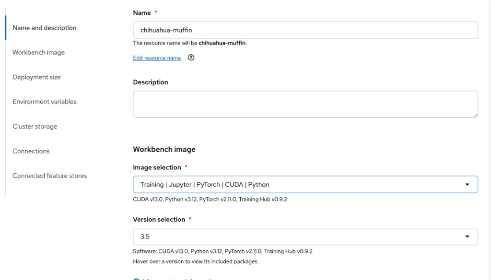

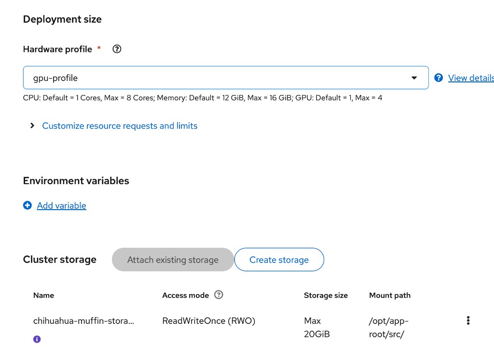

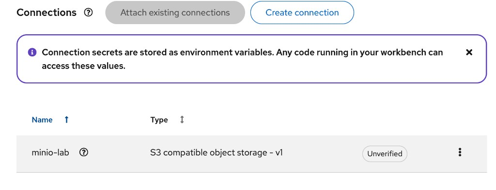

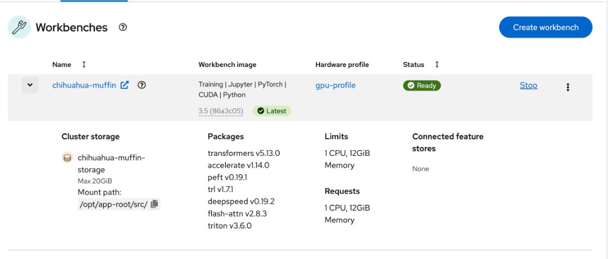

| | |
|--|--|
| Name | `chihuahua-muffin` |
| Image | PyTorch CUDA Python **3.5** |
| Profile | `gpu-profile` · 1 CPU · 12 GiB |
| Storage | `chihuahua-muffin-storage` · 20 GiB |
| Connection | `minio-lab` |
| Status | **Ready** |

---

<a id="step-4"></a>

# Step 4 — Train + ONNX

Notebook scripts (English comments): [`notebooks/`](notebooks/)

| Order | File | What it does |
|------:|------|----------------|
| 1 | [`01_install_deps.ipynb`](notebooks/01_install_deps.ipynb) | Install boto3, pillow, onnx — then **restart kernel** |
| 2 | [`02_check_s3.ipynb`](notebooks/02_check_s3.ipynb) | Print AWS env vars + list MinIO objects |
| 3 | [`03_download_dataset.ipynb`](notebooks/03_download_dataset.ipynb) | Download `train/` + `test/` onto the PVC |
| 4 | [`04_train_resnet18.ipynb`](notebooks/04_train_resnet18.ipynb) | Fine-tune ResNet18 head → save `model.pt` |
| 5 | [`05_export_onnx_upload.ipynb`](notebooks/05_export_onnx_upload.ipynb) | Export ONNX + upload `models/muffin-chihuahua/1/model.onnx` |

**How to run:** Upload the folder to the workbench → open each `.ipynb` → run cells with ⇧Enter, order **01 → 05**. After 01: **Kernel → Restart**.

ONNX on S3 (OVMS layout): `s3://muffin-chihuahua/models/muffin-chihuahua/1/model.onnx`

---

<a id="step-5"></a>

# Step 5 — Deploy model (OVMS)

**UI:** Projects → `chihuahua-vs-muffin-jan` → **Deployments** → **Deploy model**

### Model details

| Field | Value |
|-------|--------|
| Model location | Existing connection |
| Connection | `minio-lab` |
| **Path** | `models/muffin-chihuahua` ← **folder**, not the `.onnx` file |
| Model type | Predictive model |

> Wrong path that fails with “no model found”: `muffin-chihuahua/models`  
> Correct: `models/muffin-chihuahua` (contains `1/model.onnx`)

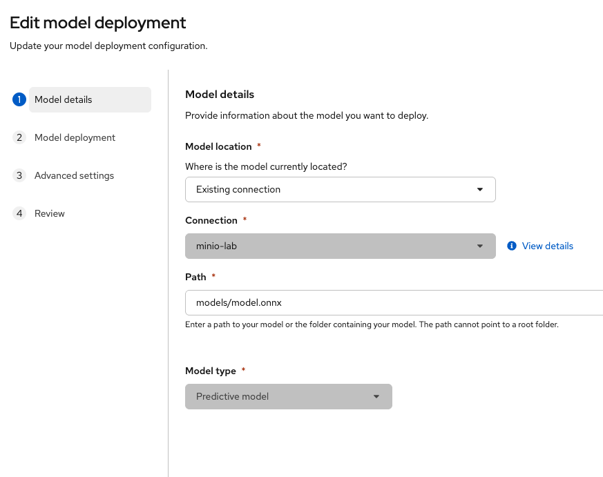

### Model deployment

| Field | Value |
|-------|--------|
| Name | `muffin-chihuahua` |
| Framework | `onnx - 1` |
| Runtime | **OpenVINO Model Server** `v2026.1.0` |
| Replicas | `1` |
| Hardware | `default-profile` |

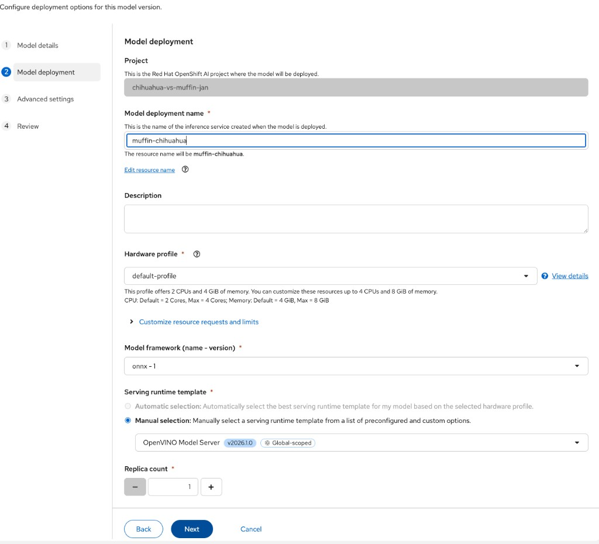

### Advanced settings

| Field | Value |
|-------|--------|
| External route | ✅ on |
| Token auth | off (lab) |
| Strategy | Rolling update |
| Timeout | 30s |

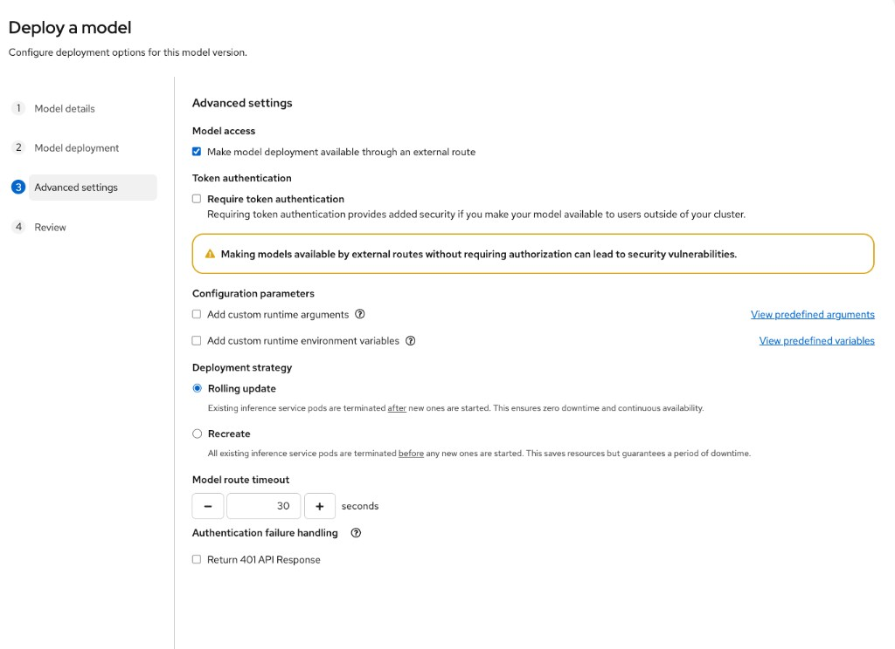

Deploy → wait until status **Ready**.

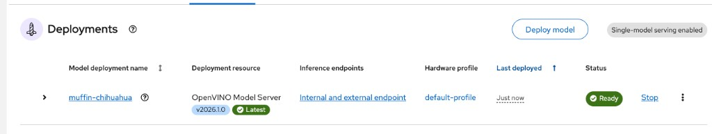

| | |
|--|--|
| InferenceService | `muffin-chihuahua` · Ready=`True` |
| External URL | `https://muffin-chihuahua-chihuahua-vs-muffin-jan.apps.ocp.dv6rj.sandbox1011.opentlc.com` |
| Predictor pod | `muffin-chihuahua-predictor-…` · 2/2 Running |

---

<a id="step-6"></a>

# Step 6 — Call the API

Notebook: [`notebooks/06_infer.ipynb`](notebooks/06_infer.ipynb)

Shows each image + a probability bar chart (`pred` vs `true`).

| | |
|--|--|
| Internal URL (use this) | `http://muffin-chihuahua-predictor.chihuahua-vs-muffin-jan.svc.cluster.local:8888` |
| External URL | `https://muffin-chihuahua-chihuahua-vs-muffin-jan.apps.ocp.dv6rj.sandbox1011.opentlc.com` |
| Metadata | HTTP 200 · versions `["1"]` · input `[1,3,224,224]` · output `[1,2]` |
| Example infer | `muffin` · confidence **~95%** |

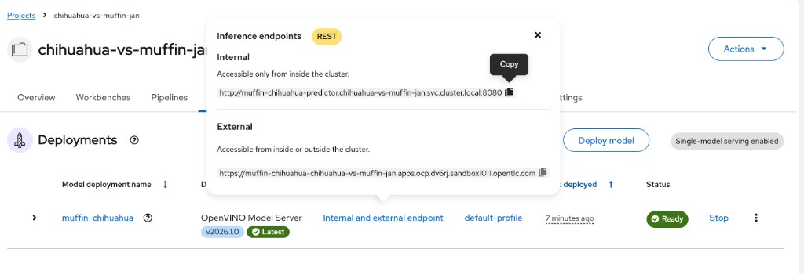

### Known bug — dashboard internal port

The **Inference endpoints** modal shows:

```text
http://muffin-chihuahua-predictor.…svc.cluster.local:8080
```

That URL returns **Connection refused**.

**Cause (validated):** you never pick a port in the deploy wizard. KServe creates a **headless** Service (`ClusterIP: None`) with `port 80 → targetPort 8888`; the OVMS container listens on **8888**. The dashboard still prints the generic KServe port **8080**, which does not match this runtime.

| What | Port | Works? |
|------|------|--------|
| UI internal URL | `:8080` | No |
| Service / pod (real) | `:8888` | Yes |
| External route | `:443` | Yes |

**Workaround:** from the workbench, call **`:8888`**, not `:8080`. Confirm anytime with:

```bash
oc -n chihuahua-vs-muffin-jan get svc muffin-chihuahua-predictor -o jsonpath='{.spec.ports}{"\n"}'
oc -n chihuahua-vs-muffin-jan get endpoints muffin-chihuahua-predictor
```

```bash
# External check (laptop)
curl -k "https://muffin-chihuahua-chihuahua-vs-muffin-jan.apps.ocp.dv6rj.sandbox1011.opentlc.com/v2/models/muffin-chihuahua"

# Internal check (in-cluster)
curl -sS "http://muffin-chihuahua-predictor.chihuahua-vs-muffin-jan.svc.cluster.local:8888/v2/models/muffin-chihuahua"
```

---

<a id="step-7"></a>

# Step 7 — Confidence thresholds (before TrustyAI)

A 2-class model **always** returns `chihuahua` or `muffin`.  
Out-of-domain photos (tea cup, cat, car…) still get a label — that is expected.

**Client-side guardrail** (notebook / app), not a change to OVMS:

1. `confidence = max(prob)` must be ≥ `CONF_MIN` (default **0.80**)
2. `margin = top1 − top2` must be ≥ `MARGIN_MIN` (default **0.25**)
3. Otherwise → `uncertain` (do not trust the raw class)

Notebook: [`notebooks/07_confidence_guardrails.ipynb`](notebooks/07_confidence_guardrails.ipynb)

| Test | What to do | Expect |
|------|------------|--------|
| In-domain | sample from `test/muffin` + `test/chihuahua` | mostly **ACCEPTED** |
| Out-of-domain | upload photos to `/opt/app-root/src/ood/` (lab samples in repo [`ood/`](ood/)) | mostly **UNCERTAIN** (tea cup); edge dogs may still score high |


If OOD images are still accepted → raise `CONF_MIN` / `MARGIN_MIN` in the notebook and re-run.

### Validated defaults

| | |
|--|--|
| `CONF_MIN` | `0.80` |
| `MARGIN_MIN` | `0.25` |
| Lab OOD samples | [`ood/teacup.jpg`](ood/teacup.jpg), [`ood/hairless_dog.jpg`](ood/hairless_dog.jpg), [`ood/chihuahua_back.jpg`](ood/chihuahua_back.jpg) |
| Workbench path | `/opt/app-root/src/ood/` |

---

<a id="step-8"></a>

# Step 8 — TrustyAI (platform monitoring)

## Why this step (plain language)

**In one sentence:** we teach TrustyAI what a “normal muffin / chihuahua” looks like, so later it can say: “the traffic has changed.”

### What we already did

1. **The model answers** — you send an image, OVMS says muffin or chihuahua.
2. **The KServe agent copies** each `/infer` call to TrustyAI (like a security camera on the traffic).
3. **TrustyAI stores it** — `/info` with `observations: 12` means 12 predictions were recorded.

Without that pipeline, TrustyAI sees nothing (`{}`).

### What we do next

Those observations are just “traffic”. To measure **drift**, TrustyAI needs a **reference**:

- **TRAINING** = “this is what the normal world looks like” (real muffins + real chihuahuas).
- We **upload** those examples with the `TRAINING` tag (`/data/upload`).
- Then we schedule **MeanShift**: a statistical alarm that compares  
  *live traffic* ↔ *TRAINING reference*.

### End goal for the team sync

- Normal images → little / no drift.  
- OOD photos (tea cup, screenshot…) → the drift score moves → you show: “the world has changed.”

### What this is *not*

This is **not** the Step 7 confidence guardrail (`uncertain` on a single image).  
That protects **one API call**. TrustyAI is **MLOps**: watch traffic over time — it does **not** block the request.

| | Step 7 — confidence | Step 8 — TrustyAI |
|--|---------------------|-------------------|
| Where | Your notebook / app | Service in the OpenShift AI project |
| Job | Reject a single weak prediction (`uncertain`) | Record traffic + detect **data drift** over time |
| Blocks the request? | Yes (if you honor `uncertain`) | No — it **observes** |
| Typical demo | Tea cup → uncertain | Many odd photos → drift metric rises |

**Not in this step:** LLM “Guardrails” (Nemo / GuardrailsOrchestrator). That is Gen AI later. Here we monitor the **predictive OVMS** model only.

Official docs (3.5):  
[Configuring TrustyAI](https://docs.redhat.com/en/documentation/red_hat_openshift_ai_self-managed/3.5/html/monitoring_your_ai_systems/configuring-trustyai_monitor) ·  
[Set up TrustyAI for your project](https://docs.redhat.com/en/documentation/red_hat_openshift_ai_self-managed/3.5/html/monitoring_your_ai_systems/setting-up-trustyai-for-your-project_monitor) ·  
[Data drift](https://docs.redhat.com/en/documentation/red_hat_openshift_ai_self-managed/3.5/html/monitoring_your_ai_systems/monitoring-data-drift_drift-monitoring)

## What we will do (checklist)

1. [Install **TrustyAIService** + CA ConfigMap](#81-install)
2. Enable InferenceService logger + fix RawDeployment TLS
3. Prove capture: `/info` shows `muffin-chihuahua` with `observations ≥ 1`
4. [**Name mapping**](#82-names): `output-0`→`chihuahua`, `output-1`→`muffin`
5. [Send a **TRAINING** baseline](#83-training) (`TRAINING: 4` via `/data/upload`)
6. [Schedule **MeanShift**](#83-training)
7. [Watch drift in Observe](#85-observe) + [flood neg / pos](#86-flood)
8. *(Facilitator)* [Reset](#87-reset) with [`scripts/trustyai_reset.sh`](scripts/trustyai_reset.sh) before the next team replay

<a id="81-install"></a>

## 8.1 Install TrustyAI + CA bundle (validated)

```bash
oc apply -f - <<'EOF'
apiVersion: trustyai.opendatahub.io/v1
kind: TrustyAIService
metadata:
  name: trustyai-service
  namespace: chihuahua-vs-muffin-jan
  annotations:
    trustyai.opendatahub.io/kserve-logger-http: "true"
spec:
  storage:
    format: "PVC"
    folder: "/data"
    size: "1Gi"
  data:
    filename: "data.csv"
    format: "CSV"
  metrics:
    schedule: "5s"
---
apiVersion: v1
kind: ConfigMap
metadata:
  name: kserve-logger-ca-bundle
  namespace: chihuahua-vs-muffin-jan
  annotations:
    service.beta.openshift.io/inject-cabundle: "true"
data: {}
EOF
```

### 8.1b RawDeployment TLS (validated — required on this cluster)

The TrustyAI operator keeps the InferenceService logger on **HTTPS**. Patching to `http://` is reverted. Without a CA, the agent fails with `x509: certificate signed by unknown authority` and `/info` stays `{}`.

Add CA + `tlsSkipVerify` to the cluster KServe ConfigMap (`redhat-ods-applications`), then recreate the predictor pod:

```bash
# Merge into inferenceservice-config .data.logger:
#   "caBundle": "kserve-logger-ca-bundle",
#   "caCertFile": "service-ca.crt",
#   "tlsSkipVerify": true
# Then: oc -n chihuahua-vs-muffin-jan delete pod -l serving.kserve.io/inferenceservice=muffin-chihuahua
```

| | |
|--|--|
| TrustyAIService | `trustyai-service` Ready |
| Route | `https://trustyai-service-chihuahua-vs-muffin-jan.apps.ocp.dv6rj.sandbox1011.opentlc.com` |
| CA ConfigMap | `kserve-logger-ca-bundle` with injected `service-ca.crt` |
| KServe logger CM | `caBundle` + `tlsSkipVerify: true` in `inferenceservice-config` |
| InferenceService logger | `mode: all` · `url: https://trustyai-service.…svc` (HTTPS kept by operator) |
| Capture check | `/info` → `muffin-chihuahua` · `observations ≥ 1` |

### Pitfalls (validated)

1. Only **`POST /infer`** feeds TrustyAI — not metadata `GET`.
2. Predictor Service is **headless** (`clusterIP: None`). Use **`:9081`** (agent) for capture. `:80` → Connection refused; `:8888` bypasses the logger.
3. Do not rely on HTTP logger URL alone — operator rewrites to HTTPS; fix TLS via `inferenceservice-config`.
4. Workbench → TrustyAI `/data/upload` can **timeout** on huge image tensors. Build JSON on the workbench, upload via **`oc exec` into the TrustyAI pod** (`curl http://127.0.0.1:8080/data/upload`). Script: [`scripts/trustyai_training_upload.py`](scripts/trustyai_training_upload.py).

<a id="82-names"></a>

## 8.2 Name mapping — part of setup (not a later fix)

As soon as `/info` shows the model schema (after the **first** captured `/infer`), apply human-readable names. Training / ImageFolder order is `['chihuahua', 'muffin']`:

| Tensor name | Label |
|-------------|-------|
| `output-0` | **chihuahua** |
| `output-1` | **muffin** |
| `input` | **image** |

Do this **before** TRAINING upload and MeanShift so Observe never shows raw `output-*` in the lab path.

If you already scheduled MeanShift with `output-0` / `output-1`, **delete** that request and create a new one after names — Prometheus may keep stale `output-*` series; in Observe filter:

```promql
trustyai_meanshift{subcategory=~"chihuahua|muffin"}
```

```bash
# One-liner setup (requires TOKEN + oc login)
NS=chihuahua-vs-muffin-jan
bash scripts/trustyai_setup_names.sh
```

Or:

```bash
export TOKEN=$(oc whoami -t)
HOST=$(oc -n chihuahua-vs-muffin-jan get route trustyai-service -o jsonpath='{.spec.host}')
curl -sk -H "Authorization: Bearer $TOKEN" -X POST \
  "https://$HOST/info/names" \
  -H "Content-Type: application/json" \
  -d '{
    "modelId": "muffin-chihuahua",
    "inputMapping": { "input": "image" },
    "outputMapping": {
      "output-0": "chihuahua",
      "output-1": "muffin"
    }
  }'
```

Prerequisite: at least one observation already in TrustyAI (schema must exist).

<a id="83-training"></a>

## 8.3 TRAINING baseline + MeanShift (validated)

| | |
|--|--|
| Tags | `TRAINING: 4` · live traffic stays `_trustyai_unlabeled` |
| MeanShift requestId | **yours from the POST response** (example after one rebuild: `53cc6651-…`) |
| Fit columns | `chihuahua`, `muffin` (name mapping **before** schedule) |
| `/info` | `metricCounts: { MEANSHIFT: 1 }` |
| Observe | `trustyai_meanshift{request="<your-requestId>"}` |

**Keep the dataset small.** Each logged image stores a full 224×224×3 tensor (~2 MiB). ~150 rows broke TrustyAI reload (`/info` → `{}`). Lab rule: **4 TRAINING + a handful of live/OOD**, not mass floods.

**How we uploaded TRAINING** (image JSON is huge — workbench → TrustyAI often times out):

1. Build payloads on the workbench with [`scripts/trustyai_training_upload.py`](scripts/trustyai_training_upload.py) (infer via **`:8888`** so we do not double-log).
2. `oc cp` each `train_*.json` out, then upload **from inside the TrustyAI pod**:  
   `curl http://127.0.0.1:8080/data/upload`.
3. Check: `GET /info/tags` → `TRAINING: 4`.

```bash
curl -sk -H "Authorization: Bearer $TOKEN" -X POST \
  "https://$HOST/metrics/drift/meanshift/request" \
  -H "Content-Type: application/json" \
  -d '{"modelId":"muffin-chihuahua","referenceTag":"TRAINING"}'
```

One-shot check (no Observe needed):

```bash
curl -sk -H "Authorization: Bearer $TOKEN" -X POST \
  "https://$HOST/metrics/drift/meanshift" \
  -H "Content-Type: application/json" \
  -d '{"modelId":"muffin-chihuahua","referenceTag":"TRAINING"}'
```

<a id="84-read"></a>

## 8.4 How to read `trustyai_meanshift` (plain language)

**MeanShift = “how much does live traffic still look like TRAINING?”**

Each value is a **p-value**:

| Value | Reading |
|-------|---------|
| Near **1** | Same world as TRAINING → little / no drift |
| **Dropping** | Traffic is changing |
| **&lt; 0.05** | Statistically strong drift (alert territory) |

On the graph (after §8.2 name mapping) you see two series:

- **`chihuahua`** — score for class 0  
- **`muffin`** — score for class 1  

Validated demo numbers on this lab:

| Moment | chihuahua | muffin |
|--------|-----------|--------|
| After TRAINING only | ~0.97 | ~0.95 |
| After real OOD traffic | ~0.70 | ~0.58 |

Still above 0.05 (not a hard alarm), but the curve **moves down** = TrustyAI sees the world changing.

**Sync one-liner:** *We put a camera on the model. TRAINING is normal. MeanShift compares. Lower = inputs left the training world.*

<a id="85-observe"></a>

## 8.5 See it in the OpenShift console (validated)

On this sandbox, **user-workload monitoring was off** → Observe showed *No datapoints found* even though `/q/metrics` had `trustyai_meanshift`.

Enable once (cluster admin):

```bash
oc apply -f - <<'EOF'
apiVersion: v1
kind: ConfigMap
metadata:
  name: cluster-monitoring-config
  namespace: openshift-monitoring
data:
  config.yaml: |
    enableUserWorkload: true
EOF
# Wait until: oc -n openshift-user-workload-monitoring get pods
# prometheus-user-workload-0 must be Ready
```

Also drop restrictive `params.match[]` on the TrustyAI ServiceMonitor if present (keep `path: /q/metrics` + `metricRelabelings: trustyai_.*`).

In the UI:

1. Perspective **Developer** (not Administrator).
2. Project **`chihuahua-vs-muffin-jan`**.
3. **Observe → Metrics**.

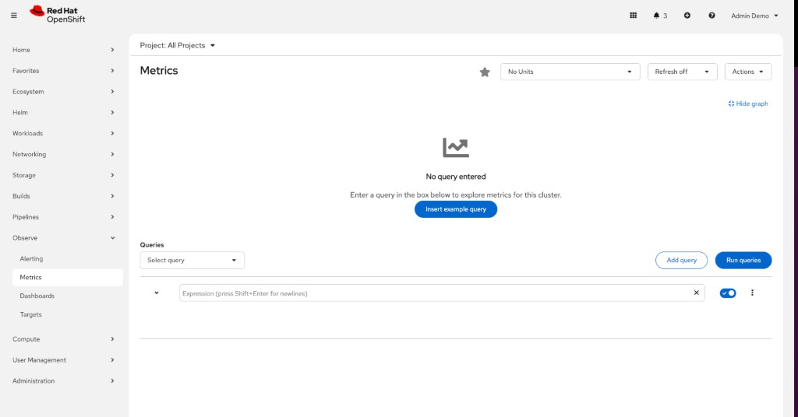

4. Expression (use **your** MeanShift `requestId` from §8.3, or all series):
   ```promql
   trustyai_meanshift{model="muffin-chihuahua"}
   ```
   Time range **15m**, Refresh **15s** · **Run queries**.
5. Wait 1–2 minutes after traffic for the curve to move.

### What you may see (validated screenshots)

**No datapoints** — user-workload monitoring / ServiceMonitor not ready yet (fix with §8.5 enable above):

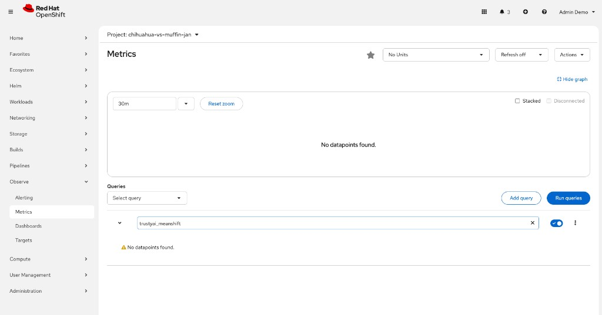

**First healthy scrape** — curves appear (may still show raw `output-0` / `output-1` if names were applied late):

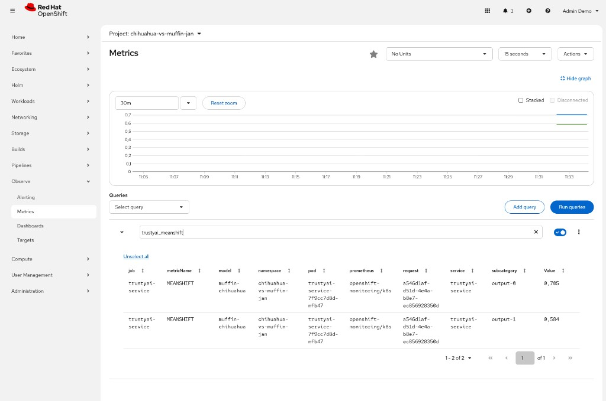

**Too many series** — old MeanShift jobs + mixed `output-*` and named labels. Clean: delete old requests (§8.7 / delete MeanShift jobs) and filter one `request=`:

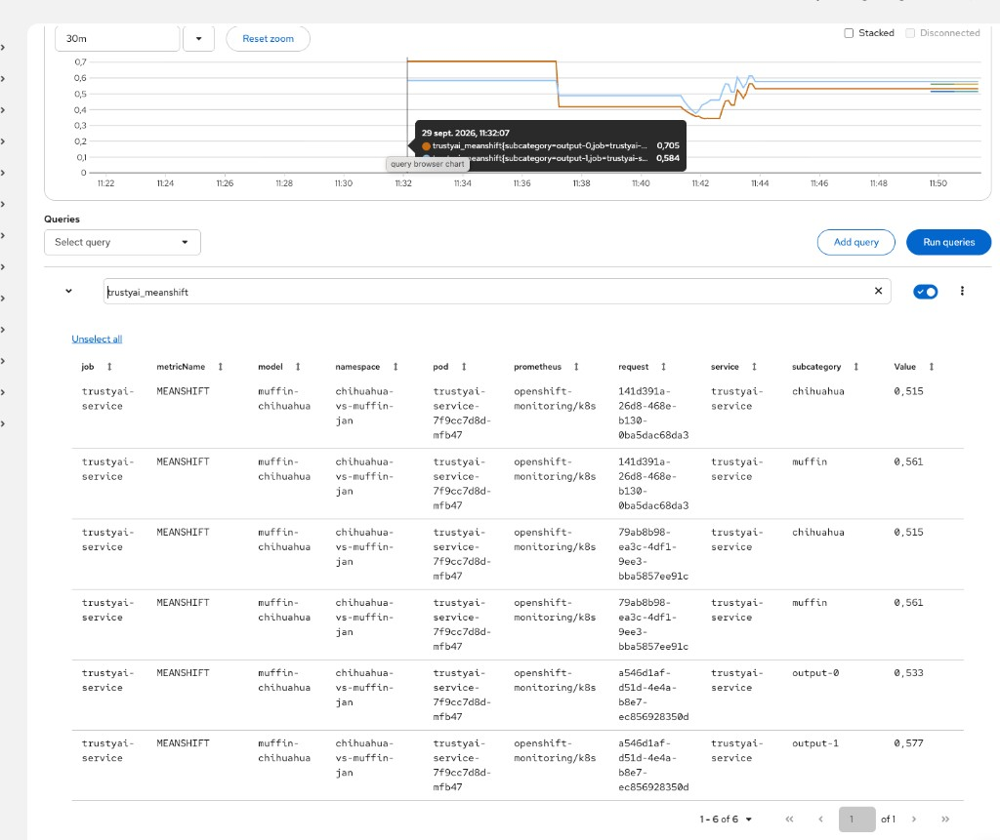

**After name mapping** — series labeled `chihuahua` / `muffin`:

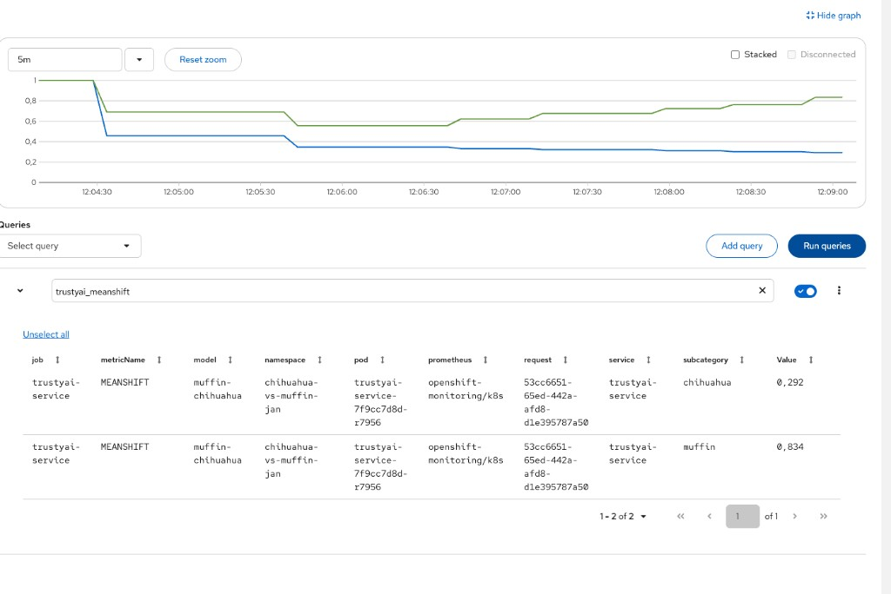

<a id="86-flood"></a>

## 8.6 Demo loop (workbench notebook)

**Run in the workbench:** [`notebooks/09_trustyai_flood.ipynb`](notebooks/09_trustyai_flood.ipynb)

Observe (15m, refresh 15s):

```promql
trustyai_meanshift{model="muffin-chihuahua"}
```

Or pin one job: `trustyai_meanshift{request="<your-requestId>"}`.

Two floods only — enough for the drift story:

| # | Flood | Send | Expect |
|---|-------|------|--------|
| 1 | **Negative** | synthetic junk (noise, colors, scribbles) | both curves ↓ |
| 2 | **Positive** | real chihuahuas **+** muffins (50/50) | both curves ↑ toward 1 |

Run one cell, wait ~1–2 min, then the next. Keep volumes small (`repeats=2`, ~2 MiB per image in TrustyAI).

Optional CLI equivalents: `scripts/trustyai_ood_flood.py` / `scripts/trustyai_good_flood.py`.

### Validated screenshots — Observe + flood notebook

**Negative flood** — junk / out-of-domain traffic → both MeanShift curves drop (workbench notebook on the right, Observe on the left):

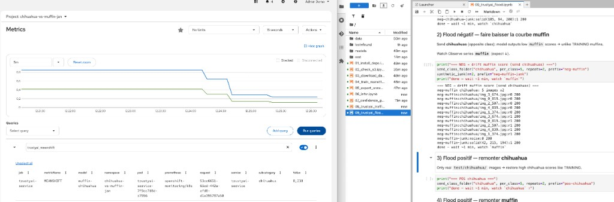

**After flood traffic** — MeanShift moving over the time window:

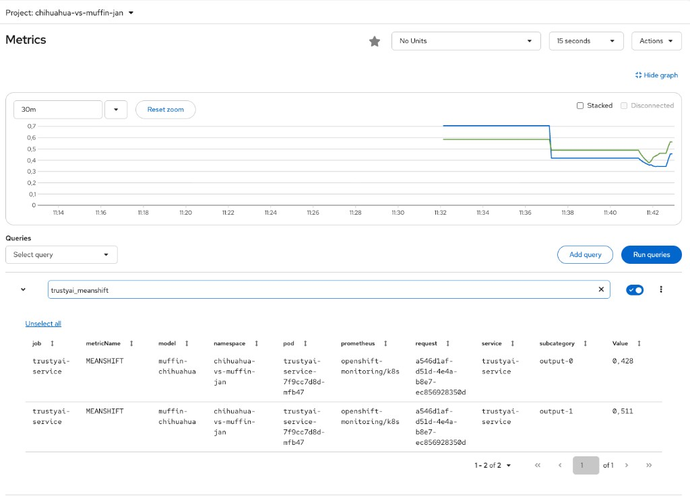

**Positive flood attempt** — sending only one class (or huge repeats) can keep the *other* curve low; recover with **balanced** chihuahua + muffin traffic (§8.6 table):

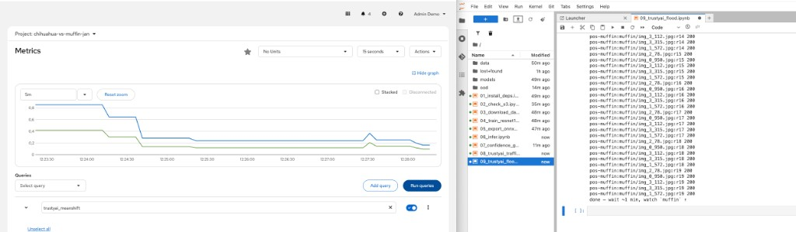

<a id="87-reset"></a>

## 8.7 Reset / uninstall TrustyAI (replay for the next team)

Two levels:

| Goal | Script | What remains |
|------|--------|----------------|
| Empty `/info`, redo TRAINING + MeanShift + floods | [`scripts/trustyai_reset.sh`](scripts/trustyai_reset.sh) | TrustyAIService + logger stay |
| **Full clean** (no TrustyAI pod at all) | [`scripts/trustyai_uninstall.sh`](scripts/trustyai_uninstall.sh) | Nothing — redo from §8.1 |

```bash
# oc login first
export NS=chihuahua-vs-muffin-jan

# Soft reset (data only):
bash scripts/trustyai_reset.sh

# Or full uninstall (pod / CR / PVC / CA / logger gone):
bash scripts/trustyai_uninstall.sh
```

**Full uninstall** removes: TrustyAIService, pods, route, PVC, `kserve-logger-ca-bundle`, ServiceMonitor, and the InferenceService `predictor.logger`. Model serve (OVMS) stays up.

Then colleagues start again at **§8.1**.

---

<a id="step-9"></a>

# Step 9 — Pipelines

## Why this step (plain language)

Until now we ran notebooks **by hand**. Pipelines answer: *can we package that work as a repeatable run on the platform?*

| | Notebooks (Steps 4–6) | Pipelines (Step 9) |
|--|----------------------|---------------------|
| Who clicks | You, cell by cell | Schedule / Run |
| Where it runs | Workbench | Pipeline pods |
| Storage | MinIO for data/model | Same MinIO for pipeline artifacts |

Docs: [Managing AI pipelines (RHOAI 3.5)](https://docs.redhat.com/en/documentation/red_hat_openshift_ai_self-managed/3.5/html/working_with_ai_pipelines/managing-ai-pipelines_ai-pipelines)

## What we will do (checklist)

1. **Configure pipeline server** (MinIO + default DB) → status **Ready**
2. **Smoke run** — import [`lab_smoke_hello.yaml`](pipelines/lab_smoke_hello.yaml) → **Succeeded**  
   *(does **one** thing: print `hello muffin…` in a pod — see [§9.2](#92-smoke))*
3. *(Optional later)* fil rouge: download S3 → train/export ONNX → upload `models/muffin-chihuahua/1/`

<a id="91-configure"></a>

## 9.1 Configure pipeline server (do this first)

**UI:** OpenShift AI → project **`chihuahua-vs-muffin-jan`** → **Pipelines** → **Configure pipeline server**

Reuse lab MinIO (same idea as connection `minio-lab`):

| Field | Value |
|-------|--------|
| Access key | `minio` |
| Secret key | `minio123` |
| Endpoint | `http://minio.lab-minio.svc.cluster.local:9000` |
| Region | `us-east-1` |
| Bucket | `muffin-chihuahua` |
| Database | **Default database on the cluster** (lab OK) |

Click **Configure** → wait until the pipeline server is **Ready**.

```bash
oc -n chihuahua-vs-muffin-jan get pods | grep -i pipeline
```

Pods related to `ds-pipeline` / `mariadb` (or equivalent) should be **Running**.

<a id="92-smoke"></a>

## 9.2 Smoke run — what `lab_smoke_hello.yaml` does

### What this pipeline does (plain language)

[`pipelines/lab_smoke_hello.yaml`](pipelines/lab_smoke_hello.yaml) is the lab **hello-world**. It does **not** train the muffin model, call OVMS, or touch TrustyAI.

When you run it, OpenShift AI:

1. Starts **one** pipeline pod  
2. Runs a single task **`say-hello`** (UBI9 Python image)  
3. Prints `hello <name> from chihuahua-vs-muffin lab` (default `name=muffin`)  
4. Exits — run status should be **Succeeded** / **Complete**

| | |
|--|--|
| Goal | Prove the pipeline server can schedule a pod and finish cleanly |
| Graph | One node: **`say-hello`** |
| Parameter | `name` (string, default **`muffin`**) — only changes the log line |
| Python source | [`pipelines/smoke_hello.py`](pipelines/smoke_hello.py) (compile → YAML) |

If this succeeds, pipelines work on the cluster. A real muffin train→ONNX pipeline is optional later.

### Import

You need a **compiled KFP YAML** (not a raw `.py`). Lab file: [`pipelines/lab_smoke_hello.yaml`](pipelines/lab_smoke_hello.yaml).

**In the Import pipeline dialog:**

1. **Pipeline name:** `lab-smoke-hello`
2. **Description (optional):** `Step 9 smoke — one print task`
3. Keep **Upload a file**
4. **Upload** → choose `pipelines/lab_smoke_hello.yaml` from the repo
5. Click **Import pipeline**

### Create run

1. Pipeline page → **Actions** → **Create run**
2. **Run type:** run once immediately
3. **Run details:**
   - **Name:** `smoke-1` (any unique name)
   - **Description:** empty OK
   - **Run group:** `Default`
4. **Pipeline:** `lab-smoke-hello`
5. **Parameters:** leave `name = muffin` (or change it to see a different log line)
6. **Create run** → wait until status **Succeeded**
7. Open the run → task **`say-hello`** → logs should show:
   `hello muffin from chihuahua-vs-muffin lab`

### Validated on this lab

| | |
|--|--|
| Pipeline | `lab-smoke-hello` |
| Run | `smoke-1` · One-off · **Complete** |
| Graph | single task `say-hello` (green check) |

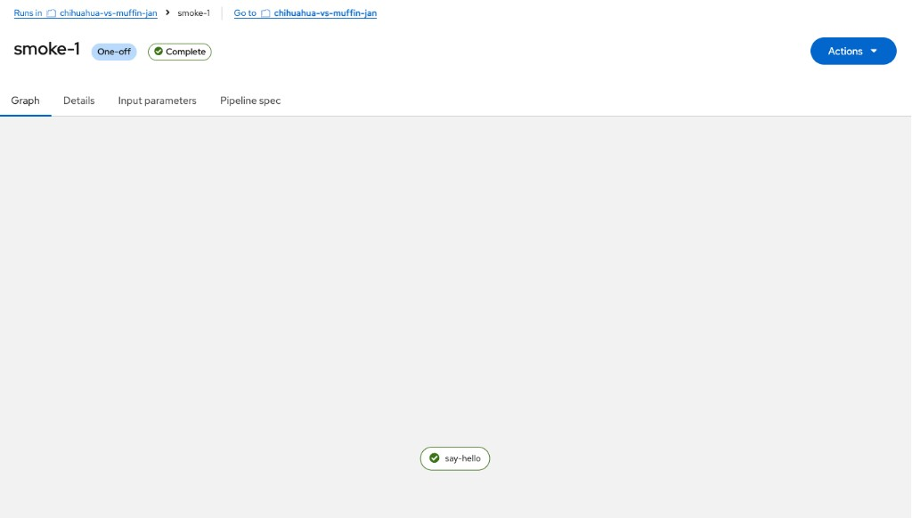

To regenerate the YAML locally:
```bash
python3 -m venv .venv-kfp && .venv-kfp/bin/pip install 'kfp>=2.7,<3'
.venv-kfp/bin/python pipelines/smoke_hello.py
```

<a id="93-out"></a>

## 9.3 Out of scope for the first pass

- Auto-retrain on every S3 upload
- Full Kubeflow DAG with Model Registry + redeploy
- Replacing TrustyAI / serving — pipelines **orchestrate**; they do not replace Steps 5–8

---

<a id="step-10"></a>

# Step 10 — AutoML (tabular)

## Why this step (plain language)

Step 4–6 built a **vision** model (photos → muffin / chihuahua).  
Step 10 shows a **different** OpenShift AI feature: **AutoML** on a **CSV table**.

AutoML (AutoGluon) tries many models for you, ranks them on a **leaderboard**, and does **not** use your ResNet / OVMS image model.

| | Vision path (Steps 4–6) | AutoML (this step) |
|--|-------------------------|---------------------|
| Data | Images on S3 | **CSV** rows + a label column |
| Who trains | You (notebook) | Platform AutoML pipeline |
| Output | ONNX on OVMS | Leaderboard + model artifacts |
| Theme | Real photos | Toy “features” that hint muffin vs dog |

Docs: [Working with AutoML (RHOAI 3.5)](https://docs.redhat.com/en/documentation/red_hat_openshift_ai_self-managed/3.5/html/working_with_automl) · [examples/automl](https://github.com/red-hat-data-services/red-hat-ai-examples/blob/main/examples/automl/readme.md)  
Status: **Developer Preview** on this product line.

## What we will do (checklist)

1. Upload CSV to MinIO (`automl-demo/train.csv`, **≥ 100 rows**)
2. **Develop & train → AutoML** → enable AutoML pipelines (once per project)
3. **Create AutoML optimization run** → binary · target **`label`**
4. Wait **Succeeded** → read the **leaderboard**

**Prerequisite:** pipeline server **Ready** (Step 9) ✅

<a id="101-data"></a>

## 10.1 Lab CSV (toy tabular “muffin vs chihuahua”)

**Why a CSV?** AutoML needs a **table**, not photos. Each row is a fake example with simple scores (0–1). The column **`label`** is the answer (`muffin` / `chihuahua`). AutoML learns to predict that column — a platform demo, separate from the vision OVMS model.

File: [`data/automl/train.csv`](data/automl/train.csv) · column legend: [`data/automl/COLUMNS.md`](data/automl/COLUMNS.md)

- **≥ 100 data rows** required by the UI (error if fewer) — lab file has **120**
- Fun features everyone can read:

| Column | Meaning |
|--------|---------|
| `pointy_ears` | oreilles pointues |
| `has_fur` | fourrure |
| `looks_like_pastry` | ressemble à un gâteau |
| `round_shape` | forme ronde |
| `brown_like_crust` | brun comme une croûte |
| `cute_eyes` | yeux mignons |
| **`label`** | **`muffin`** ou **`chihuahua`** (à prédire) |

```bash
export MINIO_ENDPOINT_EXTERNAL="https://$(oc -n lab-minio get route minio-api -o jsonpath='{.spec.host}')"
mc alias set lab "$MINIO_ENDPOINT_EXTERNAL" minio minio123 --api S3v4 --insecure
mc cp data/automl/train.csv lab/muffin-chihuahua/automl-demo/train.csv --insecure
```

| | |
|--|--|
| Bucket | `muffin-chihuahua` |
| Key | `automl-demo/train.csv` |
| Connection | **`minio-lab`** |

<a id="102-run"></a>

## 10.2 Create the AutoML run (validated)

AutoML lives under **Develop & train → AutoML** (not inside the project tabs). Select project **`chihuahua-vs-muffin-jan`**.

**First time only — enable pipelines:**

1. Click **Enable AutoML pipelines**
2. Check **Enable AutoML and AutoRAG pipelines**
3. Confirm (pipeline server **restarts**)

**Then create a run:**

1. **Create AutoML optimization run**
2. **Name:** `muffin-tabular-automl`
3. Documents: connection **`minio-lab`** → **Browse bucket** → `automl-demo/train.csv` → **Select**
4. **Target column:** **`label`** (not a numeric feature)
5. Prediction type becomes **binary** (2 categories)
6. Run preset: **Faster** (4 vCPU / 16 GiB) · Top models: **3**
7. **Create run** → wait **Succeeded**

<a id="103-read"></a>

## 10.3 How to read the result (validated)

**In plain language:** AutoML tried several models and ranked them. The leaderboard is the podium.

| You see | Meaning |
|---------|---------|
| **Succeeded** | Job finished cleanly |
| Graph | Prepare → split → train several models → **Build leaderboard** |
| Leaderboard | Ranked models + **Accuracy** (share of correct labels on the held-out test rows) |
| Winning model | Best pick for this run (example below) |

### Validated on this lab

| | |
|--|--|
| Run | `muffin-tabular-automl` |
| Status | **Succeeded** · ~2 m 48 s |
| Models evaluated | 3 |
| Winning model | `LightGBMLarge_BAG_L1_FULL` |
| Metric | Accuracy |
| Leaderboard | LightGBM / NeuralNet / XGBoost — all **1.000** on this toy CSV (easy separation) |

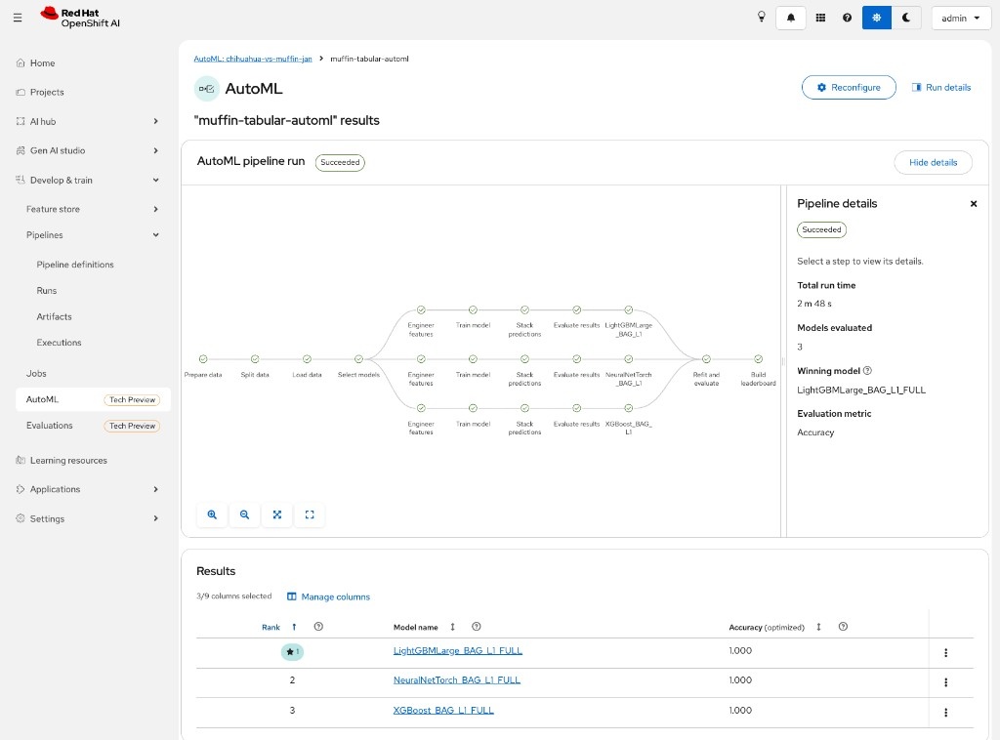

**Team sync:** same muffin/chihuahua *theme*, different feature — vision OVMS ≠ tabular AutoML. No need to deploy the AutoML winner for this lab.

## 10.4 Out of scope for the first pass

- Serving the AutoML model on OVMS next to `muffin-chihuahua`
- Time-series AutoML
- Replacing Steps 4–6 with AutoML
- Feeding **photos** into AutoML (not supported — use CSV)

---

<a id="step-11"></a>

# Step 11 — Gen AI — Muffin Court

<a id="111-why"></a>

## Why this step (plain language)

Until now we had **predictive** AI (OVMS: photo → muffin/chihuahua).  
Step 11 adds **generative** AI: a chat model that plays **Judge Muffin Court** — a funny “verdict” from the prediction.

| | Predictive (Steps 5–7) | Generative (this step) |
|--|------------------------|-------------------------|
| Model | `muffin-chihuahua` OVMS | Separate **Gen AI** deploy (vLLM / catalog) |
| Input | Image tensor | Text (label + confidence, or a short story) |
| Output | Class scores | Courtroom-style sentences |
| UI | Infer / notebooks | **Gen AI studio → Playground** |

**One-liner:** OVMS is the expert witness; the LLM is the theatrical judge.

Docs (3.5): Gen AI studio / playground are often **Technology Preview** — need admin enablement + usually a **GPU**.

## What we will do (checklist)

1. **Admin:** enable Gen AI studio + OGX (see below)  
2. Deploy a **small generative** model (catalog) as AI asset / chat endpoint  
3. Open **Playground**, attach that model  
4. Paste the **Judge Muffin Court** system prompt  
5. Demo: muffin 97% → funny verdict · tea cup / uncertain → **OUT OF ORDER / HUMAN REVIEW**

<a id="110-admin-ogx"></a>

## 11.0 Admin — enable Playground (OGX)

Playground needs **both**:

1. Dashboard feature **`genAiStudio: true`** (Settings / DataScienceCluster dashboard config — already often on for Gen AI catalog deploys)
2. Component **`ogx.managementState: Managed`** on the `DataScienceCluster` (`default-dsc`)

### Critical: do not leave Llama Stack and OGX both Managed

On OpenShift AI **3.5**, **Llama Stack Operator is deprecated** and replaced by **OGX**.  
If **both** stay `Managed`, OGX **never provisions**:

| Spec | Bad (stuck) | Good |
|------|-------------|------|
| `llamastackoperator` | `Managed` | **`Removed`** |
| `ogx` | `Managed` | `Managed` |

**Symptom when both are Managed:** DSC shows `OGXReady=False` with a cryptic message like `no matches for kind "OGX"` / `Some modules are not ready: ogx`. Operator logs say the real cause:

> `LlamaStackOperator is set to Managed; it has been deprecated, set it to Removed before enabling OGX`

**Fix (cluster admin):**

```bash
oc patch datasciencecluster default-dsc --type=merge -p '{
  "spec": {
    "components": {
      "llamastackoperator": { "managementState": "Removed" },
      "ogx": { "managementState": "Managed" }
    }
  }
}'
```

Wait until `OGXReady=True` / DSC `Ready` (`oc get dsc default-dsc -w`). Then Gen AI studio → **Playground** and **Add to playground** appear.

**UI path:** Operators → Red Hat OpenShift AI → DataScienceCluster → `default-dsc` → YAML: set `llamastackoperator.managementState: Removed`, `ogx.managementState: Managed`.

<a id="112-deploy"></a>

## 11.1 Deploy a generative model (you play)

**UI path (typical RHOAI 3.5):**

1. Project **`chihuahua-vs-muffin-jan`** → **Deployments** → **Deploy model**
2. Choose **Generative AI model** (not Predictive / OVMS)
3. Pick a **small instruct** model from the **Model catalog** that fits your quota
4. Runtime: usually **vLLM** (follow cluster defaults)
5. Enable **Add as AI asset endpoint** · use case **chat**
6. Wait until deployment is **Ready**

**Frozen on this lab (sandbox, 1× L4):**

| Field | Value |
|-------|--------|
| Catalog / model | `RedHatAI/granite-4.0-h-tiny-FP8-dynamic` |
| Deployment / asset id | `redhat-granite-4.0-h-tiny-fp8` |
| Use case | `chat` |
| Status | **Ready** |

Stop the workbench if the only GPU is already claimed (`Insufficient nvidia.com/gpu`) before deploying.

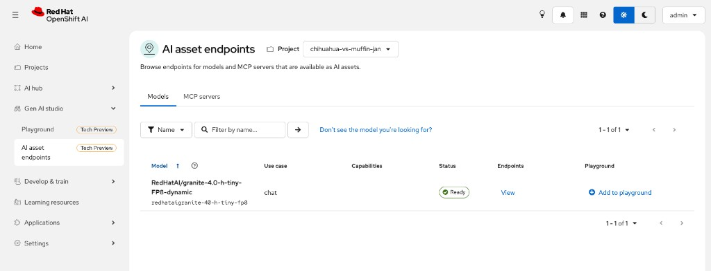

If Gen AI / GPU is missing on the sandbox, stop here and note it in the team sync — do not force a huge model.

<a id="113-playground"></a>

## 11.2 Playground — Judge Muffin Court

Requires **[11.0](#110-admin-ogx)** (`ogx: Managed` and `llamastackoperator: Removed`). If Playground is missing, check that conflict first.

1. **AI asset endpoints** → **+ Add to playground** on your Ready chat model  
2. **Configure playground:** Type = **Inference**, Max tokens ≈ **512** → **Create**  
3. Wait for **Creating playground** to finish (can take a minute)

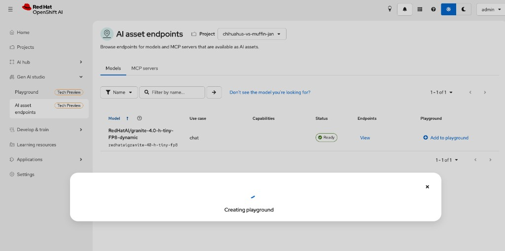

4. Open **Gen AI studio → Playground** (left nav)  
5. Select project **`chihuahua-vs-muffin-jan`** + model **`RedHatAI/granite-4.0-h-tiny-FP8-dynamic`**  
6. Set system / prompt to something like:

```text
You are Judge Muffin Court. Given a predictive result (label + confidence),
write a short funny courtroom verdict (3–6 sentences), PG-rated.
Only two possible food/animal rulings: blueberry muffin OR chihuahua.
If the input is uncertain, OOD, tea cup, or "human review", rule:
OUT OF ORDER / HUMAN REVIEW — do not force muffin or chihuahua.
```

7. Try messages such as:
   - `Prediction: muffin 0.97` → witty “guilty of being breakfast” style verdict  
   - `Prediction: uncertain (tea cup / low margin)` → **OUT OF ORDER / HUMAN REVIEW**

## 11.3 Out of scope

- Replacing OVMS with the LLM for image classification  
- Serving the Step 10 AutoML model as the judge  
- Production RAG / AutoRAG (optional later)
