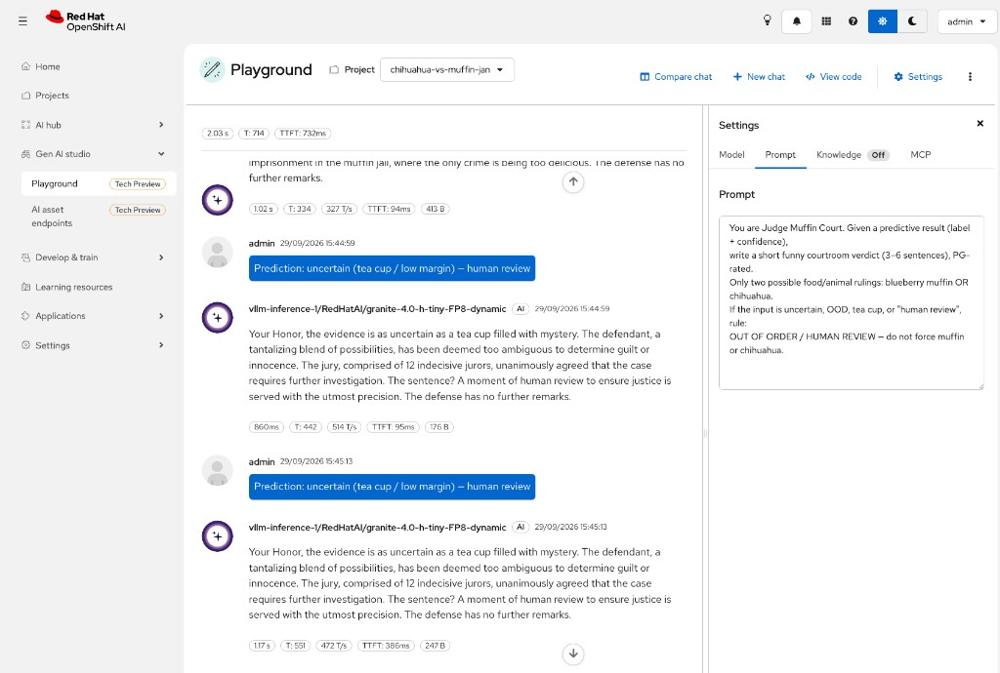

# Chihuahua vs Muffin — OpenShift AI lab

Lab on **OpenShift AI 3.5**: S3 → train → serve → guardrails → TrustyAI → pipelines → AutoML → Gen AI → protect (Authorino + Limitador).

| | |
|--|--|
| **Docs** | [OpenShift AI 3.5](https://docs.redhat.com/en/documentation/red_hat_openshift_ai_self-managed/3.5) win on conflicts |
| **Team** | 4 people · 1 cluster · 1 project |
| **Rule** | One step → run it → then freeze a short section here |

---

## Progress

| Step | Topic | Done |
|------|--------|------|
| 0 | [Prerequisites](#step-0) | ✅ |
| 1 | [MinIO + bucket](#step-1) | ✅ |
| 2 | [Dataset on S3](#step-2) | ✅ |
| 3 | [Project + connection + Workbench](#step-3) | ✅ |
| 4 | [Train + ONNX](#step-4) | ✅ |
| 5 | [Deploy model (OVMS)](#step-5) | ✅ |
| 6 | [Call the API](#step-6) | ✅ |
| 7 | [Guardrails (confidence / margin)](#step-7) | ✅ |
| 8 | [TrustyAI](#step-8) | ✅ |
| 9 | [Pipelines](#step-9) | ✅ |
| 10 | [AutoML](#step-10) | ✅ |
| 11 | [Gen AI — Muffin Court](#step-11) | ✅ |
| 12 | [Protect endpoint (Authorino + Limitador)](#step-12) | ⬜ |
| B | [People Policy Concierge — Agentic RAG (country HR)](docs/PEOPLE_POLICY_AGENT_LAB.md) | ⬜ |

Jump: [0](#step-0) · [1](#step-1) · [2](#step-2) · [3](#step-3) · [4](#step-4) · [5](#step-5) · [6](#step-6) · [7](#step-7) · [8](#step-8) · [9](#step-9) · [10](#step-10) · [11](#step-11) · [12](#step-12) · [Agentic RAG lab](docs/PEOPLE_POLICY_AGENT_LAB.md)  
Step 8: [story](#step-8) · [8.1](#81) · [8.2](#82) · [8.3](#83) · [8.4](#84) · [8.5](#85) · [8.6](#86) · [8.7](#87) · [8.8](#88) · [8.9](#89) · [8.10](#810) · [8.11](#811) · [8.12](#812) · [8.13](#813) · [8.14](#814) · [reset](#87-reset)  
Step 9: [9.1](#91-configure) · [9.2 smoke](#92-smoke) · [9.3](#93-out)  
Step 10: [10.1](#101-data) · [10.2](#102-run) · [10.3](#103-read)  
Step 11: [why](#111-why) · [11.0](#110-admin-ogx) · [11.1](#112-deploy) · [11.2](#113-playground)  
Step 12: [12.0](#120-map) · [12.A](#12a-authorino) · [12.B](#12b-limitador) · [12.C](#12c-cleanup)

---

<a id="step-0"></a>

# Step 0 — Prerequisites

```bash
oc whoami
oc project
oc get datasciencecluster -A
oc api-resources | grep -i trustyai | head
```

| | |
|--|--|
| User | `admin` |
| Project | `chihuahua-vs-muffin-jan` |
| Cluster | `https://api.ocp.dv6rj.sandbox1011.opentlc.com:6443` |
| DSC | `default-dsc` Ready |

---

<a id="step-1"></a>

# Step 1 — MinIO + bucket

```bash
oc new-project lab-minio

oc -n lab-minio create secret generic minio-root \
  --from-literal=MINIO_ROOT_USER=minio \
  --from-literal=MINIO_ROOT_PASSWORD=minio123

oc -n lab-minio apply -f - <<'EOF'
apiVersion: v1
kind: PersistentVolumeClaim
metadata:
  name: minio-data
spec:
  accessModes: [ReadWriteOnce]
  resources:
    requests:
      storage: 20Gi
---
apiVersion: apps/v1
kind: Deployment
metadata:
  name: minio
spec:
  replicas: 1
  selector:
    matchLabels:
      app: minio
  strategy:
    type: Recreate
  template:
    metadata:
      labels:
        app: minio
    spec:
      containers:
        - name: minio
          # quay.io/minio/* anonymous pulls are blocked (401); use Silo (MinIO-compatible fork)
          image: docker.io/pgsty/silo:latest
          args: [server, /data, --console-address, ":9001"]
          env:
            - name: MINIO_ROOT_USER
              valueFrom: {secretKeyRef: {name: minio-root, key: MINIO_ROOT_USER}}
            - name: MINIO_ROOT_PASSWORD
              valueFrom: {secretKeyRef: {name: minio-root, key: MINIO_ROOT_PASSWORD}}
          ports:
            - {name: api, containerPort: 9000}
            - {name: console, containerPort: 9001}
          volumeMounts:
            - {name: data, mountPath: /data}
          readinessProbe:
            httpGet: {path: /minio/health/ready, port: 9000}
            initialDelaySeconds: 10
            periodSeconds: 10
      volumes:
        - name: data
          persistentVolumeClaim:
            claimName: minio-data
---
apiVersion: v1
kind: Service
metadata:
  name: minio
spec:
  selector:
    app: minio
  ports:
    - {name: api, port: 9000, targetPort: 9000}
    - {name: console, port: 9001, targetPort: 9001}
EOF

oc -n lab-minio create route edge minio-api --service=minio --port=9000 --insecure-policy=Redirect
oc -n lab-minio create route edge minio-console --service=minio --port=9001 --insecure-policy=Redirect
oc -n lab-minio rollout status deployment/minio

export MINIO_ENDPOINT_EXTERNAL="https://$(oc -n lab-minio get route minio-api -o jsonpath='{.spec.host}')"
export AWS_ACCESS_KEY_ID=minio AWS_SECRET_ACCESS_KEY=minio123 BUCKET=muffin-chihuahua

mc alias set lab "$MINIO_ENDPOINT_EXTERNAL" minio minio123 --api S3v4 --insecure
mc mb lab/"$BUCKET" --insecure
```

| | |
|--|--|
| API | `https://minio-api-lab-minio.apps.ocp.lcdkt.sandbox1045.opentlc.com` |
| Console | `https://minio-console-lab-minio.apps.ocp.lcdkt.sandbox1045.opentlc.com` |
| In-cluster | `http://minio.lab-minio.svc.cluster.local:9000` |
| Auth | `minio` / `minio123` |
| Bucket | `muffin-chihuahua` |

---

<a id="step-2"></a>

# Step 2 — Dataset on S3

Source: [Muffin vs Chihuahua (Kaggle, CC0)](https://www.kaggle.com/datasets/samuelcortinhas/muffin-vs-chihuahua-image-classification)

```bash
python3 -m venv ~/lab-venv && source ~/lab-venv/bin/activate
pip install -q kaggle
# put API token in ~/.kaggle/kaggle.json (chmod 600)

mkdir -p ~/lab-data && cd ~/lab-data
kaggle datasets download -d samuelcortinhas/muffin-vs-chihuahua-image-classification
unzip -qo muffin-vs-chihuahua-image-classification.zip -d muffin-chihuahua-raw
export DATA_ROOT=~/lab-data/muffin-chihuahua-raw

export SUBSET=~/lab-data/muffin-chihuahua-subset
rm -rf "$SUBSET"
mkdir -p "$SUBSET"/{train,test}/{chihuahua,muffin}
for split in train test; do
  for class in chihuahua muffin; do
    if [ "$split" = train ]; then N=500; else N=100; fi
    find "$DATA_ROOT/$split/$class" -type f | head -n "$N" | while read -r f; do
      cp "$f" "$SUBSET/$split/$class/"
  done
done
done

export MINIO_ENDPOINT_EXTERNAL="https://$(oc -n lab-minio get route minio-api -o jsonpath='{.spec.host}')"
mc alias set lab "$MINIO_ENDPOINT_EXTERNAL" minio minio123 --api S3v4 --insecure
mc mirror --overwrite "$SUBSET" lab/muffin-chihuahua/ --insecure
```

Layout on S3: `train|test` / `chihuahua|muffin` — **500** train + **100** test images per class.

---

<a id="step-3"></a>

# Step 3 — Project + connection + Workbench

## Project

**UI:** Projects → Create project → `chihuahua-vs-muffin-jan`

**CLI:**

```bash
export PROJECT=chihuahua-vs-muffin-jan
oc apply -f - <<EOF
apiVersion: v1
kind: Namespace
metadata:
  name: ${PROJECT}
  labels:
    opendatahub.io/dashboard: "true"
  annotations:
    opendatahub.io/display-name: "Chihuahua vs Muffin"
EOF
```

## Connection `minio-lab`

**UI:** Connections → Create → S3 compatible  
Endpoint `http://minio.lab-minio.svc.cluster.local:9000` · keys `minio`/`minio123` · bucket `muffin-chihuahua`

**CLI** (needs both annotations + `managed` label or the dashboard hides it):

```bash
oc apply -f - <<EOF
apiVersion: v1
kind: Secret
metadata:
  name: minio-lab
  namespace: chihuahua-vs-muffin-jan
  labels:
    opendatahub.io/dashboard: "true"
    opendatahub.io/managed: "true"
  annotations:
    opendatahub.io/connection-type-protocol: "s3"
    opendatahub.io/connection-type-ref: "s3"
    openshift.io/display-name: "minio-lab"
type: Opaque
stringData:
  AWS_ACCESS_KEY_ID: "minio"
  AWS_SECRET_ACCESS_KEY: "minio123"
  AWS_S3_ENDPOINT: "http://minio.lab-minio.svc.cluster.local:9000"
  AWS_S3_BUCKET: "muffin-chihuahua"
  AWS_DEFAULT_REGION: "us-east-1"
EOF
```

## Workbench (UI)

1. Workbenches → **Create workbench**
2. Name: `chihuahua-muffin`
3. Image: **Training | Jupyter | PyTorch | CUDA | Python** · version **3.5**
4. Hardware: `gpu-profile` (or Medium if no GPU)
5. Storage: create PVC (~20 GiB) at `/opt/app-root/src/`
6. Connections → **Attach existing** → `minio-lab`
7. Create → wait **Running** → **Open**


| | |
|--|--|
| Name | `chihuahua-muffin` |
| Image | PyTorch CUDA Python **3.5** |
| Profile | `gpu-profile` · 1 CPU · 12 GiB |
| Storage | `chihuahua-muffin-storage` · 20 GiB |
| Connection | `minio-lab` |
| Status | **Ready** |

---

<a id="step-4"></a>

# Step 4 — Train + ONNX

Notebook scripts (English comments): [`notebooks/`](notebooks/)

| Order | File | What it does |
|------:|------|----------------|
| 1 | [`01_install_deps.ipynb`](notebooks/01_install_deps.ipynb) | Install boto3, pillow, onnx — then **restart kernel** |
| 2 | [`02_check_s3.ipynb`](notebooks/02_check_s3.ipynb) | Print AWS env vars + list MinIO objects |
| 3 | [`03_download_dataset.ipynb`](notebooks/03_download_dataset.ipynb) | Download `train/` + `test/` onto the PVC |
| 4 | [`04_train_resnet18.ipynb`](notebooks/04_train_resnet18.ipynb) | Fine-tune ResNet18 head → save `model.pt` |
| 5 | [`05_export_onnx_upload.ipynb`](notebooks/05_export_onnx_upload.ipynb) | Export ONNX + upload `models/muffin-chihuahua/1/model.onnx` |

**How to run:** Upload the folder to the workbench → open each `.ipynb` → run cells with ⇧Enter, order **01 → 05**. After 01: **Kernel → Restart**.

ONNX on S3 (OVMS layout): `s3://muffin-chihuahua/models/muffin-chihuahua/1/model.onnx`

---

<a id="step-5"></a>

# Step 5 — Deploy model (OVMS)

**UI:** Projects → `chihuahua-vs-muffin-jan` → **Deployments** → **Deploy model**

### Model details

| Field | Value |
|-------|--------|
| Model location | Existing connection |
| Connection | `minio-lab` |
| **Path** | `models/muffin-chihuahua` ← **folder**, not the `.onnx` file |
| Model type | Predictive model |

> Wrong path that fails with “no model found”: `muffin-chihuahua/models`  
> Correct: `models/muffin-chihuahua` (contains `1/model.onnx`)


### Model deployment

| Field | Value |
|-------|--------|
| Name | `muffin-chihuahua` |
| Framework | `onnx - 1` |
| Runtime | **OpenVINO Model Server** `v2026.1.0` |
| Replicas | `1` |
| Hardware | `default-profile` |


### Advanced settings

| Field | Value |
|-------|--------|
| External route | ✅ on |
| Token auth | off (lab) |
| Strategy | Rolling update |
| Timeout | 30s |


Deploy → wait until status **Ready**.


| | |
|--|--|
| InferenceService | `muffin-chihuahua` · Ready=`True` |
| External URL | `https://muffin-chihuahua-chihuahua-vs-muffin-jan.apps.ocp.dv6rj.sandbox1011.opentlc.com` |
| Predictor pod | `muffin-chihuahua-predictor-…` · 2/2 Running |

---

<a id="step-6"></a>

# Step 6 — Call the API

Notebook: [`notebooks/06_infer.ipynb`](notebooks/06_infer.ipynb)

Shows each image + a probability bar chart (`pred` vs `true`).

| | |
|--|--|
| Internal URL (use this) | `http://muffin-chihuahua-predictor.chihuahua-vs-muffin-jan.svc.cluster.local:8888` |
| External URL | `https://muffin-chihuahua-chihuahua-vs-muffin-jan.apps.ocp.dv6rj.sandbox1011.opentlc.com` |
| Metadata | HTTP 200 · versions `["1"]` · input `[1,3,224,224]` · output `[1,2]` |
| Example infer | `muffin` · confidence **~95%** |


### Known bug — dashboard internal port

The **Inference endpoints** modal shows:

```text
http://muffin-chihuahua-predictor.…svc.cluster.local:8080
```

That URL returns **Connection refused**.

**Cause (validated):** you never pick a port in the deploy wizard. KServe creates a **headless** Service (`ClusterIP: None`) with `port 80 → targetPort 8888`; the OVMS container listens on **8888**. The dashboard still prints the generic KServe port **8080**, which does not match this runtime.

| What | Port | Works? |
|------|------|--------|
| UI internal URL | `:8080` | No |
| Service / pod (real) | `:8888` | Yes |
| External route | `:443` | Yes |

**Workaround:** from the workbench, call **`:8888`**, not `:8080`. Confirm anytime with:

```bash
oc -n chihuahua-vs-muffin-jan get svc muffin-chihuahua-predictor -o jsonpath='{.spec.ports}{"\n"}'
oc -n chihuahua-vs-muffin-jan get endpoints muffin-chihuahua-predictor
```

```bash
# External check (laptop)
curl -k "https://muffin-chihuahua-chihuahua-vs-muffin-jan.apps.ocp.dv6rj.sandbox1011.opentlc.com/v2/models/muffin-chihuahua"

# Internal check (in-cluster)
curl -sS "http://muffin-chihuahua-predictor.chihuahua-vs-muffin-jan.svc.cluster.local:8888/v2/models/muffin-chihuahua"
```

---

<a id="step-7"></a>

# Step 7 — Confidence thresholds (before TrustyAI)

A 2-class model **always** returns `chihuahua` or `muffin`.  
Out-of-domain photos (tea cup, cat, car…) still get a label — that is expected.

**Client-side guardrail** (notebook / app), not a change to OVMS:

1. `confidence = max(prob)` must be ≥ `CONF_MIN` (default **0.80**)
2. `margin = top1 − top2` must be ≥ `MARGIN_MIN` (default **0.25**)
3. Otherwise → `uncertain` (do not trust the raw class)

Notebook: [`notebooks/07_confidence_guardrails.ipynb`](notebooks/07_confidence_guardrails.ipynb)

| Test | What to do | Expect |
|------|------------|--------|
| In-domain | sample from `test/muffin` + `test/chihuahua` | mostly **ACCEPTED** |
| Out-of-domain | upload photos to `/opt/app-root/src/ood/` (lab samples in repo [`ood/`](ood/)) | mostly **UNCERTAIN** (tea cup); edge dogs may still score high |


If OOD images are still accepted → raise `CONF_MIN` / `MARGIN_MIN` in the notebook and re-run.

### Validated defaults

| | |
|--|--|
| `CONF_MIN` | `0.80` |
| `MARGIN_MIN` | `0.25` |
| Lab OOD samples | [`ood/teacup.jpg`](ood/teacup.jpg), [`ood/hairless_dog.jpg`](ood/hairless_dog.jpg), [`ood/chihuahua_back.jpg`](ood/chihuahua_back.jpg) |
| Workbench path | `/opt/app-root/src/ood/` |

---

<a id="step-8"></a>

# Step 8 — TrustyAI (platform monitoring)

Validated path: **DATABASE (MariaDB)** + copy-paste replay.

Official docs (3.5): [Configuring TrustyAI](https://docs.redhat.com/en/documentation/red_hat_openshift_ai_self-managed/3.5/html/monitoring_your_ai_systems/configuring-trustyai_monitor) · [Set up TrustyAI for your project](https://docs.redhat.com/en/documentation/red_hat_openshift_ai_self-managed/3.5/html/monitoring_your_ai_systems/setting-up-trustyai-for-your-project_monitor) · [Data drift](https://docs.redhat.com/en/documentation/red_hat_openshift_ai_self-managed/3.5/html/monitoring_your_ai_systems/monitoring-data-drift_drift-monitoring)

Source of truth: [RHODS 3.5 — Monitoring your AI systems (PDF)](https://docs.redhat.com/en/documentation/red_hat_openshift_ai_self-managed/3.5/pdf/monitoring_your_ai_systems/Red_Hat_OpenShift_AI_Self-Managed-3.5-Monitoring_your_AI_systems-en-US.pdf)

**How to use this guide**

1. Copy-paste each command block **in order**.
2. Read **What we want** / **Why** / **Success looks like** before running anything.
3. Only go to the next step when Success is met.

| Constant | Value |
|----------|--------|
| Namespace | `chihuahua-vs-muffin-jan` |
| Model | `muffin-chihuahua` (OVMS) |
| Storage | DATABASE (MariaDB) |
| TrustyAIService | `trustyai-service` |

---

## The story in one minute (read once)

We already have a model that answers: *muffin or chihuahua?*

TrustyAI does **not** change those answers. It is a **camera on the traffic**:

1. It records what people send to the model.
2. We teach it what “normal” looks like (**TRAINING**).
3. It continuously compares live traffic to that normal world (**MeanShift**).
4. We show the result as a curve in OpenShift (**Observe**).

**Final demo for everyone:** weird photos → curve goes down (“the world changed”). Real muffins + dogs → curve goes back up.


### What this is *not*

This is **not** the Step 7 confidence guardrail (`uncertain` on a single image).  
That protects **one API call**. TrustyAI is **MLOps**: watch traffic over time — it does **not** block the request.

| | Step 7 — confidence | Step 8 — TrustyAI |
|--|---------------------|-------------------|
| Where | Your notebook / app | Service in the OpenShift AI project |
| Job | Reject a single weak prediction (`uncertain`) | Record traffic + detect **data drift** over time |
| Blocks the request? | Yes (if you honor `uncertain`) | No — it **observes** |
| Typical demo | Tea cup → uncertain | Many odd photos → drift metric rises |


---

<a id="81"></a>

## 8.1 — TrustyAI component enabled (§2.2)

### What we want
Confirm that OpenShift AI is allowed to run TrustyAI on this cluster.

### Why
TrustyAI is an optional platform component. If it is not **Managed**, creating a TrustyAIService in our project does nothing useful — no pod, no monitoring.

### Success looks like
- Operator deployment is Running
- DSC shows `trustyai: Managed`

```bash
oc -n redhat-ods-applications get deploy trustyai-service-operator-controller-manager
oc get dsc -A -o jsonpath='{range .items[*]}{.metadata.name}: {.spec.components.trustyai.managementState}{"\n"}{end}'
```

*(Usually already true on the sandbox.)*

---

<a id="82"></a>

## 8.2 — MariaDB in the project (§2.3 prerequisite)

### What we want
A working database **inside our project** where TrustyAI can store captured data and metrics.

### Why
We chose the official **DATABASE** storage path (not a PVC file).  
The Red Hat doc is explicit: MariaDB must **already exist**. TrustyAI will not create the database for you. Without this step, the TrustyAIService stays Not Ready (“database credentials / connection” errors).

### Success looks like
- Pod `mariadb-…` is `1/1 Running`
- Service `mariadb-service` listens on port `3306`

```bash
oc project chihuahua-vs-muffin-jan

oc apply -f - <<'EOF'
apiVersion: v1
kind: Secret
metadata:
  name: mariadb-root
  namespace: chihuahua-vs-muffin-jan
type: Opaque
stringData:
  database-root-password: "trustyai-lab-root"
  database-password: "trustyai-lab-pass"
---
apiVersion: v1
kind: PersistentVolumeClaim
metadata:
  name: mariadb-data
  namespace: chihuahua-vs-muffin-jan
spec:
  accessModes: ["ReadWriteOnce"]
  resources:
    requests:
      storage: 1Gi
---
apiVersion: apps/v1
kind: Deployment
metadata:
  name: mariadb
  namespace: chihuahua-vs-muffin-jan
  labels:
    app: mariadb
spec:
  replicas: 1
  selector:
    matchLabels:
      app: mariadb
  template:
    metadata:
      labels:
        app: mariadb
    spec:
      containers:
      - name: mariadb
        image: registry.redhat.io/rhel9/mariadb-105:latest
        ports:
        - containerPort: 3306
          name: mysql
        env:
        - name: MYSQL_ROOT_PASSWORD
          valueFrom:
            secretKeyRef:
              name: mariadb-root
              key: database-root-password
        - name: MYSQL_USER
          value: trustyai
        - name: MYSQL_PASSWORD
          valueFrom:
            secretKeyRef:
              name: mariadb-root
              key: database-password
        - name: MYSQL_DATABASE
          value: trustyai_service
        volumeMounts:
        - name: data
          mountPath: /var/lib/mysql/data
        resources:
          requests:
            cpu: 100m
            memory: 256Mi
          limits:
            cpu: "1"
            memory: 1Gi
      volumes:
      - name: data
        persistentVolumeClaim:
          claimName: mariadb-data
---
apiVersion: v1
kind: Service
metadata:
  name: mariadb-service
  namespace: chihuahua-vs-muffin-jan
  labels:
    app: mariadb
spec:
  selector:
    app: mariadb
  ports:
  - name: mysql
    port: 3306
    targetPort: 3306
EOF

oc -n chihuahua-vs-muffin-jan rollout status deploy/mariadb --timeout=180s
oc -n chihuahua-vs-muffin-jan get pods -l app=mariadb
oc -n chihuahua-vs-muffin-jan get svc mariadb-service
```

---

<a id="83"></a>

## 8.3 — TrustyAI DB credentials Secret (§2.3)

### What we want
A Kubernetes Secret that contains the **login details** TrustyAI needs to open MariaDB (user, password, host service name, database name).

### Why
TrustyAI never hard-codes DB passwords. It reads them from a Secret.  
Wrong name or missing keys → TrustyAIService never becomes Ready.

### Lab naming note
Doc examples sometimes say `db-credentials`. On this operator the Secret must be named:

`trustyai-service-db-credentials`  
(= `<TrustyAIService.name>-db-credentials`)

### Success looks like
`oc get secret …` shows `DATA: 7` (seven keys).

```bash
oc apply -f - <<'EOF'
apiVersion: v1
kind: Secret
metadata:
  name: trustyai-service-db-credentials
  namespace: chihuahua-vs-muffin-jan
type: Opaque
stringData:
  databaseKind: mariadb
  databaseUsername: trustyai
  databasePassword: trustyai-lab-pass
  databaseService: mariadb-service
  databasePort: "3306"
  databaseGeneration: update
  databaseName: trustyai_service
EOF

oc -n chihuahua-vs-muffin-jan get secret trustyai-service-db-credentials
```

---

<a id="84"></a>

## 8.4 — TrustyAIService CR (§2.4)

### What we want
Start the TrustyAI **service itself** in our project: a running pod + a Route we can call later.

### Why
One TrustyAI instance per project watches the models in that project.  
This CR is the “install TrustyAI here” switch. Until it is Ready, there is no camera.

### Lab note
Put `databaseConfigurations` under **`spec.storage`** (that is what the CRD expects; the PDF layout is easy to misread).

### Success looks like
- `phase=Ready` / `ready=True`
- Pod `trustyai-service-…` is `2/2 Running`
- Route `trustyai-service` exists

```bash
oc apply -f - <<'EOF'
apiVersion: trustyai.opendatahub.io/v1
kind: TrustyAIService
metadata:
  name: trustyai-service
  namespace: chihuahua-vs-muffin-jan
spec:
  storage:
    format: "DATABASE"
    size: "1Gi"
    databaseConfigurations: trustyai-service-db-credentials
  metrics:
    schedule: "5s"
EOF

# Wait ~30–60s then:
oc -n chihuahua-vs-muffin-jan get trustyaiservice trustyai-service \
  -o jsonpath='{.status.phase}{" ready="}{.status.ready}{"\n"}'
oc -n chihuahua-vs-muffin-jan get pods | grep trustyai
oc -n chihuahua-vs-muffin-jan get route trustyai-service
```

---

<a id="85"></a>

## 8.5 — RawDeployment CA + logger (§2.5)

### What we want
Wire the **copy path**: every model prediction is duplicated to TrustyAI over HTTPS, with a trusted certificate.

### Why (plain language)
When someone calls the model, a small sidecar (KServe **agent**) also forwards the request/response to TrustyAI — like CCTV on the API.

That forward uses **HTTPS**. Without the CA bundle:

- the agent fails with `x509: certificate signed by unknown authority`
- TrustyAI records **nothing**
- `/info` stays empty `{}` and the whole demo is dead

This step is “make the camera cable work”.

### Success looks like
- Cluster logger config mentions `kserve-logger-ca-bundle` + `service-ca.crt`
- Project ConfigMap contains injected `service-ca.crt`
- InferenceService has `logger.mode: all` pointing at TrustyAI HTTPS URL

### 5a — Check cluster logger config

```bash
oc -n redhat-ods-applications get cm inferenceservice-config -o jsonpath='{.data.logger}{"\n"}'
```

Need at least:

```json
"caBundle": "kserve-logger-ca-bundle",
"caCertFile": "service-ca.crt",
"tlsSkipVerify": true
```

*(PDF shows `tlsSkipVerify: false`. This lab uses `true`.)*

If missing: edit ConfigMap `inferenceservice-config` in namespace `redhat-ods-applications` (UI or CLI) and add those logger keys.

### 5b — CA ConfigMap in the project

```bash
oc apply -f - <<'EOF'
apiVersion: v1
kind: ConfigMap
metadata:
  name: kserve-logger-ca-bundle
  namespace: chihuahua-vs-muffin-jan
  annotations:
    service.beta.openshift.io/inject-cabundle: "true"
data: {}
EOF

sleep 5
oc -n chihuahua-vs-muffin-jan get cm kserve-logger-ca-bundle -o jsonpath='{.data}' | \
  python3 -c 'import sys,json; d=json.load(sys.stdin); print(list(d.keys()), "len=", len(d.get("service-ca.crt","")))'

oc -n chihuahua-vs-muffin-jan get inferenceservice muffin-chihuahua \
  -o jsonpath='{.spec.predictor.logger}{"\n"}'
```

---

<a id="86"></a>

## 8.6 — Authenticate (§3.1)

### What we want
Be able to talk to TrustyAI **from our laptop** (not only from inside the cluster).

### Why
The TrustyAI Route is protected by OpenShift OAuth. Without a bearer token, external `curl` calls fail. Every later API check (`/info`, names, MeanShift) uses this token.

### Success looks like
- `TRUSTY_ROUTE` prints a real hostname
- `curl …/info` returns HTTP success (body may still be `{}` — that only means “no data yet”)

```bash
export TOKEN=$(oc whoami -t)
export TRUSTY_ROUTE=https://$(oc -n chihuahua-vs-muffin-jan get route/trustyai-service --template={{.spec.host}})
echo "TRUSTY_ROUTE=$TRUSTY_ROUTE"
curl -sk -H "Authorization: Bearer $TOKEN" "$TRUSTY_ROUTE/info"; echo
```

---

<a id="87"></a>

## 8.7 — First capture (§3.3)

### What we want
Send a few real predictions **through the logger**, and see TrustyAI acknowledge the model in `/info`.

### Why
Until at least one inference is recorded, TrustyAI does not know the model schema (inputs/outputs).  
No schema → no sensible names, no solid TRAINING/MeanShift story.

This step answers: *“Is the camera actually recording?”*

### Critical rules (or it looks broken)
| Do | Don’t |
|----|--------|
| Call predictor port **`:9081`** (agent / logger) | Use `:8888` (talks to OVMS only — **skips** TrustyAI) |
| Send **JSON** without `"parameters"` | Use binary protocol with `binary_data_size` (TrustyAI rejects it) |

### Success looks like
`/info` contains `muffin-chihuahua` with `observations ≥ 1`

**Workbench:** run [`notebooks/08b_trustyai_capture_json.ipynb`](notebooks/08b_trustyai_capture_json.ipynb)

**Laptop:**

```bash
curl -sk -H "Authorization: Bearer $TOKEN" "$TRUSTY_ROUTE/info"; echo
```

---

<a id="88"></a>

## 8.8 — Widen MariaDB column (required for images)

### What we want
Make the database able to store **full image tensors**, not only tiny numbers.

### Why
Official TrustyAI DB demos use small tabular features (age, credit score…).  
Our model input is a 224×224×3 image (~150k floats, ~3 MiB JSON).

Default Hibernate schema creates `serializableObject` as **`tinyblob`** (~255 bytes).  
Uploading TRAINING then fails with:

`Data too long for column 'serializableObject'`

This lab ALTER is mandatory for the **image** path with DATABASE storage.

### Success looks like
Column type is `longblob`

```bash
NS=chihuahua-vs-muffin-jan
oc -n "$NS" exec deploy/mariadb -- \
  mysql -utrustyai -ptrustyai-lab-pass trustyai_service \
  -e "ALTER TABLE DataframeRow_Values MODIFY serializableObject LONGBLOB;"

oc -n "$NS" exec deploy/mariadb -- \
  mysql -utrustyai -ptrustyai-lab-pass trustyai_service \
  -e "SHOW COLUMNS FROM DataframeRow_Values LIKE 'serializableObject';"
```

---

<a id="89"></a>

## 8.9 — TRAINING upload (§3.2)

### What we want
Give TrustyAI a small set of examples tagged **`TRAINING`**: “this is the normal world.”

### Why
Live captures alone are just traffic.  
Drift needs a **reference**. TRAINING is that reference. MeanShift later asks: *does live traffic still look like TRAINING?*

We upload only **4** images (2 muffins + 2 chihuahuas) on purpose — each stored tensor is large; huge floods can break reload.

### Why this upload path
Calling TrustyAI from the workbench on port 80 often **times out**.  
Validated path: build JSON on the workbench → copy to laptop → upload from **inside** the TrustyAI pod (`curl http://127.0.0.1:8080`).

### Success looks like
- Four times: `1 datapoints successfully added to muffin-chihuahua data.`
- `/info/tags` → `{"muffin-chihuahua":{"TRAINING":4}}`

### 9a — Workbench

Run [`notebooks/08c_trustyai_training_upload.ipynb`](notebooks/08c_trustyai_training_upload.ipynb)  
→ files `/tmp/trustyai_training/train_0.json` … `train_3.json`

### 9b — Laptop: copy out of the workbench

```bash
NS=chihuahua-vs-muffin-jan
oc -n "$NS" get pods
# Set WB to your workbench / jupyter pod name:
WB="<workbench-pod-name>"

oc -n "$NS" exec "$WB" -- ls -la /tmp/trustyai_training/

rm -rf /tmp/trustyai_training && mkdir -p /tmp/trustyai_training
oc -n "$NS" cp "$NS/$WB:/tmp/trustyai_training" /tmp/trustyai_training
ls -la /tmp/trustyai_training/
```

### 9c — Upload into TrustyAI pod

```bash
NS=chihuahua-vs-muffin-jan
TAI=$(oc -n "$NS" get pod -l app=trustyai-service -o jsonpath='{.items[0].metadata.name}')
echo "TAI=$TAI"

for f in /tmp/trustyai_training/train_*.json; do
  base=$(basename "$f")
  echo "=== upload $base ==="
  oc -n "$NS" cp "$f" "$TAI:/tmp/$base" -c trustyai-service
  oc -n "$NS" exec "$TAI" -c trustyai-service -- \
    curl -sS -X POST http://127.0.0.1:8080/data/upload \
      -H 'Content-Type: application/json' \
      --data-binary "@/tmp/$base"
  echo
done

export TOKEN=$(oc whoami -t)
export TRUSTY_ROUTE=https://$(oc -n "$NS" get route/trustyai-service --template={{.spec.host}})
curl -sk -H "Authorization: Bearer $TOKEN" "$TRUSTY_ROUTE/info/tags"; echo
```

---

<a id="810"></a>

## 8.10 — Name mapping (§3.4)

### What we want
Replace raw tensor names (`output-0`, `output-1`) with human names (`chihuahua`, `muffin`) and `input` → `image`.

### Why
Without this, Observe graphs show cryptic `output-*` labels.  
With names, everyone in the room can read the chart: *chihuahua score* vs *muffin score*.

Do this **after TRAINING** (official drift scenario order). Doing it too early on DATABASE often returns HTTP 400 (“no metadata”).

Class order matches training ImageFolder: `['chihuahua', 'muffin']` → `output-0` / `output-1`.

### Success looks like
- Message: `Feature and output name mapping successfully applied`
- `/info` shows `nameMapping` with `chihuahua` / `muffin` / `image`

```bash
export TOKEN=$(oc whoami -t)
export TRUSTY_ROUTE=https://$(oc -n chihuahua-vs-muffin-jan get route/trustyai-service --template={{.spec.host}})

curl -sk -H "Authorization: Bearer $TOKEN" -X POST \
  "$TRUSTY_ROUTE/info/names" \
  -H "Content-Type: application/json" \
  -d '{
    "modelId": "muffin-chihuahua",
    "inputMapping": { "input": "image" },
    "outputMapping": {
      "output-0": "chihuahua",
      "output-1": "muffin"
    }
  }'
echo

curl -sk -H "Authorization: Bearer $TOKEN" "$TRUSTY_ROUTE/info" | python3 -m json.tool | head -50
```

---

<a id="811"></a>

## 8.11 — Schedule MeanShift (§5.1)

### What we want
Start a **recurring drift job**: every few seconds, compare live traffic to the `TRAINING` reference.

### Why
This is the alarm. MeanShift returns a probability per column (here: chihuahua / muffin):

- Near **1** → live data still looks like TRAINING (same world)
- **Dropping** → traffic is changing
- Below **~0.05** → strong statistical drift

Scheduling creates a Prometheus series you can plot. Save the returned **`requestId`**.

### Success looks like
- POST returns a `requestId` (keep it)
- Optional one-shot with only TRAINING → both scores ≈ `1.0` (normal: reference compared to itself)
- `/info` shows `metricCounts.MEANSHIFT: 1`

```bash
export TOKEN=$(oc whoami -t)
export TRUSTY_ROUTE=https://$(oc -n chihuahua-vs-muffin-jan get route/trustyai-service --template={{.spec.host}})

curl -sk -H "Authorization: Bearer $TOKEN" -X POST \
  "$TRUSTY_ROUTE/metrics/drift/meanshift/request" \
  -H "Content-Type: application/json" \
  -d '{"modelId":"muffin-chihuahua","referenceTag":"TRAINING"}'
echo

# Optional one-shot:
curl -sk -H "Authorization: Bearer $TOKEN" -X POST \
  "$TRUSTY_ROUTE/metrics/drift/meanshift" \
  -H "Content-Type: application/json" \
  -d '{"modelId":"muffin-chihuahua","referenceTag":"TRAINING"}'
echo
```

---

<a id="812"></a>

## 8.12 — Enable user-workload monitoring (§5.3 prep)

### What we want
Turn on OpenShift scraping for **user project** metrics (not only platform metrics).

### Why
TrustyAI already exposes `trustyai_meanshift` on its pod (`/q/metrics`).  
But the OpenShift **Observe** UI only shows what Prometheus scraped from your project.

If user-workload monitoring is off:

- `/q/metrics` has data ✅
- Observe says **No datapoints** ❌

This step connects the camera’s numbers to the dashboard everyone looks at.

### Success looks like
Namespace `openshift-user-workload-monitoring` has `prometheus-user-workload-0` **Ready**

```bash
oc apply -f - <<'EOF'
apiVersion: v1
kind: ConfigMap
metadata:
  name: cluster-monitoring-config
  namespace: openshift-monitoring
data:
  config.yaml: |
    enableUserWorkload: true
EOF

# Wait 1–2 minutes
oc -n openshift-user-workload-monitoring get pods
```

Optional — prove the metric exists in TrustyAI even before Observe:

```bash
NS=chihuahua-vs-muffin-jan
TAI=$(oc -n "$NS" get pod -l app=trustyai-service -o jsonpath='{.items[0].metadata.name}')
oc -n "$NS" exec "$TAI" -c trustyai-service -- \
  curl -sS http://127.0.0.1:8080/q/metrics | grep trustyai_meanshift
```

---

<a id="813"></a>

## 8.13 — Observe (§5.3)

### What we want
Show the MeanShift curve in the OpenShift console so the whole room can see drift.

### Why
CLI proofs are for us. The sync / demo moment is visual: a chart that moves when traffic changes.

### Success looks like
A graph with series (at least `chihuahua` and `muffin`) — values near 1 right after TRAINING-only.

1. Perspective **Developer**
2. Project **`chihuahua-vs-muffin-jan`**
3. **Observe → Metrics** → custom query
4. Time range **15m**, refresh **15s**

```promql
trustyai_meanshift{model="muffin-chihuahua"}
```

Or pin your job from step 11:

```promql
trustyai_meanshift{request="<your-requestId-from-step-11>"}
```

**How to read it with the room**

| Value | Meaning |
|-------|---------|
| Near **1** | Same world as TRAINING |
| Going **down** | Traffic is drifting |
| **&lt; ~0.05** | Strong drift (alert territory) |

---

<a id="814"></a>

## 8.14 — Flood demo

### What we want
Make the chart **move** on purpose: first break “normal”, then recover.

### Why
This is the punchline for everyone:

1. **Negative flood** (junk / OOD images) → “the world changed” → curves drop  
2. **Positive flood** (real muffins + chihuahuas) → “back to normal” → curves rise toward 1

TrustyAI still does **not** block requests. It only observes. (Blocking weak singles is Step 7 confidence guardrails — different story.)

### Success looks like
Observe curves drop after flood 1, then rise after flood 2 (wait 1–2 minutes between floods).

**Workbench:** [`notebooks/09_trustyai_flood.ipynb`](notebooks/09_trustyai_flood.ipynb)

| Order | Flood | Expect in Observe |
|-------|--------|-------------------|
| 1 | Negative (junk) | curves ↓ |
| 2 | Positive (real muffin + chihuahua) | curves ↑ toward 1 |

Keep volumes small (each logged image is heavy in storage).

---

## If something fails (quick map)

| What you see | What it usually means | Go back to |
|--------------|----------------------|------------|
| TrustyAIService Not Ready | DB / secret naming | §8.2–8.4 |
| `/info` stays `{}` after infer | Wrong port or binary `parameters` | §8.7 (`08b`, `:9081`) |
| Upload timeout to `:80` | Wrong upload path | §8.9c (`oc exec`) |
| `Data too long … serializableObject` | Column too small for images | §8.8 |
| `/info/names` HTTP 400 | Names too early | §8.10 after §8.9 |
| Observe **No datapoints** | User-workload monitoring off | §8.12 |

---

<a id="87-reset"></a>

## 8.15 — Reset / uninstall (facilitator)

Two levels:

| Goal | Script | What remains |
|------|--------|----------------|
| Empty data, redo TRAINING + MeanShift + floods | [`scripts/trustyai_reset.sh`](scripts/trustyai_reset.sh) | TrustyAIService + logger stay |
| **Full clean** | [`scripts/trustyai_uninstall.sh`](scripts/trustyai_uninstall.sh) | Nothing — redo from §8.1 |

Also remove MariaDB if you used the DATABASE path:

```bash
oc -n chihuahua-vs-muffin-jan delete deploy/mariadb svc/mariadb-service pvc/mariadb-data secret/mariadb-root secret/trustyai-service-db-credentials --ignore-not-found
```

```bash
export NS=chihuahua-vs-muffin-jan
bash scripts/trustyai_reset.sh
# or
bash scripts/trustyai_uninstall.sh
```

Then colleagues start again at **§8.1**.


---

<a id="step-9"></a>

# Step 9 — Pipelines

## Why this step (plain language)

Until now we ran notebooks **by hand**. Pipelines answer: *can we package that work as a repeatable run on the platform?*

| | Notebooks (Steps 4–6) | Pipelines (Step 9) |
|--|----------------------|---------------------|
| Who clicks | You, cell by cell | Schedule / Run |
| Where it runs | Workbench | Pipeline pods |
| Storage | MinIO for data/model | Same MinIO for pipeline artifacts |

Docs: [Managing AI pipelines (RHOAI 3.5)](https://docs.redhat.com/en/documentation/red_hat_openshift_ai_self-managed/3.5/html/working_with_ai_pipelines/managing-ai-pipelines_ai-pipelines)

## What we will do (checklist)

1. **Configure pipeline server** (MinIO + default DB) → status **Ready**
2. **Smoke run** — import [`lab_smoke_hello.yaml`](pipelines/lab_smoke_hello.yaml) → **Succeeded**  
   *(does **one** thing: print `hello muffin…` in a pod — see [§9.2](#92-smoke))*
3. *(Optional later)* fil rouge: download S3 → train/export ONNX → upload `models/muffin-chihuahua/1/`

<a id="91-configure"></a>

## 9.1 Configure pipeline server (do this first)

**UI:** OpenShift AI → project **`chihuahua-vs-muffin-jan`** → **Pipelines** → **Configure pipeline server**

Reuse lab MinIO (same idea as connection `minio-lab`):

| Field | Value |
|-------|--------|
| Access key | `minio` |
| Secret key | `minio123` |
| Endpoint | `http://minio.lab-minio.svc.cluster.local:9000` |
| Region | `us-east-1` |
| Bucket | `muffin-chihuahua` |
| Database | **Default database on the cluster** (lab OK) |

Click **Configure** → wait until the pipeline server is **Ready**.

```bash
oc -n chihuahua-vs-muffin-jan get pods | grep -i pipeline
```

Pods related to `ds-pipeline` / `mariadb` (or equivalent) should be **Running**.

<a id="92-smoke"></a>

## 9.2 Smoke run — what `lab_smoke_hello.yaml` does

### What this pipeline does (plain language)

[`pipelines/lab_smoke_hello.yaml`](pipelines/lab_smoke_hello.yaml) is the lab **hello-world**. It does **not** train the muffin model, call OVMS, or touch TrustyAI.

When you run it, OpenShift AI:

1. Starts **one** pipeline pod  
2. Runs a single task **`say-hello`** (UBI9 Python image)  
3. Prints `hello <name> from chihuahua-vs-muffin lab` (default `name=muffin`)  
4. Exits — run status should be **Succeeded** / **Complete**

| | |
|--|--|
| Goal | Prove the pipeline server can schedule a pod and finish cleanly |
| Graph | One node: **`say-hello`** |
| Parameter | `name` (string, default **`muffin`**) — only changes the log line |
| Python source | [`pipelines/smoke_hello.py`](pipelines/smoke_hello.py) (compile → YAML) |

If this succeeds, pipelines work on the cluster. A real muffin train→ONNX pipeline is optional later.

### Import

You need a **compiled KFP YAML** (not a raw `.py`). Lab file: [`pipelines/lab_smoke_hello.yaml`](pipelines/lab_smoke_hello.yaml).

**In the Import pipeline dialog:**

1. **Pipeline name:** `lab-smoke-hello`
2. **Description (optional):** `Step 9 smoke — one print task`
3. Keep **Upload a file**
4. **Upload** → choose `pipelines/lab_smoke_hello.yaml` from the repo
5. Click **Import pipeline**

### Create run

1. Pipeline page → **Actions** → **Create run**
2. **Run type:** run once immediately
3. **Run details:**
   - **Name:** `smoke-1` (any unique name)
   - **Description:** empty OK
   - **Run group:** `Default`
4. **Pipeline:** `lab-smoke-hello`
5. **Parameters:** leave `name = muffin` (or change it to see a different log line)
6. **Create run** → wait until status **Succeeded**
7. Open the run → task **`say-hello`** → logs should show:
   `hello muffin from chihuahua-vs-muffin lab`

### Validated on this lab

| | |
|--|--|
| Pipeline | `lab-smoke-hello` |
| Run | `smoke-1` · One-off · **Complete** |
| Graph | single task `say-hello` (green check) |


To regenerate the YAML locally:
```bash
python3 -m venv .venv-kfp && .venv-kfp/bin/pip install 'kfp>=2.7,<3'
.venv-kfp/bin/python pipelines/smoke_hello.py
```

<a id="93-out"></a>

## 9.3 Out of scope for the first pass

- Auto-retrain on every S3 upload
- Full Kubeflow DAG with Model Registry + redeploy
- Replacing TrustyAI / serving — pipelines **orchestrate**; they do not replace Steps 5–8

---

<a id="step-10"></a>

# Step 10 — AutoML (tabular)

## Why this step (plain language)

Step 4–6 built a **vision** model (photos → muffin / chihuahua).  
Step 10 shows a **different** OpenShift AI feature: **AutoML** on a **CSV table**.

AutoML (AutoGluon) tries many models for you, ranks them on a **leaderboard**, and does **not** use your ResNet / OVMS image model.

| | Vision path (Steps 4–6) | AutoML (this step) |
|--|-------------------------|---------------------|
| Data | Images on S3 | **CSV** rows + a label column |
| Who trains | You (notebook) | Platform AutoML pipeline |
| Output | ONNX on OVMS | Leaderboard + model artifacts |
| Theme | Real photos | Toy “features” that hint muffin vs dog |

Docs: [Working with AutoML (RHOAI 3.5)](https://docs.redhat.com/en/documentation/red_hat_openshift_ai_self-managed/3.5/html/working_with_automl) · [examples/automl](https://github.com/red-hat-data-services/red-hat-ai-examples/blob/main/examples/automl/readme.md)  
Status: **Developer Preview** on this product line.

## What we will do (checklist)

1. Upload CSV to MinIO (`automl-demo/train.csv`, **≥ 100 rows**)
2. **Develop & train → AutoML** → enable AutoML pipelines (once per project)
3. **Create AutoML optimization run** → binary · target **`label`**
4. Wait **Succeeded** → read the **leaderboard**

**Prerequisite:** pipeline server **Ready** (Step 9) ✅

<a id="101-data"></a>

## 10.1 Lab CSV (toy tabular “muffin vs chihuahua”)

**Why a CSV?** AutoML needs a **table**, not photos. Each row is a fake example with simple scores (0–1). The column **`label`** is the answer (`muffin` / `chihuahua`). AutoML learns to predict that column — a platform demo, separate from the vision OVMS model.

File: [`data/automl/train.csv`](data/automl/train.csv) · column legend: [`data/automl/COLUMNS.md`](data/automl/COLUMNS.md)

- **≥ 100 data rows** required by the UI (error if fewer) — lab file has **120**
- Fun features everyone can read:

| Column | Meaning |
|--------|---------|
| `pointy_ears` | oreilles pointues |
| `has_fur` | fourrure |
| `looks_like_pastry` | ressemble à un gâteau |
| `round_shape` | forme ronde |
| `brown_like_crust` | brun comme une croûte |
| `cute_eyes` | yeux mignons |
| **`label`** | **`muffin`** ou **`chihuahua`** (à prédire) |

```bash
export MINIO_ENDPOINT_EXTERNAL="https://$(oc -n lab-minio get route minio-api -o jsonpath='{.spec.host}')"
mc alias set lab "$MINIO_ENDPOINT_EXTERNAL" minio minio123 --api S3v4 --insecure
mc cp data/automl/train.csv lab/muffin-chihuahua/automl-demo/train.csv --insecure
```

| | |
|--|--|
| Bucket | `muffin-chihuahua` |
| Key | `automl-demo/train.csv` |
| Connection | **`minio-lab`** |

<a id="102-run"></a>

## 10.2 Create the AutoML run (validated)

AutoML lives under **Develop & train → AutoML** (not inside the project tabs). Select project **`chihuahua-vs-muffin-jan`**.

**First time only — enable pipelines:**

1. Click **Enable AutoML pipelines**
2. Check **Enable AutoML and AutoRAG pipelines**
3. Confirm (pipeline server **restarts**)

**Then create a run:**

1. **Create AutoML optimization run**
2. **Name:** `muffin-tabular-automl`
3. Documents: connection **`minio-lab`** → **Browse bucket** → `automl-demo/train.csv` → **Select**
4. **Target column:** **`label`** (not a numeric feature)
5. Prediction type becomes **binary** (2 categories)
6. Run preset: **Faster** (4 vCPU / 16 GiB) · Top models: **3**
7. **Create run** → wait **Succeeded**

<a id="103-read"></a>

## 10.3 How to read the result (validated)

**In plain language:** AutoML tried several models and ranked them. The leaderboard is the podium.

| You see | Meaning |
|---------|---------|
| **Succeeded** | Job finished cleanly |
| Graph | Prepare → split → train several models → **Build leaderboard** |
| Leaderboard | Ranked models + **Accuracy** (share of correct labels on the held-out test rows) |
| Winning model | Best pick for this run (example below) |

### Validated on this lab

| | |
|--|--|
| Run | `muffin-tabular-automl` |
| Status | **Succeeded** · ~2 m 48 s |
| Models evaluated | 3 |
| Winning model | `LightGBMLarge_BAG_L1_FULL` |
| Metric | Accuracy |
| Leaderboard | LightGBM / NeuralNet / XGBoost — all **1.000** on this toy CSV (easy separation) |


**Team sync:** same muffin/chihuahua *theme*, different feature — vision OVMS ≠ tabular AutoML. No need to deploy the AutoML winner for this lab.

## 10.4 Out of scope for the first pass

- Serving the AutoML model on OVMS next to `muffin-chihuahua`
- Time-series AutoML
- Replacing Steps 4–6 with AutoML
- Feeding **photos** into AutoML (not supported — use CSV)

---

<a id="step-11"></a>

# Step 11 — Gen AI — Muffin Court

<a id="111-why"></a>

## Why this step (plain language)

Until now we had **predictive** AI (OVMS: photo → muffin/chihuahua).  
Step 11 adds **generative** AI: a chat model that plays **Judge Muffin Court** — a funny “verdict” from the prediction.

| | Predictive (Steps 5–7) | Generative (this step) |
|--|------------------------|-------------------------|
| Model | `muffin-chihuahua` OVMS | Separate **Gen AI** deploy (vLLM / catalog) |
| Input | Image tensor | Text (label + confidence, or a short story) |
| Output | Class scores | Courtroom-style sentences |
| UI | Infer / notebooks | **Gen AI studio → Playground** |

**One-liner:** OVMS is the expert witness; the LLM is the theatrical judge.

Docs (3.5): Gen AI studio / playground are often **Technology Preview** — need admin enablement + usually a **GPU**.

## What we will do (checklist)

1. **Admin:** enable Gen AI studio + OGX (see below)  
2. Deploy a **small generative** model (catalog) as AI asset / chat endpoint  
3. Open **Playground**, attach that model  
4. Paste the **Judge Muffin Court** system prompt  
5. Demo: muffin 97% → funny verdict · tea cup / uncertain → **OUT OF ORDER / HUMAN REVIEW**

<a id="110-admin-ogx"></a>

## 11.0 Admin — enable Playground (OGX)

Playground needs **both**:

1. Dashboard feature **`genAiStudio: true`** (Settings / DataScienceCluster dashboard config — already often on for Gen AI catalog deploys)
2. Component **`ogx.managementState: Managed`** on the `DataScienceCluster` (`default-dsc`)

### Critical: do not leave Llama Stack and OGX both Managed

On OpenShift AI **3.5**, **Llama Stack Operator is deprecated** and replaced by **OGX**.  
If **both** stay `Managed`, OGX **never provisions**:

| Spec | Bad (stuck) | Good |
|------|-------------|------|
| `llamastackoperator` | `Managed` | **`Removed`** |
| `ogx` | `Managed` | `Managed` |

**Symptom when both are Managed:** DSC shows `OGXReady=False` with a cryptic message like `no matches for kind "OGX"` / `Some modules are not ready: ogx`. Operator logs say the real cause:

> `LlamaStackOperator is set to Managed; it has been deprecated, set it to Removed before enabling OGX`

**Fix (cluster admin):**

```bash
oc patch datasciencecluster default-dsc --type=merge -p '{
  "spec": {
    "components": {
      "llamastackoperator": { "managementState": "Removed" },
      "ogx": { "managementState": "Managed" }
    }
  }
}'
```

Wait until `OGXReady=True` / DSC `Ready` (`oc get dsc default-dsc -w`). Then Gen AI studio → **Playground** and **Add to playground** appear.

**UI path:** Operators → Red Hat OpenShift AI → DataScienceCluster → `default-dsc` → YAML: set `llamastackoperator.managementState: Removed`, `ogx.managementState: Managed`.

<a id="112-deploy"></a>

## 11.1 Deploy a generative model (you play)

**UI path (typical RHOAI 3.5):**

1. Project **`chihuahua-vs-muffin-jan`** → **Deployments** → **Deploy model**
2. Choose **Generative AI model** (not Predictive / OVMS)
3. Pick a **small instruct** model from the **Model catalog** that fits your quota
4. Runtime: usually **vLLM** (follow cluster defaults)
5. Enable **Add as AI asset endpoint** · use case **chat**
6. Wait until deployment is **Ready**

**Frozen on this lab (sandbox, 1× L4):**

| Field | Value |
|-------|--------|
| Catalog / model | `RedHatAI/granite-4.0-h-tiny-FP8-dynamic` |
| Deployment / asset id | `redhat-granite-4.0-h-tiny-fp8` |
| Use case | `chat` |
| Status | **Ready** |

Stop the workbench if the only GPU is already claimed (`Insufficient nvidia.com/gpu`) before deploying.


If Gen AI / GPU is missing on the sandbox, stop here and note it in the team sync — do not force a huge model.

<a id="113-playground"></a>

## 11.2 Playground — Judge Muffin Court

Requires **[11.0](#110-admin-ogx)** (`ogx: Managed` and `llamastackoperator: Removed`). If Playground is missing, check that conflict first.

1. **AI asset endpoints** → **+ Add to playground** on your Ready chat model  
2. **Configure playground:** Type = **Inference**, Max tokens ≈ **512** → **Create**  
3. Wait for **Creating playground** to finish (can take a minute)


4. Open **Gen AI studio → Playground** (left nav)  
5. Select project **`chihuahua-vs-muffin-jan`** + model **`RedHatAI/granite-4.0-h-tiny-FP8-dynamic`**  
6. Set system / prompt to something like:

```text
You are Judge Muffin Court. Given a predictive result (label + confidence),
write a short funny courtroom verdict (3–6 sentences), PG-rated.
Only two possible food/animal rulings: blueberry muffin OR chihuahua.
If the input is uncertain, OOD, tea cup, or "human review", rule:
OUT OF ORDER / HUMAN REVIEW — do not force muffin or chihuahua.
```

7. Try messages such as:
   - `Prediction: muffin 0.97` → witty “guilty of being breakfast” style verdict  
   - `Prediction: uncertain (tea cup / low margin)` → **OUT OF ORDER / HUMAN REVIEW**



## 11.3 Out of scope

- Replacing OVMS with the LLM for image classification  
- Serving the Step 10 AutoML model as the judge  
- Production RAG / AutoRAG (optional later)

---

<a id="step-12"></a>

# Step 12 — Protect the endpoint (Authorino + Limitador)

<a id="120-map"></a>

## Why this step (plain language — SA view)

Until now the OVMS route was **open**: anyone who knows the URL can call the model.  
Customers ask two questions next:

1. **Who** is allowed to call? → **Authorino** (token auth)  
2. **How many** calls are allowed? → **Limitador** (rate limit)

You do **not** rewrite OVMS. You put a door (auth) and a traffic cop (rate limit) in front.

| Layer | Job | Lab step |
|-------|-----|----------|
| Confidence / margin | Soft “uncertain” in the notebook | Step 7 |
| TrustyAI | Drift / OOD monitoring | Step 8 |
| **Authorino** | Reject callers without a valid token (**401**) | **12.A** |
| **Limitador** | Reject bursts over the limit (**429**) | **12.B** |
| Gen AI Playground | LLM “verdict” text | Step 11 |

**One-liner:** OVMS still classifies; Authorino decides *who*; Limitador decides *how often*.

### Path C (this lab)

1. **12.A** — Token auth on existing `muffin-chihuahua` (Standard / RawDeployment)  
2. **12.B** — Install Connectivity Link + Limitador, demo **429** on burst  

Cluster notes (sandbox validated): Authorino **Operator** is already present; Connectivity Link / Limitador are **not** until 12.B.

<a id="12a-authorino"></a>

## 12.A — Authorino: require a token

### Baseline (before auth)

Route should answer **200** without a token (auth still off):

```bash
NS=chihuahua-vs-muffin-jan
HOST=$(oc -n "$NS" get route muffin-chihuahua -o jsonpath='{.spec.host}')
curl -sk -o /dev/null -w 'http=%{http_code}\n' "https://${HOST}/v2/models/muffin-chihuahua"
# expect: http=200
```

### Enable token authentication

**UI (preferred for demos):**

1. OpenShift AI → project **`chihuahua-vs-muffin-jan`** → **Deployments** → **`muffin-chihuahua`**  
2. Edit / redeploy options → enable **Require token authentication**  
3. Service account name: **`muffin-infer-user`** (created if missing)  
4. Save → wait until deployment is **Ready** again  

**CLI equivalent:**

```bash
NS=chihuahua-vs-muffin-jan

# ServiceAccount that is allowed to call the model
oc -n "$NS" create sa muffin-infer-user --dry-run=client -o yaml | oc apply -f -

# Bind: SA can GET this InferenceService (RHOAI auth check)
oc -n "$NS" create role muffin-infer-user-isvc \
  --verb=get --resource=inferenceservices.serving.kserve.io \
  --dry-run=client -o yaml | oc apply -f -
oc -n "$NS" create rolebinding muffin-infer-user-isvc \
  --role=muffin-infer-user-isvc --serviceaccount="${NS}:muffin-infer-user" \
  --dry-run=client -o yaml | oc apply -f -

# Turn auth on
oc -n "$NS" annotate inferenceservice muffin-chihuahua \
  security.opendatahub.io/enable-auth=true --overwrite
```

Wait until `muffin-chihuahua` is Ready. Then inspect what appeared (Authorino / AuthConfig / secrets — names vary by RHOAI build):

```bash
oc -n "$NS" get authconfig,sa,secret,role,rolebinding | grep -iE 'muffin|auth|authorino' || true
oc -n "$NS" get inferenceservice muffin-chihuahua -o jsonpath='{.metadata.annotations.security\.opendatahub\.io/enable-auth}{"\n"}'
```

### Curl matrix (freeze these codes)

```bash
NS=chihuahua-vs-muffin-jan
HOST=$(oc -n "$NS" get route muffin-chihuahua -o jsonpath='{.spec.host}')
URL="https://${HOST}/v2/models/muffin-chihuahua"

# 1) No token → expect 401
curl -sk -o /dev/null -w 'no_token=%{http_code}\n' "$URL"

# 2) Bad token → expect 401
curl -sk -o /dev/null -w 'bad_token=%{http_code}\n' \
  -H 'Authorization: Bearer not-a-real-token' "$URL"

# 3) Valid SA token → expect 200
TOKEN=$(oc create token muffin-infer-user -n "$NS" --duration=1h)
curl -sk -o /dev/null -w 'ok_token=%{http_code}\n' \
  -H "Authorization: Bearer ${TOKEN}" "$URL"
```

| Call | Expected |
|------|----------|
| No `Authorization` | **401** |
| Bad Bearer | **401** |
| SA token (`muffin-infer-user`) | **200** |

Dashboard: Deployments → expand model → **Token authentication** / token secret (copy for demos).

### TrustyAI check after auth

Enabling auth must not silently kill the logger.

```bash
# TrustyAI still up?
oc -n "$NS" get trustyaiservice 2>/dev/null
oc -n "$NS" get pods | grep -i trustyai || echo 'no TrustyAI pod (OK if uninstalled)'

# If TrustyAI is installed: /info should still list the model after a few authenticated infer calls
```

If the agent stops receiving payloads: give the logger path a valid identity, or keep internal cluster traffic on the predictor Service (document what you fixed). Do **not** leave monitoring broken for the next SA.

### Teaching point

On **Standard / RawDeployment** (this lab), RHOAI enforces token auth with a **`kube-rbac-proxy`** sidecar on the predictor pod. It checks a Kubernetes JWT and a **SubjectAccessReview** (`get` on this InferenceService). The **Authorino Operator** is installed on the cluster; classic **AuthConfig** wiring is the Serverless / Connectivity Link story (see 12.B). Same customer outcome: **no ticket → 401**.

**Validated on this sandbox:**

| Call | HTTP |
|------|------|
| No `Authorization` | **401** `Unauthorized` |
| Bad Bearer | **401** |
| `oc create token muffin-infer-user` | **200** model metadata |
| `oc whoami -t` (admin) | **200** |

```bash
# Inspect the SAR config the proxy uses
oc -n chihuahua-vs-muffin-jan get cm muffin-chihuahua-kube-rbac-proxy-sar-config -o yaml
oc -n chihuahua-vs-muffin-jan get pods -l serving.kserve.io/inferenceservice=muffin-chihuahua \
  -o jsonpath='{range .items[*]}{.metadata.name}{" → "}{range .spec.containers[*]}{.name}{" "}{end}{"\n"}{end}'
# expect: kserve-container kube-rbac-proxy
```

**One-liner:** OVMS still classifies; the proxy decides *who* may call.

<a id="12b-limitador"></a>

## 12.B — Limitador: rate limit (Connectivity Link)

### Why another component?

A stolen or shared token can still **flood** a GPU. Limitador counts requests in a time window and returns **429 Too Many Requests** when over the limit.

On this sandbox, **Red Hat Connectivity Link** was **not** installed at lab start (`KserveLLMInferenceServiceDependencies` → *Connectivity Link not installed*). Part B installs it, then applies a rate-limit policy in front of the model path.

### Admin install (cluster-admin)

OperatorHub packages (validated on marketplace): `rhcl-operator`, `limitador-operator`.

```bash
# Install operators (UI: Ecosystem → OperatorHub → Red Hat Connectivity Link + Limitador)
# Or Subscriptions — exact channel/CSV frozen after first successful install on this cluster.

oc get csv -A | grep -iE 'rhcl|kuadrant|limitador|connectivity' || echo 'not installed yet'
oc get packagemanifests -n openshift-marketplace | grep -iE 'rhcl|limitador|kuadrant'
```

Follow [RHOAI 3.5 Connectivity Link / auth docs](https://docs.redhat.com/en/documentation/red_hat_openshift_ai_self-managed/3.5) for Gateway + Authorino listener TLS if required. Restart model controllers after RHCL if docs say so:

```bash
# Only if docs require (after RHCL first install):
# oc delete pod -n redhat-ods-applications -l app=odh-model-controller
# oc delete pod -n redhat-ods-applications -l control-plane=kserve-controller-manager
```

### Rate-limit policy (shape)

Exact CR names (`RateLimitPolicy` / `TokenRateLimitPolicy` / HTTPRoute target) **freeze after first working apply** on this cluster. Intent:

| Under limit | **200** + inference |
| Over limit (burst script) | **429** |

Example burst check (adjust URL / header once policy is live):

```bash
NS=chihuahua-vs-muffin-jan
HOST=$(oc -n "$NS" get route muffin-chihuahua -o jsonpath='{.spec.host}')
TOKEN=$(oc create token muffin-infer-user -n "$NS" --duration=1h)
URL="https://${HOST}/v2/models/muffin-chihuahua"

for i in $(seq 1 30); do
  code=$(curl -sk -o /dev/null -w '%{http_code}' -H "Authorization: Bearer ${TOKEN}" "$URL")
  echo "$i $code"
done
# Expect a mix of 200 then 429 once the window limit is hit
```

### Teaching point

**Limitador is the traffic cop.** Valid token ≠ unlimited traffic.

*(Policy YAML + screenshots frozen after Part B play.)*

<a id="12c-cleanup"></a>

## 12.C — Cleanup / replay

**Soft (keep operators):**

```bash
NS=chihuahua-vs-muffin-jan
# Turn auth back off for open demos
oc -n "$NS" annotate inferenceservice muffin-chihuahua \
  security.opendatahub.io/enable-auth=false --overwrite
# Delete rate-limit / Auth policies created in 12.B (names frozen later)
```

**Full:** uninstall Connectivity Link / Limitador Subscriptions only if the next team does not need them; leave Authorino Operator (often shared with RHOAI).

## 12.D Out of scope

- Enterprise OIDC / Keycloak deep-dive  
- mTLS between mesh sidecars as the primary story  
- Multi-tenant quota design  
- Replacing Step 7 confidence logic with Authorino
